<!-- vim-markdown-toc GFM -->

* [线程管理](#线程管理)
    * [线程本地存储TLS](#线程本地存储tls)
        * [thread_local](#thread_local)
    * [thread对象](#thread对象)
        * [线程创建](#线程创建)
        * [线程运行](#线程运行)
            * [参数传递](#参数传递)
                * [**NOTE**](#note)
        * [线程结束](#线程结束)
    * [线程管理](#线程管理-1)
        * [让渡](#让渡)
            * [yield](#yield)
            * [sleep_for](#sleep_for)
        * [限制调用](#限制调用)
        * [核心绑定](#核心绑定)
            * [软亲和性](#软亲和性)
            * [硬亲和性](#硬亲和性)
* [异常处理](#异常处理)
* [数据共享](#数据共享)
    * [标准库提供的锁](#标准库提供的锁)
        * [互斥量mutex](#互斥量mutex)
            * [OOP设计](#oop设计)
    * [条件竞争与死锁](#条件竞争与死锁)
        * [条件竞争](#条件竞争)
        * [死锁](#死锁)
            * [死锁避免](#死锁避免)
    * [管理锁](#管理锁)
        * [lock_guard](#lock_guard)
        * [unique_lock](#unique_lock)
* [数据同步](#数据同步)
    * [等待事件](#等待事件)
        * [等待固定时间](#等待固定时间)
        * [等待条件满足](#等待条件满足)
            * [条件变量](#条件变量)
            * [协作机制](#协作机制)
    * [异步执行](#异步执行)
        * [std::async](#stdasync)
        * [std::packaged_task](#stdpackaged_task)
        * [future、promise、shared_future](#futurepromiseshared_future)
            * [future与promise](#future与promise)
            * [future与shared_future](#future与shared_future)
    * [std::experimental](#stdexperimental)
* [时间与日期](#时间与日期)
    * [std::chrono](#stdchrono)
        * [clock 时钟](#clock-时钟)
        * [duration 时长](#duration-时长)
        * [time_point 时间点](#time_point-时间点)
    * [std::chrono_literals (c++14)](#stdchrono_literals-c14)
* [内存模型与原子操作](#内存模型与原子操作)
    * [内存模型](#内存模型)
        * [背景](#背景)
        * [内存模型](#内存模型-1)
            * [C++中的对象和内存位置](#c中的对象和内存位置)
            * [抽象内存模型](#抽象内存模型)
        * [干预重排：Barrier](#干预重排barrier)
            * [Compiler Barrier](#compiler-barrier)
            * [Runtime Barrier](#runtime-barrier)
    * [原子类型](#原子类型)
        * [标准原子类型](#标准原子类型)
        * [指针原子类型std::atomic<T*>](#指针原子类型stdatomict)
        * [自定义原子类型](#自定义原子类型)
    * [原子操作支持](#原子操作支持)
        * [标准库中原子类型的操作支持](#标准库中原子类型的操作支持)
        * [自由函数](#自由函数)
    * [memory_order](#memory_order)
        * [顺序关系](#顺序关系)
            * [sequenced-before](#sequenced-before)
            * [happens-before](#happens-before)
            * [synchronizes-with](#synchronizes-with)
        * [六种memory_order](#六种memory_order)
        * [三种内存模型](#三种内存模型)
            * [Sequential Consistency](#sequential-consistency)
            * [Release and Acquire](#release-and-acquire)
            * [Relaxed](#relaxed)
        * [注意事项](#注意事项)
    * [Fence](#fence)
        * [atomic_thread_fence](#atomic_thread_fence)
        * [std::atomic_signal_fence](#stdatomic_signal_fence)
        * [mutex与fence](#mutex与fence)
        * [memory_order与fence](#memory_order与fence)
* [Lock Free编程](#lock-free编程)
    * [无锁编程范式](#无锁编程范式)
        * [函数式编程FP](#函数式编程fp)
        * [CSP（Communicating Sequential Processer）](#cspcommunicating-sequential-processer)
* [高级线程管理](#高级线程管理)
    * [线程池](#线程池)
* [并行算法(C++17)](#并行算法c17)
* [锁](#锁)
    * [互斥锁](#互斥锁)
    * [自旋锁](#自旋锁)
    * [读写锁](#读写锁)
    * [悲观锁](#悲观锁)
    * [乐观锁](#乐观锁)
* [多线程编程模式](#多线程编程模式)
    * [主从模型](#主从模型)
    * [生产-消费者模型](#生产-消费者模型)
    * [高并发索引模型](#高并发索引模型)

<!-- vim-markdown-toc -->

# 线程管理

## 线程本地存储TLS

TLS是一种**存储期(storage duration)**控制符，该类型对象在线程开始时分配并初始化（仅一次）、线程结束时回收，**每个线程有该对象自己的实例副本**，在和static或extern结合时会影响变量的链接属性。

### thread_local

命名空间下的全局变量，类的**static成员**变量，本地变量支持被申明为thread_local变量。**`static thread_local` 和 `thread_local` 声明是等价的**（类中的thread_local成员也由多个类所共享）。

```cpp
thread_local int x;  //命名空间下的全局变量

class X{
    static thread_local std::string s; //类的static成员变量
};
static thread_local std::string X::s;  //类的static成员变量

void foo(){
    thread_local std::vector<int> v;  //本地变量
}

class A {
    public:
        A(){ std::cout << std::this_thread::get_id() << " " << __FUNCTION__ << "(" << (void *)this << ")" << std::endl;}
        ~A(){ std::cout << std::this_thread::get_id() << " " << __FUNCTION__ << "(" << (void *)this << ")" << std::endl;}
        void doSth() {}
};
thread_local A a;
int main() {
    a.doSth();
    std::thread t([]() {
            std::cout << "Thread: " << std::this_thread::get_id() << " entered" << std::endl;
            a.doSth();});//线程创建a的副本
    t.join();
    return 0;
}
/* 变量a在main线程和t线程中分别保留了一份副本，每个副本的生命期绑定到线程的生命期
139649599244096 A(0x7f02b4c1873e)
Thread: 139649599239744 entered
139649599239744 A(0x7f02b4c1763e)
139649599239744 ~A(0x7f02b4c1763e)
139649599244096 ~A(0x7f02b4c1873e)
*/
```


## thread对象

+ C++11使用`thread`类来作为存储和管理线程数据的数据结构。
+ `thead`和`unique_ptr`一样都是独占所有权的，都**只支持移动而不支持拷贝**
+ 每一个线程都有一个`std::thread::id`类型来作为唯一标识，可以通过`thread::get_id()和std::this_thread::get_id()`获取。
+ 不能以给旧线程合法赋新值的方式来让对象放弃对旧线程的所有权

### 线程创建

+ 支持从普通函数指针、`lambda`表达式、带有`operator()`函数的类的实例对象(**使用临时变量时注意C++的语法解析**)、类的函数(需提供类的实例化的对象的地址)来创建线程。
+ 线程所持有的资源会在线程正常退出的时候自动释放
+ 进程内可以创建的线程的数量是有限的，通过`thread::hardware_concurrency()`函数可以获取支持的线程的具体数量。

### 线程运行

+ 线程开始运行的时间是不确定的，这是由操作系统的调度策略决定的。它可能在决定线程运行方式的代码执行前就已经完成了线程的任务。

1. `thread::join()`:子线程会阻塞主线程的执行，只有当子线程结束后主线程才能继续执行。
2. `thread::detach()`:分离式启动线程，线程不会阻塞主线程的运行，子线程独立运行（可用于创建守护线程），其生命期随主线程结束。一旦线程被`detach()`，将不会有任何`thread`对象能够引用它。

#### 参数传入

线程的参数传递经过了**两个过程（前者是拷贝传值，后者传递右值）**，一是由`thread()`构造函数传入`thread`对象的内部，二是由线程对象内部传递给实际执行线程函数参数。只需要将需要传递的参数做为`thread`构造函数的参数即可实现传参，此时参数会被**拷贝**到线程对象的内存空间，然后在线程内部以右值的方式传递给线程函数。

##### **NOTE**

1. thread对象支持用带参数的函数初始化，但是参数中的默认参数会被忽略。

2. 当确实需要以数据的引用方式传递参数时，需要使用`std::ref(obj)`来生成引用包裹以传递引用类型。

3. 当`thread`传递不允许拷贝的参数时，可以对原始参数进行`move`操作以实现参数的正常传递

4. 当参数使用到指针的时候要注意指针所指向的变量的生命周期

```c++
std::thread my_thread(background_task());///错误写法，会被解析为声明为一个函数
///解析结果：thread my_thread(void (*background_task)(void));

std::thread my_thread((background_task()));///正确写法
std::thread my_thread{background_task()};///正确写法
```

#### 获取返回

`std::thread`无法返回值，要想获得返回值需要借助异步执行返回的`future<>`来间接获取返回值。

### 线程结束

+ 当线程对象超出作用域时，由于RAII的特性，线程对象的析构函数会被自动调用。
+ 如果`thread`析构函数被调用时，线程对象还没有`join()`或者`detach()`，析构函数会调用`std::terminate()`从而导致进程异常退出。

## 线程管理

### 让渡

#### yield

+ 线程调用该方法时，主动让出CPU，并且不参与CPU的本次调度，从而让其他线程有机会运行。在后续的调度周期里再参与CPU调度。其让出的时间以CPU调度时间片为单位是不确定的，实现依赖于操作系统CPU调度策略，在不同的操作系统或者同一个操作系统的不同调度策略下，表现也可能是不同的。

#### sleep_for

+ 让出CPU，并且休眠一段固定的(参数设置)时间，从而让其他线程有机会运行。等到休眠结束时，才参与CPU调度。

### 限制调用

+ `call_once(once_flag*, ...)`：限制被`call_once`和`once_flag`作用的任务只能被多个线程累计执行一次，无法限制不受其作用的线程。

```cpp
void init() {} //此函数只会被执行一次

void worker(once_flag* flag) {
  call_once(*flag, init);
}

int main() {
  once_flag flag;
  thread t1(worker, &flag);
  thread t2(worker, &flag);
  t1.join();
  t2.join();
  return 0;
}
```

### 核心绑定

将某个线程、进程绑定到固定的CPU核心上执行（Linux称为CPU亲和性），可以**提高程序的效率**（进程上一次运行后的残余信息会保留在 CPU 的状态中（缓存）。如果下一次仍然将该进程调度到同一个 CPU 上，就能避免**缓存**未命中等对 CPU 处理性能不利的情况，从而使得进程的运行更加高效）。

#### 软亲和性

x软亲和性主要由操作系统**调度器来实现**，Linux操作系统的调度器会倾向于保持一个进程不会频繁的在多个CPU之间迁移，通常情况下调度器都会根据各个CPU的负载情况合理地调度运行中的进程，以减轻繁忙CPU的压力，提高所有进程的整体性能。

#### 硬亲和性

Linux中每个进程的`task_struct`结构中有一个**`cpus_allowed` 位掩码**，该掩码的位数与系统CPU逻辑核数相同，通过修改该位掩码（通过相应系统函数）可以控制进程可运行在哪些特定CPU上，从而满足特定进程的特殊性能需求。[程序实例](https://murphypei.github.io/blog/2019/09/bind-cpu)

# 异常处理

+ 通常需要在线程内部的异常处理代码中手动加入thread::join()代码以确保线程在发生意外后任然可以正常结束

# 数据共享

+ 只有多个线程中存在至少一个对共享数据的修改操作没，就有可能引发数据的错误

+ 需要在多个线程中保持一致的值称为不变量，多个线运行情况下需要保证只能有一个线程(即修改不变量的线程)可以看见不变量的中间状态

## 标准库提供的锁

|           锁            |             功能             |
| :---------------------: | :--------------------------: |
|         `mutex`         |           基本互斥           |
|      `timed_mutex`      |         带超时的互斥         |
|    `recursive_mutex`    |     能被同一线程递归锁定     |
| `recursive_timed_mutex` | 带超时的能被同一线程递归锁定 |
|     `shared_mutex`      |           共享互斥           |
|  `shared_timed_mutex`   |       带超时的共享互斥       |

+ 超时：额外提供了`try_lock_for`和`try_lock_until`方法，如果在超时的时间范围内没有能获取到锁，则直接返回，不再继续等待。
+ 可重入/可递归：指在同一个线程中，同一把锁可以锁定多次。这就避免了一些不必要的死锁。
+ 共享：这类互斥体同时提供了共享锁和互斥锁。互斥锁失败完全排它（一旦某个线程获取了互斥锁，任何其他线程都无法再获取互斥锁和共享锁）；共享锁不完全排它（如果有某个线程获取到了共享锁，其他线程无法再获取到互斥锁，但是还能获取到共享锁）。对互斥锁的访问的接口同一般锁一样，对共享锁的访问通过`lock_shared()、try_lock_shared()、unlock_shared()`三个函数实现。

### 互斥量mutex

+ mutex实现了锁用来控制对共享数据的访问，提供了lock和unlock两个成员方法实现对数据加锁和解锁，处于两者之间的代码受到了mutex的互斥访问控制。
+ 推荐使用支持RAII的模板类`lock_guard<mutex>`来实现对互斥量的自动管理。
+ C++17的`scoped_lock(mutex_objs)`是C++11中的优化实现（此处没有模板类参数是因为C++17实现了模板类参数的自动推导）。

#### OOP设计

+ 将mutex和需要保护的数据封装在同一个类中，要求所有成员函数在调用时加锁，在结束时解锁。
+ **NOTE**：需要特别注意类的调用方法的设计，避免向方法的调用者返回需要被保护的数据的指针或者引用，因为**mutex不能检测并保护通过指针或者引用方式访问**本该受保护的数据。同时也要注意任何一种以指针或者引用向外部传递了受保护数据的操作，这些操作都将使数据失去mutex的保护。总的原则就是**切勿将受保护数据的指针或引用传递到互斥锁作用域之外**。

## 条件竞争与死锁

### 条件竞争

+ 多个线程竞争获取对同一个资源的访问权限
+ 接口设计的不合理也会导致条件竞争。

### 死锁

+ 由于一个以上的互斥量由于锁定的顺序不当造成了互相锁定导致整个线程无法向前推进。

#### 死锁避免

1. 要求程序中的所有互斥量都要以相同的顺序申请锁。
2. 一次性申请多个锁，使用`std::lock(mutex1, mutex2, ...)`同时锁定多个锁。
3. 建议：
    1. 避免在一个线程里手动获取多个锁，如果有必要则使用`std::lock()`获取多个锁
    2. 如果不能同时获取多个锁，则要求每个线程以固定的顺序获取多个锁
    3. 避免在持有锁的线程中调用外部代码，因为你可能不知道外部代码的具体操作，他们可能也在尝试获取锁从而违背了建议1。
    4. 实现并使用[层次锁](https://gist.github.com/ZhekaiJin/b2c591e5b78f2c4535a781844dd2e12a)，对应用进行分层,并且识别在给定层上所有互斥量。不允许高层对低层已持有该锁的互斥量再次加锁。[更多参考](http://zhengyi.me/2018/04/11/what-is-lock-hierarchy/)。

## 管理锁

为了避免需要手动管理互斥体，减少由于操作不当造成的问题。标准库基于RAII的编程技巧提供了自动化管理互斥体的类。

|    管理类     |  标准  |                   特点                   |
| :-----------: | :----: | :--------------------------------------: |
| `lock_guard`  | C++ 11 | 严格基于作用域的**不可移动**互斥体管理器 |
| `unique_lock` | C++11  |      **可移动**的互斥体所有权管理器      |
| `shared_lock` | C++14  |    **可移动**的共享互斥体所有权管理器    |
| `scoped_lock` | C++17  |       用于多个互斥体的免死锁管理器       |

|   锁定策略    |                     说明                     |
| :-----------: | :------------------------------------------: |
| `defer_lock`  |              不获得互斥的所有权              |
| `try_to_lock` |         尝试获得互斥的所有权而不阻塞         |
| `adopt_lock`  | 假设调用方已拥有互斥的所有权，本类不尝试锁定 |

```cpp
// 以下三种写法效果一样
lock(*accountA->getLock(), *accountB->getLock());
lock_guard lockA(*accountA->getLock(), adopt_lock);
lock_guard lockB(*accountB->getLock(), adopt_lock);

unique_lock lockA(*accountA->getLock(), defer_lock);
unique_lock lockB(*accountB->getLock(), defer_lock);
lock(*accountA->getLock(), *accountB->getLock());

scoped_lock lockAll(*accountA->getLock(), *accountB->getLock());
```

### `lock_guard`

`lock_guard<>`模板类仅提供了构造和析沟函数用于上锁和解锁，**不可复制（拷贝构造和赋值函数被声明为`delete`），不可移动转移所有权**。即使程序在锁定期间发生了异常，`lock_guard`也会安全的释放锁，不会发生死锁（**异常安全**）。

### `unique_lock`

一种比`lock_guard<>`提供了**更加灵活的所有权控制**的`RAII`类型的锁，**不可复制但可以`move`**转移所有权。支持延迟锁定(创建时不锁定：第二参数指定为`std::defer_lock`)、支持带超时的可重入锁定、支持递归可重入锁定。支持与条件变量一起使用（**在条件变量中只能使用std::unique_lock<std::mutex>**）。

```c++
  template <class Mutex> class unique_lock{
  public:
      typedef Mutex mutex_type;
      // 空unique_lock对象
      unique_lock() noexcept;
      // 管理m, 并调用m.lock进行上锁，如果m已被其它线程锁定，由该构造了函数会阻塞。
      explicit unique_lock(mutex_type& m);
      // 仅管理m，构造函数中不对m上锁。可以在初始化后调用lock, try_lock, try_lock_xxx系列进行上锁。
      unique_lock(mutex_type& m, defer_lock_t) noexcept;
      // 管理m, 并调用m.try_lock，上锁不成功不会阻塞当前线程
      unique_lock(mutex_type& m, try_to_lock_t);
      // 管理m, 该函数假设m已经被当前线程锁定，不再尝试上锁。
      unique_lock(mutex_type& m, adopt_lock_t);
      // 管理m, 并调用m.try_lock_unitil函数进行加锁
      template <class Clock, class Duration> unique_lock(mutex_type& m, const chrono::time_point<Clock, Duration>& abs_time);
      // 管理m，并调用m.try_lock_for函数进行加锁
      template <class Rep, class Period> unique_lock(mutex_type& m, const chrono::duration<Rep, Period>& rel_time);
      // 析构，如果此前成功加锁(或通过adopt_lock_t进行构造)，并且对mutex拥有所有权，则解锁mutex
      ~unique_lock();
  
      // 禁止拷贝操作
      unique_lock(unique_lock const&) = delete;
      unique_lock& operator=(unique_lock const&) = delete;
  
      // 支持move语义
      unique_lock(unique_lock&& u) noexcept;
      unique_lock& operator=(unique_lock&& u) noexcept;
  
      void lock();
      bool try_lock();
  
      template <class Rep, class Period> bool try_lock_for(const chrono::duration<Rep, Period>& rel_time);
      template <class Clock, class Duration> bool try_lock_until(const chrono::time_point<Clock, Duration>& abs_time);
  
      // 显示式解锁，该函数调用后，除非再次调用lock系列函数进行上锁，否则析构中不再进行解锁
      void unlock();
  
      // 与另一个unique_lock交换所有权
      void swap(unique_lock& u) noexcept;
      // 返回当前管理的mutex对象的指针，并释放所有权
      mutex_type* release() noexcept;
  
      // 当前实例是否获得了锁
      bool owns_lock() const noexcept;
      // 同owns_lock
      explicit operator bool () const noexcept;
      // 返回mutex指针，便于开发人员进行更灵活的操作
      // 注意：此时mutex的所有权仍归unique_lock所有，因此不要对mutex进行加锁、解锁操作
      mutex_type* mutex() const noexcept;
  }
```

# 数据同步

## 等待事件

### 等待固定时间

1. 等待一个时间段：`*_for()`类函数。
2. 等待某一个时间点：`*_until()`类函数。

### 等待条件满足：条件变量

#### 条件变量类型

当一个线程所需要的条件不满足时，线程会一直阻塞等待直到条件满足时再被唤醒。条件变量**利用线程间共享的全局变量**提供了让多个线程间同步协作的功能。

|          条件变量           |                     说明                     |
| :-------------------------: | :------------------------------------------: |
|    `condition_variable`     |    提供与`std::unique_lock`关联的条件变量    |
|  `condition_variable_any`   |        提供与任何锁类型关联的条件变量        |
| `notify_all_at_thread_exit` | 安排到在此线程完全结束时对 notify_all 的调用 |
|         `cv_status`         |       列出条件变量上定时等待的可能结果       |

#### 条件变量协作机制

条件变量机制主要包括两个动作：一个线程因等待条件变量的条件成立而挂起`wait*()`，另外一个线程使条件成立给出信号`notify*()`，从而唤醒被等待的线程。为了防止竞争，条件变量的使用总是和一个锁结合在一起（该锁必**须提供`lock`和`unlock`接口**），并且**管理这个锁只能是 `std::unique_lock<std::mutex> `RAII模板类**。

##### `wait*`

`wait()、wait_for().wait_until()`：在等待的条件**未就绪时会==自动解锁==互斥量，并让当前线程继续等待**，只有就绪时线程才会继续执行。

```c++
void wait( std::unique_lock<std::mutex>& lock );
template<class Predicate> void wait( std::unique_lock<std::mutex>& lock, Predicate pred );
///while (!pred()) { wait(lock);}///等价于模板函数

template< class Rep, class Period> std::cv_status wait_for( std::unique_lock<std::mutex>& lock, const std::chrono::duration<Rep, Period>& rel_time);
template< class Rep, class Period, class Predicate> bool wait_for( std::unique_lock<std::mutex>& lock, const std::chrono::duration<Rep, Period>& rel_time, Predicate pred);
```

###### 虚假唤醒

在正常情况下，`wait`类型函数返回时要不是因为被唤醒，要不是因为超时才返回，但在实际中因操作系统的原因**`wait*`在不满足条件时也有可能返回**。因此一般都是使用带有谓词参数的`wait*`函数来避免虚假唤醒，谓词为`false`时会执行`wait*`阻塞线程，为`true`时会直接向下运行。

```c++
template<class Predicate> void wait( std::unique_lock<std::mutex>& lock, Predicate pred );

///等价于以下写法：避免虚假唤醒
while (!(xxx) ){//否则继续等待，解决虚假唤醒======（NOTE 等价于 !xxx）======
    wait();//虚假唤醒发生，由于while循环，再次检查条件是否满足
}
```

##### `notify*`

`notify_all()/ notify_one()`：将条件变量中由于调用`wait()`而等待的的所有或一个线程唤醒，被唤醒的线程会尝试获取互斥锁并再次判断条件是否满足。**`notify*`不需要处于互斥锁的保护范围内**，所以在唤醒条件变量之前可以将锁`unlock()`。

```c++
void notify_one() noexcept;///若任何线程在 *this 上等待，则调用 notify_one 会解阻塞(唤醒)等待线程之一。

void notify_all() noexcept;///若任何线程在 *this 上等待，则解阻塞（唤醒)全部等待线程。
```

|      API       |               对象               |                      锁                      |
| :------------: | :------------------------------: | :------------------------------------------: |
| `notify_one()` | 只唤醒**等待队列中的第一个线程** |                 不存在锁争用                 |
| `notify_all()` | 唤醒等待队列中**阻塞的所有线程** | 只有一个线程获取锁、未获取锁的将一直尝试获取 |

#### 条件变量使用
   ```cpp
   condition_variable mConditionVar; // ①
   void changeMoney(double amount) {
       unique_lock lock(mMoneyLock); // ②
       mConditionVar.wait(lock, [this, amount] { // ③
         return mMoney + amount > 0; // ④
       });
       mMoney += amount;
       mConditionVar.notify_all(); // ⑤
   }
   // wait和notify_all虽然是写在一个函数中的，但是在运行时它们是在多线程环境中执行的，因此对于这段代码，需要能够从不同线程的角度去思考代码的逻辑。
   ```

```c++
std::mutex mtx;
std::condition_variable cv;
bool ready = false;

void print_id(int id) {
	std::unique_lock<std::mutex> lck(mtx);
	while (!ready) cv.wait(lck);
	std::cout << "thread " << id << '\n';
}
 
void go() {
	std::unique_lock<std::mutex> lck(mtx);
	ready = true;
	cv.notify_all(); ///10个线程都会乱序依次执行
//    cv.notify_one();///只有一个线程执行，该线程执行完释放锁，这时锁已经处理非锁定状态，但是其余线程依旧处于阻塞状态。
}
 
std::thread threads[10];
for (int i = 0; i < 10; ++i)
	threads[i] = std::thread(print_id, i);
std::cout << "10 threads ready to race...\n";
go();
for (auto& th : threads) th.join();
return 0;
```

线程阻塞在`condition_variable`时，它是**等待`notify_one()`或者`notify_all()`来唤醒，而不是等待锁**可以被锁定来唤醒。

## 异步执行

异步可以使耗时的操作不影响当前主线程的执行流，在线程内部再提高效率。标准库定义了以下数据结构以提供支持。

|        类         |   说明   |                       作用                       |
| :---------------: | :------: | :----------------------------------------------: |
|      `async`      | 模板函数 |  异步运行一个函数，返回运行结果到`std::future`   |
| `packaged_task<>` |  模板类  |     打包一个函数，存储其返回值以进行异步获取     |
|    `future<>`     |  模板类  |                存储被异步设置的值                |
| `shared_future<>` |  模板类  | 等待被异步设置的值（可能为其他 `future` 所引用） |
|    `promise<>`    |  模板类  |           存储一个值以支持外部异步获取           |

|          方法          |  异步支持  |           返回值           |      |
| :--------------------: | :--------: | :------------------------: | :--: |
|  函数模板`async<>()`   |  原生支持  |         `future<>`         |      |
| 类模板`package_task<>` | 不原生支持 | `void`，类有`future<>`成员 |      |

### `std::async`

通过`std:async()`可以启动一个后台任务，`async()`的全体参数由**控制参数和运行参数**两部分组成，控制参数控制具体的启动策略（是否启用新线程以及运行时机）；运行参数传递给实际任务执行者，参数形式和参数传递方式与`thread`对象的构造函数相同。

```c++
//FR用来推断函数F的返回值类型
#define FR typename result_of<typename decay<F>::type(typename decay<Args>::type...)>::type

template <class F, class... Args> future<FR> async(F&& f, Args&&... args);
template <class F, class... Args> future<FR> async(launch policy, F&& f, Args&&... args);
```

控制参数：`std::launch`类型，支持异或运算，默认为`any = std::launch::async|std::launch::deferred`，clang中的`any`策略优先使用async策略，如果创建线程失败，则使用deferred策略。

|          参数           |                             意义                             |
| :---------------------: | :----------------------------------------------------------: |
|  `std::launch::async`   |          **异步求值**：函数必须异步执行在其他线程上          |
| `std::launch::deferred` | **惰性求值**：`future`被需要时（`future`调用`get()、wait()`时）再执行函数 |

返回值：该函数返回`future<>`模板类的一个实例化对象，其值来自于异步函数中的`return`语句，由`async<>()`自动设置。

```c++
int func(){
    cout << "返回值 == " ;
    return 169168;
}

auto f = std::async(std::launch::deferred, func);
cout << "开始执行异步任务：" << f.get() << endl;
///开始执行异步任务：返回值 == 169168
```

### `std::packaged_task`

`std::packaged_task<函数签名>`模板类将函数签名**类似**（类型可以不完全匹配，因为可以隐式类型转换）的任务（函数、`bind`表达式或者其他可调用对象）封装为一个新的支持异步调用的可调用对象（该对象可以作为普通函数进行调用，也可以用于初始化线程对象）。但是`packaged_task<>`**本身并不提供异步执行**的机制，异步执行的实现需要借助`thread`的执行。

该对象内部**包含存储的任务和共享状态**两种元素，通过调用该对象就会自动调用`packaged_tak<>::operator()`执行相关的任务（设计模式：[命令模式](https://en.wikipedia.org/wiki/Command_pattern)）。当存储的任务在某个时刻将共享状态设置为就绪后，将异步的自动将共享状态设置到通过`std::packaged_task<>::get_future()`绑定的对象`std::future<>`中，通过`future::get()`可以获取异步执行的返回信息。

该模板类**禁用拷贝赋值、拷贝构造；支持移动赋值、移动构造**（有参构造函数均需要右值引用参数）。通过`packaged_task<>::reset()`清除共享状态、重新绑定`future<>`，可以多次执行`package_tak<>::operator()`。

```c++
std::packaged_task<int(int,int)> task([](int a, int b) {return a+b; });

std::future<int> ret = task.get_future();///绑定future
task(2, 9);
std::cout << "task_thread:\t" << ret.get() << '\n';///获取异步结果：11

task.reset();///重置共享状态
ret = task.get_future();///重新绑定future
std::thread(std::move(task), 12, 10).join(); ///线程式调用，由于package_task不支持复制类操作，所以得用move
std::cout << "task_thread:\t" << ret.get() << '\n';///获取异步结果：22
```

### `future、promise、shared_future`

#### `future<>与promise<>`

`promise`可以和**一个**`future`关联绑定（不能对同一个`promise<>`多次调用`get_future()`），两者配合可以实现一个通信机制（`future`阻塞线程等待数据，`promise`提供数据并将`future`置为就绪态）：将`promise`对象传入到线程内部并在内部通过`promise<>::set_value()`设置值并置状态为`ready`（**该函数只能被调用一次，多次调用会抛出`std::future_error异常`**），线程外部通过的`std::promise::get_future()`成获取与之相关的`std::future`对象的值。

如果直到销毁时都未设置过任何值，`promise`会在析构时自动设置为`std::future_error`，这会造成`std::future<>::get`抛出`std::future_error`异常。在一个`promise<>`对象上多次调用`get_future()`会造成`future_already_retrieved `异常。

```cpp
//promise<void>和future<void>不设置传递值，只是用于线程内外状态的一个通知。
void f(std::promise<void> ps){
    ps.set_value();
}
 
int main(){
    std::promise<void> ps;
    auto ft = ps.get_future();
//    auto ft2 = ps.get_future(); // 抛出std::future_error异常
    std::thread t(f, std::move(ps));
    ft.wait(); // 阻塞直到set_value，相当于没有返回值的get
//    ft.wait(); //再次获取会发生错误
    t.join();
    return 0;
}
```

两者都支持传递线程内部的异常，`future`以自动抛出异常，`promise`需要借助`promise::set_exception()`函数。

| `future_status`状态 |                             解释                             |
| :-----------------: | :----------------------------------------------------------: |
|       `ready`       |                         共享状态就绪                         |
|      `timeout`      | 共享状态在经过指定的时限时长前（`wait_for、wait_until`）仍未就绪 |
|     `deferred`      |      共享状态含有延迟的函数，故将仅在显式请求时计算结果      |

#### `future`与`shared_future`

|            |         `future`         |                  `shared_future`                  |
| :--------: | :----------------------: | :-----------------------------------------------: |
|  事件关联  |   只能与指定的事件关联   |                 可以关联多个事件                  |
| 结果所有权 | 独享可移动、只能获取一次 | 可拷贝，多个`shared_future`对象可以引用同一结果。 |

## `std::experimental`

# 内存模型与原子操作

## 内存模型

[C++ memory order循序渐进（一）—— 多核编程中的lock free和memory model](https://blog.csdn.net/wxj1992/article/details/103649056?utm_medium=distribute.pc_relevant.none-task-blog-2%7Edefault%7EBlogCommendFromMachineLearnPai2%7Edefault-2.control&dist_request_id=1619702544856_47901&depth_1-utm_source=distribute.pc_relevant.none-task-blog-2%7Edefault%7EBlogCommendFromMachineLearnPai2%7Edefault-2.control)

[C++ memory order循序渐进（二）—— C++ memory order基本定义和形式化描述所需术语关系详解](https://blog.csdn.net/wxj1992/article/details/103656486?utm_medium=distribute.pc_relevant.none-task-blog-2%7Edefault%7EBlogCommendFromMachineLearnPai2%7Edefault-4.control&dist_request_id=1619702589943_24614&depth_1-utm_source=distribute.pc_relevant.none-task-blog-2%7Edefault%7EBlogCommendFromMachineLearnPai2%7Edefault-4.control)

[C++ memory order循序渐进（三）—— 原子变量上组合应用memory order实现不同的内存序](https://blog.csdn.net/wxj1992/article/details/103843971/?utm_medium=distribute.pc_relevant.none-task-blog-baidujs_title-0&spm=1001.2101.3001.4242)

[C++ memory order循序渐进（四）—— 在std::atomic_thread_fence 上应用std::memory_order实现不同的内存序](https://blog.csdn.net/wxj1992/article/details/103917093?utm_medium=distribute.pc_relevant.none-task-blog-2%7Edefault%7EBlogCommendFromMachineLearnPai2%7Edefault-1.control&dist_request_id=1619701584679_14980&depth_1-utm_source=distribute.pc_relevant.none-task-blog-2%7Edefault%7EBlogCommendFromMachineLearnPai2%7Edefault-1.control)

[C++ memory order循序渐进（五）—— C++ memory order在编译器和cpu层面的具体实现](https://blog.csdn.net/wxj1992/article/details/104266983?utm_medium=distribute.pc_relevant.none-task-blog-2%7Edefault%7EBlogCommendFromBaidu%7Edefault-9.control&dist_request_id=1619702600432_38181&depth_1-utm_source=distribute.pc_relevant.none-task-blog-2%7Edefault%7EBlogCommendFromBaidu%7Edefault-9.control)

[C++ 内存模型](https://paul.pub/cpp-memory-model/)

### 背景

1. 在单线程中，由于编译器优化会执行会造成编译出的机器码出现指令重排，此时机器码的顺序和代码的逻辑顺序不同，这种重排不会影响单线程的执行正确性（编译器分析代码时可以确定单线程下的数据读写以及数据之间的依赖关系。但是编译器按照单线程优化的代码在多线程下可能会引发错误（**编译器并不知道哪些数据是在线程间共享，而且是有可能会被修改的**）。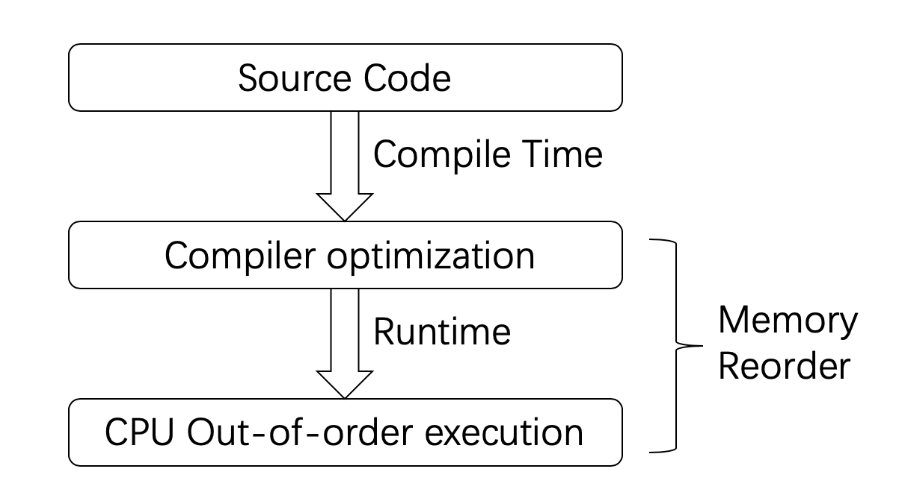

2. CPU部件为了提高效率，在执行指令时使用了乱序、多发射等技术，这也会导致机器码中的指令执行顺 序和机器码顺序不同。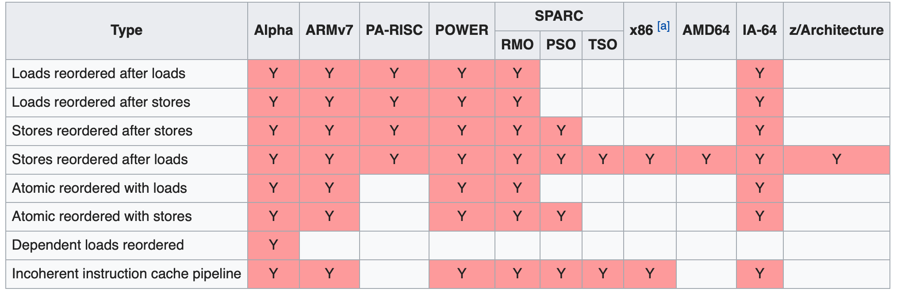

3. 当提升单核能力来提高CPU性能的路越走越窄时，多核架构逐渐成为一条新的道路，多核中各核心都有自己的cache，还有不同层级的cache，彼此共享内存。每个CPU核在运行的时候，都会优先考虑离自己最近的Cache，一旦命中就直接使用Cache中的数据，每一层之间的Cache，数据常常是不一致的，而CPU去同步这些数据是需要消耗时间的。这就会造成某个CPU核修改了一个数据，没有同步的让其他核知道（CPU层面使用的是一套包括[MESI协议](https://my.oschina.net/u/4482993/blog/4690298)、store buffer、invalid queue等技术在内的数据同步方式）时又有其他核也要访问同一块内存，于是多个核心上的cache就存在了数据不一致的情况，必须等待CPU上的硬件算法完成数据的同步。

   

   

+ 由于以上这些原因CPU所运行的程序和我们编写的代码可能是不一致的，甚至，对于同一次执行，不同线程感知到其他线程的执行顺序可能都是不一样的。因此内存模型需要考虑到所有这些细节，以便让开发者可以精确控制以避免未定义的行为。

### 内存模型

#### C++中的对象和内存位置

+ C++内存模型中的基本存储单位是字节。C++中所有数据都是由对象（基本类型+指针类型+定义的类对象）组成的。每个对象均包含了一个或多个内存位置（字节寻址）[参考](https://paul.pub/cpp-memory-model/#id-%E5%AF%B9%E8%B1%A1%E5%92%8C%E5%86%85%E5%AD%98%E4%BD%8D%E7%BD%AE)。

```cpp
struct S {
 char a;        // 内存位置 #1
 int b : 5;     // 内存位置 #2
    int c : 11,    // 内存位置 #2 （接续，相邻位域占用同一个内存位置）
    : 0,     // 无名位域，它指定类定义中的下个位域将始于分配单元的边界。
  d : 8;     // 内存位置 #3 （由于存在0值无名位域，这里是一个新的内存位置）
    struct {
        int ee : 8; // 内存位置 #4
    } e;
} obj;
```

+ 如果多个线程各自访问的是不同的内存位置不会出现问题，但是当多个线程访问同一个内存位置，并且其中只要有一个线程包含了写操作，如果这些访问没有一致的修改顺序，那么结果就是未定义的。

#### 抽象内存模型

+ 对内存的操作归根结底只有load和store两种操作，指令重拍也就只有四种：

 1. Loadload：重拍两个读操作
 2. Loadstore：将写之前的读操作重排到写之后
 3. Storeload：将读之前的写操作重排到读之后
 4. Storestore：重排两个写操作

+ 上述四种重排是否出现就决定了对应内存模型的强弱程度，由于重排会发生在软件和硬件两个层面，所以内存模型也就有软件和硬件两个层面。

+ 内存模型定义了特定处理器上或者工具链上对指令的重排情况（原则是**不能修改单线程的行为**），代码和指令的重排会严格遵守对应的内存模型。以下是几种CPU层面的内存模型分类。

  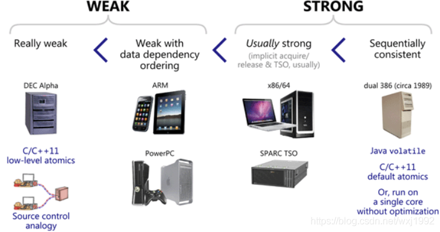

+ 在上图中DEC Alpha平台上四种重排都会发生。x86的内存模型叫做x86-TSO（Total Store Order），这可能是目前处理器中最强的内存模型之一。主流的CPU都没有在硬件层面上提供Sequential Consistency(没有重排，代价大效率低且无必要)。

### 干预重排：Barrier

+ 为了兼顾指令重拍带来的效率提升和阻止乱序执行可能造成的错误，有时必须对指令重排进行干预。CPU和编译器为这样的需求提供了屏障Barrier这样一个抽象的手段(软件层面)。

#### Compiler Barrier

+ 用来限制编译阶段的重排
+ GCC编译器下在代码中插入`asm volatile("" ::: “memory”)`就是一个Compiler Barrier

#### Runtime Barrier

+ 通过特定的CPU 指令来限制运行阶段的重排

1. Loadload barrier：保证barrier前的读操作比barrier后的读操作先完成。
2. Loadstore barrier：保证barrier前的读操作比barrier后的写操作先完成。
3. Storeload barrier：保证barrier前的写操作比barrier后的读操作先完成。
4. Storestore barrier：保证barrier前的写操作比barrier后的写操作先完成。

## 原子类型
+ 多线程读写同一变量需要使用同步机制，最常见的同步机制就是`std::mutex`和`std::atomic`，其中`atomic`通常提供更好的性能。

+ 定义在`atomic`头文件中的模板类，主要用于替代`mutex`实现同步

**注意事项**

1. 所有原子类型都**不支持拷贝、赋值和移动**，因为该操作涉及了两个原子对象（对于两个不同的原子对象上单一操作不可能是原子的）。但可以用对应的内置类型或者提供的成员函数赋值。
2. **`std::atomic_flag`是唯一一个保证无锁的原子类型**，只支持`ATOM_FLAG_INIT`宏初始化为`clear()`状态，且只支持在`set()`和`clear()`之间转换。
3. 规范要求`atomic_flag`的原子操作都是免锁的，其他类型是否免锁与具体的平台有关。
4. 原子操作并**不一定能提高性能**，只有在没有任何竞争或只被一个线程访问的原子操作是才比较快的，当原子操作需要等待CPU的MESI等硬件算法完成一致性同步时，这个复杂的硬件算法使得原子操作会变得很慢。

### 标准原子类型

+ atomic<>模板类特化了常用的数据类型，通常类型std::atomic\<T>的别名就是`atomic_T`，只有以下几种例外：`signed`缩写为`s`，`unsigned`缩写为`u`，`long long`缩写为`llong`


```cpp
namespace std {
    using atomic_bool = atomic<bool>;
    using atomic_char = std::atomic<char>;
    using atomic_schar = std::atomic<signed char>;
    using atomic_uchar = std::atomic<unsigned char>;
    using atomic_uint = std::atomic<unsigned>;
    using atomic_ushort = std::atomic<unsigned short>;
    using atomic_ulong = std::atomic<unsigned long>;
    using atomic_llong = std::atomic<long long>;
    using atomic_ullong = std::atomic<unsigned long long>;
}
```

### 指针原子类型`std::atomic<T*>`

### 自定义原子类型

+ 该自定义类型必须[可平凡复制](https://zh.cppreference.com/w/cpp/named_req/TriviallyCopyable) (使用`std::is_trivially_copyable`校验, 通俗的说，就是可以直接按字节拷贝的结构)。
+ 自定义类型的原子类型不允许运算操作，只允许`is_lock_free、load、store、exchange、compare_exchange_weak`和`compare_exchange_strong`，以及赋值操作和向自定义类型转换的操作o

## 原子操作支持

+ **原子操作**就是对一个内存上变量（或者叫左值）的读取-变更-存储（load-add-store）作为一个整体一次完成。cpu保证没有线程能观察到原子操作的中间态，也就是对于一个原子操作，对于所有的线程来说要么做了要么没做。

### 标准库中原子类型的操作支持

|           函数            | 操作类型 |        功能        | atom_flag | atom_bool | 原子指针 | 原子整形 |
| :-----------------------: | :------: | :----------------: | :-------: | :-------: | :------: | :------: |
|      `test_and_set`       |  R-M-W   | 设为true并返回旧值 |    Yes    |           |          |          |
|          `clear`          |    W     |     设为false      |    Yes    |           |          |          |
|      `is_lock_free`       |    R     |    检查免锁支持    |           |    Yes    |   Yes    |   Yes    |
|          `load`           |    R     |       读变量       |           |    Yes    |   Yes    |   Yes    |
|          `store`          |    W     |       写变量       |           |    Yes    |   Yes    |   Yes    |
|        `exchange`         |  R-M-W   |  替换值并返回旧值  |           |    Yes    |   Yes    |   Yes    |
|  `compare_exchange_weak`  |  R-M-W   |                    |           |    Yes    |   Yes    |   Yes    |
| `compare_exchange_strong` |  R-M-W   |                    |           |    Yes    |   Yes    |   Yes    |
|     `fetch_add、 +=`      |  R-M-W   |                    |           |           |   Yes    |   Yes    |
|     `fetch_sub、 -=`      |  R-M-W   |                    |           |           |   Yes    |   Yes    |
|         `++、--`          |  R-M-W   |                    |           |           |   Yes    |   Yes    |
|      `fetch_add、&=`      |  R-M-W   |                    |           |           |          |   Yes    |
|      `fetch_or、|=`       |  R-M-W   |                    |           |           |          |   Yes    |
|      `fetch_xor、^=`      |  R-M-W   |                    |           |           |          |   Yes    |

* `load、store、exchange`使用和返回的都不是原子类型的值。

* 所有**命名函数（例如：`fetch_add`, `fetch_or`）返回的是修改前的值**。而**复合赋值运算符（例如：`+=`, `|=`）返回的是修改后的值**。

* `compare_exchange_weak` 和 `compare_exchange_strong`都接受`T& expected`和`T desired`两个输入值。函数会比较原子变量实际值和所提供的预计值，相等则更新原子变量值为期望值，否则保持原子变量值不变，如果原子变量值发生了变化返回true，否则返回false。`compare_exchange_weak`在缺少单个[比较交换指令](https://en.wikipedia.org/wiki/Compare-and-swap)的机器上可能会出现伪失败（原始值等于预计值时返回False）。


### 自由函数

+ 除了每个类型各自的成员函数，原子操作库还提供了自由函数(函数名多了一个atomic_前缀，**参数仅为指针**类型)

1. 除`std::atomic_is_lock_free`外，每个自由函数有一个`_explicit`后缀版本，`_explicit`自由函数额外接受一个`std::memory_order`参数
2. 自由函数不仅可用于原子类型，还为std::shared_ptr提供了特化版本(C++20弃用了特化，直接允许std::atomic的模板参数为std::shared_ptr)

```cpp
std::atomic<int> i(42);
int j = std::atomic_load(&i); // 等价于i.load()
std::atomic<int> i(42);
std::atomic_load_explicit(&i, std::memory_order_acquire); // i.load(std::memory_order_acquire)
std::shared_ptr<int> p(new int(42));
std::shared_ptr<int> x = std::atomic_load(&p);
std::shared_ptr<int> q;
std::atomic_store(&q, p);
std::atomic<std::shared_ptr<int>> x; // C++20
```

## memory_order

+ 为了更好的提供多线程支持，C++11引入`std::memory_order`提供一种**通过原子变量限制内存序**的手段来干预指令的重排，它会影响**原子操作周围的所有内存访问**顺序。
+ 定义好memory order后的工作由编译器和cpu完成：其具体实现是通过**内存屏障memory barrier（FENCE/栅栏）**来进行的，代码在不同平台上会插入合适的[同步屏障](https://www.wikiwand.com/zh-hans/同步屏障)指令来保证内存序（**在memory barrier 之前的指令和memory barrier之后的指令不会由于系统优化等原因而导致乱序**）。在strong memory model的平台需要增加的指令较少（平台本身就有相对强的顺序保证），而weak memory order的平台需要更多的指令来进行限制。[来源](https://blog.csdn.net/wxj1992/article/details/104266983)

### 顺序关系

+ 对于两个**语句**A和B，C++对A和B的访问顺序定义了以下几种关系（A relationship B）：

#### sequenced-before

+ 一种**单线程上的关系**，这是一个**非对称，可传递**的成对关系。
+ 满足此关系则A在B之前执行且B可以看到A的执行结果。

#### happens-before

+ 对sequenced-before的拓展，包含了单线程（此时即sequenced-before）和多线程下的关系。是一个**非对称，可传递**的关系。
+ 满足此关系则A对内存的修改将在B操作执行之前就可见（为线程间的数据访问提供了保证）。

#### synchronizes-with

+ 是一种**运行时的同步关系**，描述对内存的修改操作（包括原子和非原子操作）对其他线程可见

+ 满足此关系则保证操作A之前的内存修改对B之后都可见。

  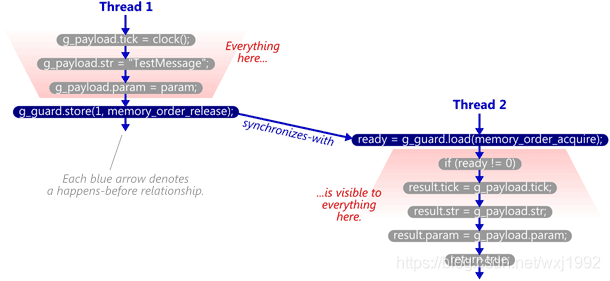

### 六种memory_order

|         枚举值         |                             规则                             |
| :--------------------: | :----------------------------------------------------------: |
| `memory_order_relaxed` |               不对原子操作的执行顺序做任何保证               |
| `memory_order_release` | 本线程中所有之前的原子写操作完成后才能执行本条原子操作（**我后写**） |
| `memory_order_acquire` | 本线程中所有之后的原子读操作只有在本条原子操作完成后才能执行（**我先读**） |
| `memory_order_acq_rel` |                 同时满足`acquire`和`release`                 |
| `memory_order_consume` | 本线程中所有后续**本原子变量**相关的原子操作只有在本条原子操作完成后执行，**不推荐** |
| `memory_order_seq_cst` |   默认控制，全部原子操作遵循代码顺序，**不允许重排和乱序**   |
* 原子类型的成员函数支持的有意义的memory_order如下：

  |   操作类型    |                     有意义参数                      |
  | :-----------: | :-------------------------------------------------: |
  |  Read / Load  | `memory_order_{relaxed、consume、acquire、seq_cst}` |
  | Write / Store |     `memory_order_{relaxed、release、seq_cst}`      |
  |     R-M-W     |     `memory_order_{relaxed、acq_rel、seq_cst}`      |

### 三种内存模型

* 当多个线程中包含了多个原子操作，而这些原子操作的memory_order的选择不一样时将导致运行时不同的内存模型强度。

#### Sequential Consistency

顺序一致性模型，默认模型，最严格的内存模型，它将提供以下保证：

1. 程序指令与源码顺序一致（所有关于原子操作的代码都不会被乱序）
2. 所有线程的所有操作存在一个全局的顺序。

```cpp
std::atomic<bool> x,y;
std::atomic<int> z;

void write_x_then_y(){
    x.store(true); // ①
    y.store(true); // ②
}

void read_y_then_x(){
    while(!y.load()); // ③
    if(x.load()) // ④
        ++z; // ⑤
}

int main(){
    x.store(false), y.store(false), z.store(0);
    std::thread a(write_x_then_y), b(read_y_then_x);
    a.join();
    b.join();
    assert(z.load()!=0); // ⑥
}
/*
① happens-before ②
② happens-before ③
③ happens-before ④
最终顺序：①②③④
*/
```

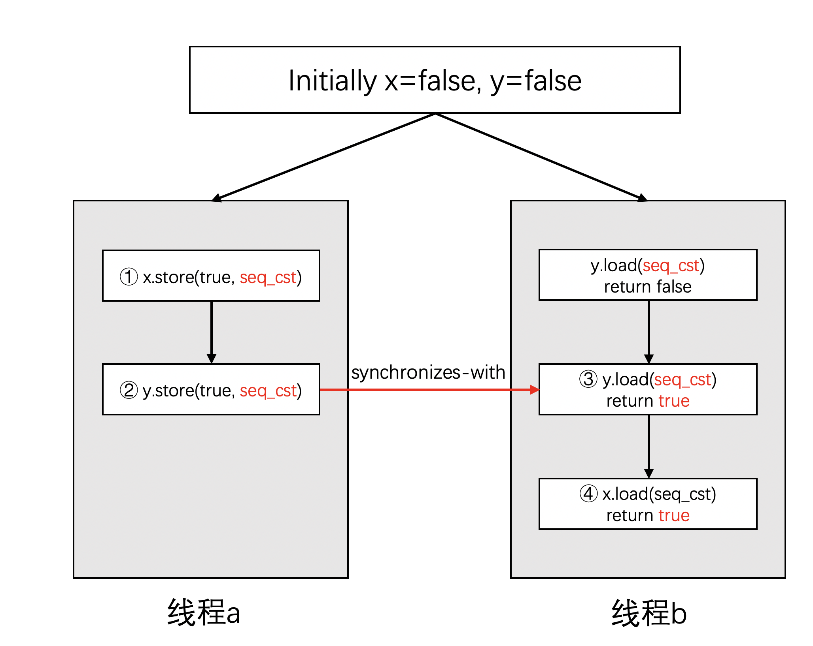

#### Release and Acquire

线程A和B**在运行时**，如果线程A对一个原子操作采用`memory_order_release`，线程B对同一个原子变量的原子操作为`memory_order_acquire`，线程之间的读写才**可能建立Synchronizes-with关系**。


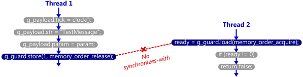

满足synchronizes-with关系的模型不再有全局的一致顺序，同时该模型保证：

1. 对同一个对象的多个原子操作不会被打乱
2. release操作禁止了所有在它之前的读写操作与在它之后的写操作乱序
3. acquire操作禁止了所有在它之前的读操作与在它之后的读写操作乱序

```cpp
std::atomic<bool> x,y;
std::atomic<int> z;

void write_x_then_y(){
    x.store(true, std::memory_order_relaxed); // ①
    y.store(true, std::memory_order_release); // ②
}

void read_y_then_x(){
    while(!y.load(std::memory_order_acquire)); // ③
    if(x.load(std::memory_order_relaxed))	   // ④
        ++z;
}

int main(){
    x.store(false), y.store(false), z.store(0);
    std::thread a(write_x_then_y), b(read_y_then_x);
    a.join();
    b.join();
    assert(z.load()!=0); // ⑤
}
/*
①happens-before②
②synchronized-with③
③happens-before④
最终顺序：①②③④
*/
```
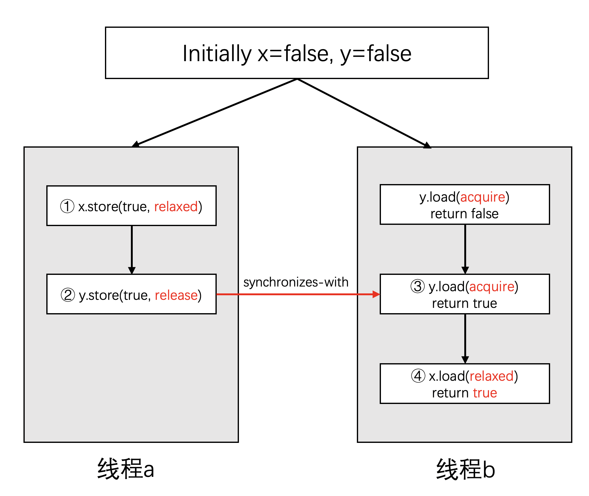

#### Relaxed

最弱的内存模型，此模型保证：

1. 仅仅是保证原子操作自身的原子性，所有原子操作不存在一个全局顺序（线程内部有happens-before规则）
```cpp
std::atomic<bool> x,y;
std::atomic<int> z;

void write_x_then_y(){
    x.store(true, std::memory_order_relaxed); // ①
    y.store(true, std::memory_order_relaxed); // ②
}

void read_y_then_x(){
    while(!y.load(std::memory_order_relaxed)); // ③
    if(x.load(std::memory_order_relaxed)) // ④
        ++z;  // ⑤
}

int main(){
    x.store(false), y.store(false), z.store(0);
    std::thread a(write_x_then_y), b(read_y_then_x);
    a.join();
    b.join();
    assert(z.load()!=0); // ⑥
}
/*
线程A最终表现：①②
线程B最终表现：③④
从原子变量y的角度来看，这段代码的逻辑保证了顺序 ②③④，但是A中的顺序并不会同步到线程B中，此时线程B看到的执行顺序可能是②③④①、①②③④、②①③④，线程A和B不存在统一的访问顺序
*/
```
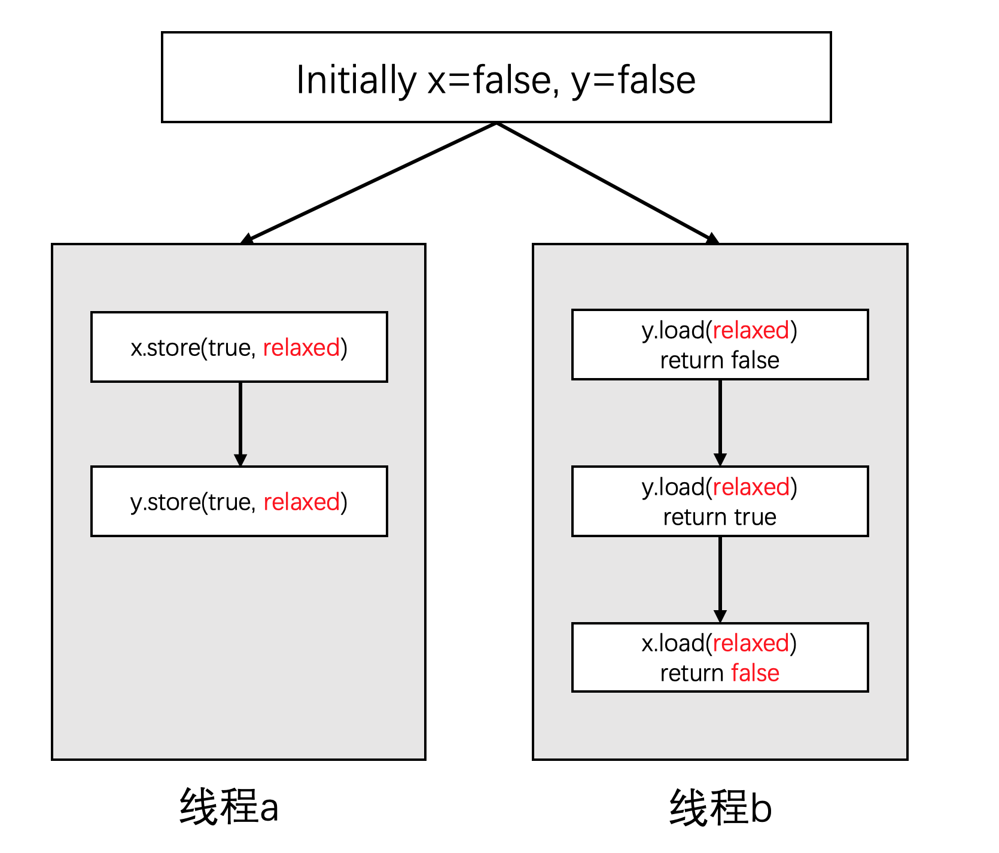

### 注意事项

1. `memory_order_consume`仅仅考虑对一个`atomic`数据的读写顺序（C++17修改了其语义，因此不推荐使用）。而其他几种内存顺序都是在操控/安排多个`atomic`数据之间的读写顺序。
2. C++11所规定的这6种模式，**它本身与多线程无关，是限制的单一线程当中指令执行顺序**。这是由于在单线程的环境下指令重拍不会造成逻辑错误（没有依赖的指令才会重排，CPU乱序发射但有序写回，详见计算机体系结构），但在多核心多线程下由于数据的共享，指令重排和乱序执行时内存数据的同步顺序和代码顺序不一致而造成逻辑错误，所以需要**限制单线程下的指令重排以避免多线程环境下出现的问题**。

## Fence

从C++11开始，C++提供了`std::atomic_thread_fence`（在线程间进行数据访问的同步）和`std::atomic_signal_fence`（线程和信号处理器间的同步）两种机制控制乱序优化。fence可以和原子操作组合进行同步，也可以fence之间进行同步，fence不光可以不依赖原子操作进行同步，而且相比较于同样memory order的原子操作，具有更强的内存同步效果。

### atomic_thread_fence

1.  **full fence**：将参数指定为`memory_order_seq_cst`或者`memory_order_acq_rel`。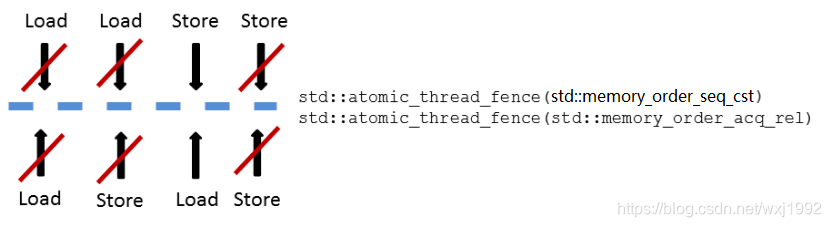

2.  **acquire fence**：将参数指定为`memory_order_acquire`或`memory_order_consume`，阻止它之前的读操作和之后的读写操作的乱序（**先读**）。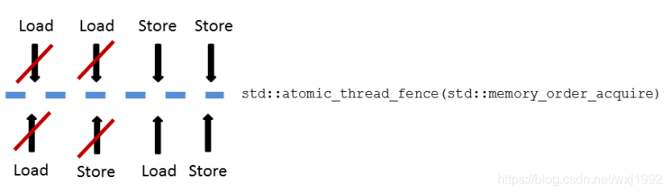

3.  **release fence**：将参数指定为`memory_order_release`，阻止它之前的读写操作和之后的写操作的乱序（**后写**）。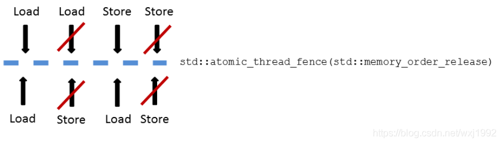

* 这三种fence都不会阻止先写后读的重排

  ```cpp
  std::atomic<bool> x,y;
  std::atomic<int> z;
  
  void write_x_then_y(){
      x.store(true, std::memory_order_relaxed); // ①
      std::atomic_thread_fence(std::memory_order_release);
      y.store(true, std::memory_order_relaxed); // ②
  }
  
  void read_y_then_x(){
      while(!y.load(std::memory_order_relaxed)); // ③
      std::atomic_thread_fence(std::memory_order_acquire);
      if(x.load(std::memory_order_relaxed))
          ++z;  // ④
  }
  
  int main(){
      x.store(false), y.store(false), z.store(0);
      std::thread a(write_x_then_y), b(read_y_then_x);
      a.join();
      b.join();
      assert(z.load()!=0); // ⑥
  }
  /*
  线程A：①②
  线程B：③④
  代码的逻辑保证了顺序 ②③④，两个fence限制了线程A和线程B内部的重排。
  最终顺序：①②③④
  */
  ```

### std::atomic_signal_fence

### mutex与fence

由于临界区内的代码不会被优化到临界区之外（反之不然），所以mutex也可以在语句间起到fence的作用，如下图中第一种可能会被优化成第二种。但是第二种情况不会被优化成第三种：

### memory_order与fence

1. fence的同步效果要强于基于原子操作的同步，同时在weak memory order平台的开销也会更大。
2.

# Lock Free编程

+ lock free经常被中译为无锁编程，从而造成没有使用锁的程序就是无锁编程这样一个错误概念。无锁编程只需要满足一项要求：如果涉及到共享内存的多线程代码在多线程执行下不可能由于互相影响导致被阻塞住，不管OS如何调度线程**至少有一个线程在做有用的事**就是lock-free。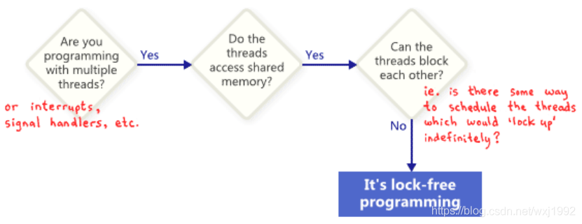
+ **NOTE**：lock free(代码通常更复杂难以理解)不一定优于使用锁的方式，他们在应用场景上更多的是一种互补的关系。lock-free算法的价值在于其保证了一个或所有线程始终在做有用的事，而不是绝对的高性能。但lock-free相较于锁在并发度高（竞争激烈导致上下文切换开销变得突出）的某些场景下会有很大的性能优势，总的来说，在多核环境下，lock-free是很有意义的。

## 无锁编程范式

### 函数式编程FP

+ FP不会改变外部状态，不修改共享数据就不存在race condition，因此也就没有必要使用锁，可以实现无锁的算法

### CSP（Communicating Sequential Processer）

+ CSP中的线程理论上是分开的，没有共享数据，但communication channel允许消息在不同线程间传递
+ 每个线程实际上是一个状态机，收到一条消息时就以某种方式更新状态，并且还可能发送消息给其他线程
+ 真正的CSP没有共享数据，所有通信通过消息队列传递，但由于C++线程共享地址空间，因此无法强制实现这个要求。[CSP实现ATM](no link)

# 高级线程管理

## 线程池

+ 线程的创建和销毁都是需要时间的，当任务的计算时间在线程的生命期中占比较少且任务较多时，为了避免反复创建和释放线程的代价，引入线程池实现。在线程池中线程结束任务后并不被释放而是等待执行下一个任务，以此来避免线程的重复创建与销毁。
+ 线程池一般主要由任务队列和工作线程队列构成。任务队列负责存放主线程需要处理的任务，工作线程队列负责从任务队列中取出和运行任务。
+ C++目前为止没有提供线程池的支持，需要自己实现[实现参考](https://wangpengcheng.github.io/2019/05/17/cplusplus_theadpool/) 。

# 并行算法(C++17)

需要tbb库（[Intel Threading Building Blocks](https://github.com/intel/tbb)）提供支持。

## [并行策略](https://www.bookstack.cn/read/CPP-Concurrency-In-Action-2ed-2019/content-chapter10-10.2-chinese.md)

+ 标准库将许多算法加入了`sequenced_policy`参数已启用算法的并行版本，该参数对算法只是一种权限，而非一种申请（即使指定了并行参数，算法依然可能是串行的）。[参考来源](https://paul.pub/cpp-concurrency)

|          变量          |                   类型                   |                         作用                         |
| :--------------------: | :--------------------------------------: | :--------------------------------------------------: |
|    `execution::seq`    |      `execution::sequenced_policy`       |                     顺序执行算法                     |
|    `execution::par`    |       `execution::parallel_policy`       |            并行执行算法（通常使用线程池）            |
| `execution::par_unseq` | `execution::parallel_unsequenced_policy` | 可以并行执行算法，并可以使用矢量命令（例如SSE，AVX） |

这些策略将会影响算法，算法的行为受到执行策略的控制。算法会更加复杂化，影响抛出异常时的行为，影响算法执行的位置、方式和时间。

## 并行算法

标准库中的大多数被执行策略重载的算法都在<algorithm>和<numeric>头文件中。包括有：

遍历：`for_each，for_each_n`

生成/填充：`fill，fill_n`，`generate，generate_n`

查找：`find，find_if，find_end，find_first_of，adjacent_find`，`search，search_n`

替换：`replace，replace_if，replace_copy，replace_copy_if`

删除：`remove，remove_if，remove_copy，remove_copy_if`

集合：`includes，set_union，set_intersection，set_difference，set_symmetric_difference`

堆： `is_heap，is_heap_until`

第K： `min_element，max_element，minmax_element，nth_element`

排序： `sort，stable_sort，partial_sort，partial_sort_copy，is_sorted，is_sorted_until`

统计：`count，count_if，all_of，any_of，none_of`

划分：`is_partitioned，partition，stable_partition`

比较：`mismatch，equal，unique，lexicographical_compare`

复制/移动：`copy，copy_n，copy_if，move，swap_ranges，unique_copy ，reverse_copy，rotate_copy，partition_copy`

变换：`transform，reverse，rotate，transform_reduce`

合并： `merge，inplace_merge`

遍历计算：`reduce，exclusive_scan，inclusive_scan，transform_exclusive_scan，transform_inclusive_scan，adjacent_difference `。

# 锁

加锁的目的就是保证共享资源在任意时间里，只有一个线程访问，这样就可以避免多线程导致共享数据错乱的问题。

## 互斥锁

互斥锁加锁失败后，内核会将尝试加锁的线程设置为睡眠状态，当等待的锁被释放后，内核会在**一定时机**唤醒线程（由阻塞态进入就绪态），该线程持有锁后可以继续执行。该锁涉及到**内核态和用户态的切换，两次线程上下文的切换**（只需切换寄存器等线程私有不共享数据，由于线程共享虚存等所以不需切换）。适用于**临界区代码执行代价大于上下文切换总代价**。

1. 当线程加锁失败时，内核会把线程的状态从「运行」状态设置为「睡眠」状态，然后把 CPU 切换给其他线程运行；
2. 当锁被释放时，之前「睡眠」状态的线程会被内核标记为「就绪」状态，然后内核会在合适的时间，把 CPU 切换给该线程运行。

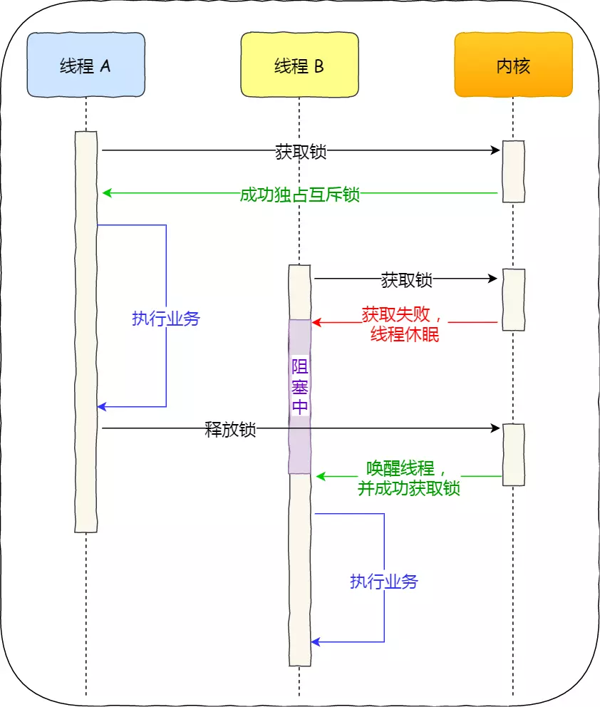

## 自旋锁

自旋锁在加锁失败后，该线程会**忙等待**直到拿到锁执行任务；其实现利用了CPU提供的CAS（Compare And Swap）原子指令将加锁的两个步骤合并（首先查看锁状态，然后无锁则获取锁），在**用户态完成加锁和解锁**操作，不会主动产生线程上下文切换。

该锁开销少，在多核系统下一般不会主动产生线程切换，适合异步、协程等在用户态切换请求的编程方式，但如果被锁住的代码执行时间过长，自旋的线程会长时间占用 CPU 资源。同时也不适用于非抢占式调度的单核CPU（**自旋的线程永远不会主动放弃 CPU**）。

## 读写锁

由读锁（共享锁：用于读取共享资源）和写锁（独占锁：用于修改共享资源）两部分构成，适用于可以明确划分读写操作、尤其是读多写少的场景。

1. 读优先锁：读锁能被更多的线程持有，以便提高读线程的并发性。写锁只有在之前所有读锁释放后才可获得。可能造成了写线程饥饿。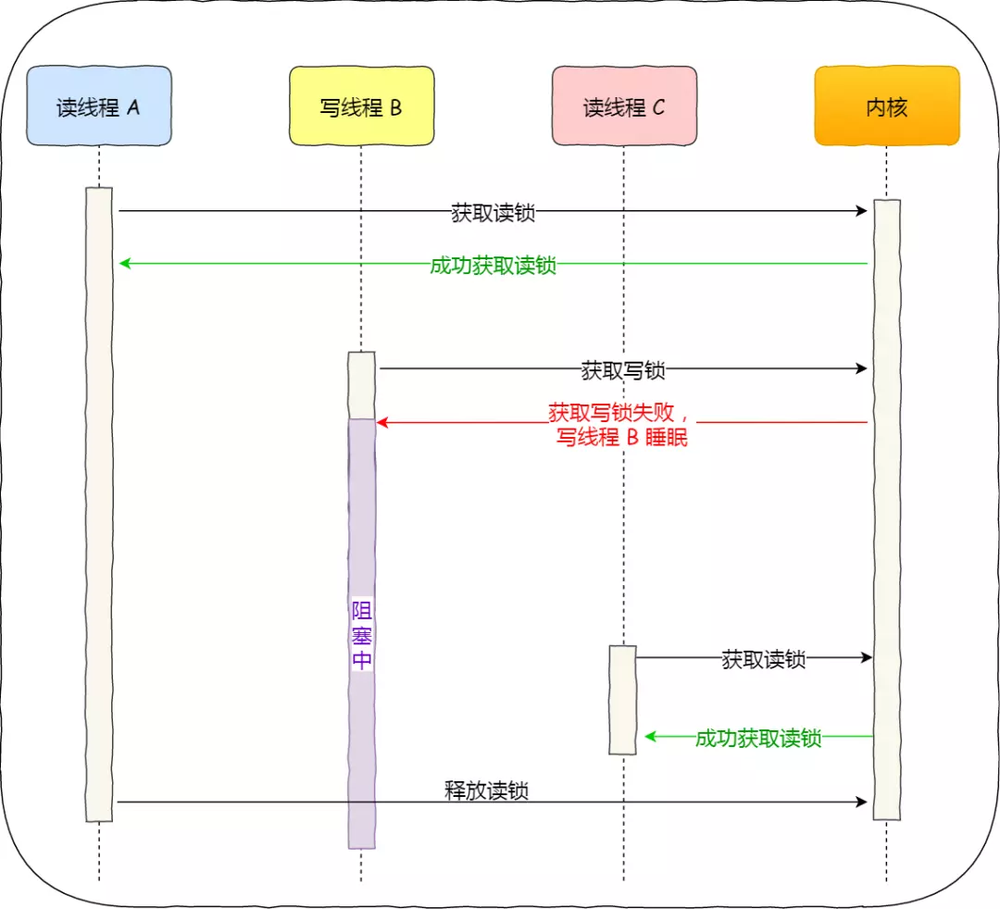

2. 写优先锁：优先服务写线程，写锁申请之后的读锁无法获取读锁。可能造成了写线程饥饿。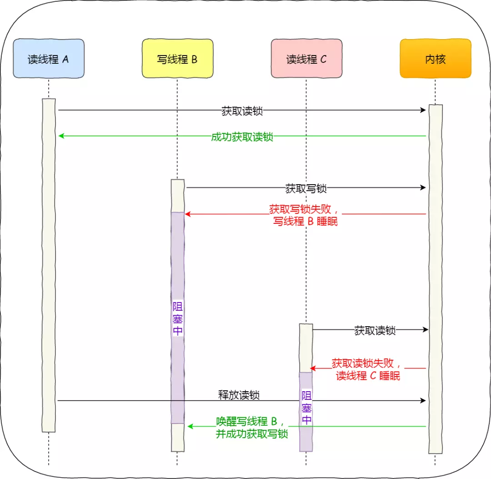

3. 公平读写锁：利用队列**先进先出**将请求锁的线程排队，按照队列顺序加锁。

## 悲观锁

悲观锁假定多线程同时修改共享资源的概率比较高、**易冲突**，所以**访问共享资源前先上锁**。互斥锁、自旋锁、读写锁，都是属于悲观锁。

## 乐观锁

乐观锁（如在线文档）假定**冲突的概率很低**，它**先修改共享资源，再验证**这段时间内有没有发生冲突，如果没有其他线程在修改资源，那么操作完成，如果发现有其他线程已经修改过这个资源，就放弃本次操作，**乐观锁全程没有加锁**。

# 多线程编程模式

## 主从模型

## 生产-消费者模型

## 高并发索引模型


# 其它推荐

[模拟实现`std::future`](http://blog.xnnyygn.in/cpp11-std-thread-input-and-output1/) 

[C++11 并发指南系列](https://www.cnblogs.com/haippy/p/3284540.html)

[C++11多线程-目录](https://www.jianshu.com/p/e5a3498ba930)
