# 设计哲学

## [一切皆文件](https://cloud.tencent.com/developer/article/1512391)

+ 在Linux系统中，由于管道文件、socket文件等特殊文件的存在，一切皆文件退化为**一切皆文件描述符**。
+ bash再处理到`/dev/tcp/host/port`的充电向时建立了一个`host:port`的socket连接，将socket的读写表现的和普通文件的读写一样，但是上述的文件在文件系统并不是真实存在的，只是bash对用户的一个善意的谎言。
+ plan9系统承诺彻底贯彻执行一切皆文件，将分布在不同位置的所有资源作为文件统一在同一棵目录树中，实现Unix最初的愿景。

## 提供机制而非策略

## 使用文本文件保存配置信息

## 尽量避免跟用户交互

## 由众多功能单一的程序组成


# 虚拟文件系统VFS

一个操作系统可以支持多种底层不同的文件系统（比如NTFS, FAT,  ext3,  ext4），为了给内核和用户进程提供统一的文件系统视图，Linux在用户进程和底层文件系统之间加入了一个抽象层，即虚拟文件系统(Virtual  File System, VFS)。通过虚拟文件系统VFS提供的抽象层来适配各种底层不同的文件系统甚至不同介质，进程所有的文件操作都由VFS完成实际的文件操作。文件IO流程简化为：

1. 应用程序通过文件操作函数（`open()、close()、read()、write()、ioctl()`）调用VFS提供的系统调用函数接口(`sys_open()、sys_close()、sys_read()、sys_write()、sys_ioctl()`)同VFS进行交互。
2. VFS通过驱动程序提供的`file_operation`接口同设备驱动进行交互（驱动层的`file_operations`方法的屏蔽了不同类型设备的底层操作方法的差异）

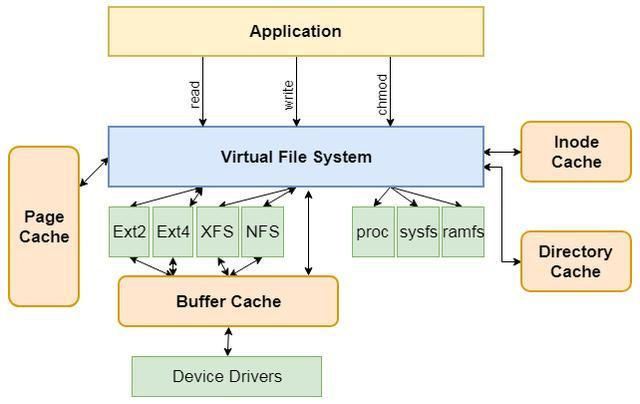

## 数据结构

每个单独的文件系统分别为自己所管理的文件系统提供相应的控制结构，组织自己所管理的所有文件。


VFS主要通过四个主要的结构体实现抽象层，每个结构体包含了指向该结构体支持的方法列表的指针。[更详细的说明](https://www.huliujia.com/blog/81d31574c9a0088e8ae0c304020b4b1c4f6b8fb9/)

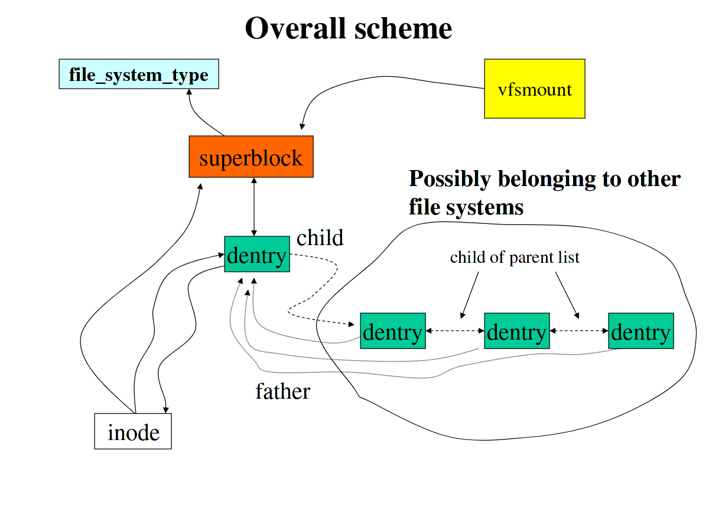


### 超级块对象 super block

存储一个已安装的**文件系统的控制信息**，每一个超级块对象代表一个已安装文件系统实例；每次一个实际的文件系统被安装时，内核会从磁盘的特定位置读取一些控制信息来填充**常驻内存**中的超级块对象。

#### 文件系统

```shel
cat /proc/filesystems #查看系统支持的文件系统
```

```c
struct file_system_type{ // 每种受支持的文件系统（即使无实例）一个该对象
    const char *name; //文件系统的名称
    int fs_flags; //文件系统类型
    struct super_block *(*get_sb) (struct file_system_type *, int, char *, void *);//在文件系统加载的时候读取磁盘上的superblock，并使用读入的数据填充内存中的superblock对象。
    void (*kill_sb) (struct super_block *);
    struct module *owner; /* module owning the filesystem */
    struct file_system_type *next;//下一个file_system_type，所有文件系统类型file_system_type链表管理
    struct list_head fs_supers;//该文件系统的所有超级块实例链表
};
```

#### 挂载点

```c
struct vfsmount {//表示一个具体的文件系统实例，在文件系统挂载时创建
	struct dentry *mnt_root;	/* root of the mounted tree */
	struct super_block *mnt_sb;	/* pointer to superblock */
	int mnt_flags;
	// ...其他数据成员
} ;
```

#### 超级块

```c
struct super_block{
    struct list_head s_list;//将所有的文件块对象组织成为链表
    dev_t s_dev;//文件系统对应的设备标识符
    unsigned long s_blocksize;//文件系统中数据块大小，以字节为单位
    unsigned char s_blocksize_bits;//文件系统中数据块大小，以位为单位
    unsigned char s_dirt; /* dirty flag */
    unsigned long long s_maxbytes;//允许的最大的文件大小(字节数)
    struct file_system_type s_type;//文件系统类型(ext2,ext4)
    struct super_operations s_op;//superlbock对象支持的函数操作集合（不含创建、删除）
    struct dquot_operations *dq_op;//指向某个特定的具体文件系统用于限额操作的函数集合
    struct quotactl_ops *s_qcop;//用于配置磁盘限额的的方法，处理来自用户空间的请求
    unsigned long s_magic//区别于其他文件系统的标识
    struct dentry *s_root;//指向该具体文件系统安装目录的目录项
    struct rw_semaphore s_umount;//对超级块读写时进行同步
    int s_count;//对超级块的使用计数
    atomic_t s_active;//引用计数
    struct list_head s_inodes;//管理的所有inode链表
    struct list_head s_dirty;//已经脏的inode链表
    struct list_head s_io;//需要回写的inode
    struct list_head s_instances;/* instances of this fs */
    char s_id[32];/* text name */
};

struct super_operations {//对文件系统和它的inode执行low-level operations.
    struct inode *(*alloc_inode)(struct super_block *sb);
    void (*destroy_inode)(struct inode *);
    void (*dirty_inode) (struct inode *);
    void (*put_super) (struct super_block *);
    int (*remount_fs) (struct super_block *, int *, char *);
	//... 其他函数指针成员
};
```


#### 关系

1. Linux支持的文件系统无论是否有文件系统的实例存在，都有且仅有一个`file_system_type`结构用于描述具体的文件系统的类型信息。相同文件系统的多个实例的超级块通过其域内的`s_instances`成员链接。
2. 每一个文件系统的实例都对应有一个超级块和安装点，超级块通过它的一个域`s_type`指向其对应的具体的文件系统类型`file_system_type`。

### [目录项对象`dentry`](https://bean-li.github.io/vfs-inode-dentry/)

为了方便查找文件而在内存创建的**目录项缓存**对象（目录也是文件、即**目录文件**），存储的是**磁盘文件系统目录树结构的一部分**，一个路径上的每一个组件都是一个`dentry`，包含目录下的所有的文件的`inode`号和文件名等信息，如路径`/bin/vi.txt`中共有3个`dentry（ /、 bin、vi.txt）`，但通过文件链接，**同一个文件可以有多个`dentry`**。其内部是树形结构，操作系统检索一个文件，都是从根目录开始，按层次解析路径中的所有目录，直到定位到文件。

#### dentry

| dentry状态  | d_inode |                           使用状态                           |
| :---------: | :-----: | :----------------------------------------------------------: |
|  **used**   |  有效   |         `d_count`是正数、有一个或者多个用户正在使用          |
| **unused**  |  有效   | `d_count`是0、`VFS`并没有使用该`dentry`，但仍在`dentry cache` |
| **negtive** | `null`  | `inode`对象被销毁了或者是查找的路径名称不对。此时`dentry`仍然被保存在`cache`中 |

```c
struct qstr {//quick string
	union {
		struct {//为大小端优化了内存布局
			HASH_LEN_DECLARE;//针对大小端有不同的变量申明顺序，含有本name的hash值
		};
		u64 hash_len;
	};
	const unsigned char *name;//路径的最后一个分量，即文件名(不含路径)
};

struct dentry {//directory entry
 　 atomic_t d_count;//目录项对象使用计数器 
	struct dentry *d_parent;//父目录
	struct qstr d_name;//文件名
	struct hlist_bl_node d_hash;//哈希链表：hash由父dentry的地址和该d_name计算出，用于快速索引到本dentry
    struct list_head d_lru; // 未使用的dentry构成的链表 
	struct inode *d_inode;//与该目录项关联的inode
	unsigned char d_iname[DNAME_INLINE_LEN];//文件缩略名
	const struct dentry_operations *d_op;//此目录项支持的操作
	struct super_block *d_sb;//这个目录项所属的文件系统的超级块(目录项树的根)
	void *d_fsdata;//具体文件系统的数据
	struct list_head d_subdirs;//子目录链表
	struct list_head d_child;//父目录的子目录链表，下面的hash链表可以实现快速查找
	struct hlist_bl_node d_hash;//哈希链表：hash由父dentry的地址和该d_name计算出，用于快速索引到本dentry
	//... 其他数据成员
};

struct dentry_operations {
	int (*d_delete)(const struct dentry *);
	int (*d_init)(struct dentry *);
	char *(*d_dname)(struct dentry *, char *, int);
	//... 其他函数指针成员
};
```

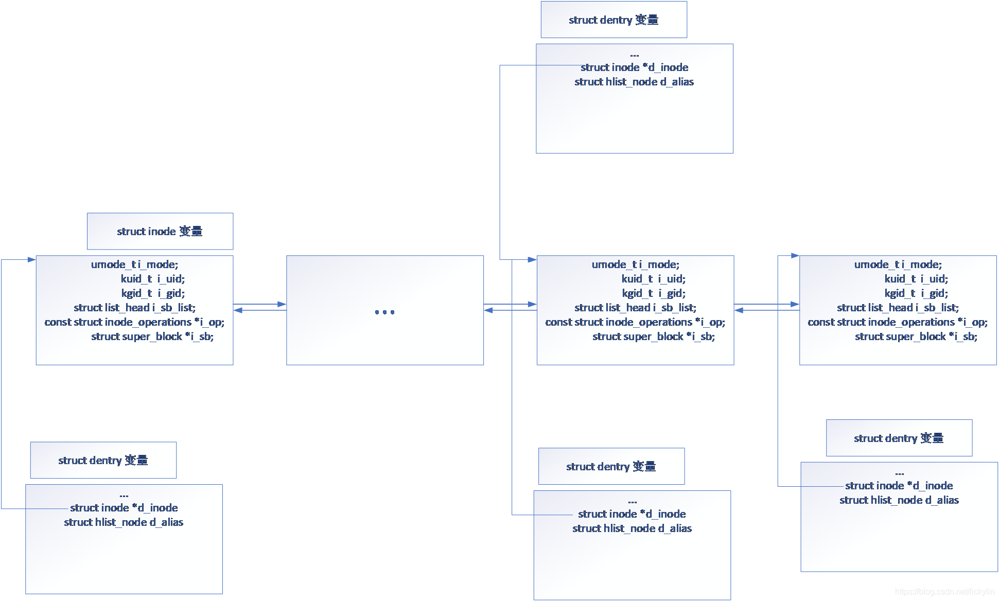

#### [dentry cache](https://blog.csdn.net/whatday/article/details/100663436)

为了提高目录项对象的处理效率而设计的**目录项高速缓存**（`dcache`），只要**有效`dentry`**被`cache`，对应的`inode`就一定也被cache到了内存之中。由空间由**`slab`分配器管理**，主要由`dentry`对象的哈希链表`dentry_hashtable`和未使用的`dentry`对象链表`dentry_unused`**两个数据结构**组成：

①：`dentry_hashtable`链表`dentry::dhash`：`dcache`中的所有`dentry`对象都通过`d_hash`指针域链到相应的`dentry`哈希链表中。

②：`dentry_unused`链表（LRU链表）`dentry_lru`：`dcache`中所有处于`unused`状态和`negative`状态的`dentry`对象都通过其`d_lru`指针域链入`dentry_unused`链表中。

### 文件对象

文件对象是**已打开的文件**在内存中的表示，主要用于建立进程和磁盘上的文件的对应关系。文件对象和物理文件的关系类型进程和程序的关系，文件对象仅仅在进程观点上代表已经打开的文件。**一个文件对应的文件对象可能不是惟一的**，但是其对应的索引节点和目录项对象是唯一的。系统的所有已打开的文件信息将被内核用一张系统级的**已打开文件表**组织起来。

#### 已打开文件

```c
struct file {//已打开文件
	struct path f_path;//该文件对应的struct path
	struct inode *f_inode;//文件对应的缓存在内存中的inode
    atomic_long_t f_count;//使用该文件的进程数、即引用计数（为0才删除）
	const struct file_operations f_op;//文件支持的操作集合
	unsigned int f_flags;//文件打开标志
	fmode_t f_mode;//文件读写权限
	struct mutex f_pos_lock;//
	loff_t f_pos;//文件的当前位置
    struct address_space *f_mapping;//文件的页缓存映射
	// ...其他数据成员
}

struct file_operations {//一系列函数指针的集合
	struct module *owner;
	loff_t (*llseek) (struct file *, loff_t, int);
	ssize_t (*read) (struct file *, char __user *, size_t, loff_t *);
	ssize_t (*write) (struct file *, const char __user *, size_t, loff_t *);
	// ...其他函数指针成员
};
```

#### 已打开文件表

所有`file`结构形成一个双链表，称为系统打开文件表。

#### 文件缓存

```c
struct address_space { //对应一个已缓存文件，管理着若干个页
    struct inode *host;//该结构所属的indee或者block_device
    unsigned long nrpages;//该文件占用的内存页数量
    spinlock_t tree_lock;//保护page_tree
    struct radix_tree_root page_tree;//指向管理所有属于本结构的物理页面的基数树根节点
    struct spinlock_t i_mmap_lock;//保护immap
    struct prio_tree_root i_mmap;//管理address_space所属文件的多个VMAs映射 
    struct address_space_operations *a_ops;//该文件支持的所有操作函数表
    //其他数据成员
}
```

**`address_space`**：一个`struct address_space`管理表示了一个文件在**所有已缓存物理页**。它是页缓存和外部设备中文件系统的桥梁，**关联了内存系统和文件系统**。


### 索引节点对象 inode

存储了**文件元数据**（文件大小，设备标识符，用户标识符，用户组标识符，文件模式，扩展属性，文件读取或修改的时间戳，链接数量，指向存储该内容的磁盘区块的指针，文件分类等），代表了存储设备上的一个实际的**物理文件**且不随文件名改变而变化。文件系统内部依靠`inode`而非文件名来识别文件（借此实现软件的[热更新](https://zhuanlan.zhihu.com/p/143430585)）。

```c
struct inode {//文件的惟一标识符，文件名可以更改但inode号锁定文件
	unsigned long i_ino; //全局唯一的索引节点号
	atomic_t i_count;  //引用计数器
	const struct inode_operations *i_op;
	struct super_block *i_sb;//inode对应的文件系统的超级块
	struct address_space *i_mapping;//管理该inode所有缓存页面的address_space
	loff_t i_size; // 文件大小，字节数
	blkcnt_t i_blocks; // 文件大小，块数
	struct timespec64 i_atime, i_mtime, i_ctime;//上次打开、修改、创建时间
	union{//和特殊文件相关的共用体域
        struct pipe_inode_info  *i_pipe; /* pipe information */
        struct block_device *i_bdev; /* block device driver */
        struct cdev *i_cdev; /* character device driver */
    };
    struct list_head i_lru;//全局LRU链表，保存所有unused的inode	
	unsigned long i_state;
    struct file_lock *i_flock;//文件锁
    //...其他数据成员
}

struct inode_operations {
	int (*create) (struct inode *,struct dentry *, umode_t, bool);
	int (*link) (struct dentry *,struct inode *,struct dentry *);
	int (*unlink) (struct inode *,struct dentry *);
	int (*symlink) (struct inode *,struct dentry *,const char *);
	int (*mkdir) (struct inode *,struct dentry *,umode_t);
	int (*rmdir) (struct inode *,struct dentry *);
	// ...其他函数指针成员
};
```

#### inode的产生

`inode`节点的大小一般是128字节或256字节，每个节点管理2KB的空间（一般文件系统中很少有文件小于2KB的，所以预定按照2KB分），节点总数在格式化时就给定(现代OS可以动态变化)。`inode`有两种，一种是VFS的`inode`，一种是具体文件系统的`inode`。前者在内存中，后者在磁盘中。

当一个文件被访问时，内核会在内存中组装相应的索引节点对象，以便向内核提供对一个文件进行操作时所必需的全部信息（这些信息一部分存储在磁盘特定位置，另外一部分是在加载时动态填充的）。没有`inode`的**匿名文件**则需要根据磁盘上的数据动态生成`inode`的信息，并将这些信息填入内存中的`inode`对象。

#### [inode的管理](https://www.cnblogs.com/long123king/archive/2014/01/30/3536486.html)

```sh
ls -l # 看文件名对应的inode号码
```

| `inode`状态  |       `unused`       |          `use`           |         ``dirty``          |
| :----------: | :------------------: | :----------------------: | :------------------------: |
|   **含义**   | 内容无效、空间可复用 | 内容有效、与某个文件关联 | 与介质上内容不一致、需回写 |
| **存储位置** | 全局`inode LRU`链表  |   全局`inode use`链表    |  `super_block`中的链表域   |

##### 链接

|            |               `inode`号               |        内容        |
| :--------: | :-----------------------------------: | :----------------: |
| **软链接** | 不同，实际数据文件`inode`引用计数不变 | 被链接的文件的路径 |
| **硬链接** | 相同，实际数据文件`inode`引用计数增加 |      文件内容      |

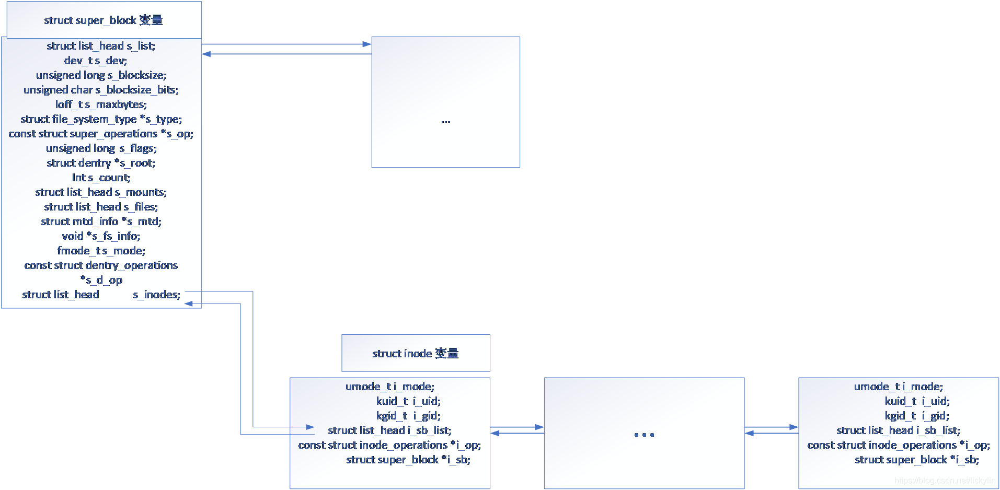

## 进程与VFS

### 数据结构

#### 进程`task_struct`

```c
struct task_struct {
    volatile long state; /* -1 unrunnable, 0 runnable, >0 stopped */
    void *stack;//
    pid_t pid;//进程id
    pid_t tgid;//线程组id
    #ifdef CONFIG_CC_STACKPROTECTOR
    /* Canary value for the -fstack-protector gcc feature */
    	unsigned long stack_canary;
    #endif
    struct list_head thread_group;//线程组链表
    struct completion *vfork_done; //* for vfork() */
    int __user *set_child_tid; //* CLONE_CHILD_SETTID */
    int __user *clear_child_tid; //* CLONE_CHILD_CLEARTID */
    cputime_t utime, stime, utimescaled, stimescaled;
    cputime_t gtime;
    /* filesystem information */
    struct fs_struct *fs;//启动该进程的用户文件系统相关,chdir、chroot可修改此变量
    struct files_struct *files;//进程拥有的文件描述符表
    struct nsproxy *nsproxy;//进程namespce隔离
};
```

#### 进程目录信息

```c
struct fs_struct {//存储和进程相关的文件系统信息
	int users;//本实例被进程引用的次数
	spinlock_t lock;
	seqcount_t seq;
	int umask;//创建文件时的默认文件掩码
	int in_exec;
	struct path root, pwd;//进程的根目录和当前目录
}

struct path {
	struct vfsmount *mnt;//所属的挂载点
	struct dentry *dentry;//目录项
	// ...其他数据成员
}
```

#### 进程打开文件表

```c
struct files_struct{//内核假定绝大多数进程打开的文件数不会超过NR_OPEN_DEFAULT=64个
    atomic_t count;//引用计数
    struct fdtable *fdt;//指向扩展的fdtable(当打开多余NR_OPEN_DEFAULT时才有效)
    struct fdtable fdtab;//基本的fdtable
    spinlock_t file_lock;/* per-file lock */
    int next_fd;//下一个可用文件描述符
    struct embedded_fd_set close_on_exec_init; //默认的close-on-exec的文件描述符位图
    struct embedded_fd_set open_fds_init//默认的已打开的文件描述符位图
    struct file *fd_array[NR_OPEN_DEFAULT]; //指向一个file结构的数组,fd_array[i]指向文件描述符为i的file对象。
};

struct fdtable{//预先分配的fdtable
	unsigned int max_fds;//本结构的数组的大小
	struct file __rcu **fd;//指向进程的打开文件表
	fd_set *close_on_exec;//位图，用来记录那些fd需要close_on_exec
	fd_set *open_fds;//位图，用来记录那些fd已经在用，那些还处于free状态
	struct rcu_head rcu;
	struct fdtable *next;//下一个fdtable
};
```

对于64位系统，内核假定绝大多数进程打开的文件数不会超过64个，因此`fork`创建进程的时候，就已经预先分配了可能需要的`fdtable`，以及两个长度为64的位图。其分配情况如下图,其中绿色部分为展开后的`fdtable`,其实际有效数据存储在`files_struct`中.

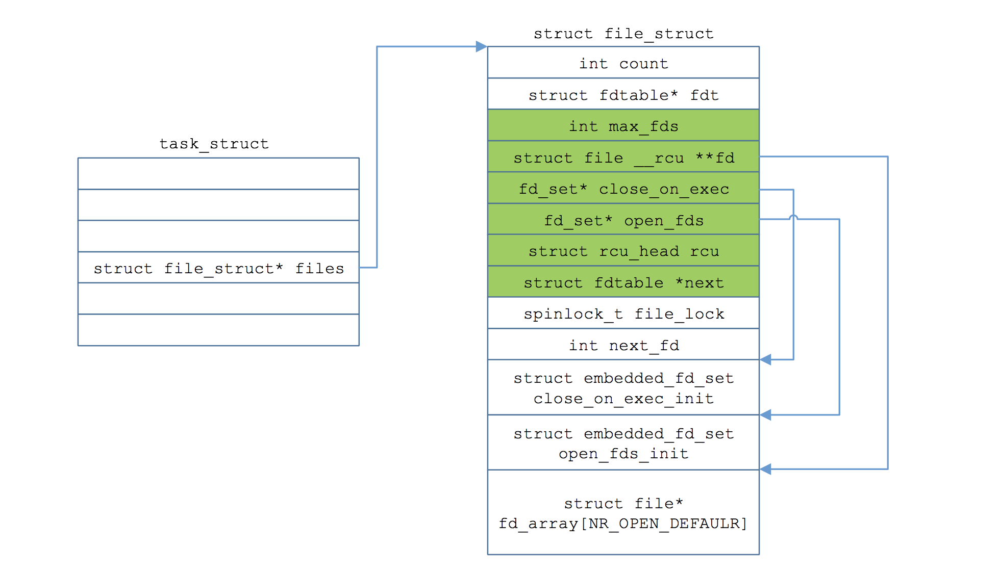

如果进程打开的文件超过了64，那么就不得不`expand_fdtable()`分配一个更大的能够容纳更多`struct file`指针的`fdtable`,然后将老的`fdtab`中数据拷贝到新的`fdtable`。

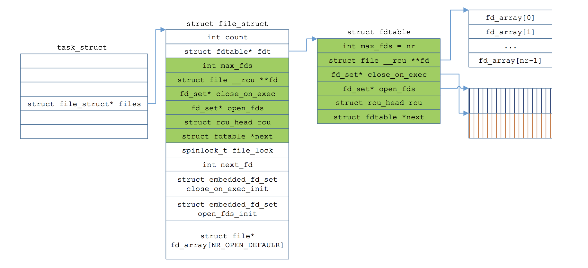

### 文件相关三张表

#### 进程级文件描述附表

存储了本进程所有打开的文件描述符信息，每一项包含一个文件描述符的控制标志`flags`（**`close-on-exec`**等）及指向对应文件表项的指针。

##### [`close-on-exec`](https://cloud.tencent.com/developer/article/1177094)

即字面意思的执行`exec`就`close`。通过在打开文件时加入`close-on-exec`可以实现在**`fork`的子进程执行`exec`执行另一个程序时，自动关闭**被复制到子进程的无用的文件描述符。

#### 系统级文件打开表

文件表保存了所有进程打开的文件的信息，每一个表项描述一个被进程打开的文件（可能出现多个表项对应一个`idode`），该表项记录了一个进程对文件**读写的偏移量**、存取权限和文件的`inode`指针。

#### 系统级`inode`表

`i-node`**存储在磁盘设备上**保存了系统所管理的所有文件的信息，每一项代表一个文件、记录了文件的类型、大小、权限、UID、GID、链接数、时间戳（`ctime、mtime、atime`）、文件数据`block`的位置。内核在**内存中维护了磁盘上inode的副本**并加入了一些文件的附加信息（如引用计数、文件锁等临时属性）。

#### 三表关系

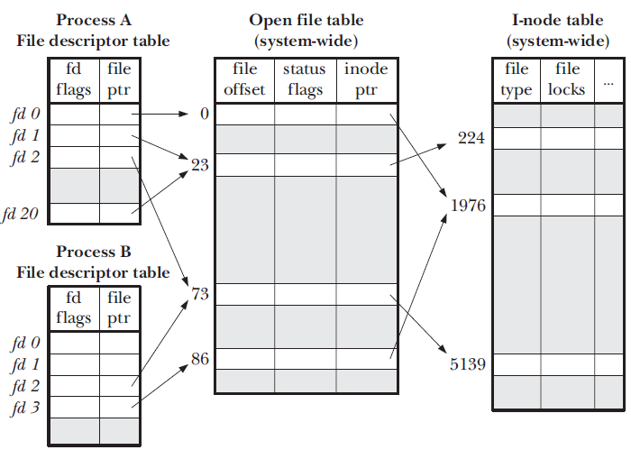

同一进程使用`dup`造成进程A中`file:23`的状态、`fork`的父子进程造成`file:73`的状态、不同进程调用`open`打开相同文件造成`inode:1976`的状态

### 进程与文件

进程使用`files_struct`, `fs_struct` 和`mnt_namesapce`这三个数据结构来将进程和`VFS`层关联起来，记录已打开文件列表、进程的根文件系统、当前工作目录等信息。

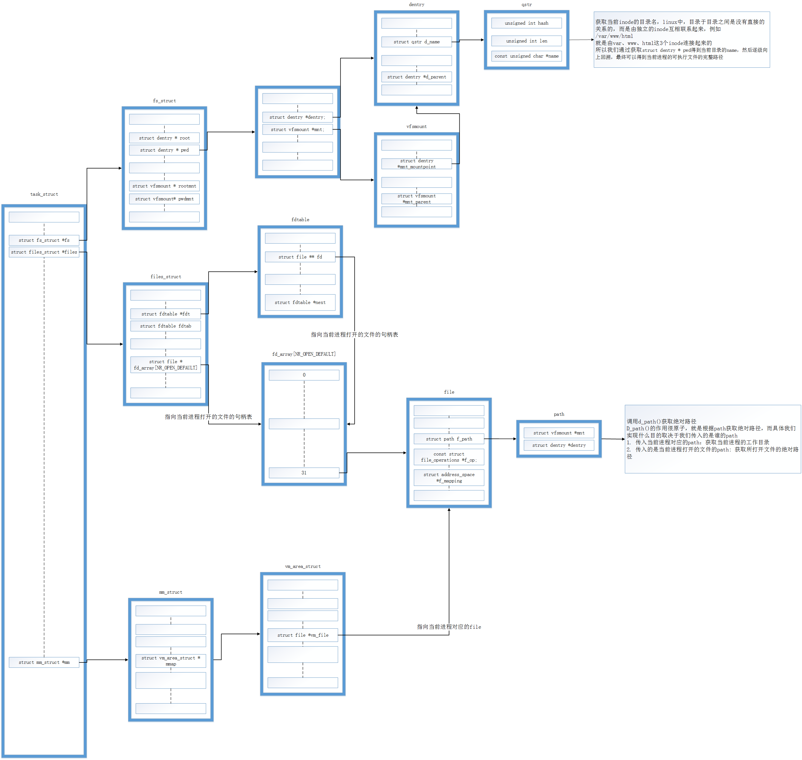


内核通过进程的`task_struct`中的`files`域指针找到**`file_struct`结构体**，该结构体包含了一个由`file *`构成的**已打开文件描述符表**，表中的每一个指针指向VFS中文件列表中的**文件对象**。


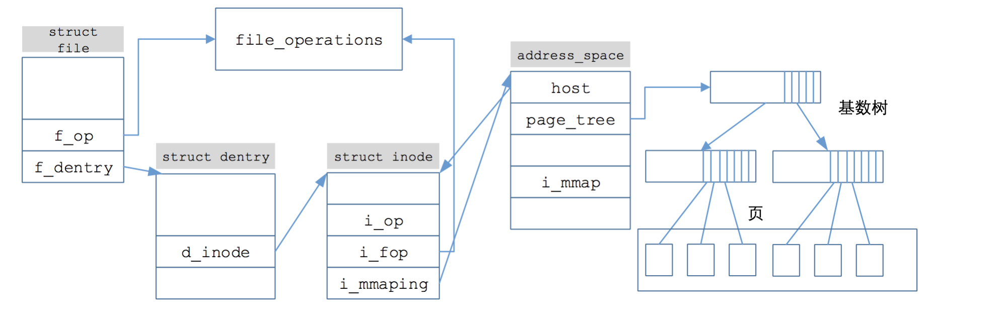

## VFS与FS

### inode&dentry

VFS文件系统中的`inode`和`dentry`与实际文件系统的`inode`和`dentry`有一定的关系，但不能等同。真实磁盘文件的`inode`和`dentry`是存在于物理外存上的，但VFS中的`inode`和`dentry`是存在于内存中的，系统读取外存中的`inode`和`dentry`信息进行一定加工后，生成内存中的`inode`和`dentry`。虚拟的文件系统也具有`inode`和`dentry`结构，只是这是系统根据相应的规则生成的，不存在于实际外存中。

### FS与磁盘

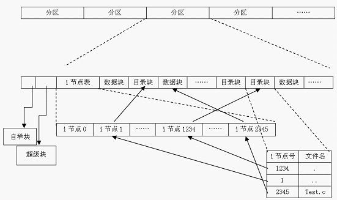

## 特殊文件系统

|   文件系统    |              内容              |                 作用                 |
| :-----------: | :----------------------------: | :----------------------------------: |
|    `tmpfs`    |   基于内存的临时文件存储系统   |     极高IO速度、减少存储设备损耗     |
|   `debugfs`   |                                |                                      |
|   `procfs`    | 映射内核中的系统信息、进程信息 |        便于访问和控制内核行为        |
|   `sockfs`    |                                |                                      |
| `devfs(<2.6)` |       硬件设备的文件表示       | 提供了一种类似于文件的方法来管理设备 |
| `sysfs(≥2.6)` |  实际连接到系统上的设备和总线  |           实现和内核的交互           |

**`sockfs`**：`socketfs`伪文件系统被编译进内核（而非一个模块）在系统运行期间**总是被装载**着的（因为要支持整个TCP/IP协议栈）。它实现了VFS中的4种主要对象：超级块`super block`、索引节点`inode`、目录项对象`dentry`和文件对象`file`，当执行文件IO系统调用时，VFS就将请求转发给`sockfs`，而`sockfs`就调用具体的协议实现。

# 任务调度

Linux将所有的执行实体都称之为任务Task（Task是进程概念在Linux中的实现），由`Task_Struct`进行描述。每一个**Task都具有内存空间、执行实体、文件资源等进程都具有的资源**，从表现形式上看类似于一个单线程的进程。同时Linux允许多个任务**共享内存空间**（在`Task_Struct`对应域中指明**共享的资源空间**即可），从而使多个任务运行在同一个内存空间上。从表现上来看，此时的多个任务相当于多个线程，多个这样的线程构成了一个进程。

## Linux线程

在linux2.6之前，内核并不支持线程的概念，仅通过轻量级进程LWP模拟线程，一个用户线程对应一个内核线程（内核轻量级进程），这种模型最大的特点是线程调度由内核完成了，而其他线程操作（同步、取消）等都是核外的线程库（LinuxThread）函数完成的。[参考来源](https://developer.aliyun.com/article/374623)

在linux2.6之后，为了完全兼容posix标准，linux2.6对内核进行改进，引入了线程组的概念（仍然用轻量级进程表示线程），有了这个概念就可以将一组线程组织称为一个进程。通过这个改变，linux内核正式支持多线程特性。在实现上主要的改变就是在task_struct中加入tgid字段，这个字段就是用于表示线程组id的字段。在用户线程库方面，也使用NPTL代替LinuxThread。[参考来源](https://developer.aliyun.com/article/374623)

### 共享的资源

内存地址、空间进程基础信息、大部分数据、打开的文件、信号处理、当前工作目录用户和用户组属性等

### 线程独有

线程ID、寄存器、栈的局部变量、返回地址、错误码errno、信号掩码、优先级等

## 调度时机


## 抢占内核

### 非抢占式内核

在Linux 2.6以前，内核只支持用户态抢占，在**内核态执行的进程不可被抢占**，它会一直运行直到任务完成或者被阻塞(系统调用可以被阻塞)。异步事件由中断服务处理，中断服务可以使一个高优先级的任务由挂起状态转为就绪状态。但中断服务以后的控制权还是回到原来被中断了的那个任务，直到该任务主动放弃CPU的使用权时，就绪的高优先级的任务才能获得CPU的使用权。

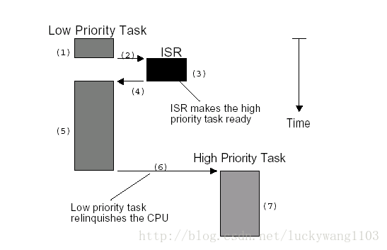

### 抢占式内核

Linux从2.6开始支持可抢占式内核，运行的任务可以在任何时间点（因为中断造成的抢占可以发生在任何时间）上被抢占（要求此时间点的内核代码**不持有锁（处于临界区）且内核代码[可重入](https://www.wikiwand.com/zh-hans/%E5%8F%AF%E9%87%8D%E5%85%A5)**）。如果被高优先级的进程抢占则执行上面相同的过程，如果被中断抢占，中断处理程序返回到内核态时，内核会检查是否有优先级更高的就绪任务，有则挂起被抢占的进程。[参考1](https://github.com/IMCG/-/blob/master/kernel/Linux%E5%86%85%E6%A0%B8%E6%80%81%E6%8A%A2%E5%8D%A0%E6%9C%BA%E5%88%B6%E5%88%86%E6%9E%90.md)


#### 可重入函数

所谓可重入是指一个可以**被多个任务调用**的过程，任务在调用时不必担心数据是否会出错。他对函数的设计与实现提出了一系列要求：①不能含有静态变量、②不能返回静态变量的地址、③只能处理调用者提供的数据、④不能依赖于单实例模式资源的锁、⑤不能调用不可重入的函数、⑥内部尽量不用 malloc 和 free 之类的方法

### 比较

|  内核  |               响应速度               |           内核函数要求           |
| :----: | :----------------------------------: | :------------------------------: |
| 非抢占 | 中断响应快、任务响应慢（就绪需等待） |           不可重入函数           |
|  抢占  |  任务响应快（高优先级就绪即可运行）  | 调用不可重入函数时要满足互斥条件 |

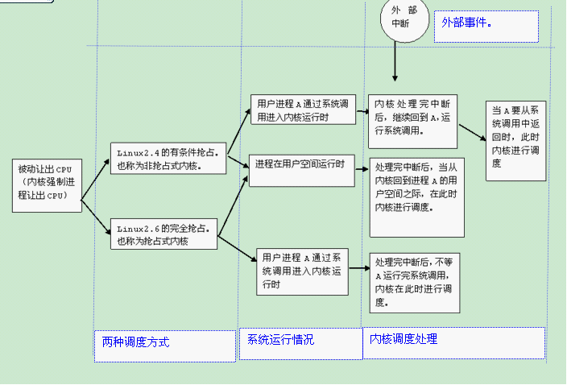

## CFS调度算法

# [I](https://zhuanlan.zhihu.com/p/308054212) [O](https://zhuanlan.zhihu.com/p/83398714)

为了满足速度与容量的需求，现代计算机系统都采用了多级金字塔的存储结构。在该结构中上层一般作为下层的Cache层来使用。而狭义的文件IO聚焦于Local Disk的访问特性和其与DRAM之间的数据交互。

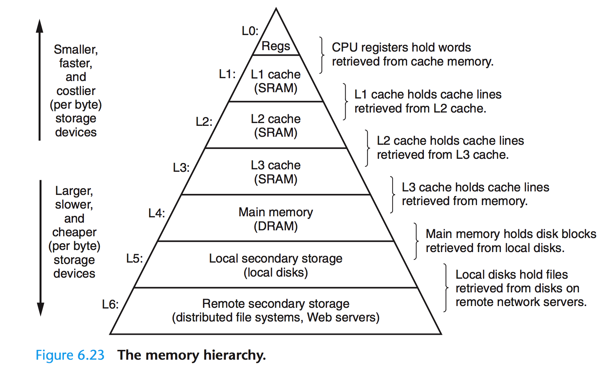
<center class="half">
    <center mg src="img/OS/storage-arch.png" title="a" width="300" alt="图片说明1"/> 题注
</center>

一个简单的用户态的`stdio::printf()`将经过运新模式切换、缓存切换等多个过程才能将更改内容写入存储介质：**用户态的IO函数都有自己在用户态建立的`buffer`**，这主要是出于性能的考虑（系统调用的代价是昂贵的，没必要对每一次IO都使用系统调用，尤其是小的IO，通过用户态缓冲可以**将多次IO请求聚合成一次内核IO**）。同时下图中有意忽略了存储介质自带的缓存（由介质自己管理），图中的`Kernel buffer cache`也被习惯性称之为`Page Cache`；


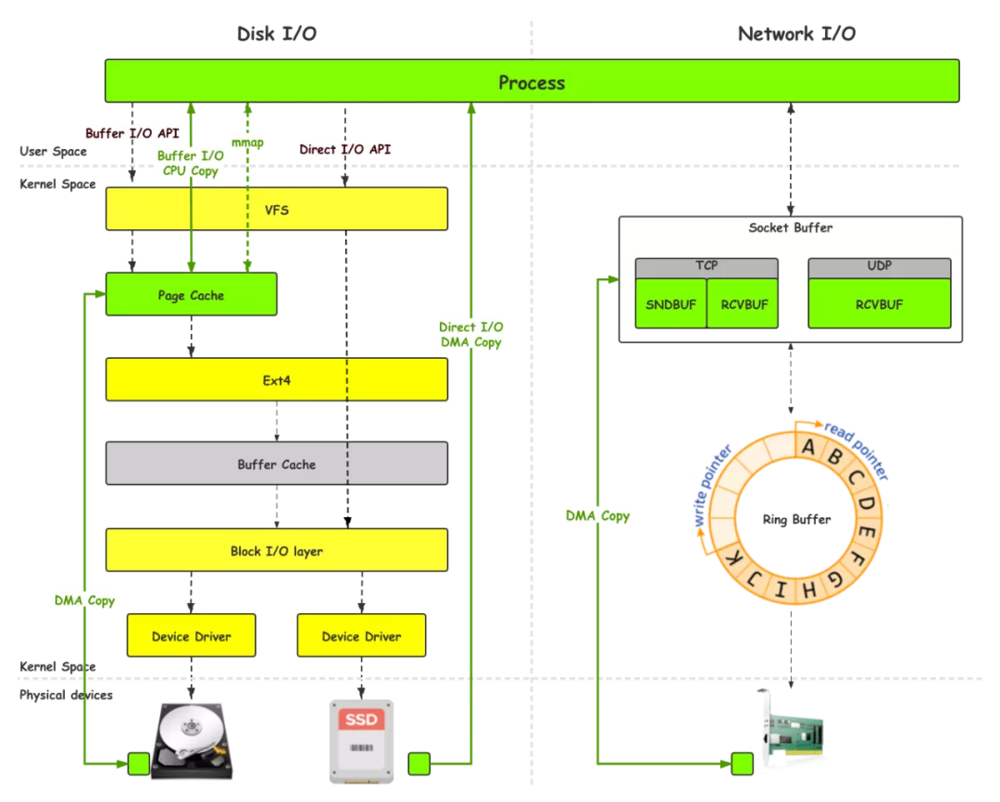

##  内核IO栈


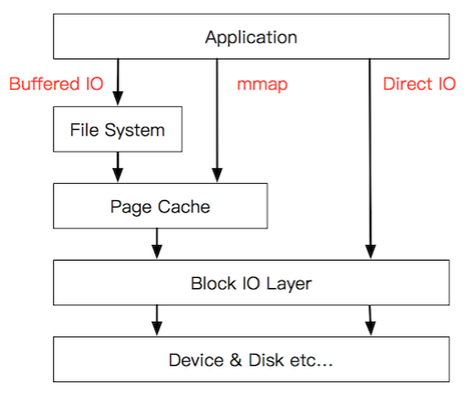

## [内存中的Buffer与Cache](https://linux.cn/article-7310-1.html)

|                    |               作用               |    访问特点    |      丢失      |      透明性      |
| :----------------: | :------------------------------: | :------------: | :------------: | :--------------: |
| **Buffer（缓冲）** | 流量整形（大量小IO变为少量大IO） | 往往是顺序访问 | 影响数据正确性 | 不透明、属于程序 |
| **Cache（缓存）**  |    加快访问速度、重复使用数据    |    随机访问    |   可能不影响   |    对应用透明    |

Page cache 是建立在文件系统之上的，因此其缓存的是逻辑数据 。Buffer cache 是建立在块层之上的，因此其缓存的是物理数据。

### Cache

Page **Cache**：也叫页缓冲或文件缓冲，主要用来作为**文件系统上的文件数据的缓存**来用，尤其是针对当进程对文件有 read / write 操作的时候。在当前的系统实现里，Page Cache 也被作为其它文件类型的缓存设备来用，所以事实上Page Cache 也负责了大部分的**块设备文件的缓存**工作。

### Buffer

**Buffer** Cache：也叫**块缓冲**、用来在系统对块设备进行读写的时候，对块进行数据缓存的系统来使用。这意味着某些对块的操作会使用 Buffer Cache 进行缓存。

### 融合Buffer与Cache

Linux 2.4之后**两个缓存系统被合并使用的**，比如当我们对一个文件进行写操作的时候，Page Cache 的内容会被改变，而 Buffer Cache 则可以用来将 page 标记为不同的缓冲区，并记录是哪一个缓冲区被修改了。**此时 Buffer cache 只是 Page cache 中的 buffer_head 描述符**。这样内核在后续执行脏数据的回写（write back）时，就不用将整个 page 写回，而只需要写回修改的部分即可。

### 内存回收

Linux 内核会在内存将要耗尽的时候，触发内存回收的工作，以便释放出内存给急需内存的进程使用。一般情况下，这个操作中**主要的内存释放都来自于对 Buffer / Cache 的释放**（尤其是被使用更多的 Cache 空间）。这种内存释放需要对Page **Cache**中的脏数据写回，会**带来短时间的大量IO**。

**并不是所有的Page Cache都可以被直接释放回收**：tmpfs中的文件再被删除前都不能自动释放。

1. **tmpfs 中存储的文件**会占用 cache 空间，除非文件删除否则这个 cache 不会被自动释放。
2. 使用 **`shmget `**方式申请的共享内存会占用 cache 空间，除非共享内存被 ipcrm 或者使用 shmctl 去 IPC_RMID，否则相关的 cache 空间都不会被自动释放。
3. 使用 **mmap 方法申请的 MAP_SHARED** 标志的内存会占用 cache 空间，除非进程将这段内存 munmap，否则相关的 cache 空间都不会被自动释放。

## 标准IO

即`Buffer IO`，大多数文件系统的默认IO（如`printf(), puts()`）都采用的是标准IO的方式，需要经历**物理设备<–>设备自带缓存<–>内核缓冲区（Page Cache）<–>（用户缓冲区）<–>用户程序**的过程，其中用户缓冲区即上文提到的`stdio`等程序库提供的自实现缓冲。对于写过程一般函数只实现到由用户缓冲到内核缓冲（`write back`机制），至于**何时写入设备缓冲由OS决定、pdflush (page dirty flush)内核线程执行**（可以调用`sync`等干预），由设备缓存到设备由设备自身控制。

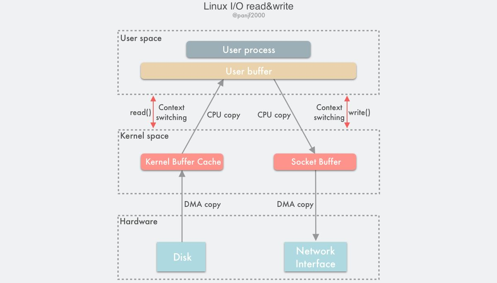


**优点**：隔离用户和内核地址空间以加强安全；汇聚IO请求以减少硬件请求；

**缺点**：数据在用户和内核之间的多次拷贝带来的CPU和内存开销；**延迟写**机制可能造成数据丢失

**场景**：适用于大多数普通文件操作，对性能、吞吐量没有特殊要求，由kernel通过page cache统一管理缓存。默认是异步写，如果使用sync则是同步写。

### 读写过程

1. 进程发起读文件请求。
2. 内核通过查找进程文件符表，定位到内核已打开文件集上的文件信息，从而找到此文件的inode。
3. inode在address_space上查找要请求的文件页是否已经缓存在页缓存中。如果存在，则直接返回这片文件页的内容。
4. 如果不存在，则通过inode定位到文件磁盘地址，将数据从磁盘复制到页缓存。之后再次发起读页面过程，进而将页缓存中的数据发给用户进程。

## 零拷贝技术

指计算机执行操作时**CPU**不需要先将数据**从某处内存复制到另一个特定区域**，从而**节省 CPU 周期和内存带宽**的技术。按照实现的核心思想可以分为三类：

1. **减少甚至避免用户空间和内核空间之间的数据拷贝**：如`mmap()、sendfile() 、 splice() `
2. **绕过内核的直接 I/O**：允许在用户态进程绕过内核直接和硬件进行数据传输，内核在传输过程中只负责一些管理和辅助的工作。
3. **优化内核缓冲区和用户缓冲区之间的数据传输**：对传统IO方式的延续

### [减少拷贝：`mmap()`内存映射](# 内存映射：`mmap()`)

### [减少拷贝：`Linux::sendfile()`](# `sendfile()`)

### [减少拷贝：`Linux::splice()`](# `splice()`)

### 减少拷贝：`Linux::tee()`

在两个管道文件描述符之间复制数据，同是零拷贝。但它不消耗数据，数据被操作之后，仍然可以用于后续操作。 `flag`参数和`splice()`一样。

```c
ssize_t tee(int fdin, int fdout, size_t len, unsigned int flags);
```

### 直接IO

#### 概述

不经过内核缓冲区直接访问介质数据（此时由用户程序**自己设计提供缓冲机制**，通常和**异步IO**结合使用来等待硬件响应）。需要经历**物理设备<–>设备自带缓存<–>（用户缓冲区）<–>用户程序**的过程。其主要的实现方式有用户直接访问硬件和内核控制访问硬件两种方式。


**优点**：减少了内存拷贝和一些系统调用

**缺点**：用户程序实现复杂，需要自己提供缓冲机制和与设备的IO处理

**场景**：性能要求较高、内存使用率也要求较高的情况下使用。如数据库等结合自身数据特点设计了自己高线缓存的程序。

```c
int open(const char *pathname, int flags, mode_t mode);//设置flag就可以启用内核支持的直接IO
```

#### 用户直接访问硬件

**思想**：赋予用户进程直接访问硬件设备的权限，在数据传输过程中只需要内核做一些虚拟内存配置相关的工作。

**缺点**：适用性窄（只适用于诸如 MPI 高性能通信、丛集计算系统中的远程共享内存等有限的场景）、破坏硬件抽象、需要定制的硬件和专门设计的应用程序、存在安全问题。

#### 内核控制访问硬件

**思想**：内核只控制 DMA 引擎替用户进程做缓冲区的数据传输工作而不参与到实际的数据传输过程。

### 传输优化

#### 动态重映射与写时拷贝 (Copy-on-Write)

**`COW`**：如果有多个调用者（callers）同时请求**相同资源**（如内存或磁盘上的数据存储），他们会共同获取相同的指针指向相同的资源，直到某个调用者试图修改资源的内容时，系统才会真正复制一份专用副本（private copy）给该调用者，而其他调用者所见到的最初的资源仍然保持不变。这过程对其他的调用者都是**[透明](https://link.zhihu.com/?target=https%3A//zh.wikipedia.org/wiki/%E9%80%8F%E6%98%8E)**的。此作法主要的优点是如果调用者没有修改该资源，就不会有副本（private copy）被创建，因此**多个调用者只是读取操作时可以共享同一份资源**。

**优点**：节省内存减少拷贝、适合读多写少的场景。

**局限**：构建于虚拟内存之上需要MMU硬件支持（标记只读页，当尝试写时发生异常产生副本），COW事件开销也大。

#### 缓冲区共享 (Buffer Sharing)


**实现**：内核提供**快速缓冲区fbufs**（fast buffers），使用一个fbuf 缓冲区作为数据传输的最小单位。用户区和内核区、内核区之间的数据都必须严格地在 fbufs 这个体系下进行通信。fbufs 为每一个用户进程分配一个 buffer pool，里面会储存预分配 (也可以使用的时候再分配) 好的 buffers，这些  buffers 会被同时映射到用户内存空间和内核内存空间。fbufs 只需通过一次虚拟内存映射操作即可创建缓冲区，有效地消除那些由存储一致性维护所引发的大多数性能损耗。

**缺点**：实现需要依赖于用户进程、操作系统内核、以及 I/O 子系统 (设备驱动程序，文件系统等)之间协同工作。需要使用新的系统API。

## [网络IO](https://mp.weixin.qq.com/s?src=11&timestamp=1621430712&ver=3078&signature=-RLNKlzq-y1BC0uMX2YJtIvcDFoGjI*ghFHOl8ks9SUfGtGjiZE4ThKBbd2c6t4SwA21TY4v6fQ7eEWI9jE-3-c6cOOkRbhd1kw5Rl-c1*zQxjQhwESxDstPOd8FVxpA&new=1)

### socket收发

Linux将TCP、UDP的收发抽象成了Socket的读写。网路适配器驱动会在内核中申请一块内存用来存放实际的收发数据，而Ring Buffer主要被用来存储一些描述信息用以在内存中索引到真正的数据，DMA负责完成物理内存与网络适配器中的缓存的数据拷贝工作。

#### 数据结构

##### `sk_buff`链

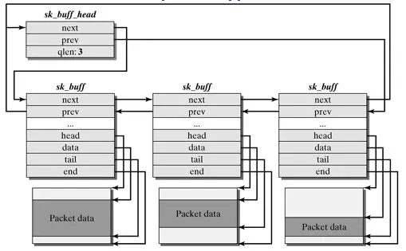


每个socket被创建后，内核会为其分配一个初始时为空的**`sk_buff`链表（`skb`）**，网络收发（socket读写）的过程就是对`sk_buff`链表进行追加删除的过程。内核将TCP数据包抽象表示为一个`sk_buff`，其长度是固定的（与 MTU 有关）。

```c
skb = alloc_skb(len, GFP_KERNEL);//申请创建skb链
skb_reserve(skb, header_len);//释放skb
```

**`sk_buff`创建时机**：应用写Socket；数据包到达NIC；

**`sk_buff`拷贝时机**：用户空间与内核空间的拷贝；sk_buff与NIC之间的拷贝；

##### QDisc 排队规则

位于 IP 层和网卡的 Ring Buffer 之间的由**内核定义**的数据排队规则，该机制是IP层流量控制的基础。

##### Ring Buffer

固定大小的环形队列，队列中存放的元素是指向`sk_buff`的描述符和被指向的`sk_buff`的使用状态（`ready、used`），数据会存放在描述符指向的`sk_buff`中。通过这样一个缓冲结构可以平衡生产者、消费者的速度，因为一旦Ring Buffer满后就丢弃数据包。

#### TCP Socket发送

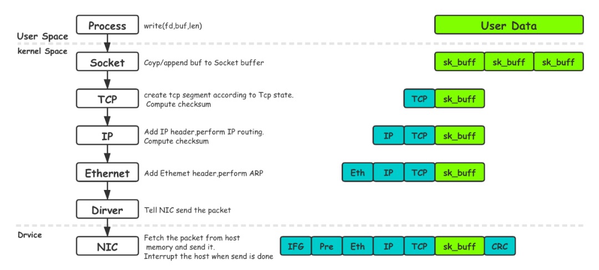

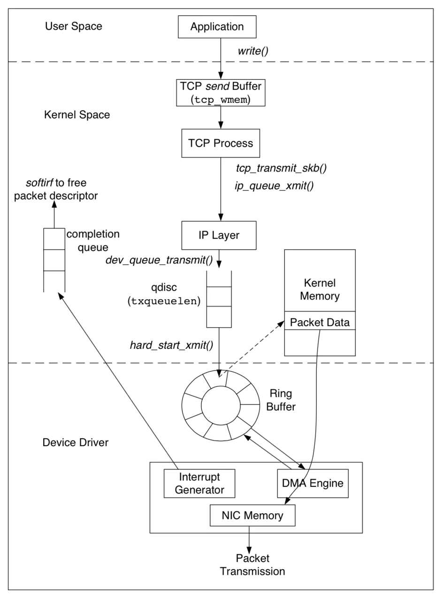

内核根据用户发送来的数据会创建`sk_buff`链表，每个`sk_buff`的最大大小为`MSS`，从而将经由TCP传输的原始数据进行了**分割**。链表上的所有空间构成了**内核的Socket缓冲区**。之后网络协议栈会负责在每层加上适当的包头。NIC在将数据发送之后会产生一个中断信号通知CPU。

#### TCP Socket接收

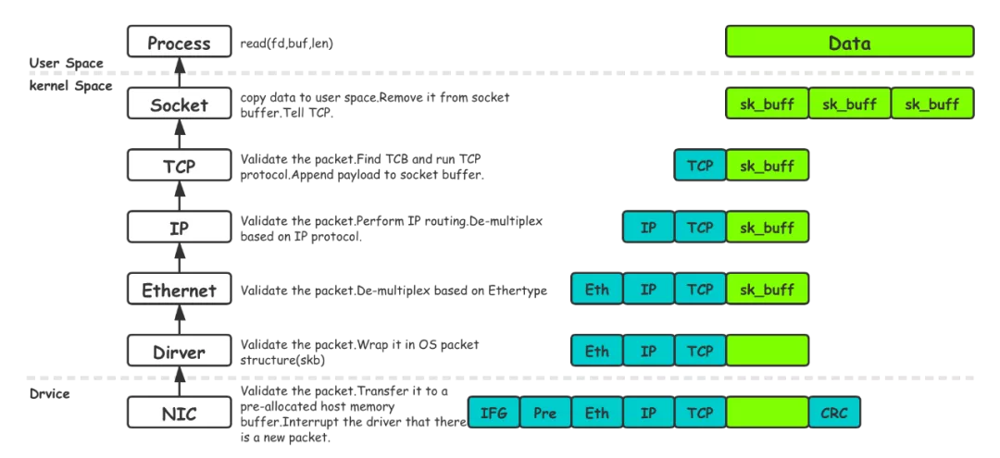

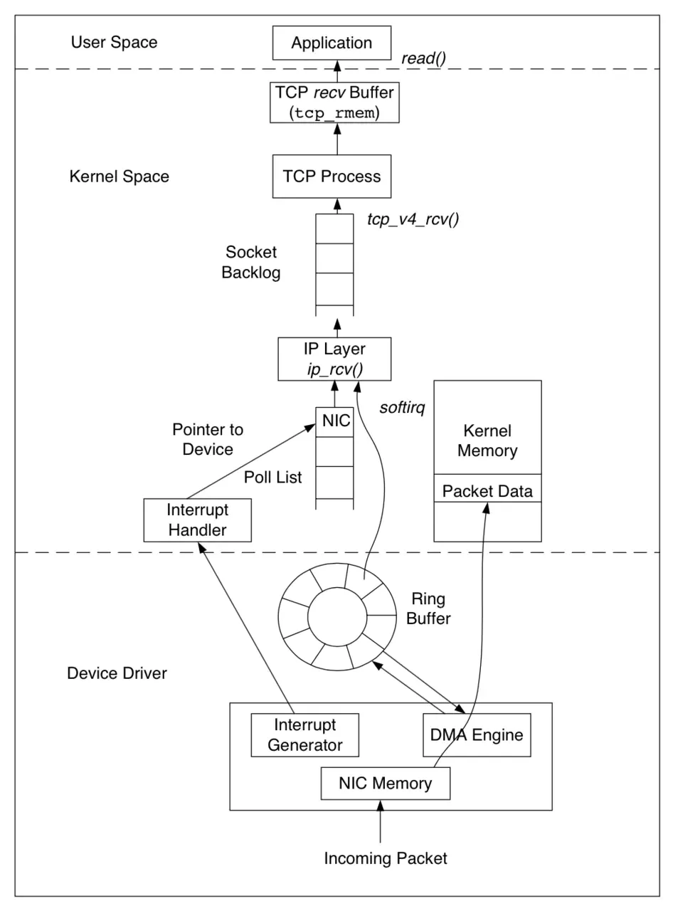

## 回写 `write back`

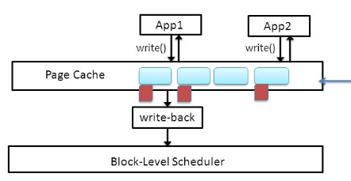

### 回写时机

涉及的参数都在` /proc/sys/vm/dirty*`中可以查看和修改，如`dirty_background_bytes、irty_background_ratio 、dirty_bytes、dirty_ratio、dirty_writeback_centisecs、ddirty_expire_centisecs、dirtytime_expire_seconds`。回写时机类似于内存回收时机。

**①空间**：系统中的脏页大于预先设置的阈值采用**同步回写**，当同时采用比例和字节两种阈值时优先使用字节阈值。

**②时间**：**周期性**的扫描时检查页（为减少开销实际按照inode中记录的dirtying-time计算）的上次更新时间是否超过某个阈值，超过则**异步回写**。

**③**：用户主动发起**`sync()/msync()/fsync()`调用**。

### [回写](https://zhuanlan.zhihu.com/p/71217136)

在**2.6内核**具体的回写工作由**`pdflush`内核线程池**（线程数量根据块设备IO负载变化）完成。后来的2.6.32内核实现中一个块设备对应一个**名为`writeback`的`flusher`内核线程**，其执行体为通过[`workqueue`机制](https://zhuanlan.zhihu.com/p/91106844)实现调度的`wb_workfn`。

# 系统调用

## 零拷贝

### 内存映射：`mmap()`

#### 概述

`mmap()`将一个文件描述符指向文件逻辑上连续的一段数据直接映射到进程的地址空间，实现了**进程用户空间缓冲区<–>文件所在内核空间缓冲区之间的映射**（用户空间和内核空间的虚拟内存地址同时**映射到同一块物理内存**，用户态进程可以直接操作物理内存），之后进程读写操作这一段用户空间的内存就相当于直接读写文件（匿名文件或命名文件）的缓冲页，而系统会自动回写脏页到对应的硬件上，用户进程不用因为内核空间和用户空间相互隔离而将数据在两个空间的内存之间来回拷贝。


#### 函数原型

```c
#include <sys/mman.h>;
void *mmap(void *addr, size_t length, int prot, int flags, int fd, off_t offset);//分配内存映射区
int munmap(void *addr, size_t length);//释放内存映射区
```

##### [参数及注意事项](http://www.yushuai.xyz/2019/05/31/4365.html)
**`addr`**: 建立映射区的首地址，使用时，直接传递`NULL`，实际参数由Linux内核确定。

**`length`**：欲创建映射区的大小，不能创建0字节大小的映射区。

**`prot`**：映射区权限：`PROT_READ、PROT_WRITE、PROT_EXEC、PROT_NONE`支持或操作组合。映射区创建过程中对文件有一次**隐含的读操作**；创建的映射区的权限要**小于等于**打开文件的权限。

**`flags`**：标志位参数(常用于设定更新物理区域、设置共享、创建匿名映射区)，支持或操作组合，表中仅列出其中几个可能的参数。

|       位        |                             含义                             |
| :-------------: | :----------------------------------------------------------: |
|  `MAP_SHARED`   | 对映射区的修改会影响其他同方式的进程，更改会被写回物理设备上 |
|  `MAP_PRIVATE`  |      映射区所做的修改不会影响其他进程，不会写回物理设备      |
| `MAP_ANONYMOUS` |       匿名映射，映射区不与任何文件关联（`fd`必须为-1）       |

**fd**：用来建立映射区的文件描述符（创建完后**可以先关闭**），-1为匿名映射，否则为文件映射。

**offset**：映射文件的偏移（必须是**页大小的整数倍**，因为映射是由MMU帮忙创建的，而MMU操作的基本单位就是4K），可以把整个文件都映射到内存空间，也可以只把一部分文件内容映射到内存空间。

##### 返回值

成功返回创建的映射区首地址、失败返回`MAP_FAILED`宏（其值为`(void *)-1`）并设置`error`。

并不是以返回值开始`len`长的地址都可访问，只有**部分可访问**，`mmap`可访问的地址空间为**即在文件大小以内又在映射区域范围内**的数据。对不同部分的访问将收到不同的结果。文件大小（可能动态变化）、 `mmap`的参数 `len` 都不能决定进程能访问的大小。


#### [过程分析](https://www.cnblogs.com/huxiao-tee/p/4660352.html)

**（一）未分配虚拟页**：进程启动映射过程，在虚拟地址空间中为映射创建虚拟映射区域

1. 用户在用户空间调用`mmap()`函数。

2. 内核在进程的**用户虚拟地址空间**内找到满足大小`len`的**连续地址空间**（可以超过页）。

3. 为此空间创建并初始化一个**新的`vm_area_struct`**结构，并将此结构体加入到**`mm_struct`**引出的链表或红黑树中。

##### 文件映射、共享匿名映射

共享匿名页在内核演变为文件映射缺页异常（伪文件系统），

**（二）已分配虚拟页，未映射到物理页**：调用内核空间的系统调用函数`mmap`（不同于用户空间函数），实现文件物理地址和进程虚拟地址的一一映射关系

1. 通过**文件描述符**在内核的**已打开文件表**索引到**文件结构体**。
2. 通过文件结构体的**`file_operation`**域调用该文件**驱动提供的`int mmap(struct file *filp, struct vm_area_struct *vma)`函数**，该函数会找到文件的**`inode`定位**到地址。
3. 通过[内存映射函数`remap_pfn_range`](https://www.cnblogs.com/pengdonglin137/p/8149859.html)**建立页表项**（）实现了**文件地址和虚拟地址区域的映射**关系（**此时虚拟地址并没有关联到主存主存，即没有分配物理内存**）。

**（三）已分配虚拟页，已映射到物理页**：进程发起对这片映射空间的访问，引发缺页异常，实现文件内容到物理内存（主存）的拷贝

1. 进程发起对这片映射空间的访问，引发**缺页异常**。

2. 内核处理缺页（分配物理内存并调入页：先查找swap cache、没有再调用`nopage()`）。

3. 读写页面、页面成为了**脏页**后系统会**延时等待**一段时间后将页面**回写**到磁盘地址。

##### [私有匿名映射](https://www.cnblogs.com/linhaostudy/p/13647189.html)
**（二）：已分配虚拟页，未映射到物理页**：产生缺页异常，建立到物理页的映射并访问物理页

1. 如果是读访问，将虚拟页映射到**0页**（内容全为0），以减少不必要的内存分配；
2. 如果是写访问，则会分配**新的物理页**（如果先发生读导致的0页映射则有两次缺页中断），并用0填充然后映射到虚拟页上去。


#### 适用场景

|              |     私有映射     |           共享映射           |       内容       |
| :----------: | :--------------: | :--------------------------: | :--------------: |
| **匿名映射** |  常用于内存分配  |     共享内存实现进程通信     |    初始化为0     |
| **文件映射** | 常用于加载动态库 | 内存映射大文件IO，进程间通信 | 被映射的部分文件 |
|              |  修改外部不可见  |         修改外部可见         |                  |

**进程通信**：`mmap` 由内核负责管理，对**同一个文件地址的映射将被所有线程共享**（对这段区域的修改也直接反映到所有用户空间、用户空间和内核空间对这一段内存的修改相互可见，操作系统确保线程安全、线程可见性和数据一致性），进程通过直接读写内存实现不同进程间的文件共享，是**最快的IPC形式**（相比于管道和消息队列等避免了许多数据拷贝和系统调用）。操作系统确保线程安全以及线程可见性；

**快速IO**：即完成了对文件的操作又避免更多的`lseek()、read()、write()`等系统调用，这点对于大文件或者频繁访问的文件尤其有用，提高了I/O效率（写入非实时）。适用于对文件操作的吞吐量、性能有一定要求，且对内存使用不敏感，不要求实时写回的情况下使用。

##### [缺点](https://spongecaptain.cool/SimpleClearFileIO/3.%20mmap.html)

1. 用时必须实现指定好内存映射的大小，因此**不适合变长文件**。
2. 如果更新文件（尤其是随机写）的操作很多，会使**大量脏页引发的随机IO**占用大量时间，效率可能反而不如Buffer IO。
3. **读/写小文件时mmap并不占优势**；同时 mmap 的写回由系统全权控制，但是在小数据量的情况下由应用本身手动控制更好；
4. 由于mmap必须要在内存中找到一块**连续的地址块**，因此对于超大文件无法完全mmap映射，需要使用更为复杂的分块映射。

#### [其他](https://www.cnblogs.com/huxiao-tee/p/4660352.html)

##### 使用事项

1. 用于创建映射区的文件描述符可以在映射区解除映射之前**提前关闭**。这是因为建立映射的是文件的磁盘地址和内存地址，而不是文件本身，和文件描述符无关。
2. 一般说来，进程在映射空间的对共享内容的改变并**不直接写回**到磁盘文件中，往往在调用**`munmap()`**解除映射关系后才执行该操作，也可以通过调用**`msync()`**强制写回实现磁盘上文件内容与共享内存区的内容一致。
3. `mmap`实际创建的映射区域大小和偏移量必须是**物理页的整倍数**（数据不足一页的会被补齐为0）。原因是，内存管理的最小粒度、进程虚拟地址空间和内存的映射也是以页为单位，为了匹配内存的操作，`mmap`从磁盘到虚拟地址空间的映射也必须是页。
4. 用户空间的mmap映射使用的是虚拟内存空间（可以分配大于物理内存大小的mmap映射），实际上并不占据物理内存，只有在内核空间的kernel buffer cache才占据实际的物理内存；
5. [**文件截断**](https://blog.csdn.net/caianye/article/details/7576198)：可用信号处理（治标）和文件租借/机会锁解决

##### 映射大小和文件大小

**CASE 1**：偏移为0、映射大小（5000）等于文件大小（5000）、映射大小超过整数页


此时：

（1）读/写前5000个字节（0~4999），会返回操作文件内容。

（2）读字节5000\~8191时，结果全为0。写5000~8191时，进程不会报错，但是所写的内容**不会写入原文件**中 。

（3）读/写8192以外的磁盘部分，会返回一个SIGSECV错误。

**CASE 2**：偏移为0、映射大小（15000）大于文件大小（5000）、映射大小超过整数页 


（1）进程可以正常读/写被映射的前5000字节(0~4999)，写操作的改动会在一定时间后反映在原文件中。

（2）对于5000~8191字节，进程可以进行读写过程，不会报错。但是内容在写入前均为0，另外，写入后不会反映在文件中。

（3）对于8192~14999字节，进程不能对其进行读写，会报SIGBUS错误。

（4）对于15000以外的字节，进程不能对其读写，会引发SIGSEGV错误。

**CASE 3**：文件初始大小为0，映射了1000页，映射区为`ptr`

（1）如果在映射建立之初，就对文件进行读写操作，由于文件大小为0，并没有合法的物理页对应，访问会返回`SIGBUS`错误。

（2）如果，每次操作`ptr`读写前，先增加文件的大小，那么`ptr`在文件大小内部的操作就是合法的。

### [`sendfile()`](https://zhuanlan.zhihu.com/p/308054212)

将磁盘文件直接由内核缓冲区传递到内核中的网卡缓冲区，适用于**文件数据到网卡**的传输过程，并且用户程序对数据**没有修改**的场景；

**一般IO：**硬盘–>内核缓冲–>用户缓冲–>内核socket缓冲–>网络协议栈（四次模态切换、两次DMA拷贝、两次CPU拷贝）

**`sendfile`：**硬盘–> 内核缓冲–>内核socket缓冲–>网络协议栈（两次模态切换、两次DMA拷贝、一次CPU拷贝）


#### 函数原型

```c
#include <sys/sendfile.h>
ssize_t sendfile(int out_fd, int in_fd, off_t *offset, size_t count);
```

##### 参数

**`out_fd`**：已经打开的接受输出的**任意类型的文件描述符**。

**`in_fd`**：已经打开的产生输入的文件描述符。该文件描述符必须**指向支持类似`mmap`映射操作的具体文件**，**不能是socket类型**。

**`offset`**：指示 `sendfile()`从in_fd开始读取的位置。函数返回后，该值会被更新为`sendfile()`最后读取的字节位置处。

**`count`**：此次期望传输的文件数。

##### 返回值

如果成功就返回写到`out_fd`中的字节数；失败返回-1，并设置`error`信息

#### 支持DAM聚合拷贝`sendfile`

**复制到socket缓冲区中的只有记录数据位置和长度的描述符而没有实际的数据**，DMA模块将数据直接从内核缓冲区传递给协议引擎，从而又消除了一次复制。


### `splice()`

`splice`需要在内核缓冲区和内核的socket缓冲区之间**建立管道连接**避免CPU拷贝。适用于**任意两个文件描述符中移动数据**（两个文件描述符中**至少有一个是管道**设备），并且用户程序对数据**没有修改**的场景；

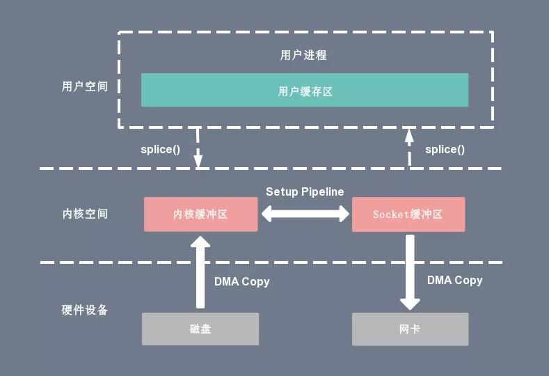

#### 函数原型

其功能是（逻辑上）从fd_in**移动**到 fd_out 中，如传入非 NULL 的off_in/off_out则会指定消费或者复制端的 offset，并会禁止对于文件当前 offset 的处理。

```c
#include <fcntl.h>
#include <unistd.h>

int pipe(int pipefd[2]);
int pipe2(int pipefd[2], int flags);

ssize_t splice(int fd_in, loff_t *off_in, int fd_out, loff_t *off_out, size_t len, unsigned int flags);
```

##### 参数

**`fd_in、fd_out`**：待读取 \ 写入的文件描述符（**至少一个是`pipe`**）。

**`off_in、off_out`**：开始读出 \ 写入的起始地址，管道描述符对应的偏移必须是NULL。

**`len`**：需要移动的数据长度

**`flag`**：控制数据的移动方式（支持`SPLICE_F_MOVE、SPLICE_F_NONBLOCK、SPLICE_F_MORE、SPLICE_F_GIFT`的位组合）

##### 返回值

**成功**：返回成功移动的字节数，为0且数据源为管道则管道中未被填入数据

**失败**：返回-1，并设置error

### [`tee()`](# 减少拷贝：`Linux::tee()`)

### `vmsplice()`


## 内存分配 

 从操作系统角度来看，进程分配内存主要由**`brk()`和`mmap()`**两个系统调用完成，这两种内存分配调用分配的都是**以页为基本单位的虚拟内存**，其物理内存的分配发生在第一次访问已分配的虚拟地址空间产生缺页中断时，OS会负责分配物理内存，然后建立虚拟内存和物理内存之间的映射关系。

`brk()、sbrk()、mmap()`完成的都是以页为基本单位的大粒度内存分配，更小粒度的内存分配由具体的调用器（如`malloc()`、STL分配器等）负责实现。

### `brk()/sbrk()`

该函数负责在**堆空间**分配大小**小于等于`M_TRIM_THRESHOLD(128KB)`**的内存，在分配虚拟内存时将**`brk`指针**（指向堆的顶部）向高地址方向增加指定的大小。

```c
int brk( const void *addr );//设置brk为addr
void* sbrk ( intptr_t incr );//incr为申请的地址的大小，返回新的brk
```

#### 内存释放

**`brk`指针始终指向指向堆的顶部**，只有当高地址内存释放完后，`brk`才能回撤同时触发物理内存的回收。但如果堆空间里的可用空闲内存空间超过`M_TRIM_THRESHOLD(128KB)`时也会**触发内存紧缩**（虚拟和物理），否则里面的可用地址也可以被**重用**。

### `mmap()/munmap()`

该函数通过创建**私有匿名的映射段**，在**MMS段**分配大小**大于`M_TRIM_THRESHOLD(128KB)`**的内存。

```c
void *mmap(void *addr, size_t length, int prot, int flags, int fd, off_t offset);//分配
int munmap(void *addr, size_t length);//释放
```

#### 内存释放

可以单独释放

### [其他分配函数](https://www.jianshu.com/p/e42f4977fb7e)

|                       函数                        | 模态 |   空间连续性   |          空间          |       分配速度       |
| :-----------------------------------------------: | :--: | :------------: | :--------------------: | :------------------: |
|                     `kmalloc`                     | 内核 | 虚拟物理都连续 | 内核（低端内存）小内存 |         最快         |
|                     `vmalloc`                     | 内核 |  连续虚拟地址  | 内核（高端内存）大内存 |     稍慢（改PT）     |
| [`malloc`](https://zhuanlan.zhihu.com/p/57863097) | 用户 |  内部有内存池  |       用户堆空间       | 最慢（改PT、切模态） |

```c
void *kmalloc(size_t size, int flags);
void kfree(const void *ptr);

void *vmalloc(unsigned long size);
void vfree(void *addr);

void *malloc(size_t size);//底层依赖mmap、munmap、brk、sbrk
void free(void *ptr);
```

## 实体克隆

`fork、vfork、clone`都是linux的系统调用，这三个函数分别调用了`sys_fork、sys_vfork、sys_clone`，最终都调用了`do_fork`函数，差别在于参数的传递和一些基本的准备工作不同，主要用来创建新的子进程或线程。

### `fork()`

```c
pid_t fork(void);
//@Return value
//	失败返回-1；成功在子进程返回0，在父进程返回子进程的pid
```

子进程复制了父进程包括`task_struct`（`PID`不同）在内所有的资源（**此时两个进程共享物理内存空间，可以节省内存、加快速度**），之后利用**写时复制**为子进程分配和初始化资源：内核以**写保护**的方式在父子进程间共享页并监控页的状态。当任何一个进程试图写保护页时将产生异常，内核为尝试写的进程复制该页到新的物理页并标记新页为可写。原页仍然为写保护状态，当其他进程试图写入原页时，如果写进程是页帧的唯一属主就把这个页帧标记为对这个进程可写，否则执行复制的过程。

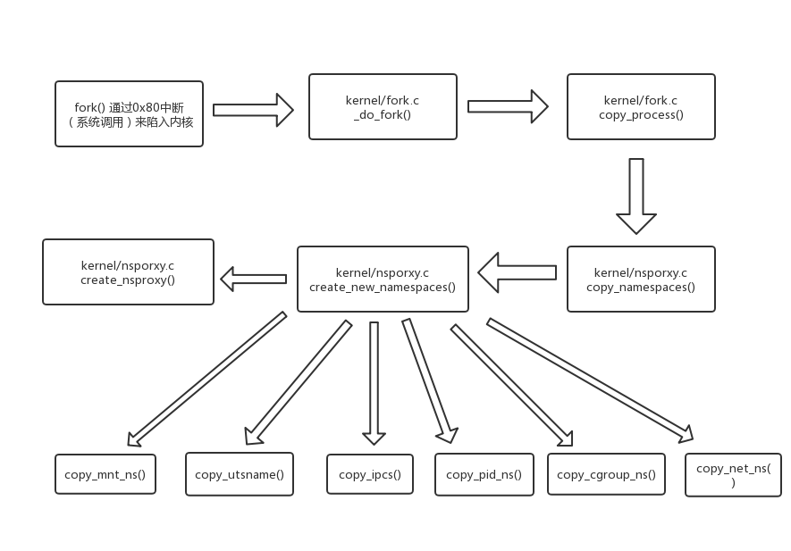

### `vfork()`（过时）

```c
pid_t vfork(void); // 已不实用的系统调用
```

如果**没有写时复制**机制时`fork`后调用`execve()`用新的内存镜像取代原来的内存镜像将使`fork`的复制毫无意义（尤其是原进程的地址空间比较大时）。在此情况下增加了`vfork()`，它产生的**子进程与父进程共享所有资源**（修改相互影响）并**阻塞父进程**直到在子进程调用`execve()`或`exit()`之前不会执行,（**子进程不能使用return**）。

### `clone()`

```c
int clone(int (*fn)(void *), void *child_stack, int flags, void *arg);
//@parameters
//	fn: 指向要新运行的函数的指针
//	child_stack: 位子进程分配的系统栈空间
//	flags: 描述从父进程获取哪些资源
//	arg: 传递给子进程的参数
//@Return value

```

|      标志       |                             含义                             |
| :-------------: | :----------------------------------------------------------: |
| `CLONE_PARENT`  | 创建的子进程的父进程是调用者的父进程，新进程与创建它的进程成了“兄弟”而不是“父子” |
|   `CLONE_FS`    | 子进程与父进程共享相同的文件系统，包括root、当前目录、umask  |
| `CLONE_THREAD`  | Linux 2.4中增加以支持POSIX线程标准，子进程与父进程共享相同的线程群 |
|  `CLONE_FILES`  |   子进程与父进程共享相同的文件描述符（file descriptor）表    |
|  `CLONE_NEWNS`  | 在新的namespace启动子进程，namespace描述了进程的文件hierarchy |
| `CLONE_SIGHAND` |     子进程与父进程共享相同的信号处理（signal handler）表     |
| `CLONE_PTRACE`  |               若父进程被trace，子进程也被trace               |
|  `CLONE_VFORK`  |           父进程被挂起，直至子进程释放虚拟内存资源           |
|   `CLONE_VM`    |              子进程与父进程运行于相同的内存空间              |
|   `CLONE_PID`   |                子进程在创建时PID与父进程一致                 |

可以更细粒度地控制与子进程共享的资源，利用它可以创建线程、父子进程、兄弟进程。利用`clone`创建出的新运行实体和**不再复制原运行实体的栈空间**，而是借助`child_stack`创建一个新的空间。

## 文件共享

### `dup系列`

#### 文件描述符

|          |          用户级限制           |                        系统级限制                        |
| :------: | :---------------------------: | :------------------------------------------------------: |
|   查看   |          `ulimit -n`          | `cat /proc/sys/fs/file-max`或`sysctl -a |grep file-max ` |
| 临时修改 |        `ulimit -SHn x`        | `echo x >/proc/sys/fs/file-max`或`sysctl -w file-max=x`  |
| 永久修改 | 改`/etc/security/limits.conf` |            改`/etc/sysctl.conf`后`sysctl -p`             |

#### 实现原理

`dup`系列调用会在原有旧文件描述符的基础之上创建一个新的文件描述符，新文件描述符的文件指针和旧文件描述符相同**指向同一个文件**，但其文件打开标志与旧文件描述符不同（重要的是`close-on-exec`标志），新老描述符**共享系统级打开文件表项**（即偏移量、标志和锁），对应打开文件表项中的文件**引用计数加一**。如下图`file:23`的状态。

```c
int dup(int oldfd);
int dup2(int oldfd,int newfd);
int dup3(int oldfd, int newfd, int flags);
//@Parameters:
//	oldfd: 待复制的旧文件描述符
//	newfd: 期望得到的文件描述符的下限，如果newfd是一个已经打开的文件描述符，则首先关闭该文件，然后再复制。
//	flags: 设置close-on-exec 标志位的开启和关闭
//@Return value
//	 成功返回不小于newfd的最小可用文件描述符；失败返回-1并设置errno
```


同一进程使用`dup`造成进程A中`file:23`的状态；`fork`的父子进程造成`file:73`的状态；不同进程调用`open`打开相同文件造成`inode:1976`的状态；同一进程多次调用`open`打开打开同一文件时会创建不同的文件描述符表项和不同的文件打开表项，但是最终指向的`inode`节点一样（`inode:1976`的状态）。

# 进程通信

## [进程通信的三种模型](http://ruleless.github.io/2016/06/09/unix-ipc-basic.html)

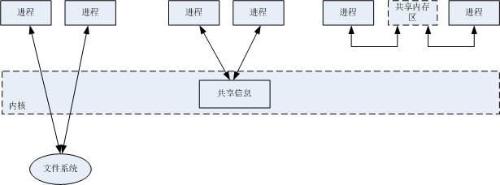

1. **通过访问文件的方式**：通常需要某种形式的同步，一般用文件记录锁。

2. **共享驻留于内核中的某些数据**： **管道、FIFO、System V消息队列、System V信号量** 属于这类型的数据共享方式； **Posix消息队列、Posix信号量** 在某些系统的实现也属于这种。

3. **双方都能访问的共享内存区**：若该共享内存区被映射到了各自进程的地址空间，那么这两个进程将能不通过内核（系统调用）而实现交互。 共享该内存区的进程需要某种形式的同步，信号量是常用的选择。

## Linux支持

Linux提供的`ipcs`和`ipcrm`分别用于查看与删除系统中的System V IPC：

   ```shell
    ipcs [-s -m -q] -i id
    ipcrm [ [-q msqid] [-m shmid] [-s semid] [-Q msgkey] [-M shmkey] [-S semkey] ... ]
   ```

### [Namespace](https://blog.csdn.net/energysober/article/details/89303542)

Linux Namespaces机制提供一种资源隔离方案。PID、IPC、Network等系统资源不再是全局性的，而是属于某个特定的Namespace。每个namespace下的资源对于其他namespace下的资源都是透明不可见的。因此在操作系统层面上看，就会出现多个pid相同的进程，但由于属于不同的namespace，所以它们之间并不冲突。而在用户层面上只能看到属于用户自己namespace下的资源

| Namespace |       隔离功能       |      |
| :-------: | :------------------: | ---- |
|    MNT    | 磁盘挂载点、文件系统 |      |
|    IPC    |      进程间通信      |      |
|    Net    |         网络         |      |
|    UTS    |        主机名        |      |
|    PID    |         进程         |      |
|   User    |         用户         |      |

一个进程也可以从属于不同的namespace，其`task_struct`结构中的`nsproxy`成员就负责维护当前进程的namespace信息。

```c
struct task_struct {
    //其他成员
	struct nsproxy *nsproxy;// namespace信息
}  
struct nsproxy {
	atomic_t count;
	struct uts_namespace *uts_ns;//UNIX Timesharing System,包含了运行内核的名称、版本、底层体系结构类型等信息
	struct ipc_namespace *ipc_ns;//与进程间通信（IPC）有关的信息
	struct mnt_namespace *mnt_ns;//已经装载的文件系统的视图
	struct pid_namespace *pid_ns_for_children;//
	struct net *net_ns;//网络相关的命名空间参数
}; 
```


## 信号 signal

Linux事先定义了一系列称为信号的变量用来指代某些事件。信号是一种**更高层的**软件形式的异常，不同于陷阱、中断和异常等**由内核透明处理的低层异常**的机制，信号的处理可以由用户完成。当发生某一事件时，内核会向进程通告该事件对应的信号，用户程序决定如何处理信号，如果不处理就会执行OS默认的处理方式。

### 信号类别与状态

#### 信号分类 

|         信号类别         |    来源     |            特点            |
| :----------------------: | :---------: | :------------------------: |
| 不可靠/普通信号$[1, 31]$ | 早期`Unix`  | 不支持排队可能导致信号丢失 |
| 可靠/实时信号$[34, 64]$  | `POSIX`标准 |          支持排队          |

#### 信号状态

|     状态      |                             含义                             |
| :-----------: | :----------------------------------------------------------: |
|  未决pending  |                    从产生到抵达之间的状态                    |
| 递达delivery  |     实际执行信号处理信号的动作（三种：忽略、默认、处理）     |
| **阻塞block** | 收到信号不立即处理，此时信号将**保持未决状态**，解除阻塞后才执行抵达动作 |

### 信号产生

信号可以由组合按键触发、硬件异常触发（内核将异常转为信号发送给进程）、调用信号发生函数触发、内核检测到某些软件条件发生等条件触发。

#### 信号发生API

##### 与本进程相关

```c
void abort(void);//向当前进程发送SIGABRT信号，总是成功所以无返回值

int raise(int sig);//向本进程发送信号sig
//@Return value
//	成功时返回0；失败返回-1并设置error

unsigned int alarm(unsigned int seconds);//经过预定时间后向本进程发送一个SIGALRM信号
//Parameters:
//	seconds: 延迟发送的时间，为0则取消所有已设置的发送SIGALRM的请求
//@Return value
//	失败返回-1；成功返回以前设置的闹钟时间的余留秒数
```

##### 向其他实体发送信号

```c
int kill(pid_t pid, int sig);//把信号sig发送给进程或进程组
//@Parameters
//	pid: 接收信号sig的进程
//		pid>0: 将信号传给进程识别码为pid 的进程
//		pid=0: 将信号传给和当前进程相同进程组的所有进程 
//		pid=-1: 将信号广播传送给系统内所有的进程 
//		pid<-1: 将信号传给进程组识别码为pid绝对值的所有进程 
//	sig: 待发送的信号
//@Return value
//	成功时返回0；失败返回-1并设置error

int killpg(int pgrp, int sig);//向进程组发送信号
//@Parameters
//	prgp: 将信号发送到进程组pgrp中的每个进程
//@Return value
//	成功时返回0；失败返回-1并设置error

int tkill(int tid, int sig);//过时的接口，一般不使用
int tgkill(int tgid, int tid, int sig);
//glibc未封装该系统调用，需要以系统调用形式使用，如下:
ret = syscall(SYS_tgkill, tgid, sig);//向线程组ID是tgid、线程ID为tid的线程发送信号

int pthread_kill(pthread_t thread, int sig);//向同一个进程内的线程发送信号
//@Parameters
//	thread: 将信号发往指定的线程
//	sig: 待发送的信号，0不发送任何信号
//@Return value
//	成功时返回0；失败返回错误码
//	向退出的线程发送信号引发未定义的错误

union sigval {
    int   sival_int;
    void *sival_ptr;
};
int sigqueue(pid_t pid, int sig, const union sigval value);//新的向进程发送信号的系统调用,主要针对实时信号提出、支持信号带有参数,
//@Parameters
//	pid: 接收信号sig的进程
//	sig: 待发送的信号，0用于检测目标进程存在性
//	value: 伴随数据，可以向目标进程发送一个整形数据或者指针（需处理函数启用SA_SIGINFO标志）
//@Return value
//	成功时返回0；失败返回-1并设置error
```

### 信号处理

用户态信号处理函数**不能接受和处理`SIGSTOP、SIGKILL`**信号。`SIGKILL`是为 root 提供了一种使进程**强制终止**方法，此时将会有操作系统直接回收该进程占用的资源，对于一些保存状态的应用就可能会导致异常。`SIGSTOP`用于 Shell 的任务管理，不能被用户屏蔽。[参考来源](https://gohalo.me/post/kernel-signal-introduce.html)

####  处理时机

进程**不会立即处理收到的信号（紧急信号除外），而是在恰当时机进行处理**（多在内核态返回用户态时，也可能在中断返回时）。其`task_struct`会对每个信号使用两个位记录状态，一个指针记录对信号的处理方法。


#### 信号屏蔽

**非实时信号：**对于不支持排队的非实时信号，内核会为每个信号维护一个信号掩码，当非实时信号被**阻塞期间被传递过多次**，**解除阻塞后该信号将仅被传递一次**。

**实时信号**：采用**队列化处理**，一个实时信号的多个实例发送给进程，**信号将会传递多次**。同时可以在发送信号时传递数据，不同实时信号的传递顺序是固定的，**优先传递信号编号小的**。

##### 信号集与信号屏蔽字

**信号集**是用来描述信号的集合，每个信号占用一位，总共 64 位，Linux 所支持的所有信号可以全部或部分的出现在信号集中，主要与信号阻塞相关函数配合使用。每个进程都有一个用来描述哪些信号递送到进程时将被阻塞的信号集，这个信号集就称为**信号屏蔽字（显示阻塞）**。信号屏蔽字中的所有信号在递送到进程后都将被阻塞，即对到来的信号先不传递给当前进程，一旦信号不阻塞，信号又可以被重新送达到当前进程。同时进程还含有隐式阻塞机制。

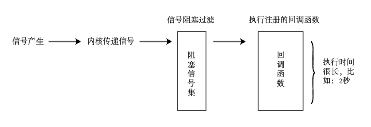

##### 信号集API

```c
typedef unsigned long int __sigset_t;
typedef __sigset_t sigset_t;

int sigemptyset(sigset_t *set);//初始化信号集为空
int sigfillset(sigset_t *set);//初始化信号集，该信号集包含所有预定义的信号
int sigaddset(sigset_t *set, int signo);//向信号集中添加信号
int sigdelset(sigset_t *set, int signo);//从信号集中删除信号
//@Parameter
//	set: 待作用的信号集
//	signo: 待作用的信号
//@Return value
//	成功时返回0；失败时返回-1

int sigismember(sigset_t *set, int signo);//验证信号是否属于信号集
//@Parameter
//	set: 待作用的信号集
//	signo: 待作用的信号
//@Return value
//	是返回1；不是返回0；给定的信号无效返回-1

int sigpromask(int how, const sigset_t *set, sigset_t *oset);//检测或更改当前进程的信号集
//@Parameter
//	how: 对set的处理方法
//		SIG_BLOCK: 将set中的信号加入到原信号集
//		SIG_UNBLOCK: 将原信号集中属于set的信号剔除
//		SIG_SETMARK: 将set参数指向的信号集中的信号设置为信号掩码
//	set: 新的信号集合
//	oset: 用来保存旧的信号集合
//@Return value
//	成功返回1；how无效返回-1并设置errno

int sigpending(sigset_t *set);//读取当前进程的未决信号集
//@Parameters
//	set: 保存当前进程的未决信号集
//@Return value
//	成功返回1；出错返回-1
```

#### 简单信号处理

```c
#include <signal.h>
void (*signal(int sig, void (*handler))(int)))(int);//处理指定的信号
//@Parameters
//	sig: 所要处理的信号
//	func: 类型为void (*)(int)的函数指针，该函数负责处理sig信号。可以取以下特殊值
//		SIG_IGN:忽略信号 
//		SIG_DFL:恢复信号的默认行为
```

**注意**：`signal`设置的信号处理函数在执行时会**阻塞正在处理的信号，不阻塞其它信号**。即当前处理信号的控制流可能被转移，**可能会丢失信号**。

#### 高级信号处理

在执行回调函数处理信号期间，使用`sa_mask`临时的去替代进程的阻塞信号集，保证回调函数执行完毕，然后**再解除替代**，这个过程仅仅发生在回调函数执行期间，是临时性的设置。在使用`sigaction`时`sa_sigaction` 与 `sa_handler` 只能取其一，其中前者多用于实时信号，可以保存信息；同时设置 `sa_flags` 为 `SA_SIGINFO` 用于接收其它进程发送的数据，保存在 `siginfo_t` 结构体中。

```c
struct sigaction{
    void (*sa_handler)();//信号处理函数的指针，可以是特殊值SIG_IGN、SIG_DFL
	void (*sa_sigaction)(int, siginfo_t *, void *);//备选信号处理函数指针，当flag启用SA_SIGINFO时
    sigset_t sa_mask;//设置在处理某信号时暂时将sa_mask指定的信号集先阻塞，默认阻塞当前信号
    int sa_flag;//设置信号处理的其他相关操作，可以取以下值
//		SA_RESTART: 如果信号中断了进程的某个系统调用，则系统自动启动该系统调用
//		SA_NODEFER: 信号处理函数运行处理信号时，内核将不阻塞该信号
//		SA_RESETHAND: 当调用信号处理函数时，将信号的处理函数重置为缺省值SIG_DFL
//		SA_SIGINFO: 使用 sa_sigaction 函数作为信号处理函数
};

int sigaction(int sig, const struct sigaction *act, struct sigaction *oact);//更加健壮的信号接口
//@Parameters
//	sig: 除SIGKILL及SIGSTOP外所要处理的信号
//	act: 设置处理sig信号的新动作
//	oact: 保存处理sig信号的原处理动作
//@Return value
//	成功返回1；how无效返回-1并设置errno
```

#### `signal` VS `sigactioon`

|     方式     | 安全性 |  本信号  | 其他信号 |      响应函数有效性      |   信号排队   | 额外消息 |
| :----------: | :----: | :------: | :------: | :----------------------: | :----------: | :------: |
| 传统`signal` |   低   | 自动阻塞 |  不阻塞  | 一次，自动重置为默认方式 |   都不排队   |  不支持  |
| `sigaction`  |  更高  | 自动阻塞 | 手动阻塞 |         一直有效         | 排队实时信号 |   支持   |

#### 控制流API

##### 一般流控制

```c
int pause(void);//进程挂起进入休眠状态，直到进程接收到信号后且信号函数处理了信号
//@Return value
//	如信号动作为终止进程(一般默认)，则进程终止，pause() 没有机会返回
//	如信号动作为忽略信号，进程继续处于挂起状态，pause() 不返回
//	如信号动作为用户处理函数，则调用了信号处理函数之后 pause() 返回 -1，其 errno 设置为 EINTR 

unsigned int sleep(unsigned int second);//挂起调用中的进程，直到过了预定时间或收到一个信号并从信号处理程序返回。
int usleep(useconds_t usec);
int nanosleep(const struct timespec *req, struct timespec *rem);
//Parameters:
//	seconds: 延迟发送的时间，为0则取消所有已设置的发送SIGALRM的请求
//@Return value
//	失败返回-1；成功返回以前设置的闹钟时间的余留秒数

int sigsuspend(const sigset_t *sigmask);//先替换进程的信号屏蔽字后挂起进程，程序将在信号处理函数执行完毕后返回重置信号屏蔽字后继续执行。sigsuspend将重置信号集、捕捉信号、信号处理函数集成到一起
//@Parameters
//	sigmask: 替换原信号集的新信号集
//@Return value
//	信号处理终止程序则不返回，否则返回-1并设置errno为EINTR
```

##### 跳转

```c
int system(const char *string);//阻塞进程直到调用“/bin/sh -c command”执行特定的命令完毕
//Parameters:
//	string: 要执行的shell命令
//@Return value
//	成功执行返回命令的退出码，其他错误返回-1或127

int sigsetjmp(sigjmp_buf env, int savemask);//标记目前地址并保存当前堆栈环境，超越goto实现非局部跳转
//@Parameters
//	env: 保存目前堆栈环境，一般为全局变量
//	savemask: 设置对env中屏蔽字的处理
//		0: 不保存、不恢复屏蔽字；
//		1: 保存、恢复屏蔽字；
//@Return value
//	0代表标记成功；非0代表从siglongjmp跳转返回
void siglongjmp(sigjmp_buf env, int val);//回到之前标记的地址并恢复堆栈环境
```

### 信号与线程组

进程中的所有线程（即线程组）都会收到信号，但线程组中**只有一个线程会响应处理该信号**，但致命信号会使所有的线程都被杀死。

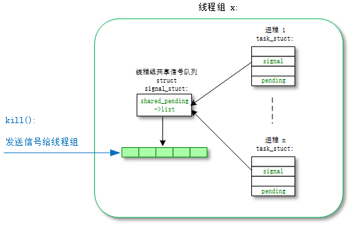

### 具体实现

如果一个信号还未被递达那么就处于未决(pending)状态。对于每一个目标进程，内核会用一个**位图(`struct sigset_t`)来记录信号的处理状态**，内核先检查待发送的信号在进程位图中的状态，如果处于未决状态，内核会将实时信号放入对应的未决信号队列`struct sigpending`，如果不是实时信号就丢弃；如果对应位图为空则加入信号。

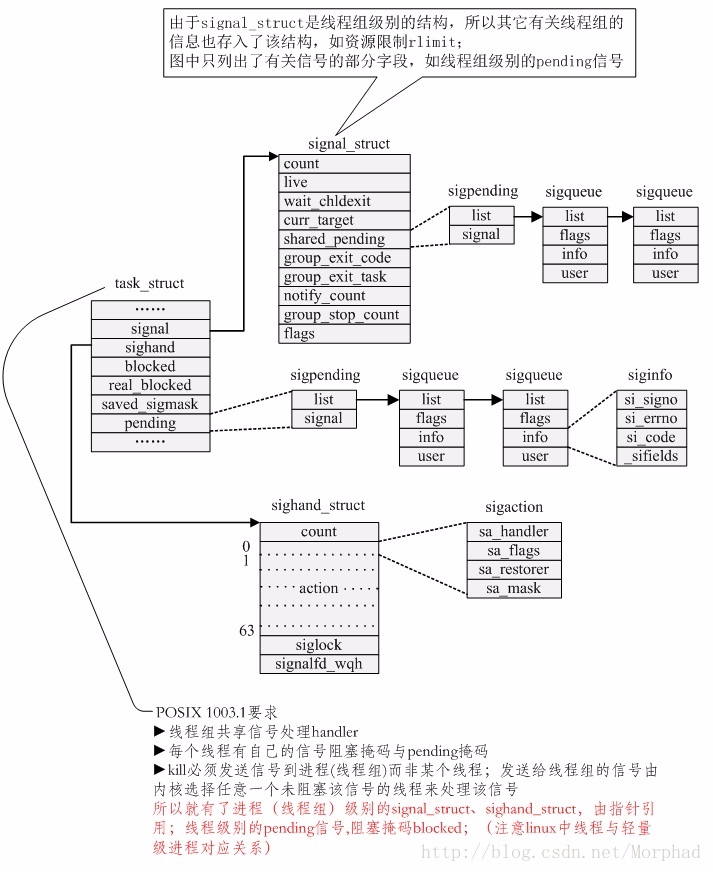

## 管道

由于管道是**基于字节流的通信**（无消息边界），无法对来自不同的进程的信息区分，所以一般只用在两个进程间**半双工**通信。


### 实现原理

管道是内核借助[`pipefs`](https://blog.csdn.net/Morphad/article/details/9219843)创建的一个**内核缓冲区**（大小一般为一页），并没有专门的数据结构用来描述管道，对该文件的操作由`pipefs`提供[具体的实现支持](https://www.cnblogs.com/zengyiwen/p/5755170.html)（对读写端错误调用写读都会引发错误、收到`-EBADF`的返回值）。

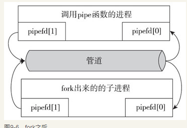

父进程创建的管道描述符会被`fork`后的子进程复制，此时两个进程各自持有的`file`结构的`inode`指向同一个VFS的`inode`节点，该`inode`节点指向同一个物理页。父子进程访问管道文件最终读写的是同一个内存页。

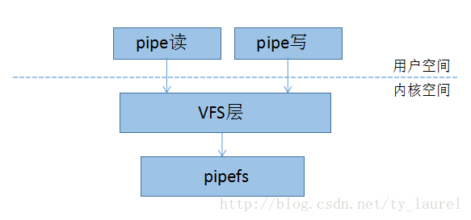

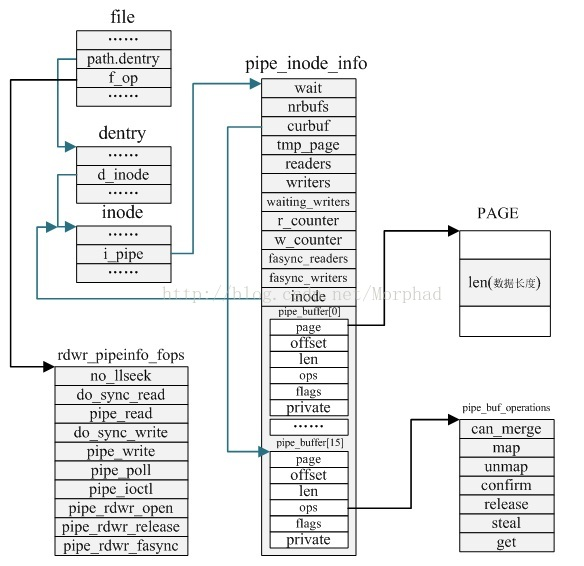

### 匿名管道

内核中的**缓冲区没有明确的标识符**，其他进程无法直接访问管道。用于实现有**亲缘关系**（**多个进程只要能够拿到同一个管道（缓冲区）的操作句柄就可以**）的进程间的通信。

#### API

```c
#include <unistd.h>

int pipe(int fd[2]);//创建管道
//@parameters
//	fd[2]：传递给内核用来保存内核创建的管道描述符，两个元素分别是读端和写端
//@Return value
//	成功返回0；失败返回-1；

int dup(int oldfd);
int dup2(int oldfd, int newfd);
int dup3(int oldfd, int newfd, int flags);

#include <stdio.h>
FILE *popen(const char *command, const char *type);//创建管道和shell进程（用于创建执行command的孙子进程）
//@parameters
//	command: 将要执行段的孙子进程
//	type: 'r','w'
//		'r': command执行的标准输出写入创建的管道，返回相当于管道读端
//		'w': 返回相当于管道写端，对管道的写将作为command执行的标准准输入端
//@Return value
//	成功返回管道读端或者写端描述符；失败返回NULL并设置error
int pclose(FILE *stream); //等待子进程退出并关闭管道
//@parameters
//	stream: popen返回的管道文件描述符
//@Return value
//	成功返回shell的终止状态；失败返回-1并设置error
```

### [命名管道](https://www.codenong.com/cs106798137/)

此时内核中的**缓冲区具有标识符**，其他的进程可以通过这个标识符访问同一个文件实现**同一主机上任意进程间的通信**。**标识符为一个可见于文件系统的文件名**，所以需要依靠一个具体的文件名，此时的命名文件仅仅起到提供inode供其他进程索引而已，**数据依然存在于内存缓冲页**面中。命名管道一旦建立，之后它的读、写以及关闭操作都与普通管道完全相同。

#### API

```c
#include <sys/types.h>
#include <sys/stat.h>

int mknod(const char *filename, mode_t mod, dev_t dev);//创建普通或特殊文件(命名管道)
//@parameters
//	filename: 待创建的文件名
//	mod: 文件权限，只读只写会阻塞
//	dev: 设备值，只在创建设备文件时才会用到，其值取决于文件创建的种类
//@Return value
//	成功返回0；失败返回-1；

int mkfifo(const char *filename, mode_t mode); //创建命名管道文件
//@parameters
//	filename: 创建的命名管道的文件名
//	mode: 文件权限，只读只写会阻塞
//@Return value
//	成功返回0；失败返回-1；
```

### shell与管道

将进程的标准输入\标准输出描述符分别复制到管道的读写端，实现两个进程的输入输出通过管道连接，由**于内核给管道总是分配最小的可用描述符**，所以需要格外注意。

```c
// 进程1：校验管道写入端，复制标准输出描述符到管道写入端，关闭管道原写入端
if(pipefd[1] != STDOUT_FILENO){
	dup2(pipefd[1],STDOUT_FILENO);
	close(pipefd[1]);
}
// 进程2：校验管道读出端，复制标准输入描述符到管道读出端，关闭管道原读出端
if(pipefd[0] != STDIN_FILENO){
	dup2(pipefd[0],STDIN_FILENO);
	close(pipefd[0]);
}
```

### 同步与互斥

当要写入的数据量**不大于`PIPE_BUF`时，内核将保证写入的原子性**。

### 注意事项（阻塞……）

1. 当管道文件的**所有读写端都关闭时，管道文件才会被释放**（丢弃`inode`，释放`page`）。所以需要**主动及时关闭无用的管道描述符**。
2. 所有读端都关闭后再次从写端**`write`会失败**并收到`SIGPIPE`信号(默认杀死进程)。
3. 所有写端关闭且管道已空时从读端`read`才会才**返回0且收到`EOF`标志**。
4. **管道无数据阻塞读，满数据阻塞写**，

## 共享内存

将**多个进程的虚拟地址映射到同一块物理地址**上，这样进程对自己空间中作为共享内存的一段空间的操作将对其他进程可见，从而实现进程间的通信。共享内存**有两种实现方案**，一种`system V`基于`shm`文件系统（`tmpfs`），一种基于`mmap`系统调用创建共享内存映射。

### System V实现

#### 数据结构

~~在**老版本的Linux**中每一个新创建的**共享内存对象都用一个`shmid_ds`数据结构来表达**。系统中所有的`shmid_ds`数据结构的指针都保存在`shm_segs[SHMMNI]`向量表（长度为`SHMMNI:128`，所以**系统支持的基于`shm`的共享内存个数有限**）中。~~

```c
/*// Obsolete, used only for backwards compatibility and libc5 compiles
static struct shmid_ds *shm_segs[SHMMNI];

 struct shmid_ds {
	struct ipc_perm shm_perm;//操作权限
	int shm_segsz;//段的大小（以字节为单位)
	__kernel_time_t shm_atime, shm_dtime, shm_ctime;//上一次shat、shdt、change的时间点
	__kernel_ipc_pid_t shm_cpid, shm_lpid;//该共享内存的创建者和上次使用者
	unsigned short shm_nattch;	//当前附加到该段的进程的个数(即使用该共享内存的进程个数)
	//其他数据
};*/

struct shmid_kernel{//每一个共享内存区的控制结构，实现存储管理和文件系统的结合
	struct kern_ipc_perm shm_perm;
	struct file *shm_file;//将被映射文件的文件描述符
	int id;
	unsigned long shm_nattch;//连接到这块共享内存的进程数
	unsigned long shm_segsz;//该共享内存大小，字节为单位
	time_t shm_atim, shm_dtim, shm_ctim;//上一次shat、shdt、change的时间点
	pid_t shm_cprid, shm_lprid;//该共享内存的创建者和上次使用者
};

struct shm_file_data {//存放tmpfs中创建的内存文件信息
	int id;
	struct ipc_namespace *ns;
	struct file *file;
	const struct vm_operations_struct *vm_ops;
};
```

#### [操作](https://blog.csdn.net/Morphad/article/details/9148437)

##### 创建

```c
int shmget(key_t key, size_t size, int shmflag);//创建共享内存
//@Parameters
//	key: 非0，
//	size: 共享内存的长度，范围在[SHMMIN, SHMMAX]，如果key之前以存在则size要不大于key的原size值
//	shmflag: 权限标志，支持mode_t和0644之类的权限控制做或操作
//@Return value
//	成功则返回一个共享内存描述符；失败返回-1
```

内核保证`shmget`获得或创建一个共享内存区，并初始化该共享内存区相应的`shmid_kernel`结构。同时还在**特殊文件系统`tmpfs`**中创建并打开一个同名文件，并在内存中建立起该文件的相应`dentry`及`inode`结构，**新打开的文件不属于任何一个进程**（任何进程都可以访问该共享内存区）。

##### 使用

###### 映射到进程空间

```c
void *shmat(int shm_id, const void *shm_addr, int shmflg);//把共享内存连接到当前进程的地址空间,启动对该共享内存的访问。
//@Parameters
//	shm_id: shmget函数返回的共享内存标识
//	shm_addr: 指定共享内存连接到当前进程中的地址位置，通常为null（OS自己选择）。
//	shmflag: 组标志位，通常为0。
//@Return value
//	成功时返回一个指向共享内存第一个字节的指针；失败返回-1
```

共享内存主要涉及**`tmpfs`文件与`shm`文件**两种文件，一个共享内存对应一个`tmpfs`文件，内核借助`tmpfs`的**文件映射**功能（` do_mmap->do_mmap_pgoff->mmap_region->mmap`）直接将共享内存映射到进程地址空间，有多少个进程`attach`到共享内存就有多少个`shm`文件。即**`共享内存:tmpfs文件:shm文件:共享进程数 = 1:N:N`**。通过`shm`文件的设计起到相当于引用计数的功能，只有所有进程`detach`各自的`shm`文件后，内核才会删除IPC资源。

~~老版本：内核会为每个申请使用该共享内存的进程**创建一个新的`vm_area_stuct`结构**用来描述该共享内存，用户可以干预该共享内存在进程的虚拟地址空间的位置，进程将内核创建的描述共享内存的`vm_area_struct`**连接到自己的`mm_struct`结构**中供进程寻址使用，同时也要**连接到`attaches`链表的末端**。~~

~~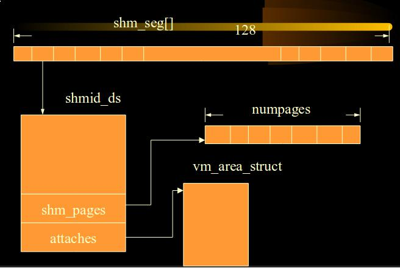~~

###### 读写

```c
int shmctl(int shm_id, int command, struct shmid_ds *buf);//控制共享内存
//@Parameters
//	shm_id: shmget函数返回的共享内存标识符
//	command: 采取的动作，取IPC_STAT、IPC_SET、IPC_RMID（删除）之一
//	buf: 指向共享内存模式和访问权限的结构shmid_ds的指针
//@Return value
//	
```

###### 解除映射

```c
int shmdt(const void *shmaddr);//将共享内存从当前进程中分离,当前进程不能够在使用共享内存，但内存仍属于进程
//@Parameters
//	shm_addr: shmat返回的指向共享内存的指针
//@Return value
//	成功返回0；失败返回-1；
```

查找共享内存映射到进程地址空间的虚拟地址内存段vma，移除共享内存在进程地址空间的映射。

### [Posix实现](# 内存映射：`mmap()`)

### 方案总结

|  风格   |  基础  |               数据写回                |    数据持久性    | 进程中止的影响 |
| :-----: | :----: | :-----------------------------------: | :--------------: | :------------: |
| SystemV | `shm`  | 基于`shm`文件系统中的文件，不写回磁盘 | 不删则随内核存在 |     需考虑     |
|  Posix  | `mmap` |      映射普通文件，可以写回磁盘       |    随文件存在    |    不用考虑    |

## Socket

套接字提供了一套本机内（UNIX Socket）或主机间（BSD Socket）的通信机制，Linux在底层通过同一套API对两种`Socket`的通信都提供了支持。每个套接字的类型由**域domain、类型type、协议protocal**三个属性确定，其唯一标识由其使用的地址确定，地址的格式随域（协议族）的不同而不同（UNIX有其socket命名规则，BSD使用ip:port元组）。

### 属性

**域 domain**：指定套接字通信中使用的网络介质；如AF_UNIX/AF_LOCAL（Unix Socket）、AF_INET（IPV4）、AF_INET6（IPV6）、AF_NETLINK（内核进程通信）……。

**类型 type**：如SOCK_STREAM（有序，可靠，双工、有连接、支持带外传输的字节流）、SOCK_DGRAM（无连接、不可靠、单次传输长度受限）、SOCK_RAW（原始字节）……。

**协议 protocal**：

### UNIX Socket

也叫UDS（Unix Domain Socket），UDS通过本机内核传输原始数据，不需要经过网络协议栈的打包、拆包、校验等操作。对于本地套接字来说，流式套接字（SOCK_STREAM）是一个有顺序的、可靠的双向字节流，相当于在本地进程之间建立起一条数据通道；数据报式套接字（SOCK_DGRAM）相当于单纯的发送消息，在进程通信过程中，理论上可能会有信息丢失、复制或者不按先后次序到达的情况，但由于其在本地通信，不通过外界网络，这些情况出现的概率很小。 

#### socket命名

UNIX流式套接字（**常用**）的通信双方都需要本地地址，其中服务端必须通过`struct sockaddr_un`变量明确指明地址、客户端必须使用和服务端相同的命名方式。socket进程通信的命名方式有两种：

**普通命名**：系统**根据参数中的名字**自动**创建同名的socket文件**，客户端建立链接的时候通过**读取此sock文件**来和服务端建立链接。

**抽象命名空间**：将`sockaddr_un::sun_path`的**第一字节置0**即启用了该特性。此时系统不需要创建socket文件、客户端只需要知道名字就可以连接

#### [使用](https://cloud.tencent.com/developer/article/1722546)

```c
struct sockaddr_un {//UDS中的套接字地址
    sa_family_t sun_family;//套接子类型：AF_UNIX/AF_LOCAL
    char sun_path[UNIX_PATH_MAX];//套接字文件路径名 
};

socket(AF_UNIX/AF_LOCAL, SOCK_STREAM/SOCK_DGRAM, 0);//建立UNIX Socket
```

### BSD Socket

详见网络编程

## 消息队列

### POSIX消息队列

#### API

```c
#include <bits/mqueue.h>

struct mq_attr{
 long int mq_flags; /* Message queue flags. 0 or O_NONBLOCK */
 long int mq_maxmsg; /* Maximum number of messages. */
 long int mq_msgsize; /* Maximum message size. */
 long int mq_curmsgs; /* Number of messages currently queued. */
 long int __pad[4];
};

mqd_t mq_open(const char *name, int oflag, mode_t mode, struct mq_attr *attr);//创建或打开消息队列
//@parameters
//	name: 消息队列的名字，形如/xxx
//	oflag: 打开的方式，和 open函数的类似
//		必选O_RDONLY，O_WRONLY，O_RDWR三者之一
//		可选O_NONBLOCK，O_CREAT，O_EXCL
//	mode: 可选参数，flag中含有O_CREAT标志且消息队列不存在时需要，设置访问权限
//	attr: 可选参数，flag中含有O_CREAT标志且消息队列不存在时需要，用于给新队列设定某些属性，为空指针则默认属性
//@Return value
//	成功则返回消息队列描述符；失败返回-1

mqd_t mq_close(mqd_t mqdes);//关闭消息队列
mqd_t mq_unlink(const char *name);//删除消息队列
mqd_t mq_getattr(mqd_t mqdes, struct mq_attr *attr);//获取消息队列参数
mqd_t mq_setattr(mqd_t mqdes, struct mq_attr *newattr, struct mq_attr *oldattr);//设置消息队列参数

mqd_t mq_send(mqd_t mqdes, const char *msg_ptr, size_t msg_len, unsigned msg_prio);//发送消息
mqd_t mq_receive(mqd_t mqdes, char *msg_ptr, size_t msg_len, unsigned *msg_prio);//接收消息
//@parameters
//	msg_len: 消息体的长度，用作接收时要求大于等于队列中最大消息的大小
//	msg_prio: 消息的优先级；它是一个小于 MQ_PRIO_MAX的数，数值越大，优先级越高。
```

### System V消息队列

#### [消息队列系统](https://www.cnblogs.com/zengyiwen/p/5b05df70da3299b79fe673d959b5fc16.html)

```c
struct msg_queue {//每个报文队列的队列头
	struct kern_ipc_perm q_perm;
	time_t q_stime;			/* last msgsnd time */
	time_t q_rtime;			/* last msgrcv time */
	time_t q_ctime;			/* last change time */
	unsigned long q_cbytes;		/* current number of bytes on queue */
	unsigned long q_qnum;		/* number of messages in queue */
	unsigned long q_qbytes;		/* max number of bytes on queue */
	pid_t q_lspid;			/* pid of last msgsnd */
	pid_t q_lrpid;			/* last receive pid */
	struct list_head q_messages;
	struct list_head q_receivers;
	struct list_head q_senders;
};
```

**`q_messages`**：指向待读取的消息链表

**`q_receivers`**：指向sleeping的接收者链表，表上的每个`msg_receiver`元素都有一个成员指向等待接受消息而阻塞的进程。		

**`q_senders`**：指向sleeping的发送者链表，表上的每个`msg_sender`元素都有一个成员指向等待发送消息而阻塞的进程。

以上数据结构的关系如下图中所表示的那样，全局`ipc_ids`数据结构的实例对象`msg_ids`是负责管理系统中的所有消息队列，其指针`entries`指向一个`ipc_id`结构数组，数组中的每个元素代表一个消息队列，数组的长度代表系统支持的消息队列的数目，系统中的所有消息队列都可以在`msg_ids::entries`中找到访问入口。数组元素的成员指针指向一个`kern_ipc_perm`数据结构，每个消息队列头`msg_queue`中页有一个指向`kern_ipc_perm`结构的指针。

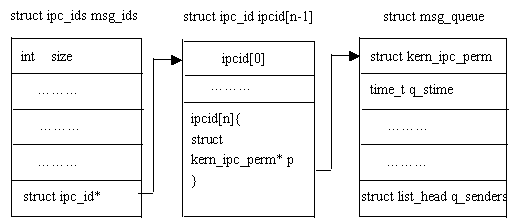

每个消息队列本质上是**位于内核空间的消息链表**，链表的每个节点都是一条消息。每一条消息都有自己的消息类型（用大于0的整数表示），每种类型的消息都被对应的链表所维护，每个消息队列的连接情况如下图：消息类型为 0 的链表按照消息进入消息队列的顺序记录了所有消息加入队列的消息，每一个类别的链表记录了该类下的所有消息。


#### 每个消息队列

```c
struct msgbuf {//用来发送和接受消息的消息缓冲区的结构
	long mtype;         //消息的类型
	char mtext[1];      //存放消息正文的数组
};

struct msg_msg {		//代表每一个消息
	struct list_head m_list;//双向列表，通过这个变量连接队列中的消息成双向链表
	long  m_type;		//消息的类型
	int m_ts;           //消息长度
	struct msg_msgseg* next;//指向本消息下一分片所在的位置
	void *security;
	//本页之后空间存储消息的分片数据
};

struct msg_msgseg {			//保存消息超出一页时的切片
	struct msg_msgseg* next;//指向本消息下一分片所在的位置
	//本页之后空间存储消息分片数据
};

struct msg_receiver {//睡眠的接受者进程
    struct list_head    r_list;
    struct task_struct  *r_tsk;//指向接收者进程描述符
    int	r_mode;
    long r_msgtype;
    long r_maxsize;
    struct msg_msg *r_msg;
};

struct msg_sender {//睡眠的发送者进程
    struct list_head    list;
    struct task_struct  *tsk;
    size_t msgsz;
};
```

**`msg_msg`**：分为**控制结构区和数据区**两部分，每个`msg_msg`的大小**上限为一页**（小于页则为实际大小，大于一页将把**数据区切分**放到`msg_msg`的数据区和`msg_msgseg`的数据区）。

**`msg_msgseg`**：存放被分片后的剩余的消息，也分为控制区和数据区。

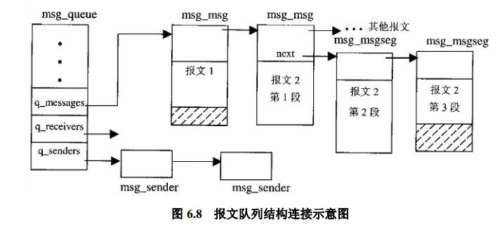

#### 整体架构

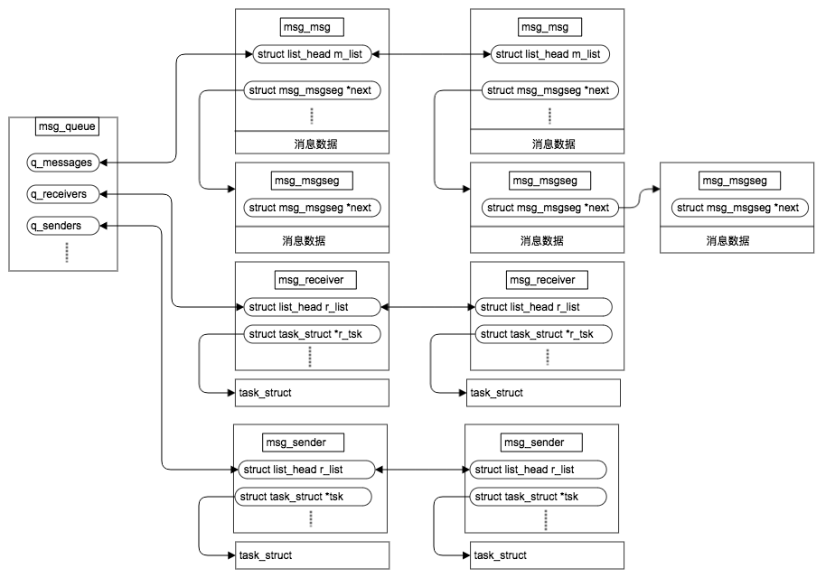

#### 操作API

```c
int msgget(key_t key, int msgflg);//创建消息队列
//@parameters
//	key: 键名、关键字--用来为消息队列命名获取描述符
//	msgflg: 消息队列的访问权限
//@Return value
//	成功则返回一个以key命名的消息队列描述符；失败返回-1

int msgsend(int msgid, const void *msg_ptr, size_t msg_sz, int msgflg);//将消息注入消息队列
//@parameters
//	msgid: msgget函数返回的消息队列标识符
//	msg_ptr: 指向待发送消息的指针，要求该消息结构是以一个长整型成员变量开始的结构体
//	msg_sz: msg_ptr指向的消息的长度（而非结构体的长度）
//	msgflg: 控制当前消息队列满或队列消息到达系统范围的限制时将要发生的事情
//@Return value
//	失败返回-1；成功返回0并将消息副本写入消息队列

int msgrcv(int msgid, void *msg_ptr, size_t msg_sz, long int msgtype, int msgflg);//从消息队列获取消息
//@parameters
//	msgtype: 
//		0: 获取消息队列中的第一个消息
//		>0: 获取匹配消息类型的第一个消息
//		<0: 获取类型等于或小于msgtype的绝对值的第一个消息
//	msgflg: 控制当队列中没有相应类型的消息可以接收时将发生的事情
//@Return value
//	失败时返回-1；成功返回被复制到msg_ptr中的字节数并消除消息队列中的相应消息

int msgctl(int msgid, int command, struct msgid_ds *buf);//控制消息队列
//@parameters
//	command: 将要采取的动作，可以取3个值
//		IPC_STAT: 用消息队列的当前关联值覆盖msgid_ds的值
//		IPC_SET: 把消息列队的当前关联值设置为msgid_ds结构中给出的值（需要进程有足够权限）
//		IPC_RMID: 删除消息队列
//	buf: 指向msgid_ds结构的指针
//@Return value
//	 成功时返回0；失败时返回-1

struct msgid_ds{
    uid_t shm_perm.uid;
    uid_t shm_perm.gid;
    mode_t shm_perm.mode;
};

struct my_message{//自定义的消息
    long int message_type; // 必须含有此域，用来标识不同的消息类型
    //接下来是希望传输的数据
};
```

### 注意事项

**生命期**：消息队列的存在独立于进程，只要没有显式的删除消息队列，消息队列就**随内核一直存在**。

**大小限制**：**消息大小和队列的容量**分别受到`MSGMAX` 和 `MSGMNB`的限制（字节为单位）。

**拷贝开销**：每次数据的写入和读取都需要经过**用户态与内核态之间**的拷贝过程。

**数据获取**：消息队列不一定按照FIFO顺序读，支持**乱序读出**（不同类型间的乱序），内核会自动删除被读出的消息。

## 信号量

**信号量其实是一个整型的计数器，主要用于实现进程间的互斥与同步，而不是用于缓存进程间通信的数据**。对信号量`sv`的访问（PV操作）都具有原子性。

### 类别

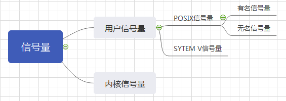

此外还可以根据信号量的初值不同分为**二值信号量**（互斥量）和**计数信号量**。

### 内核信号量

内核信号量试图获取资源失败时可能导致进程被挂起进入**对用户透明的等待队列**，因此**只有可以睡眠的函数才能获取内核信号量**，中断处理程序和可延迟函数都不能使用内核信号量。 

#### 数据结构

```c
struct semaphore {//信号量在内核中的表示
	raw_spinlock_t lock;//自旋锁，用于count值的互斥访问
	unsigned int count;//计数值，现有资源的数量、能同时允许访问的数量
	struct list_head wait_list;//不能立即获取到信号量的访问者，都会加入到等待列表中
};

struct semaphore_waiter {//等待信号量的进程节点
	struct list_head list;//用于添加到信号量的等待列表构成链表
	struct task_struct *task;//指向等待的进程，在实际实现中，指向current
	bool up;//用于标识是否已经释放
};
```

#### 操作

##### 初始化

```c
void sema_init (struct semaphore *sem, int val);
void init_MUTEX (struct semaphore *sem); //将sem的值置为1，表示资源空闲
void init_MUTEX_LOCKED (struct semaphore *sem); //将sem的值置为0，表示资源忙
```

##### 申请与释放

```c
void down(struct semaphore * sem);//申请内核信号量所保护的资源

int down_interruptible(struct semaphore * sem);//申请内核信号量所保护的资源
//@Return value
//	如果返回0，表示获得信号量正常返回，如果被信号打断，返回-EINTR

int down_trylock(struct semaphore * sem);//尝试申请内核信号量所保护的资源
//@Return value
//	获得信号量返回0；否则返回非0

void up(struct semaphore * sem);//释放内核信号量所保护的资源

int down_killable(struct semaphore *sem);//未获取到信号量时，进程中度睡眠： TASK_KILLABLE
int down_timeout(struct semaphore *sem, long timeout);//获取信号量，并指定等待时间
```

|                      |                             特点                             |
| :------------------: | :----------------------------------------------------------: |
|        `down`        | **不会被信号打断，会导致进程挂起而睡眠**，不能在中断上下文使用 |
| `down_interruptible` |                       **能被信号打断**                       |
|    `down_trylock`    |        **不会导致进程挂起而睡眠**，能在中断上下文使用        |

### 用户信号量

#### Posix 实现

##### 数据结构

```c
typedef union{
  char __size[__SIZEOF_SEM_T];
  long long int __align;
} sem_t;
```

##### 操作

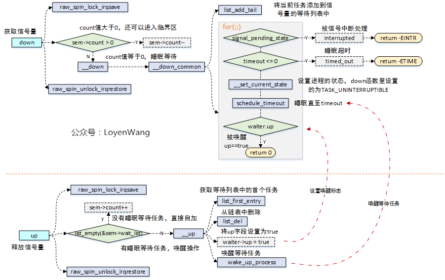

`schedule_timeout`指定的睡眠时间一般是无限等待只能等待被唤醒才能继续运行当前任务。

###### 创建销毁

**有名信号量**：**值保存在文件中**，所以它可以用于线程也可以用于进程间的同步。由于借助了文件实现所以每个`open`的位置都要`close`和`unlink`，但只有最后执行的`unlink`生效（会检查信号量的引用计数）。

```c
sem_t *sem_open(const char *name, int oflag, mode_t mode, int val);//创建有名信号量
//@Paramters:
//	name: 文件名（不要写路径，因为会自动放到/dev/shm目录下）
//	oflag: 文件的打开控制，如O_CREAT或O_CREAT
//	mode: 控制新的信号量的访问权限
//	val: 信号量初值
//@Return value
//	成功返回0；失败返回-1并设置errno。

int sem_close(sem_t *sem);//每个进程内标记此有名信号量已经不会再被用到
int sem_unlink(const char *name);//删除系统中的信号量，只有没有任何进程引用该信号量时系统才会删除该有名信号量
```

**无名信号量**：值保存在内存中，**主要应用于线程**。也可以用于多进程之间的同步，此时要求无名信号量和要保护的变量必须在多个进程间共享。

```c
int sem_init(sem_t *sem, int pshared, unsigned int val);//初始化无名信号量
//@Paramters:
//	sem: 信号量
//	pshared: 设置信号量共享属性(0用于线程间，非0用于进程间，1用于父子进程)，进程间共享sem必须放在共享内存区域
//	val: 信号量初值
//@Return value
//	成功返回0；失败返回-1并设置errno。

int sem_destroy(sem_t *sem);//销毁一个无名信号量
```

###### 一般操作

```c
int sem_trywait(sem_t *sem);//非阻塞地将信号量减一（已为0不挂起而是返回错误）

int sem_wait(sem_t *sem);//阻塞地将信号量减一（已为0就挂起）
int sem_post(sem_t *sem);//给信号量值加一
//@Paramters:
//	sem: 要操作的信号量
//@Return value
//	成功返回0；失败返回-1并设置errno。

int sem_getvalue(sem_t *sem, int *sval);//取回信号量sem的当前值保存到sval中

int sem_timedwait(sem_t sem, const struct timespec abs_timeout);//限时尝试对信号量加锁
//@Paramters:
//	sem: 信号量
//	abs_timeout: 等待的绝对时间
//@Return value
//	成功返回0；失败返回-1并设置errno。
```

#### [System V实现](https://blog.csdn.net/Morphad/article/details/9141509)

##### 数据结构

###### 信号量

```c
struct sem {//System V信号量在内核的表示
	int	semval;//信号量的当前值
	int	sempid;//上一次操作本信号的进程PID
	struct list_head sem_pending;//阻塞队列
};
```

###### 信号量集

若干个信号量构成的信号量数组，用于把多个共享资源包装成互斥资源，内核使用`sem_array`记录和管理信号量集。

```c
struct sem_array {//信号量集
	struct kern_ipc_perm sem_perm;//记录了该信号量集的权限信息
	struct list_head list_id;//undo结构\\\\\\\\\\\\\\\\\\\\\\\\\\\\\\\\\\\
	struct sem *sem_base;//指向信号量数组的指针
	unsigned long sem_nsems;//信号量集里面信号量的数目
	struct list_head sem_pending;//等待队列
	time_t sem_otime;//上一次信号量的操作时间
	time_t sem_ctime;//信号量变化时间
};
```

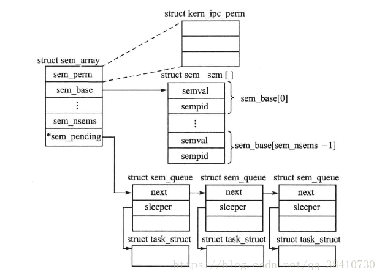

###### 进程等待队列

一个信号量集对应一个进程等待队列

```c
struct sem_queue {//信号等待队列的每个节点
	struct list_head list;//链接节点成队列
	struct task_struct *sleeper; /* 指向等待进程控制块的指针 */
	struct sem_undo *undo;	 /* undo请求操作结构指针 */
	int pid;	 /* 请求操作的进程标识 */
	int status;	 /* 操作完成状态 */
	struct sembuf *sops;	 /* 挂起的操作集 */
	int nsops;	 /* 操作数目 */
	int alter;   /* does the operation alter the array? */
};
```

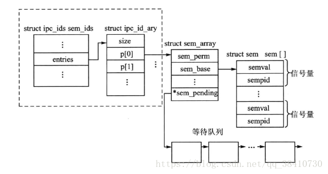

###### `sem_undo`结构

**通过设置`SEM_UNDO`，当进程非正常中止时内核会产生响应操作，以保证信号量处于正常状态**。进程可能会因非正常中止而导致临界段没有机会来释放资源，此时进程必须将释放资源的任务转交给内核来完成。即在调用`semop()`请求资源时，把传递给函数的`sembuf`结构的域`sem_flg`设置为`SEM_UNDO`。这样，函数在执行时就会为信号量配置一个`sem_undo`的结构，并在该结构中记录释放信号量的调整值；然后把信号量集中所有`sem_undo`组成一个队列，并在等待进程队列中用指针`undo`指向该队列。

```c
struct sem_undo {
	struct list_head list_proc;	/* per-process list: all undos from one process. */
						/* rcu protected */
	struct rcu_head rcu;		/* rcu struct for sem_undo() */
	struct sem_undo_list *ulp;		/* sem_undo_list for the process */
	struct list_head list_id;	/* per semaphore array list: all undos for one array */
	int semid;		/* 信号量集标识符 */
	short *semadj;		/* 存放信号量集调整值的数组指针 */
};
```

##### 操作

###### 创建

```c
int semget(key_t key, int num_sems, int sem_flags);//创建新信号量集或取得已有信号量集
//@parameters
//	key: 键名、关键字--唯一且非零，用来获取信号量集描述符
//	num_sems: 
//		>0: 创建新信号量集中信号的数目
//		=0: 访问一个已存在的信号量集合
//	sem_flags: 一组标志，如IPC_CREAT|0666
//@Return value
//	成功则返回一个以key命名信号量集描述符；失败返回-1
```

###### 数据操作

**参数数据结构**：

```c
struct sembuf{
    short sem_num;//信号在信号量集中的下标索引
    short sem_op;//一次操作中对信号量加上sem_op（整数）
//	>0: 释放sem_op个资源
//	<0: 申请sem_op个资源
    short sem_flg;//操作该信号的标志
//	IPC_WAIT: 0,操作不能执行时阻塞等待
//	IPC_NOWAIT: 操作不能执行时立即返回
//	SEM_UNDO: 操作系统跟踪信号，在进程没有释放该信号量而终止时由操作系统释放信号量
};

union semun{
    int val;//setval操作将使用的值
    struct semid_ds *buf;//IPC_STAT、IPC_SET 使用的缓存区
    unsigned short *arry;//GETALL、SETALL 使用的数组
	struct seminfo *__buf;//IPC_INFO(Linux特有) 使用的缓存区
};
```

```c
int semop(int sem_id, struct sembuf *sem_opa, size_t num_sem_ops);//改变信号量的值
//@parameters
//	sem_id: semget返回的信号量集描述符
//	sem_opa: 要对某些信号量施加的操作
//	num_sem_ops: 要操作的信号数量，即sem_opa数组的长度
//@Return value
//	成功返回0；失败返回-1并设置erron

int semctl(int sem_id, int sem_num, int command, ...);//直接控制信号量集信息
//@parameters
//	sem_id: semget返回的信号量集描述符
//	sem_num: 要操作的信号量在信号量集中的下标
//	command: 设置的属性
//		GETALL/SETALL: 获取/设置信号量集中所有值，数据存储在semun的arry参数中
//		GETVAL/SETVAL: 获取/设置信号量的值，数据来源于semun::val
//		IPC_STAT/IPC_SET: 读取/设置一个信号量集的数据结构semid_ds，数据存储在semun的buf参数中。
//		IPC_RMID: 删除信号量
//		GETPID: 返回最后一个执行semop操作的进程的PID。
//	...: semun类型的可选参数
//@Return value
//	若成功不同cmd返回不同的值，IPC_GETVAL返回信号量当前值其他返回0；出错返回-1
```

### [读写信号量](https://www.cnblogs.com/LoyenWang/p/12907230.html)

共享读互斥写，临界区只允许一个写进程进入，适于**读多写少**的场景。读写信号量有两种实现，一种是通用的不依赖于硬件架构；另一种是架构相关的（高性能）。

#### 数据结构

以下是简化的数据结构，其中最为重要的是**`count`字段**，它同时记录了读者和写者的信息，在32b的count中，高16位代表了`waiting part`，低15位代表了`active part`。

**`waiting part`**：

**`active part`**：

```c
struct rw_semaphore {
	atomic_long_t count;//用于表示读写信号量的计数
	struct list_head wait_list;//等待列表，用于管理在该信号量上睡眠的任务
	raw_spinlock_t wait_lock;//锁，用于保护count值的操作
	struct optimistic_spin_queue osq;//MCS自旋锁
	struct task_struct *owner;//当写者成功获取锁时，owner会指向锁的持有者
};
```

|         count：宏         |   值   |    16进制    |               含义与使用                |
| :-----------------------: | :----: | :----------: | :-------------------------------------: |
|  `RWSEM_UNLOCKED_VALUE`   |   0    | `0x00000000` |           初态：无读者和写者            |
|    `RWSEM_ACTIVE_BIAS`    |   1    | `0x00000001` |                  NONE                   |
| `RWSEM_ACTIVE_READ_BIAS`  |   1    | `0x00000001` |   **读者**申请释放时对count的操作单位   |
| `RWSEM_ACTIVE_WRITE_BIAS` | -65535 | `0xFFFF0001` |   **写者**申请释放时对count的操作单位   |
|   `RWSEM_WAITING_BIAS`    | -65536 | `0xFFFF0000` | 添加删除**等待队列**时对count的操作单位 |

在获取释放读锁和写锁的全过程中，`count`值伴随着上述这几个宏定义的加减操作，用于标识不同的状态，可以罗列如下：

|                              值                              |                             状态                             |
| :----------------------------------------------------------: | :----------------------------------------------------------: |
|                         `0x00000000`                         |                      初态：无读者和写者                      |
|                         `0x0000000X`                         |  活跃的读者和正在申请读锁的读者总共为`X`个，没有写者来干扰   |
| `0xFFFF000X = RWSEM_WAITING_BIAS + X * RWSEM_ACTIVE_READ_BIAS` | 表示活跃的读者和正在申请读锁的读者总共有`X`个，并且还有一个写者在睡眠等待； |
| `0xFFFF000X = RWSEM_ACTIVE_WRITE_BIAS + (X - 1)* RWSEM_ACTIVE_READ_BIAS` | 表示有一个写者在尝试获取锁，活跃的读者和正在申请读锁的读者总共有`X-1`个； |
|            `0xFFFF0001 = RWSEM_ACTIVE_WRITE_BIAS`            |   有一个活跃的写者，或者写者正在尝试获取锁，没有读者干扰；   |
|  `0xFFFF0001 = RWSEM_ACTIVE_READ_BIAS + RWSEM_WAITING_BIAS`  |    有个写者正在睡眠等待，还有一个活跃或尝试获取锁的读者；    |

#### 初始化

```c
DECLARE_RWSEM(name)//声明一个读写信号量name并对其进行初始化
void init_rwsem(struct rw_semaphore *sem);//对读写信号量sem进行初始化
```

#### 获取信号量

##### 读者获取信号量

```c
void down_read(struct rw_semaphore *sem);//会导致调用者睡眠，因此只能在进程上下文使用。
int down_read_trylock(struct rw_semaphore *sem);//不会导致调用者睡眠
//@Return value
//	获得读写信号量返回1；否则返回0
```

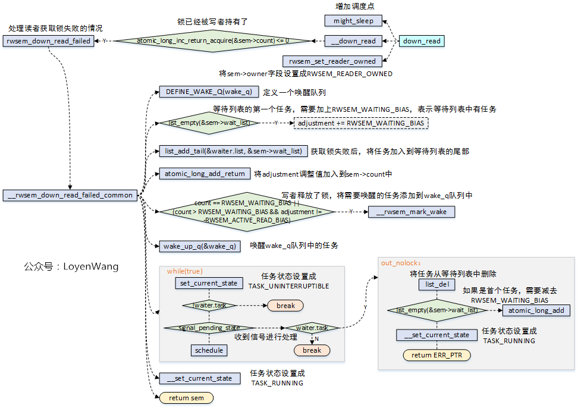

读者获取锁的时候，如果没有写者持有，那就可以支持多个读者直接获取；而如果此时写者持有了锁，读者获取失败，它将把自己添加到等待列表中（这个**等待列表中可能已经存放了其他来获取锁的读者或者写者**），在将读者真正睡眠等待前，还会**再一次判断**此时是否有写者释放了该锁，释放了的话，那就需要对睡眠等待在该锁的任务进行唤醒操作了。

##### 写者获取信号量

```c
void down_write(struct rw_semaphore *sem);//会导致调用者睡眠，因此只能在进程上下文使用。
int down_write_trylock(struct rw_semaphore *sem);////不会导致调用者睡眠
//@Return value
//	获得读写信号量返回1；否则返回0
```

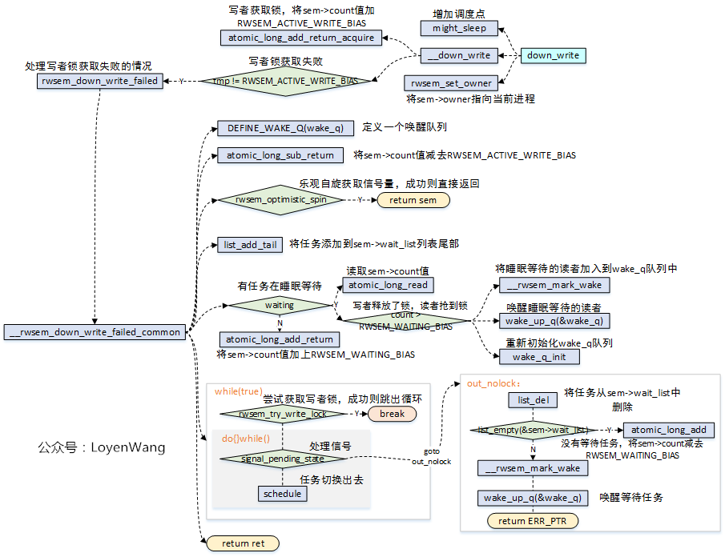

写者获取锁时，只要锁被其他读者或者写者持有了，则获取锁失败，然后进行失败情况处理。在失败情况下，它本身会**先尝试进行optimistic  spin**去尝试获取锁，如果获取失败**后进入慢速路径**。慢速路径中去判断等待列表中是否有任务在睡眠等待，并且会再次尝试去查看是否已经有写者释放了锁，写者释放了锁，并且只有读者在睡眠等待，那么此时应该优先让这些先等待的任务唤醒。

#### 释放信号量

唤醒操作中，**优先处理自旋未休眠的任务**，没有自旋任务才去唤醒等待列表中的任务；唤醒等待列表中的任务时，由于等待列表中可能存放的是读者与写者的组合，需要分情况处理：如果第一个任务是写者，则直接唤醒该写者，否则将唤醒排在前边的**连续**几个读者；

##### 读者释放信号量

```c
void up_read(struct rw_semaphore *sem);
```

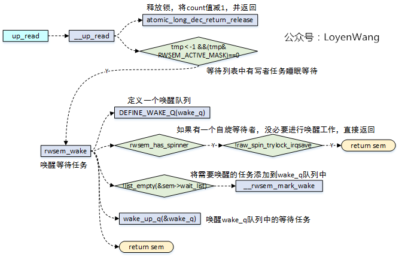

##### 写者释放信号量

```c
void up_write(struct rw_semaphore *sem);
```

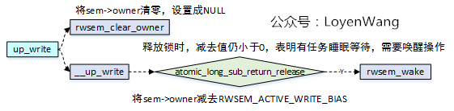

####  身份转换

在写者保持读写信号量而不需要写期间，将写者降级为读者使等待访问的读者能够立刻访问，从而增加并发性提高效率。 

```c
void downgrade_write(struct rw_semaphore *sem);
```

### `Semaphore`与`Mutex`

在`Mutex`能满足要求的情况下，**优先使用`Mutex`**。`Mutex`被持有后有一个明确的`owner`，而`Semaphore`并没有`owner`，当一个进程阻塞在某个信号量上时，它没法知道自己阻塞在哪个进程（线程）之上；

没有`ownership`会带来以下几个问题：

1. 在保护临界区的时候，无法进行优先级反转的处理；
2. 系统无法对其进行跟踪断言处理，比如死锁检测等；
3. 信号量的调试变得更加麻烦；

当对低开销、短期、中断上下文加锁，优先考虑自旋锁；当对长期、持有锁需要休眠的任务，优先考虑信号量。

### NOTE

1. 信号量可能会引起进程睡眠，开销较大，适用于保护较长的临界区；

## 总结

信号量只能由那些允许休眠的程序可以使用（获取信号量失败，则相应的进程会被挂起），像中断处理程序和可延时函数等不能使用。

### 通信方式

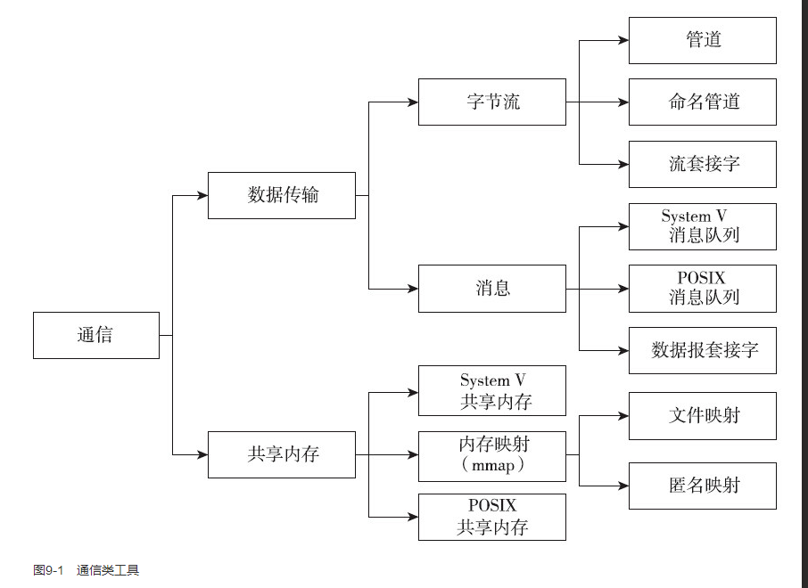

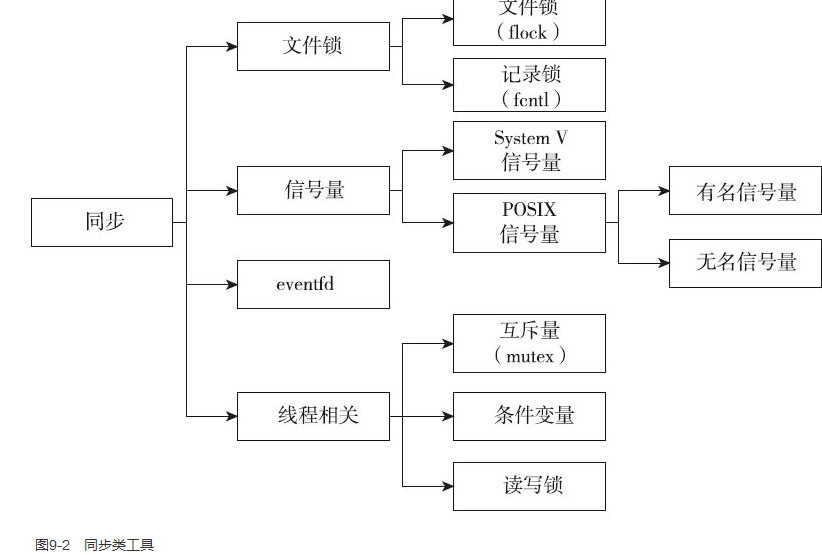

| 通信方式 |                用于空间与内核的局限                |
| :------: | :------------------------------------------------: |
| 消息队列 | 消息队列在硬中断和软中断中不可以无阻塞地接收数据。 |
|  信号量  |      信号量无法在内核空间和用户空间之间使用。      |
|  套接字  |    套接字在硬、软中断中不可以无阻塞地接收数据。    |

|   方式   |        数据量        |      进程关系      |  消息格式  |    模式    | 同步 | 生命期 | K/U拷贝 | 模态转换 |    补充    |
| :------: | :------------------: | :----------------: | :--------: | :--------: | :--: | :----: | :-----: | :--------: | :--------: |
|   信号   |      预定义事件      |      任何进程      |    整形    |   半双工   |      | 随进程 | 无所谓 |         | 唯一的异步 |
| 匿名管道 |     循环使用一页     |      亲缘进程      |   字节流   |   半双工   |  Y   | 随进程 |         |         |            |
| 命名管道 |     循环使用一页     |      任何进程      |   字节流   |   半双工   |  Y   |              随进程              |         |         |            |
|  套结字  |                      | 可跨主机的任何进程 |            |            |      | **随进程** |         | 看实现 |            |
| P共享内存 |        自定义        |      任何进程      |   字节流   | 无同步支持 |  N   | 随内核或文件（内存映射文件实现） | 无拷贝  | 不需要 |            |
| P消息队列 | 消息和消息数量有上限 |      任何进程      | 自定义消息 |            |      | 随内核或文件（内存映射文件实现） |  需要   |     |            |
|  P信号量  | 单信号量 | 任何进程 | 预定义 |            | Y | 随内核或文件（内存映射文件实现） | 无所谓 | 竞争时需要 | 基于`futex` |
| SV共享内存 |        自定义        |      任何进程      |   字节流   | 无同步支持 |  N   | 随内核 | 无拷贝  |   |            |
| SV消息队列 | 消息和消息数量有上限 |      任何进程      | 自定义消息 |            |      | 随内核 | 需要 |  |            |
|  SV信号量  | 信号量集 | 任何进程 | 预定义 |            | Y | 随内核 | 无所谓 | 需要 | 支持`UNDO` |

**`futex`  快速用户空间互斥锁**：对传统的System V同步方式的一种替代，仅在有竞争的操作时才用系统调用访问内 核，在竞争较少的情况下可以大幅度地减少工作负载 。

### SystemV & Posix

Linux内核为系统System VIPC提供了一个统一的系统调用`ipc()`：

   ```c
int ipc(unsigned int call,int firtst,int second,int third,void*ptr,int firth);
//@parameters
//	call: 具体的操作码，可以取以下宏
//		信号量[1-4]：SEMOP、SEMGET、SEMCTL、SEMTIMEDOP
//		消息队列[11-14]：MSGSND、MSGRCV、MSGGET、MSGCTL
//		共享内存[21-24]：SHMAT、SHMDT、SHMGET、SHMCTL
   ```

|          |        接口        |   本体   |    对象命名    |        移植性        |    标识符    |   内核实现   |    头文件     |    额外库    |
| :------: | :----------------: | :------: | :------------: | :------------------: | :----------: | :----------: | :-----------: | :----------: |
|  POSIX   | 简单，命名有下划线 | 非负整数 | 使用名字`name` |   有一些unix不支持   |  特定于进程  | 基于文件系统 | `semaphore.h` | `rt,pthread` |
| system V |   复杂，性能较低   | 信号量集 | 使用键`key_t`  | 几乎所有的*nix都支持 | 系统全局范围 | 统一数据结构 |  `sys/sem.h`  |    不需要    |

| System V IPC |    头文件     | 创建方法 | 控制函数 |     操作函数     |
| :----------: | :-----------: | :------: | :------: | :--------------: |
|   消息队列   | `<sys/msg.h>` | `msgget` | `msgctl` | `msgsnd、msgrcv` |
|    信号量    | `<sys/sem.h>` | `semget` | `semctl` |     `semop`      |
|  共享内存区  | `<sys/shm.h>` | `shmget` | `shmctl` |  `shmat、shmdt`  |

| Posix IPC  |     头文件      |                     创建销毁方法                     |        控制函数         |                   操作函数                   |
| :--------: | :-------------: | :--------------------------------------------------: | :---------------------: | :------------------------------------------: |
|  消息队列  |  `<mqueue.h>`   |             `mq_open/mq_close/mq_unlink`             | `mq_getattr/mq_setattr` |        `mq_receive/mq_send/mq_notify`        |
|   信号量   | `<semaphore.h>` | `sem_open/sem_close/sem_unlink/sem_init/sem_destroy` |           无            | `sem_wait/sem_trywait/sem_post/sem_getvalue` |
| 共享内存区 | `<sys/mman.h>`  |                `shm_open/shm_unlink`                 |    `ftruncate/fstat`    |                `mmap/munmap`                 |

Posix IPC对象打开函数第二参数的有效性总结
|    方法    | `O_RDONLY` | `O_WRONLY` | `O_RDWR` | `O_CREAT` | `O_EXCL` | `O_NONBLOCK` | `O_TRUNC` |
| :--------: | :--------: | :--------: | :------: | :-------: | :------: | :----------: | :-------: |
| `mq_open`  |    支持    |    支持    |   支持   |   支持    |   支持   |     支持     | **无效**  |
| `sem_open` |  **无效**  |  **无效**  | **无效** |   支持    |   支持   |   **无效**   | **无效**  |
| `shm_open` |    支持    |  **无效**  |   支持   |   支持    |   支持   |   **无效**   |   支持    |

#### [SystemV的IPC管理](https://ty-chen.github.io/linux-kernel-shm-semaphore/)

##### 整体组织

内核为SystemV的IPC提供了统一的封装和管理机制`struct ipc_ids`，`ipc_ids[3]`中分别代表信号量、消息队列和共享内存。并通过`ipc_namespace`来分割不同的IPC环境。

```c
                                                        [0] struct kern_ipc_perm <==> struct shmid_kernel
struct ipc_namespace => struct ipc_ids => struct idr => [1] struct kern_ipc_perm <==> struct shmid_kernel
                                                        [2] struct kern_ipc_perm <==> struct shmid_kernel
```


##### 数据结构

同步机制以数据结构操作为中心，为了提供同步操作IPC对象的效率，Linux内核针对不同大小的数据结构操作使用了自旋锁、读/写信号量、RCU、删除标识和引用计数等机制。

|                             机制                             |                  适用类型                  |      实例       |
| :----------------------------------------------------------: | :----------------------------------------: | :-------------: |
|                            自旋锁                            |     占用内存少、操作快速的小型数据结构     | `kern_ipc_perm` |
|                         读/写信号量                          |    读操作明显多于写操作的中小型数据结构    |    `ipc_ids`    |
| [RCU](http://www.wowotech.net/kernel_synchronization/rcu_fundamentals.html)/ [Read-Copy-Update](https://zhuanlan.zhihu.com/p/30583695) | 含有队列或链表、操作时间较长的大型数据结构 |   `sem_array`   |
|                      删除标识和引用计数                      |              协调各种同步机制              |                 |

**RCU**：内核实现的一种针对**读多写少**的共享数据的同步机制，随意读，但更新数据的时候，需要先复制一份副本，在副本上完成修改，再一次性地替换旧数据。

**`radix`基数树**：实现对于长整型数据类型的路由，**利用radix树可以实现IDR（ID Radix）机制**（将对象的   **身份鉴别号整数值ID与对象指针建立关联表**根据一个长整型（比如一个长ID）快速查找到其对应的对象指针）。

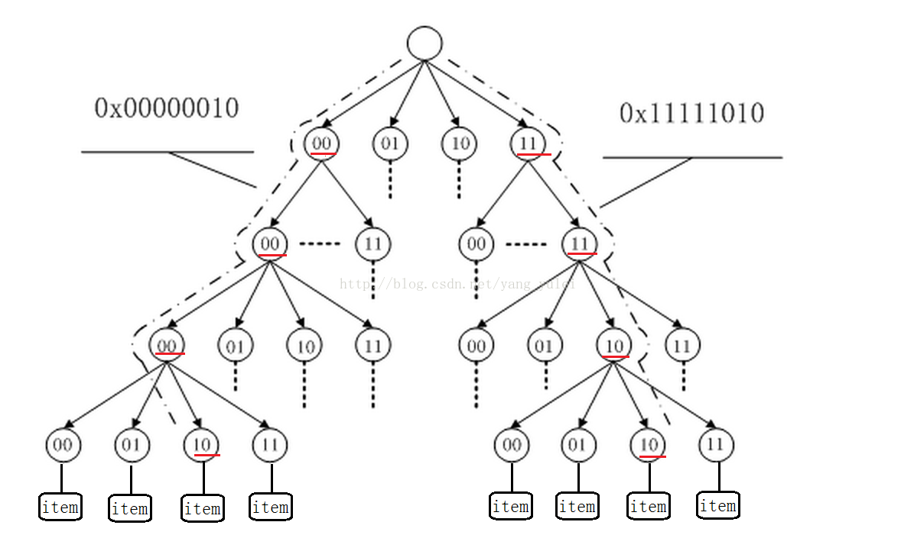

###### 顶层设计

```c
#define sem_ids(ns) ((ns)->ids[IPC_SEM_IDS])
#define msg_ids(ns) ((ns)->ids[IPC_MSG_IDS])
#define shm_ids(ns) ((ns)->ids[IPC_SHM_IDS])
struct ipc_namespace {//用来隔离不同的IPC环境，非完整定义
	atomic_t count;//被引用的次数
	struct ipc_ids	ids[3];//每个数组元素对应一种 IPC 机制：信号量、消息队列、共享内存
 //       #define IPC_SEM_IDS 0   信号量
 //       #define IPC_MSG_IDS 1   消息队列
 //       #define IPC_SHM_IDS 2   共享内存
    // 信号量、消息、共享内存、消息队列的管理结构
};

struct ipc_ids {// 内核的全局数据结构用来管理IPC对象
	int in_use;//使用中的 IPC 对象数量
	unsigned short seq;//下一个可分配的位置序列号，每次分配后自增1
	unsigned short seq_max;//能够使用的序列最大位置，seq达到seq_max后从0重新开始
	struct rw_semaphore rw_mutex;//保护ipc_ids的读写锁
	struct idr ipcs_idr;//基数树：通过IDR机制将ID与结构kern_ipc_perm类型指针建立关联，真正管理数据
//	当对象较少时采用链表的方式组织每一类的IPC对象，较多时使用基数树来加快查找
//	struct ipc_id_ary* entries;//指向资源ipc_id_ary数据结构的指针，记录了该类IPC对象的所有条目
}sem_ids, msg_ids, shm_ids; //内核中的实例化对象，分别用来管理信号量、消息队列、共享内存

struct ipc_id_ary {
	int size;//保存的是数组的长度值
	struct kern_ipc_perm *p[0];//数组长动态变化的指针数组，内核初始值为128
};

struct ipc_perm {};//用户数据结构：包含了IPC对象的基本信息，内容同kern_ipc_perm
struct kern_ipc_perm{//内核数据结构：内核为每个IPC对象维护一个此数据结构，用于记录一个IPC对象的权限信息
	spinlock_t lock;
	int deleted;//删除标识，表示该结构对象已删除
	int id;//每个IPC对象的id识别号（由基数树中空闲id与seq计算得到），便于从基数树中获取该对象的指针
	key_t key;//键值
	uid_t uid, cuid;//对象所有者、创建者的UID
	gid_t gid, cgid;//对象所有者所属组、创建者所属组的GID
	mode_t mode;//创建者、创建者群组和其他人的读和写许可
	unsigned long seq;//在每个IPC对象类型中的序列号
};
```

###### 下层组织

信号量、消息队列和共享内存三种IPC对象的数据结构中都有一个`struct kern_ipc_perm sem_perm`，在实际使用传递IPC对象的过程中传递的是**`struct kern_ipc_perm`的指针**，对这个指针使用**宏`container_of`**可以达到外层的`struct X`即实际的IPC对象。

```c
#define container_of(ptr, type, member) ({			\
	const typeof( ((type *)0)->member ) *__mptr = (ptr);	\
	(type *)( (char *)__mptr - offsetof(type,member) );})
```

```c
struct msg_queue {//每个消息队列的头，包括了该队列的基本信息
	struct kern_ipc_perm q_perm;
	time_t q_stime, q_rtime, q_rtime;//上一次send、receive、change的时间点
	pid_t q_lspid, q_lrpid;//上一次send、receive消息的进程号
	unsigned long q_cbytes;//消息队列中的消息总大小（Byte）
	unsigned long q_qnum;//消息队列中的消息数量
	unsigned long q_qbytes;//消息队列能容纳的最大消息总大小（Byte）
	struct list_head q_messages;//指向待读取的消息链表，链表元素为msg_msg
	struct list_head q_receivers;//指向sleeping的接收者链表，链表元素为msg_sender
	struct list_head q_senders;//向sleeping的发送者链表，链表元素为msg_sender
};

struct sem_array {
   struct kern_ipc_perm sem_perm; 
   time_t sem_otime, sem_ctime;//上一次semop、change的时间点
   struct sem  *sem_base;//指向信号量队列
   struct sem_queue *sem_pending;//指向挂起队列的首部
   struct sem_queue **sem_pending_last;//指向挂起队列的尾部
   struct sem_undo  *undo;//信号量集上的undo请求个数
   unsigned long  sem_nsems;//信号量集中的信号量的个数
};

struct shmid_kernel{//每一个共享内存区的控制结构，实现存储管理和文件系统的结合
	struct kern_ipc_perm shm_perm;
    time_t shm_atim, shm_dtim, shm_ctim;//上一次shat、shdt、change的时间点
	pid_t shm_cprid, shm_lprid;//该共享内存的创建者和上次使用者
	struct file *shm_file;//将被映射文件的文件描述符
	int id;
	unsigned long shm_nattch;//连接到这块共享内存的进程数
	unsigned long shm_segsz;//该共享内存大小，字节为单位
};
```

#####  **`System V: key_t`**

System V风格的IPC都使用**key_t值（IPC键）**作为它们的IPC描述符名字，**`key_t`和IPC对象描述符的关系类似于文件名和文件描述符的关系**。头文件通常把`key_t`定义为一个少32位的正整数，其值的产生有三种方式：使用**`ftok()`**产生；指定为**`IPC_PRIVATE`**由内核负责产生一个系统唯一的值；随机选一个整数由多个进程共享。

**note**：使用`tfok()`产生的`key_t`在文件的`inode`变化后（删后重建），即使是同名文件最后的生成结果也不一样。

```c
key_t ftok(const char *pathname, int id);
//@parameters
//	pathname: 文件名（必须存在且进程可访问）
//	id: project_id，[1,255]
//@Return value
//	成功返回IPC键（inode低16b+dev低8位+id低8b）;出错返回-1
```

## 相关场景

### 生产者消费者模型


# 同步机制

由于**多进程、内核抢占、异常、中断**的引入，**内核的执行路径（进程）总以交错的方式运行**，都不可避免的对一些关键数据结构进行交错访问（共享）和修改（竞争），如果不采取必要的同步（**避免多个进程并发并发访问同一临界资源**）措施将导致这些数据结构状态的不一致，进而导致系统崩溃。


## 禁用中断

**仅仅适用于单处理器不可抢占系统**，通过Linux系统中提供了两个宏`local_irq_enable`与 `local_irq_disable`来使能和禁用中断。这种方式会使中断不能被及时响应，要求关开中断之间的代码执行时间不能过长。

## 原子操作

与硬件**架构强相关**使用**汇编实现**，主要**用于实现资源计数**。

```c
typedef struct{//重点在于不同架构下的API实现
    int counter;
}atomic_t;
```

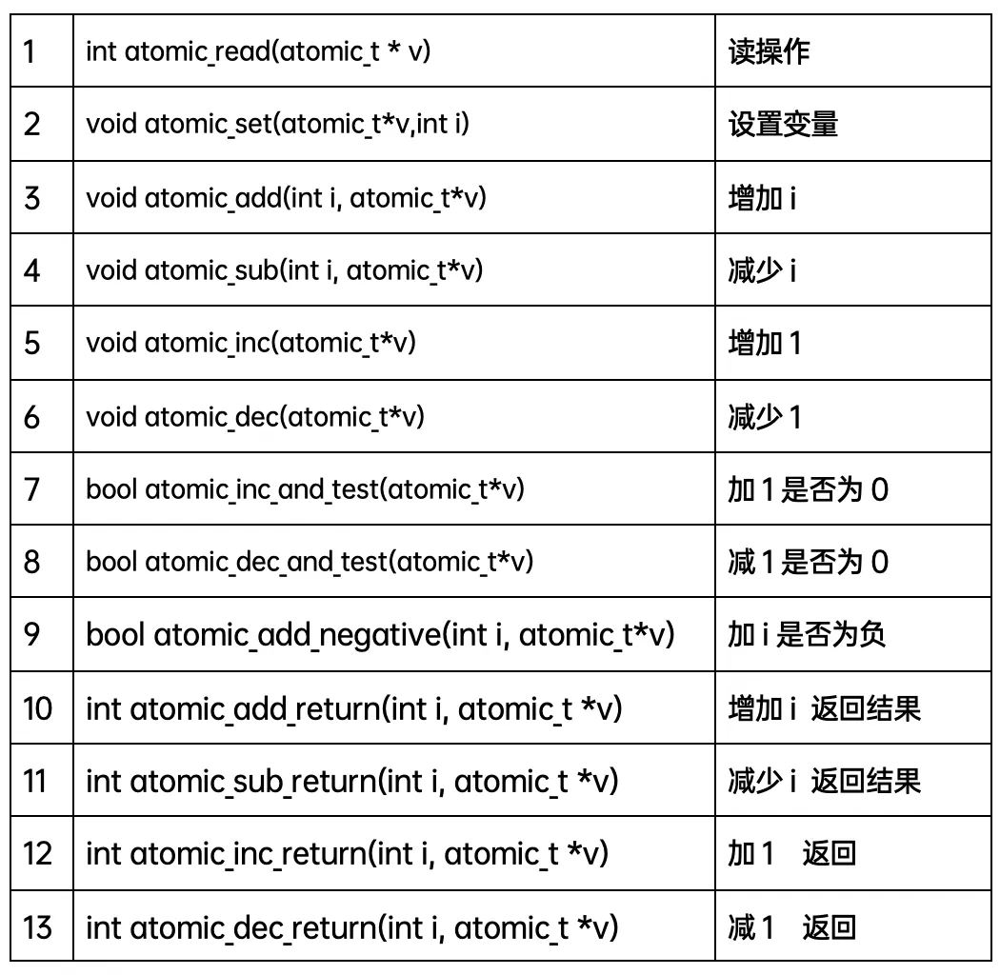

## 自旋锁

**基于忙等原则**的**针对多处理器**的同步机制，它只允许唯一的一个执行路径持有自旋锁，其他路径都不挂起的等待获取自旋锁。

### 一般自旋锁

```c
typedef struct {//IA64的实现
	volatile unsigned int lock;//计数，为1代表可用状态
} arch_spinlock_t;

typedef struct raw_spinlock {
	arch_spinlock_t raw_lock;//自旋锁的实际实现，与体系结构相关
} raw_spinlock_t;
```

#### 一般接口(宏)

```c
spin_lock_init(lock)  //声明自旋锁是，初始化为锁定状态
spin_lock(lock)//锁定自旋锁，成功则返回，否则循环等待自旋锁变为空闲
spin_unlock(lock)//释放自旋锁，重新设置为未锁定状态
spin_is_locked(lock)//判断当前锁是否处于锁定状态。若是，返回1.
spin_trylock(lock)//尝试锁定自旋锁lock,不成功则返回0，否则返回1
spin_unlock_wait(lock)//循环等待，直到自旋锁lock变为可用状态。
spin_can_lock(lock)//判断该自旋锁是否处于空闲状态。
```

#### 中断支持接口(宏)

为了避免持有锁的进程被中断打断，而中断也需要锁而造成**死锁**的情况出现。在多处理器系统中，当锁定一个自旋锁时，需要首先禁止内核态抢占，然后尝试锁定自旋锁，在锁定失败时执行一个死循环等待自旋锁被释放；当解锁一个自旋锁时，首先释放当前自旋锁，然后使能内核态抢占。当系统是单处理器系统时，自旋锁的加锁、解锁过程分为别退化为禁止内核态抢占、使能内核态抢占。

```c
spin_lock_irq(lock)//关中断、锁定自旋锁
spin_unlock_irq(lock)//释放自旋锁、开中断
spin_trylock_irq(lock)//能锁定自旋锁就关中断并获取自旋锁，否则直接返回
    
spin_lock_irqsave(lock, flags)//保存标志寄存器至flag、关中断、锁定自旋锁
spin_unlock_irqrestore(lock, flags)//释放自旋锁、开中断、从flag恢复到标志寄存器
spin_trylock_irqsave(lock)//能锁定自旋锁就就关中断并获取自旋锁，否则直接返回
    
spin_lock_bh(lock)//关软中断、锁定自旋锁
spin_unlock_bh(lock)//释放自旋锁、开软中断
spin_trylock_bq(lock)//能锁定自旋锁就关软中断、锁定自旋锁
```

性能：`spin_lock > spin_lock_bh > spin_lock_irq > spin_lock_irqsave`。

安全性：`spin_lock_irqsave > spin_lock_irq > spin_lock_bh >spin_lock`。

## 读写锁


### 读写自旋锁

允许**多个读者进程同时进入**临界区或一个**写者独占进入**临界区，交错访问同一个临界资源，提高了系统的并发能力，提升了系统的吞吐量。

```c
typedef struct {
	volatile unsigned int read_counter	: 31;
	volatile unsigned int write_lock	:  1;
} arch_rwlock_t;

typedef struct {
	arch_rwlock_t raw_lock;
} rwlock_t;

DEFINE_RWLOCK(lock) //声明读写自旋锁lock，并初始化为未锁定状态
write_lock(lock) //以写方式锁定，若成功则返回，否则循环等待
write_unlock(lock) //解除写方式的锁定，重设为未锁定状态
read_lock(lock) //以读方式锁定，若成功则返回，否则循环等待
read_unlock(lock) //解除读方式的锁定，重设为未锁定状态
    
//中断支持接口(宏)与一般锁接口相似
```

### 顺序自旋锁

用于**解决读写锁由于存在大量的读者而造成写者饿死**的问题，在对某一共享数据**读取时不加锁，写的时候加锁**。所以**只有写者之间相互互斥、读者之间、读写者之间不互斥**，读者在写者写时任然可以读取数据，但是为了保证读取的过程中不会因为写入者的出现导致该共享数据的更新，需要**依赖顺序值`seqcount`**：写者在**写之前会改变`seqcount`**，读取者在开始读取前和读取完成后**两次并比较**读取该`sequence`，如果两者不一致则本次读取无效。

```c
typedef struct seqcount {
	unsigned sequence;
} seqcount_t;

typedef struct {
	struct seqcount seqcount;//用于同步写者访问的顺序以更新读者访问
    spinlock_t lock;//实现写操作之间的互斥
} seqlock_t;

seqlock_init(seqlock) //初始化为未锁定状态
read_seqbgin()//读取seqcount值
read_seqretry() //判断当前seqcount是否与seqcount一致
write_seqlock(lock) //尝试以写锁定方式锁定顺序锁
write_sequnlock(lock) //解除对顺序锁的写方式锁定，重设为未锁定状态。
    
//中断支持接口(宏)与一般锁接口相似
```

**NOTE**：要求被保护的**共享资源不含有指针**，因为写者可能使得指针失效，但读者如果正要访问该指针，将导致OOPs。如果读者在读操作期间，写者已经发生了写操作，那么，读者必须重新读取数据，以便确保得到的数据是完整的。顺序锁**适用于读多写少**的情况。

### [RCU（Read-Copy Update）](http://www.wowotech.net/kernel_synchronization/rcu_fundamentals.html)

Read-Copy Update是内核中提供的一种**免锁的同步机制**，它将读进程和写入进程访问的共享**数据放在指针p中**，读进程通过p读数据，写进程通过修改p写数据，从而允许多个读者和多个写者同时访问被保护的数据。要想确保RCU机制的正确使用所有的RCU相关操作都应该使用内核提供的RCU API函数。


#### 临界区管理

RCU不基于锁、其字段是耦合在进程描述符和CPU变量中的，是一种与系统强耦合的同步机制，RCU负责管理进程内所有的临界区，进程通过调用`rcu_read_lock`与`rcu_read_unlock`标记读者临界区，通过`rcu_assign_pointer`、`list_add_rcu`将数据纳入保护区，当写者copy出新数据时在读者全部退出临界区后，将新数据指针更新，旧数据将在垃圾收集器的检查中被释放，但存在延迟。

```c
void call_rcu(struct rcu_head *head,void (*func)(struct rcu_head *rcu));
```

#### 读者

读者**对指针的引用必须要在临界区中完成**，离开临界区之后不应该出现任何形式的对该指针的引用。在临界区内的代码**不应该被切换或导致任何形式的进程切换**（一般要关掉内核抢占，中断可以不关）。

#### 写者

所有写入者需要调用`call_rcu()`**向内核注册一个回调函数**（主要功能是释放老指针指向的内存空间，在内核里以链表组织着回调函数）。之后首先要重新分配一个新的内存空间做作为共享数据区。然后将老数据区内的数据**复制**到新数据区，并根据需要**修改**新数据区，最后在合适的时机用新数据区指针**原子的更新替换**掉老数据区的指针。

#### [释放机制](https://blog.csdn.net/fzubbsc/article/details/37736683)

老指针被新指针更新后**不能马上释放老指针**（可能某些CPU上有进程仅仅获取到老指针进入临界区而没有引用该指针），只有当内核确定**所有对老指针的引用都结束时**（**所有cpu都至少发生一次进程切换**，因为rcu临界区不允许进程切换，切换则意味着出了临界区、再进入一定是新指针）才会调用写者注册的回调释放老指针的空间。

#### 限制

①：RCU只保护动态分配并通过指针引用的数据结构

②：在被RCU保护的临界区中，任何内核路径都不能睡眠（经典实现中）

## 互斥锁

## 文件锁

```shell
lslocks#查看当前系统中的文件锁使用情况
```

### 先导概念

#### 文件锁

锁的最小粒度为文件。

#### 记录锁

锁的最小粒度为字节，可以只对文件中的部分字节进行加锁保护

#### 建议锁（Advisory locking）

也叫事务锁，是Linux**默认的锁**类型。一个进程可以忽略其他进程加的锁，直接对目标文件进行读写操作。因而，只有当前进程主动调用 `flock`去检测是否已有其他进程对目标文件加了锁，文件锁才会在多进程的同步中起到作用。建议锁只对主动检查和遵守规则的**合作进程**起作用。

#### 强制锁（Mandatory locking）

当有进程对某个文件上锁之后，其他进程即使不在操作文件之前检查锁，也会在提供强制锁支持的`open、read、write`等文件操作时无法绕开锁，**进程行为取决于所执行的操作模式和文件锁的类型**。

| 已加强制锁类型 | 阻塞读 | 阻塞写 | 非阻塞读 | 非阻塞写 |
| :------------: | :----: | :----: | :------: | :------: |
|      读锁      | 正常读 |  阻塞  |  正常读  |  EAGAIN  |
|      写锁      |  阻塞  |  阻塞  |  EAGAIN  |  EAGAIN  |

此外Linux还引入了两种强制锁的变种形式：**共享模式强制锁（share-mode mandatory lock）和租借锁（lease）**。

##### 共享模式锁

其他进程打开加上了共享模式强制锁的文件的时不能与该文件的共享模式强制锁所设置的访问模式相冲突；可以用于某些私有网络文件系统；可移植性不好。

##### 租借锁

租借锁**保护整个文件**，当进程尝试打开一个被租借锁保护的文件时，该进程会被阻塞，同时，在一定时间内拥有该文件租借锁的进程会收到一个信号。收到信号之后，拥有该文件租借锁的进程会首先更新文件，从而保证了文件内容的一致性，接着，该进程释放这个租借锁。如果拥有租借锁的进程在一定的时间间隔内没有完成工作，内核就会自动删除这个租借锁或者将该锁进行降级，从而允许被阻塞的进程继续工作。

### 实现

#### [文件锁](https://www.cnblogs.com/hnrainll/archive/2011/09/20/2182137.html)

每当创建一把文件锁的时候，系统就会实例化一个**`struct file_lock`**对象（记录锁基本信息），最后把这个`file_lock`对象插入到被锁文件的**`inode::i_flock`链表**中，就完成了对该文件的加锁功能。由于同一个文件只有一个`inode`节点（Linux没有v节点只有i节点），多进程共享同一个文件相当于就共享同一个锁链表，链表上**节点代表是一把锁**（读锁和写锁），节点存在时表示没有解锁。通过共享锁链表就实现了文件的互斥和共享，其它进程想要对同一个文件加锁，那么它在将`file_lock`对象插入到`inode::i_flock`之前，会遍历该链表，如果没有发现冲突的锁，就将其插入到链表尾，表示加锁成功，否则失败。

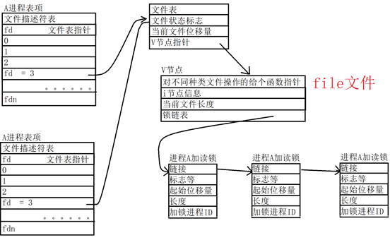

```c
struct file_lock {//一把文件锁
	struct file_lock *fl_blocker;/* The lock, that is blocking us */
	struct list_head fl_list;//文件锁链表
	struct hlist_node fl_link;/* node in global lists */
	struct list_head fl_blocked_requests;/* list of requests with ->fl_blocker pointing here*/
	struct list_head fl_blocked_member;	/* node in->fl_blocker->fl_blocked_requests*/
    fl_owner_t fl_owner;//锁拥有者的files_struct
	unsigned int fl_flags;//锁的标识（租赁锁，阻塞锁，POSIX锁，FLOCK锁）
	unsigned char fl_type;//锁类型（共享锁，独占锁）
	unsigned int fl_pid;//拥有这把锁的进程号
	int fl_link_cpu;/* what cpu's list is this on? */
	wait_queue_head_t fl_wait;//阻塞进程的等待队列
	struct file *fl_file;//指向文件对象
	loff_t fl_start;//锁区域起始位置
	loff_t fl_end;//锁区域终止位置
	struct fasync_struct *	fl_fasync;//用于租借暂停通知
	unsigned long fl_break_time;//租借的剩余时间，默认45s，可通过procfs改变
	unsigned long fl_downgrade_time;//锁降级等待时间
	//... 其他数据成员
} ;
```

#### POSIX实现

##### 数据结构

```c
struct flock {
	short l_type;//锁类型：共享读锁F_RDLCK，独占性写锁F_WRLCK，解锁F_UNLCK
	short l_whence;//作为l_start的参照点，可以取SEEK_SET(文件开头), SEEK_CUR, SEEK_END
	off_t l_start;//相对l_where的偏移点，从此点开始的字节加锁
	off_t l_len;//以字节为单位的要加锁的区域字节长度
	pid_t l_pid;/* PID of process blocking our lock(set by F_GETLK and F_OFD_GETLK) */
	//...其他数据
};
```

锁可以从**除文件头之外的任何位置（包含文件尾甚至文件尾）开始**。加锁长度`l_len=0`代表锁的范围可以扩大到最大可能偏移量，这意味着不管向文件中追加多少数据，它们都可以处于锁的范围内，而且此时加锁的起始位置`l_where`可以任意。

##### 操作

```c
// 库函数lockf只是对fcntl的封装
int fcntl(int fd, int cmd, .../*struct flock *flockptr*/);
//@Parameters:
//	fd: 待操作的文件描述符
//	cmd: 具体操作，F_GETLK, F_SETLK, F_SETLKW中的一个
//		F_GETLK: 检查一个文件上是否被锁住，如果是就可以获取该文件锁，并存放于fcntl()的第三个参数lock里
//		F_SETLK: 获取或释放由flockptr所描述的锁，如果flockptr想获取锁而内核阻止获取该锁，函数返回错误
//		F_SETLKW(ait):F_SETLK的阻塞版本，如果进程无法获取锁则进入休眠直到进程获得锁或者信号中断
//	flockptr： 可变参数用于文件锁时的具体参数
//@Return value
//	返回值：若成功返回值依赖于cmd；失败返回-1
```

#### [BSD实现](https://zhuanlan.zhihu.com/p/25134841)

```c
#define LOCK_SH 1 /* Shared lock.  */
#define LOCK_EX 2 /* Exclusive lock.  */
#define LOCK_UN 8 /* Unlock.  */
#define LOCK_NB 4 /* Don't block when locking.  */

int flock(int fd, int operation);
//@Parameters:
//	fd: 待操作的文件描述符
//	operation: 取LOCK_SH(共享锁)、LOCK_EX（独占锁）或LOCK_UN（无锁），支持与LOCK_NB取或
//@Return value
//	返回值：若成功返回0；失败返回-1
```

#### [比较](https://www.cnblogs.com/charlesblc/p/6287631.html)

~~两种锁的实现都是在`inode`上进行加锁，但是BSD认为所的持有者是系统级打开文件表、而POSIX认为是进程持有了锁。[参考来源](https://yxkemiya.github.io/2019/08/19/file-lock/) 此处有问题(https://www.cnblogs.com/charlesblc/p/6287631.html)~~

| 实现  |   API   |                锁类型                |  NFS   |         进程中止         |
| :---: | :-----: | :----------------------------------: | :----: | :----------------------: |
|  BSD  | `flock` |    文件锁；共享锁/排它锁；建议锁     | 不支持 | 释放进程建立的所有文件锁 |
| POSIX | `fcntl` | 文件锁/记录锁；排它锁；建议锁/强制锁 |  支持  | 释放进程建立的所有文件锁 |

①：两种机制在遍历`inode::i_flock`链表**发现存在PID相同的锁时的处理机制不同**：`fcntl`允许同一个进程对同一个文件多次加同样一把锁，而解锁只需一次完成；`flock`则不支持这样操作（共享锁可以多次加锁而除外）。

②：关闭一个描述符时：`fcntl`会关闭**本进程设置**的关于本描述符的一切文件锁，而`flock`不同。

③：锁继承：

### 标准IO库文件锁

其结构都是**在用户态的FILE结构体中实现**的，而非内核中的数据结构来实现，这导致**标准IO文件锁无法在多进程环境中使用、只能处理一个进程中的多个线程之间共享的FILE \*的进行文件操作**。

主要面临以下三个问题：①进程在`fork`的时候会复制一整套父进程的地址空间，这将导致子进程中的FILE结构与父进程完全一致（父进程如果加锁，子进程也将持有这把锁）；②由于父子进程地址空间相互独立的，子进程也无法通过FILE结构体检查别的进程的是否加了标准IO库提供的文件；③如果线程内部使用`fopen`重新打开文件，那么返回的FILE *地址不同与其他线程不同，也起不到线程的互斥作用。

```c
void flockfile(FILE *filehandle);
int ftrylockfile(FILE *filehandle);
void funlockfile(FILE *filehandle);
```

### NOTE

①、在单个进程下，如果在已有的锁上加新锁，则新锁会替换旧锁，也不管锁是何种类型。在多进程下遵循读写锁的一般规则。

②、[强制性锁](http://blog.jobbole.com/16882/)：`fcntl`支持强制锁需要对一个特定文件打开其设置组ID位(`S_ISGID`)，并关闭其组执行位(`S_IXGRP`)，此外要在挂载文件系统时使用`mount -o mand`启用机制。虽然Linux内核虽然提供了强制锁的能力，但**其对强制性锁的实现是不可靠的**，**在Linux环境下`flock`和`fcntl`在是锁类型方面没有本质差别**（都是建议锁而非强制锁）。

③、对同一个文件使用上面两种机制的锁时互不影响 。

# 内存布局

## [内存管理](https://blog.csdn.net/gatieme/category_6393814.html)


| 简称 |       全程        |    来源     |        内容         |             数据结构              |
| :--: | :---------------: | :---------: | :-----------------: | :-------------------------------: |
| PFN  | Page Frame number | 物理地址/4K |      页帧编号       | `typedef struct _MMPFN{} MMPFN`gg |
| PTE  | Page Table Entry  |             | 指向页帧编号+页属性 |                                   |

**PFN数据库**：将每一个页帧的属性地址提取出来组成一数据结构，将连续的PFN组织在一起被称为页帧数据库。


### 3层管理架构

#### 内存架构

对于多个物理内存和多个CPU核心的组织目前主要为**UMA**（Uniform Memory Access）和**NUMA**（Non-Uniform Memory Access）两种架构。**UMA（均匀存储器存取）**架构下内存作为一个整体，每个CPU访问内存的方式和效果是完全相同的。而**NUMA（非均匀存储器存取）**架构下，内存被分为多个cell，每个核访问靠近它的本地内存的时候就比较快，访问其他CPU的内存或者全局内存的时候就比较慢。

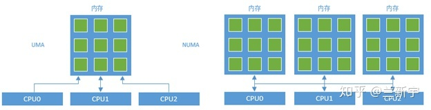

#### 管理层次

Linux系统将UMA架构抽象为**[只有一个内存节点的NUMA架构](https://zhuanlan.zhihu.com/p/68465952)**，基于NUMA架构将对内存的[管理划分成三个层次](https://zhuanlan.zhihu.com/p/68473428)，分别是Node、Zone、Page。

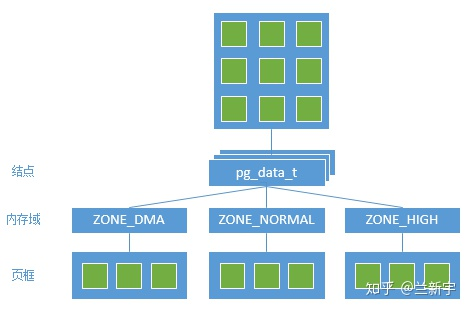

|       层次       |                             说明                             |
| :--------------: | :----------------------------------------------------------: |
| Node（存储节点） | CPU被划分成多个节点，每个节点都有自己的一块内存，可以参考NUMA架构有关节点的介绍 |
|  Zone（管理区）  | 每一个Node（节点）中的内存被划分成多个管理区域（Zone），用于表示不同范围的内存 |
|   Page（页面）   | 每一个管理区又进一步被划分为多个页面，页面是内存管理中最基础的分配单位 |


##### NODE

###### 数据结构

```c
enum {
	ZONELIST_FALLBACK,//本node分配不到内存时可选的备用zones
#ifdef CONFIG_NUMA
	ZONELIST_NOFALLBACK,//本node的zones
#endif
	MAX_ZONELISTS
};

typedef struct pglist_data {
	int node_id;//本node的id
	unsigned long node_start_paddr;//本node的起始物理地址
     struct pglist_data *node_next;//指向由多个node构成的NUMA单向链表pgdat_list中的下一个节点
     int nr_zones;//此nodee含有的zone数量
     struct zone node_zones[MAX_NR_ZONES];//包含各个zone结构体的数组
     struct zonelist node_zonelists[MAX_ZONELIST];//包含了MAX_ZONELIST个zonelist，详情见上一个枚举
     unsigned long node_size;//node含有的物理页的个数
     struct page *node_mem_map;//指向node中所有struct page构成的mem_map数组
     spinlock_t lru_lock;//
    //...，其他数据结构
} pg_data_t; 
```

##### [ZONE](# 物理地址布局)

###### 数据结构

为了更好的利用硬件cache来提高访问速度，struct zone中还有一些填充位，用于帮助结构体元素的cache line对齐。

```c
struct zone {
     spinlock_t lock;
     unsigned long spanned_pages;//这个zone含有的总的内存页数目
     unsigned long present_pages; 
     unsigned long nr_reserved_highatomic;//为某些场景预留的内存页数目
     atomic_long_t managed_pages;//由伙伴系统管理的内存页数目
     struct free_area free_area[MAX_ORDER];//free list空闲链表构成的可供分配的内存页数目
     unsigned long _watermark[NR_WMARK];//存放内存回收时的阈值，WMARK_LOW、WMARK_MIN、WMARK_HIGH
     long lowmem_reserve[MAX_NR_ZONES];//给更高位的zones预留的内存
     atomic_long_t vm_stat[NR_VM_ZONE_STAT_ITEMS];//zone的内存使用情况的统计信息，传递给/proc/zoneinfo
     unsigned long zone_start_pfn;//zone的起始物理页面号
     struct pglist_data *zone_pgdat;//指向这个zone所属的node
     struct page *zone_mem_map;//指向由属于本zoned的struct page构成的mem_map数组
    //...，其他数据结构
} 
```


##### PAGE

###### 数据结构

`struct page`描述和管理每一个`4KB`的物理内存**不关注这段内存中的数据变化**。在实际的`struct page`中为了节省内存使用了大量的`union`结构，使得同一个元素在不同的场景下有不同的意义，以下的数据结构只是抽象描述。

```c
struct page {//描述每一个物理内存页
    unsigned long flags;//页帧的状态或者属性，高8位存储了它所属的zone和node。
    atomic_t count;//该页正在被某个进程或者内核使用的引用计数
    atomic_t _mapcount;//该页被映射的个数，即有多少个PTE指向本PFN
    struct list_head lru;//供内存回收的LRU链表
    struct address_space *mapping;//如果页属于文件则指向文件inode对应的address_space，匿名文件同理
    unsigned long index;//该页在一个文件中的以页为单位的偏移，匿名文件同理
    //...，其他数据结构
}
```


### [Buddy伙伴系统（解决外碎片）](https://blog.csdn.net/gatieme/article/details/52420444)

把所有的空闲页面分为11 个块组，每组由若干个大小相同的块（每块有$2^x, x=[0,10]$个**页**）构成链，每个不同大小的块组又用链表组织起来。以页为单位管理和分配内存，通过监视内存的分配情况，解决外碎片的问题。


#### 分配

**原则：**保证在内核只要申请一小块内存的情况下，不会从大块的连续空闲内存中截取一段过来，从而保证了大块内存的连续性和完整性。

分配的机制和STL中的分配器机制相同，在所有块组中找到大于等于需分配大小（会自动调整为 不小于要求的幂次个页面）的最小内存块。将该内存块分配出去，块中剩余的的页面插入到适当的空闲块组中。无法完成分配就产生错误信号。


#### 释放

将释放的空闲块中的**伙伴块（大小相同且物理地址连续的两个块）合并**成一个更大的快，迭代重复这一过程知道无法合并。

### [Slab分配机制（解决内碎片）](https://kernel.blog.csdn.net/article/details/52705552)

==此部分主要是思想的描述，由于slab有多种实现方法，故下文中的数据结构描述只是抽象的描述==

Slab分配器向外部提供的接口为**`kmalloc()、kfree()`**，它**以伙伴系统为基础、以字节为分配单位、基于对象的**为**经常分配并释放的小对象**提供内存管理和**缓存**机制。Slab分配器提供了**专用slab**（负责为`m_area_struct、mm_struct`等特定结构体分配内存）和**通用slab**两种（`sudo cat /proc/slabinfo`中名为`kmalloc-xxx`的为通用型slab）分配，两种`slab`的分配和管理机制完全相同。

#### 数据结构

##### `struct slab/page`

slab指**一个或多个连续的物理页构成的内存空间**（每个slab的页数目为$2^{kmem\_cache::gfporder}$），它存储了实际的有效对象（个数为`kmem_cache::num`），内核对每个slab结构的描述借助**`struct page`实现**（`page`结构体包含了大量的`union`，既可以描述页又可以描述`slab`）。不同分配状态的单个slab被组织成一个链表，当一个slab的分配状态出现变化时，这个slab将会进入到别的链表中。

|  slab分配状态   |                意义                |
| :-------------: | :--------------------------------: |
|  `slabs_full`   |        所有对象被标记为使用        |
|  `slabs_free`   |        所有对象被标记为空闲        |
| `slabs_partial` | 有的被标记为使用，有的被标记为空闲 |

每个slab内部空间可以大致分为管理区和数据区（存放有效数据）。灰色部分是着色区，绿色部分是slab管理结构，黄色部分是空闲对象链表的索引，红色部分是对象的实体。

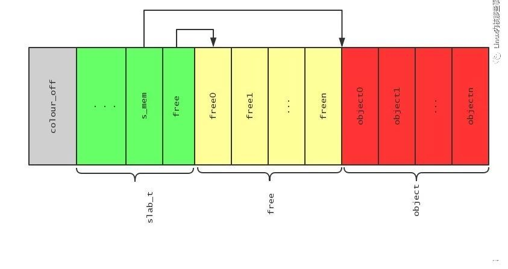

管理性数据中比较重要的时`s_mem`和`kmem_bufctl_t＼freelist`指针。`s_mem`指向这段连续页框中第一个对象；后者本质上是一个空闲对象链表，用于描述下一个可用对象序号。

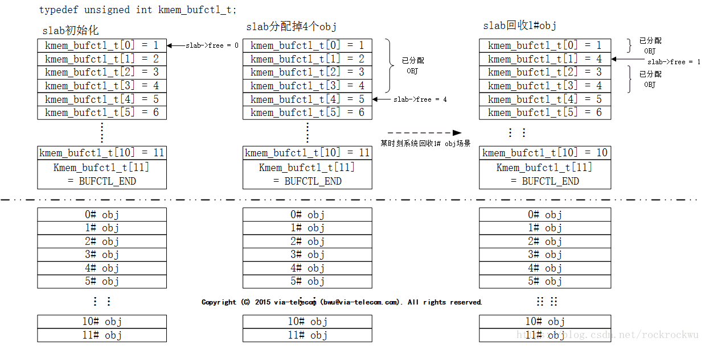

##### `struct kmem_cache`

```c
struct kmem_cache {//每类对象一个实例
    unsigned int num;			//每个slab中的对象数量
    unsigned int gfporder;		//每个slab中包含的页框的数量的幂次，即每个slab有2^gfporder个页
    const char *name;			//该kmem_cache对应的类的名称，如task_struct
    struct kmem_cache_node *node[MAX_NUMNODES];//元素指向不同分配状态的slab
	void (*ctor)(void *obj);	//该kmem_cache对应的类的对象的初始化函数
	struct array_cache *cpu_cache;//array_cache数组，每个CPU核心对应一个数组元素
	……
};
```

Slab分配器的主要管理结构，每个`kmem_cache`管理不同大小的基本对象，其中包含了专用slab和通用slab（其空间中的基本分配大小为｛$2^x,x=[5,12]$｝字节）。

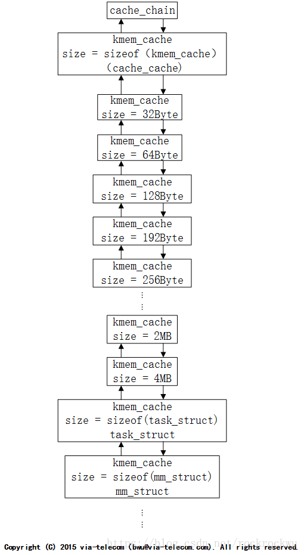

`kmem_cache`内部的**`kmem_cache_node[MAX_NUMNODES]/(kmem_list3)`**数组记录了该类几种不同分配状态的slab构成的链表，开始时这三个链表都为空，只有在申请对象时发现没有可用的slab时才会创建一个新的slab加入到链表中。

##### `struct kmem_cache::array_cache`

```c
struct array_cache {	//每个CPU核心一个实例
    unsigned int avail; //当前可用对象的数目.
    unsigned int limit; //entry中保存的最大的对象的数目
    unsigned int batchcount; //可用entry为空时从slab中调入或entry满时调入slab时的操作的对象的个数
    unsigned int touched;	 //是否在收缩后被访问过
    void *entry[];		//伪数组，初始没有任何数据项，之后会增加并保存释放的对象指针
}
```

对应于**每个CPU核心存在一个实例**，该实例保存了对应CPU核心上最后释放的对象。

##### 整体组织

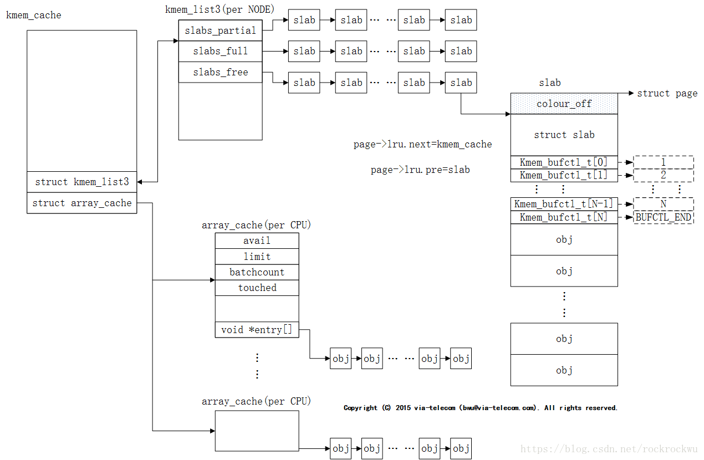

#### 管理

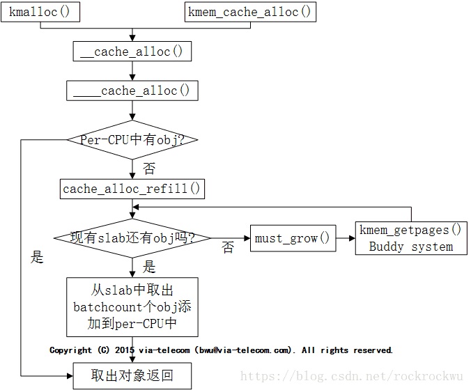

 **分配**：**优先从array_cache的entry中按LIFO原则**（最后的对象很可能还在硬件cache）。如果`entry`为空，则说明是第一次从`array_cache`中分配obj或者是`array_cache`中的所有对象都已分配，所以需要先从`kmem_cache`的`kmem_list3`中取出`batchcount`个对象，把这些对象全部填充到entry中，然后再分配。

**释放**：**优先释放到`kmem_cache::array_cache`中**。只有`kmem_cache::array_cache`中的对象数量超过了上限`kmem_cache::limit`，系统才会将`kmem_cache::array_cache::entry`中的前`kmem_cache::batchcount`个对象搬到`kmem_cach::kmem_list3`中。当slab数量太多时，`kmem_cache`会将一些slab释放回伙伴系统中。

## 物理地址布局

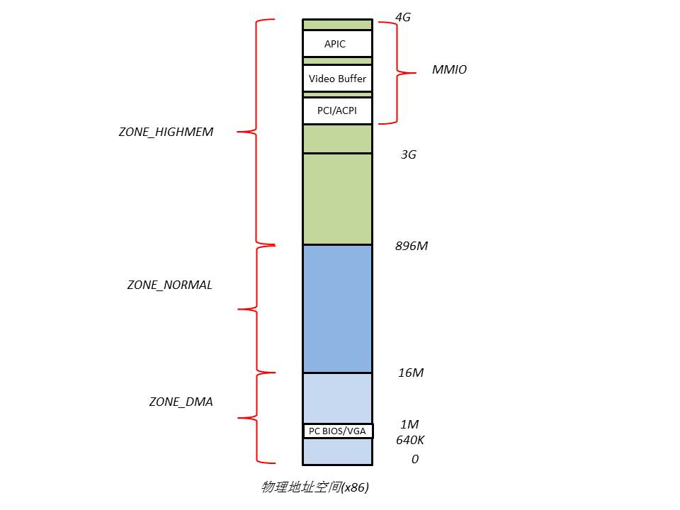

### ZONE_DMA（0~16M）

由于**DMA不经过MMU直接使用物理内存**地址访问内存，而且**需要连续的缓冲区**，所以必须为DMA划分一段连续的物理地址空间。因此内核在物理内存中开辟专门的ZONE_DMA区域**专门供I/O设备的DMA**使用。此区域也被称为**内存空洞**，CPU对该区域地址的**访问请求不会到达内存而会被自动转发到相应的IO设备**。

### ZONE_NORMAL（16M~896M）

内核**能够直接使用**。

### [ZONE_HIGHMEM（896M~结束）](https://www.zhihu.com/question/280526042)

内核**不能直接使用**此区域的内容，对此区域的访问需要临时建立映射关系，

## 虚拟地址布局

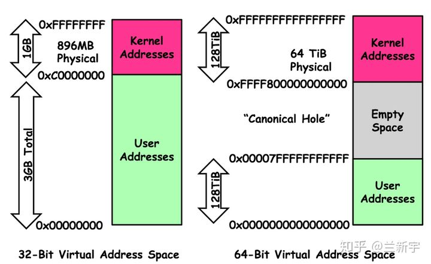

### 位数与寻址空间

#### 寻址空间

指的是 CPU 对于内存寻址的能力。计算机对内存的寻找范围由**总线宽度**（处理器的地址总线的位数）决定的，也可以理解为 **CPU 寄存器位数**，这二者一般是匹配的。地址总线为 N 位（N 通常都是 8 的整数倍；也说 N 根数据总线）的 CPU 寻址范围是$2^NB$。目前IA32可使用的地址线是36个，可使用的最大物理地址是$2^{36}B$，折合64GB，可用的地址空间是4GB。Intel® 64地址线是46个，最大的物理地址是$2^{46}B$，折合64TB，可用地址空间也是这么大

#### 位数

CPU一次能够处理的二进制的位数。

### `32bit`布局

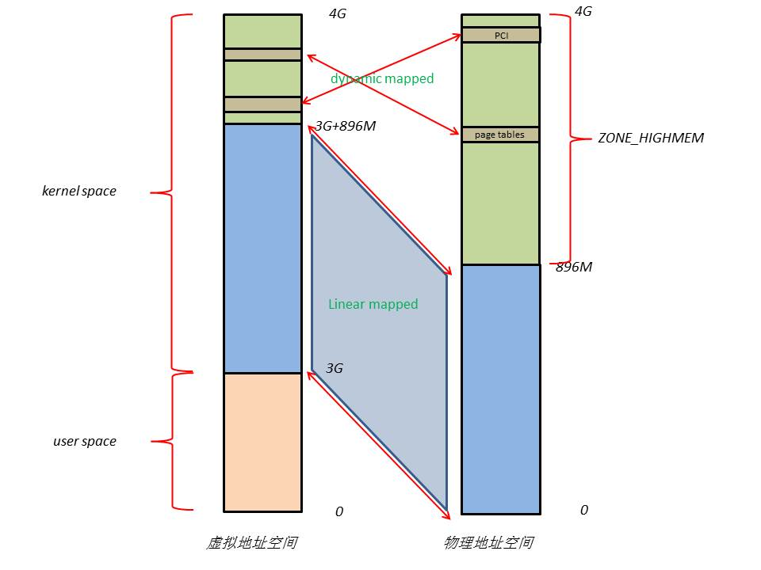

### `64bit`布局

配备64位处理器的64位操作系统的**可寻址的地址长度一般没有64b**，造成这个现象有两个原因，一是目前的64位处理器的地址线位数的设计并不是64位（因为并不需要如此之大），二是指令集中地址部分的位数。目前64位处理器的寻址能力已经足够大，因此Linux在64bit下的内存布局下**用户虚拟空间不再挨着内核虚拟空间**，而是分别占据底部和顶部，中间空出来的区域可以辅助进行地址有效性的检测。

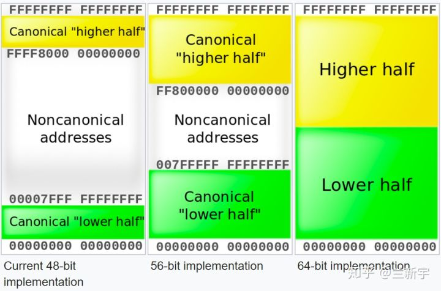

此时内核的虚拟地址空间已经足够大，当它要访问所有的物理内存时可以直接映射，不再需要`ZONE_HIGHMEM`动态映射机制。

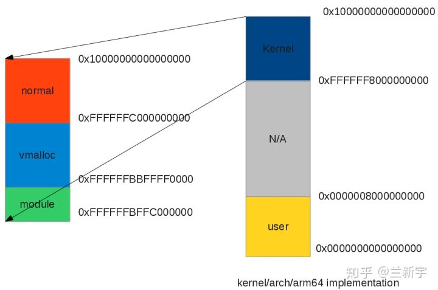

## 物理地址与虚拟地址

由于开启了分页机制，**内核需要访问全部物理地址空间**的话，必须先建立映射关系，然后通过虚拟地址来访问。在32bit Linux中内核简化了分段机制（Intel由于历史原因必须支持分段），将最高的1GB虚拟内存空间作为内核空间（内核对应的虚拟地址空间对应的物理内存会**常驻内存**，不会被OS换出到磁盘等设备，**所有的进程共享内核空间地址**），对内核空间的访问将受到硬件保护(0级才可访问)，低3GB虚拟内存空间作为用户空间（包含代码段、全局变量、BSS、函数栈、堆内存、映射区等）供用户进程使用（3级可访问）。


### 多级页表寻址

32bit Linux采用了3级页表$[PGD(16b)|PMD(4b)|PTE(4b)|Offset(12b)]$。


64bit采用了4级页表$[PG_{lobal}D|PU_{pper}D|PM_{iddle}D|PTE|Offset]$。


## [内核空间布局](https://blog.csdn.net/qq_38410730/article/details/81105132)

内核为了能够访问所有的物理地址空间，就要**将全部物理地址空间映射到的内核线性空间**中。于是内核将0~896M的物理地址空间**一对一映射**到自己的线性地址空间（对应`ZONE_DMA`和`ZONE_NORMAL`区域）中，这样它便可以随时访问里的物理页面。而由于内核的虚拟地址空间的限制，内核按照常规的映射方式不能访问到896MB之后的全部物理地址空间（即**`ZONE_HIGHMEM`**区域），在32位Linux下，内核采取了**动态映射**的方法，即按需的将`ZONE_HIGHMEM`里的物理页面映射到内核地址空间的最后128M线性地址空间里，使用完之后释放映射关系，循环使用这128M线性地址空间以映射到其他所有物理页面。[来源](https://blog.csdn.net/ibless/article/details/81545359) [来源](https://blog.csdn.net/farmwang/article/details/66976818?utm_source=debugrun&utm_medium=referral)


### 直接/线性映射区域（`896MB`）

在此段（`normal memory`）申请地址需要使用**`kmalloc()`**函数，该函数会在直接映射区开辟出虚拟连续且物理上都连续（可以更好的利用内存访问的局部性、**分配更快**（由于页表的原因）……[其他优点](https://zhuanlan.zhihu.com/p/68501351)）的地址空间。

#### 低16MB

对应着物理地址空间中的**`ZONE_DMA`区域**。

#### 中880MB

此段对应着物理地址空间中的**`ZONE_NORMAL`区域**，内核会将**频繁使用的数据**（内核代码段、内核数据段、内核`BSS段、GDT、IDT、PGD、mem_map`数组等）放置在此段**直接使用**。

### 动态映射区域（`128MB`）

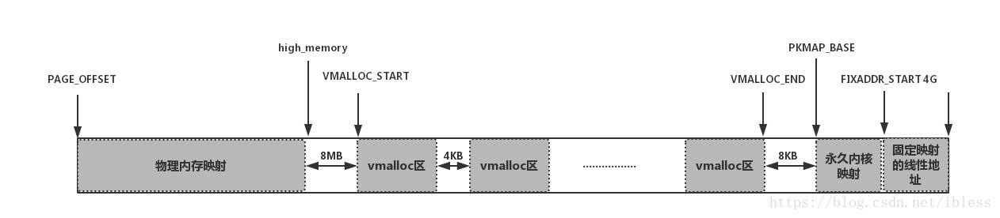

此段内也叫**高端内存**（若**机器安装的物理内存超过内核虚拟地址空间范围**，就会存在高端内存，高端内存只和逻辑地址有关系）。在高端内存最前面留有用来和`normal memory`做间隔的8MB区域，这部分间隔不作任何地址映射，相当于一个做**安全保护的内存空洞**（防止不正确的越界内存访问，因为此处没有进行任何形式的映射，如果进入到空洞地带，将会触发处理器产生一个异常），**事实上所有的这样的内存空洞都是用来作安全防护的**。

通过借助128MB的逻辑地址空间和**动态映射**的方法可以使Linux内核**使用到超出内核虚拟地址空间（1GB）的物理内存**，内核对这一块的地址进行访问时必须**借助页表**才能得到真正的物理地址。具体的动态映射方式有三种，这三种动态映射的方式分别使用三段不同的虚拟地址空间。

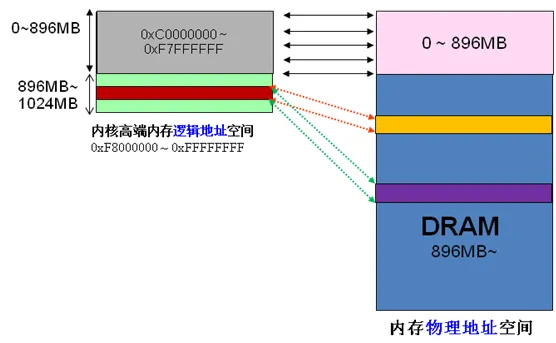

#### `vmalloc`区（**`120MB`**）：

即`VMALLOC_START`和`VMALLOC_END`之间的区域。在此区域的内存分配使用**`vmalloc()`**，将得到连续的虚拟地址空间，每一块被分配的空间都有一个对应的**`vm_struct`**结构进行管理。

#### 持久映射区（**`PKMap：4MB`**）：

在可持久内核映射区，可通过调用函数`kmap()`在物理页框与内核虚拟页之间建立长期映射。这个空间通常为4MB，最多能映射1024个页框，数量较为稀少，所以为了加强页框的周转，应及时调用函数`kunmap()`将不再使用的物理页框释放。

#### 固定映射区/临时映射区（**`FixMap：4MB`**）：

该段虚拟地址空间会被分配给多个CPU核心，每个CPU占用一块空间，在每个CPU占用的空间内部又会根据映射的目的再次分为多个小空间。对这一段内存的分配和使用借助**`kmap_atomic()`**完成。

## [用户空间段布局](https://www.cnblogs.com/fuzhe1989/p/3936894.html)

|  段分布  |                             内容                             | 分配方式 |           大小           | 运行态 |
| :------: | :----------------------------------------------------------: | :------: | :----------------------: | :----: |
|  保留段  |     0x08048000(x86下)：为了便于**检查空指针**的一段空间      |   静态   |         固定大小         |  用户  |
|  代码段  |    程序指令、**字符串常量**、虚函数表（**只读**、可共享）    |   静态   |        编译时确定        |  用户  |
|  数据段  |                  初始化的全局变量和静态变量                  |   静态   |        编译时确定        |  用户  |
|   BSS    |            未初始化的全局变量和静态变量（全为0）             |   静态   |        编译时确定        |  用户  |
|  映射段  |              动态链接库、共享文件、匿名映射对象              |   动态   |           动态           |  用户  |
|    堆    | 动态申请的数据、有**碎片**问题、[`brk()`函数](https://blog.csdn.net/shuzishij/article/details/86574927) |   动态   |       和栈共享上限       |  用户  |
|    栈    | 局部变量、函数参数与返回值、函数返回地址、调用者环境信息（如寄存器值） |   静态   | 和堆共享上限、**可设置** |  用户  |
| 内核空间 |      储操作系统、驱动程序、**命令行参数和环境变量**等……      |  动+静   |           定长           |  内核  |


Linux通过将每个段的起始地址赋予一个随机偏移量**`random offset`**来打乱内存布局（否则进程内存布局缺乏变化，容易被试探出内存布局）以加强安全性。

**代码段、数据段**：大小和内容在程序被编译后就被固定了在了目标文件之中，通常都被存储在预分配的连续内存之中。

**BSS段（Block Started by Symbol）**：大小在编译时固定（目标文件仅记录所需的大小，无实际数据），**实际数据只存在于内存之中**，内存中的内容由OS全部初始化为0。

**映射段（Memory Mapping Segment）**：Linux中通过`mmap()`系统调用，Windows中通过`creatFileMapping()/MapViewOfFile()`**动态创建**的区域。内核通过使用该区域（**内存映射**）可以避免内核空间和用户空间的文件拷贝，直接将文件内容直接映射到内存以实现**快速IO**。常被用来加载动态库、创建[匿名映射](https://www.jianshu.com/p/b24265a3a222)。在C库函数中，如果一次申请内存大于`M_MMAP_THRESHOLD(128K)`字节时，库函数会**自动使用映射段创建匿名映射**。

**栈**：Linux进程在运行过程中遇到栈满时会自动试图增加栈大小（上限是`RLIMIT_STACK(8MB)`），如果无法增加才会出现段错误。而只有[动态栈增长](http://lxr.linux.no/linux+v2.6.28.1/arch/x86/mm/fault.c#L692)（由`alloca()`完成）访问到未分配区域是合法的（白色区域）其它方式访问到未映射区域时都会引发一次页错误，进而导致段错误。

## [用户与内核的通信](https://www.write-bug.com/article/2143.html)

| 方式              | 依赖fs    | 不足                       | 优势                                                         |
| ----------------- | --------- | -------------------------- | ------------------------------------------------------------ |
| 内核启动参数      |           | 单向向内核、数据量小       | 在启动内核时就传递数据改变内核的启动方式                     |
| 模块参数和`sysfs` | `sysfs`   | 数据量小                   | 可在内核运行时传递数据，并可以动态的进行更改                 |
| `Sysctl`          | `procfs`  | 数据量小                   | 可在内核运行的任何时刻获取和改变内核的配置参数               |
| 系统调用          |           | 添加额外的系统调用要重编译 | 只需要调用系统调用函数即可进行数据传递                       |
| `Netlink`         |           | `netlink`接口变化速度太快  | 使用方式类似于`socket`的使用方式，支持大量数据传输、异步通信、多播 |
| `Procfs`          | `procfs`  | 不便于传输超页大小数据     | 方便的通过操作文件的方式进行数据传输。                       |
| `seq_file`        | `procfs`  | 单向向用户                 | 改进`procfs`数据量小的缺点使内核输出大文件信息更容易         |
| `debugfs`         | `debugfs` | 仅用于简单类型变量         | 专门设计用来内核开发调试使用，方便内核开发者向用户空间输出调试信息。 |

### 系统调用传参

用户进行系统调用时必须向内核传递一些参数，对于非指针的基础数据类型可以通过寄存器的拷贝直接实现，而对于特殊数据结构或者内存块内数据的传递需要借助指针实现，然而内核空间和用户空间**不能简单地使用指针传递数据**（尤其是有MMU的结构下），内核必须小心处理来自用户空间的指针，OS对于指针类型的数据的传递专门定义了``copy_to_user()、copy_from_user()`方法，该方法包含**验证和拷贝**两个步骤：

**验证**：是否是合法的用户空间地址、该地址是否已经分配了物理地址（处理缺页）。

**拷贝**：避免其他进程在运行的过程中修改了地址指向的用户空间的数据。

理论上，内核空间可以直接使用用户空间传过来的指针，即使要做数据拷贝的动作，也可以直接使用`memcpy`，事实上，在没有`MMU`的体系架构上，`copy_form_user`最终的实现就是利用了`memcpy`。但对于大多数有`MMU`的平台，情况就有了一些变化：用户空间传过来的指针是在虚拟地址空间上的，它指向的虚拟地址空间很可能还没有真正映射到实际的物理页面上。用户空间的缺页导致的异常会透明的被内核予以修复(为缺页的地址空间提交新的物理页面)，访问到缺页的指令会继续运行仿佛什么都没有发生一样。内核空间必须被显示的修复，这是由内核提供的缺页异常处理函数的设计模式决定的（其背后的思想后：在内核态中，如果程序试图访问一个尚未提交物理页面的用户空间地址，内核必须对此保持警惕而不能像用户空间那样毫无察觉。如果内核访问一个尚未被提交物理页面的空间，将产生缺页异常，这个时候内核会调用`do_page_fault`，因为异常发生在内核空间，`do_page_fault`的处理逻辑将调用`search_exception_tables`在`__ex_table`中查找异常指令的修复指令），正因为这样，`copy_from_user`的实现才会看起来有些复杂，当然性能方面提升也是它的复杂度提升的一个原因。[来源](https://www.cnblogs.com/rongpmcu/p/7662749.html)

## 段的管理

进程的多个段的连续地址空间构成多个独立的内存区域。Linux内核使用**`vm_area_struct`结构**（包含区域起始和终止地址、指向该区域支持的系统调用函数集合的**`vm_ops`指针**）来表示一个独立的虚拟内存区域，一个进程拥有的多个`vm_area_struct`将被链接接起来方便进程访问（少时用链表、多时用红黑树）。


# [交换空间](https://blog.csdn.net/qkhhyga2016/article/details/88722458)


## 过程概述

Linux会在内存充裕时将空闲内存用于缓存磁盘数据以提高I/O性能，在**内存紧张**（空闲页面小于所在`struct zone::_watermark[NR_WMARK]`中的`WMARK_LOW`时）**或内核线程`kswapd`周期性扫描**可能触发内存回收机制。在进程的地址空间中存在**具名页和匿名页两种内存页**，对于和文件系统中的文件绑定的具名页可以直接将脏页写回到磁盘上对应的文件上。而对于如`heap、stack`这样没有后备文件的匿名页，在开启`swap`支持后会**将`swap`分区作为匿名页的后备文件**进行内存回收。

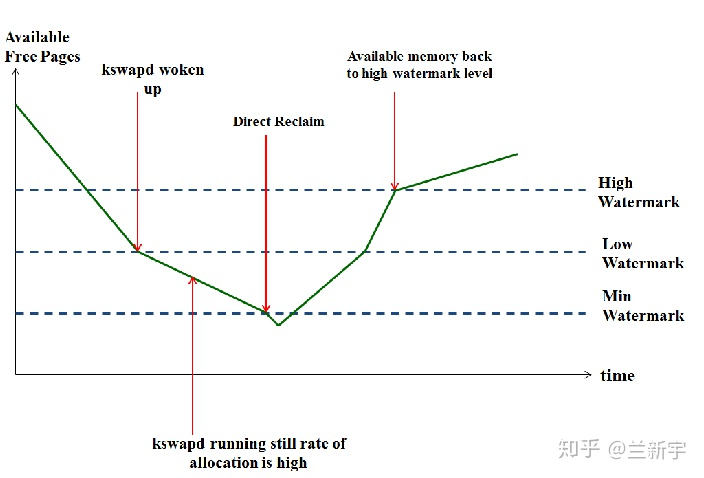

## 内核支持

交换空间既可以使用普通文件系统上的交换文件也可以使用磁盘交换分区，内核支持最大`MAX_SWAPFILES`个交换区，所有的交换区都在`struct swap_info_struct swap_info[MAX_SWAPFILES]`全局数组中，每个**交换区[`swap_info_struct`](http://elixir.free-electrons.com/linux/v2.6.11/source/include/linux/swap.h#L121)**都由一个（交换分区）或者多个（交换文件：因为文件系统有可能没把该文件全部分配在磁盘的一组连续块中）由`swap_extent`描述符表示的**交换子区**(swap extent)组成，每个子区对应一组**页槽**（在**磁盘上物理相邻**：可以减少在访问交换区时磁盘的寻道时间）。

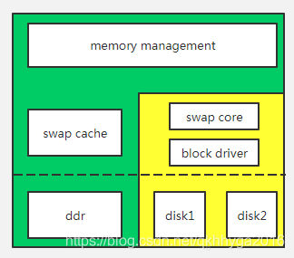

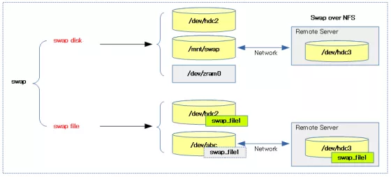

### 交换区

#### 组织结构

**页槽**：内核将每一个交换区中的空间按照页大小划分作为**基本管理单位**，每一个**页大小**的空间称为一个页槽。每个交换区的第0页槽存贮该交换区的信息不参与交换，有缺陷不可用的槽也会被标记。

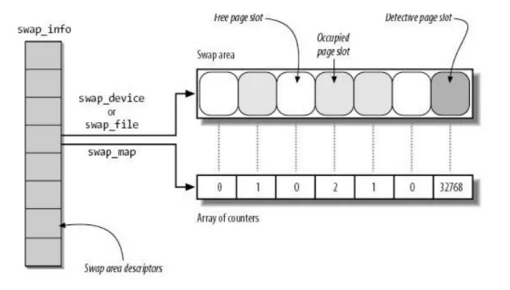

#### `swap_info_struct`

```c
enum {//flag字段的可能取值
    SWP_USED = (1 << 0),    /* is slot in swap_info[] used? */
    SWP_WRITEOK = (1 << 1),    /* ok to write to this swap?    */
    SWP_DISCARDABLE = (1 << 2),    /* swapon+blkdev support discard */
    SWP_DISCARDING = (1 << 3),    /* now discarding a free cluster */
    SWP_SOLIDSTATE = (1 << 4),    /* blkdev seeks are cheap */
    SWP_CONTINUED = (1 << 5),    /* swap_map has count continuation */
    SWP_BLKDEV = (1 << 6),    /* its a block device */
    SWP_FILE = (1 << 7),    /* set after swap_activate success */
                    /* add others here before... */
    SWP_SCANNING    = (1 << 8),    /* refcount in scan_swap_map */
};

struct swap_info_struct {//描述每一个交换区
	unsigned int flags;//交换区标志
	signed char	type;//交换区的名字，用于在全局变量swap_info[]中索引到本结构体
	spinlock_t sdev_lock;//保护交换区的自旋锁
	struct block_device *bdev;//存放交换区的块设备描述符
	int prio;// 交换区优先级
	unsigned long max;//交换区的大小，以页为单位
	int next;// 指向下一个交换区描述符

	int nr_extents;//组成交换区的子区数量
    struct swap_extent first_swap_extent;;//组成交换区的子区链表的头部，链表已被rbtree所取代
	struct swap_extent *curr_swap_extent;//上一次访问的swap_extent，每次访问后更新

	int pages;//实际可用页槽的个数
	unsigned int lowest_bit;//可用页槽起始位置
	unsigned int highest_bit;//可用页槽结束位置
	unsigned long inuse_pages;//交换区内已用页槽数
	unsigned short * swap_map;//指向计数器数组的指针，交换区的每个页槽对应一个数组元素

    struct file *swap_file;//指向swap分区的struct file结构体

	unsigned old_block_size;
    struct swap_cluster_list free_clusters;//优化SSD：主要为了损耗均衡而非速度
	unsigned int cluster_next;//优化SSD下性能的新增字段
	unsigned int cluster_nr;//优化SSD下性能的新增字段
};

struct swap_cluster_info {//每个CPU核心上一个，主要为优化SSD
    spinlock_t lock;	
    unsigned int data:24;
    unsigned int flags:8;
};
```

**`swap_map`**：指向一个**长为交换区`slot`数量**的页槽计数器数组，数组中每一个元素对应一个页槽，记录了该页槽被多少个进程共享换出。特殊值0代表页槽空闲、`SWAP_MAP_BAD`代表槽有缺陷不可用。

[**SSD优化**](https://link.zhihu.com/?target=http%3A//tinylab.org/lwn-704478/)：[来源](https://zhuanlan.zhihu.com/p/70964551)

#### `swp_entry_t`

该结构中的每个位有其含义，该值在换出时会被填充如进程对应的页表项中：

```c
typedef struct{//换出页标识符，用于标识索引每一个页槽
    unsigned long val;
}swp_entry_t;
```

| 比特位 |        0         |     1-7      |   8    | 9-最高位 |
| :----: | :--------------: | :----------: | :----: | :------: |
|  含义  | 代表页是否在内存 | 区域编号type | 保留位 | slot编号 |

#### `swap_extent`

内存层面的最小管理单元为一个`slot:4K`，而磁盘层面的最小寻址单元为一个`sector:512B`，每个`slot`对应磁盘上一个`block`，每个`block`包含8个`sector`（供`block io`层使用）。由于**`swapfile`**在磁盘上的物理分布不一定连续，`slot`索引和磁盘`block`编号的映射关系需要借助专门的结构体`swap_extent`来描述，它将一个`swapfile`一定范围内的的`slots`映射到一定范围内的磁盘`blocks`。

```c
struct swap_extent {//用于为swapfile的slot和磁盘地址建立映射
    struct list_head list;//用来构成双向链表
	pgoff_t nr_pages;//映射的数目
    pgoff_t start_page;//描述的第一个存储块编号，对应slot
    sector_t start_block;//描述该第一个存储块对应的扇区编号，对应sector
};
```


## 物理页管理

Linux内核采用LRU算法负责物理内存页面的管理，它将所有的页面分为五类并使用LRU链表进行串联。物理内存的每个区域`struct zone`都会关联一组内存页描述符的LRU链表，每当内存页被访问时，守护进程 `kswapd` 都会**将被访问的内存页描述符移到所在链表的头部，将活跃链表`active_list` 末尾的内存页描述符移至不活跃链表`inactive_list`的队首平衡两个链表的长度**。内存回收依赖的[`shrink_lruvec`](http://linux.laoqinren.net/kernel/shrink_lruvec/#gallery-3)函数就依赖这些LRU链表，回收时优先使用文件映射页面`Page Cache`（最多需要同步下数据，不需要把整页都换出），如果是脏页则需要同步或者换出（匿名页必须换出）后才能使用。


```c
enum lru_list {
	LRU_INACTIVE_ANON = LRU_BASE,//不活跃匿名页
	LRU_ACTIVE_ANON = LRU_BASE + LRU_ACTIVE,//活跃匿名页
	LRU_INACTIVE_FILE = LRU_BASE + LRU_FILE,//不活跃具名页
	LRU_ACTIVE_FILE = LRU_BASE + LRU_FILE + LRU_ACTIVE,//活跃具名页
	LRU_UNEVICTABLE,//禁止回收的内存页
	NR_LRU_LISTS
};

struct zone {
	spinlock_t lru_lock;
	struct lruvec lruvec;
	//...
};

struct lruvec {
    struct list_head lists[NR_LRU_LISTS];//数组元素为每个类型页面组成的链表的表头
    struct zone_reclaim_stat reclaim_stat;
#ifdef CONFIG_MEMCG//memory cgroup支持，打开后不再为zone而是为每个memory cgroup配置LRU链表
    struct zone *zone;//其关联的区域zone
#endif
};
```

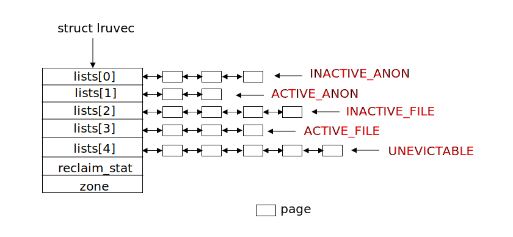

### [LRU缓存](https://www.cnblogs.com/tolimit/p/5447448.html)

为了降低对LRU链表的竞争访问提升了系统的性能，内核为**每个CPU核心提供四种LRU缓存`struct pagevec`**用以**批量地向 LRU 链表中快速地添加页面**。有了 LRU 缓存之后，新页不会被马上添加到相应的链表上去，而是先被放到一个缓冲区中去，当该缓冲区缓存了足够多的页面之后，缓冲区中的页面才会被一次性地全部添加到相应的 LRU 链表中去。

```c
#define PAGEVEC_SIZE 14
 
struct pagevec { // LRU缓存结构
    unsigned long nr; //当前已用容量
    unsigned long cold; 
    struct page *pages[PAGEVEC_SIZE];//缓存数组，最大容量为PAGEVEC_SIZE
};

/* 这部分的lru缓存是用于那些原来不属于lru链表的，新加入进来的页 */
static DEFINE_PER_CPU(struct pagevec, lru_add_pvec);
/* 在这个lru_rotate_pvecs中的页都是非活动页并且在非活动lru链表中，将这些页移动到非活动lru链表的末尾 */
static DEFINE_PER_CPU(struct pagevec, lru_rotate_pvecs);
/* 在这个lru缓存的页原本应属于活动lru链表中的页，会强制清除PG_activate和PG_referenced，并加入到非活动lru链表的链表表头中
 * 这些页一般从活动lru链表中的尾部拿出来的
 */
static DEFINE_PER_CPU(struct pagevec, lru_deactivate_pvecs);
#ifdef CONFIG_SMP
/* 将此lru缓存中的页放到活动页lru链表头中，这些页原本属于非活动lru链表的页 */
static DEFINE_PER_CPU(struct pagevec, activate_page_pvecs);
#endif
```

### 扫描回收页

为了寻找确定足够数量的可回收页同时提高回收效率（有多个zone每个zone又有多组LRU），linux内核定义了一个扫描优先级，通过这个优先级换算出在每个LRU上应该扫描的页面数。

整个回收算法以最低的优先级开始，先扫描每个LRU中最近最少使用的几个页面，然后试图回收它们。如果一遍扫描下来，已经回收了足够数量的页面，则本次回收过程结束。否则，增大优先级，再重新扫描，直到足够数量的页面被回收。而如果始终不能回收足够数量的页面，则优先级将增加到最大，也就是所有页面将被扫描。这时，就算回收的页面数量还是不足，回收过程都会结束。

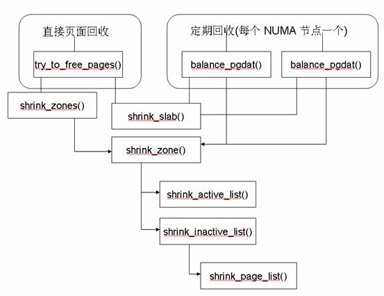

**`OOM`**：如果内存回收无法获取足够的内存而又一定需要足够的内存页面，内存回收机制`PFRA`就会启动**`OOM（out of memory）`杀死一个最不重要的进程**，通过释放这个进程所占有的内存页面，以缓解系统压力。

## 交换

### swap cache

一个`pages`管理结构的临时区域（不直接包含`page`），存储着正在被换入或换出的匿名页描述符，其[作用](http://liujunming.top/2017/10/08/Linux-swapping%E6%9C%BA%E5%88%B6%E8%AF%A6%E8%A7%A3/)主要发挥在多进程共享页的换入和一个进程试图换入一个正在被换出的页面时。当换入或换出结束时（对于共享匿名页，换入换出操作必须对共享该页的所有进程进行），匿名页描述符才可以从`swap cache`删除。


### 换出

**①**：触发内存回收机制后内核首先确定需要回收的物理页；

**②**：调用`get_swap_page()`通过`swap core `为待回收的内存页优先在高优先级的交换区寻找合适的`swap`地址（分区加`slot`）记为`swp_entry_t`；

**③**：修改该内存页对应的所有进程（**[反向映射](http://www.wowotech.net/memory_management/reverse_mapping.html)**）的页表项`pte`为`swp_entry_t`，同时把该页面加入到 `swap cache `缓存；

**④**：调用`swap_writepage()`通过`swap core`发起回写请求，待回写结束后释放该页面。

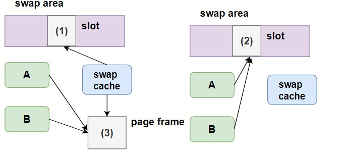

### 换入

**①**：访问进程页表发现缺页，判断缺页是否可以由换入解决，如果可以则分配物理页，获取`swp_entry_t`进入换入过程；

**②**：**先在`swap cache`中寻找**是否有对应的`swp_entry_t`，如果有则直接修改`pte`指向该`page`重新建立映射。

**③**：如果在`swap cache`中未找到，**再在`swap core`**中通过`swp_entry_t`查找对应的`swap`分区和数据地址，发起并等待读操作完成。

**④**：读操作完成后数据存储在物理页面中，增加`swap cache`到该页面的指向，共享该页面的其他进程访问对应的`slot`时会自动访问到该页，当所有共享该页面的进程都再次访问了这个页面的内容后`swap cache`才会解除对该页面的指向。

## 内存压缩 ZRam

在内存不足时将内存页进行压缩仍然存放在内存中，发生缺页的时候进行解压缩后换入，LZO压缩算法一般可以将内存页中的数据压缩至1/3。[更多参考](http://tinylab.org/linux-swap-and-zram/)

# 其他补充

[Linux内核中的锁](https://www.cnblogs.com/LoyenWang/p/12632532.html)

[内核源码在线看](https://elixir.bootlin.com/linux/latest/source)

[glibc源码在线看](https://elixir.bootlin.com/glibc/latest/source)

[Linux SystemV ipc 实现](https://blog.csdn.net/lcw_202/article/details/6076362#t12)：排版乱

[struct page结构体](http://linux.laoqinren.net/kernel/memory-page/)

[逆向映射的演进](http://www.wowotech.net/memory_management/reverse_mapping.html)

[Windows内存布局和不同架构的内存访问](https://www.eefocus.com/mcu-dsp/400488)

[服务器体系(SMP, NUMA, MPP)与共享存储器架构(UMA和NUMA)](https://www.cnblogs.com/linhaostudy/p/9980383.html)

[谢宝友：深入理解 RCU系列](https://cloud.tencent.com/developer/article/1006339)

[Linux内核学习笔记（一）虚拟文件系统（VFS）](https://www.huliujia.com/blog/81d31574c9a0088e8ae0c304020b4b1c4f6b8fb9/)

[linux内核数据结构学习总结](https://www.cnblogs.com/LittleHann/p/3865490.html)

[LINUX VFS分析之三 进程描述符与文件系统相关参数的关联](https://blog.csdn.net/lickylin/article/details/100863941)

[Linux 虚拟文件系统四大对象：超级块、inode、dentry、file之间关系](https://www.eet-china.com/mp/a38145.html)

[文件锁的API实现细节](https://blog.csdn.net/hnwyllmm/article/details/41626163)


ShiftEdithttps://shiftedit.net/home#


https://zhuanlan.zhihu.com/p/25134841

