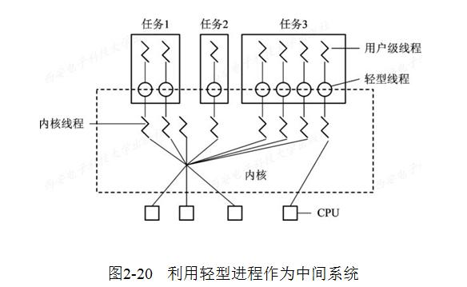
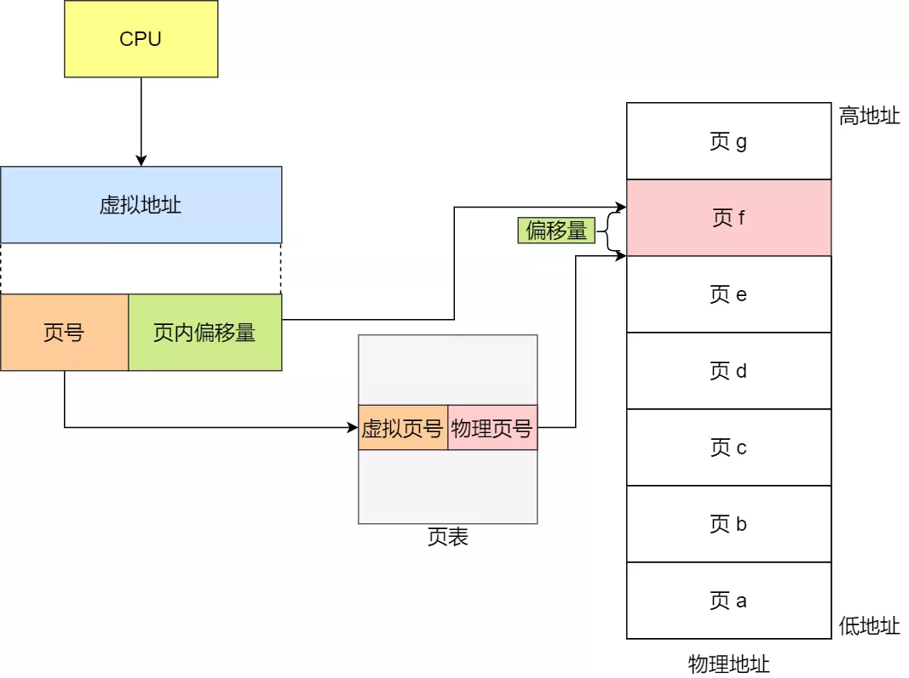

<!-- vim-markdown-toc GFM -->

+ [进程管理](#进程管理)
    * [进程](#进程)
    * [线程](#线程)
        - [内核线程/守护进程](#内核线程守护进程)
            + [轻量级进程](#轻量级进程)
            + [优点](#优点)
            + [缺点](#缺点)
        - [用户线程](#用户线程)
            + [用户线程的实现](#用户线程的实现)
                * [运行时系统](#运行时系统)
                * [内核控制线程](#内核控制线程)
            + [优点](#优点-1)
            + [缺点](#缺点-1)
        - [线程实现模型](#线程实现模型)
            + [用户线程:内核线程 = 1:1](#用户线程内核线程--11)
                * [优点](#优点-2)
                * [缺点](#缺点-2)
            + [混合线程模型](#混合线程模型)
            + [**混合线程模型** 用户线程:内核线程 = N : 1](#混合线程模型-用户线程内核线程--n--1)
                * [优点](#优点-3)
                * [弊端](#弊端)
            + [**混合线程模型** 用户线程:内核线程 = N : M](#混合线程模型-用户线程内核线程--n--m)
                * [优点](#优点-4)
                * [弊端](#弊端-1)
        - [线程调度](#线程调度)
        - [线程同步（锁）](#线程同步锁)
            + [互斥锁](#互斥锁)
            + [读写锁](#读写锁)
            + [条件变量](#条件变量)
            + [自旋锁](#自旋锁)
            + [内存屏障](#内存屏障)
    * [现代OS下的调度](#现代os下的调度)
    * [协程](#协程)
        - [优点](#优点-5)
+ [内存管理](#内存管理)
    * [分页管理](#分页管理)
    * [分段管理](#分段管理)
+ [文件管理](#文件管理)
    * [基本概念](#基本概念)
        - [超级块](#超级块)
        - [索引节点 INode](#索引节点-inode)
        - [文件](#文件)
    * [进程对文件的管理](#进程对文件的管理)
+ [Linux Kernel](#linux-kernel)
    * [设计哲学](#设计哲学)
        - [一切皆文件](#一切皆文件)
    * [系统调用](#系统调用)
    * [虚拟文件系统VFS](#虚拟文件系统vfs)
        - [VFS数据结构](#vfs数据结构)
            + [超级块对象](#超级块对象)
            + [索引节点对象](#索引节点对象)
            + [目录项对象](#目录项对象)
            + [文件对象](#文件对象)
            + [NOTE](#note)
        - [tmpfs](#tmpfs)
        - [sysfs](#sysfs)
        - [debugfs](#debugfs)
        - [procfs](#procfs)
        - [sockfs](#sockfs)
        - [devfs](#devfs)
    * [调度管理](#调度管理)
        - [Linux的任务管理](#linux的任务管理)
        - [Linux线程](#linux线程)
            + [共享的资源](#共享的资源)
            + [线程独有](#线程独有)
        - [多线程编程模式](#多线程编程模式)
            + [leader-follow 模型（主从）](#leader-follow-模型主从)
            + [producer-consumer模型（生产者消费者）](#producer-consumer模型生产者消费者)
            + [高并发索引模型](#高并发索引模型)
        - [相关问题](#相关问题)
+ [内核态与用户态](#内核态与用户态)
    * [内存布局](#内存布局)
    * [用户态与内核态](#用户态与内核态)
        - [核心态](#核心态)
        - [用户态](#用户态)
        - [NOTE](#note-1)
    * [上下文切换](#上下文切换)

<!-- vim-markdown-toc -->

# 进程管理

## 进程

+ 一个包含线程集和资源集的动态实体（程序运行时的产物），是**资源管理及分配的最小单元**

+ **NOTE**：用户进程同时具备内核空间与用户空间，在进行系统调用时用户进程会由用户内存空间陷入内核内存空间。

### 进程状态

* 挂起：此时进程不占用内存空间，此时进程所使用的空间在硬盘而非物理内存上。其中就绪挂起状态的进程一旦进入内存就可以运行。

## 线程

+ 程序**执行的最小单元**

|      |
| ---- |

|                      |             内核线程             |                   用户线程                   |
| :------------------: | :------------------------------: | :------------------------------------------: |
|      OS内核感知      |              可感知              |                    无感知                    |
| 管理主体(建立和销毁) |             操作系统             | 线程库而非内核支持（创建、同步、调度和管理） |
|      处理器分配      | 进程的多个线程可以获得多个处理机 |                   单处理器                   |
|      OS调度单位      |               线程               |       内核调度进程、进程自定义线程调度       |
|        工作态        |            只在内核态            |        用户态和内核态(执行系统调用时)        |

### 内核线程/守护进程

+ 每一个内核线程都是内核部分代码的一个运行实体，相当于以一个特化的部分，每个内核线程都有其特定的任务

+ 内核为每一个内核线程维护一个内核控制块TCB，通过TCB感知和调度内核线程。

+ 内核线程是内核调度的基本单位，是“独立运行在内核空间的标准进程”。每一个内核线程都可以在全系统内进行资源的竞争。

+ 内核线程没有自己的地址空间，与内核使用同一张页表

+ 以下是一些特殊的内核线程（Linux下）

   | 内核线程 |                           任务                           |
   | :------: | :------------------------------------------------------: |
   |   init   | 运行文件系统上的一系列”init”脚本，并启动shell进程；pid=1 |
   | kthreadd |    内核的守护线程，在内核正常工作时永远不退出；pid=2     |

+ 

#### 优点

+ 在多处理器系统中，内核能够同时调度同一进程中多个线程并行执行到多个处理器中；
+ 如果进程中的一个线程被阻塞，内核可以调度同一个进程中的另一个线程；
+ 内核支持线程具有很小的数据结构和堆栈，内核线程之间的切换快、开销小；
+ 内核本身也可以使用多线程的方式来实现（如Linux的kswapd线程负责在内存不足时将内存页写回磁盘、kflushd、bpflush线程负责周期性的将脏数据写会磁盘）。

#### 缺点

+ 即使CPU在同一个用户进程的多个线程之间切换，也需要陷入内核，因此其速度和效率不如用户级线程。
+ 当线程进行切换的时候，由用户态转化为内核态。切换完毕要从内核态返回用户态?????????

### 轻量级进程

建立在内核之上并有**内核支持的用户线程**，**每个LWP跟内核线程一对一映射的，一个进程可有一个或多个 LWP**。只能由**内核管理**并像普通进程一样被调度。

LWP与普通进程的区别也在于它只有一个**最小的执行上下文和调度程序所需的统计信息**。一个进程代表程序的一个实例，而 LWP 代表程序的执行线程，因为一个执行线程不像进程那样需要那么多状态信息，所以 LWP 也不带有大量的信息。

### 用户线程

+ 不需要内核支持而在用户空间中实现的线程，用户进程利用线程库提供创建、同步、调度和管理线程的函数来控制用户线程。其内部的活动对于内核是透明的。
+ 每个进程里的**线程表**由运行时系统管理。当一个线程转换到就绪状态或阻塞状态时，在该线程表中存放重新启动该线程所需的信息

#### 用户线程的实现

用户线程运行在一个中间系统上面。目前中间系统实现的方式有两种，即运行时系统（Runtime System）和内核控制线程。

##### 运行时系统

+ “运行时系统”实质上是用于**管理和控制线程的函数集合**，包括创建、撤销、线程的同步和通信的函数以及调度的函数。
+ 这些函数都驻留在用户空间作为用户线程和内核之间的接口。
+ 当线程需要系统资源时不能使用系统调用，而是将请求传送给运行时，由后者通过相应的系统调用来获取系统资源。

##### 内核控制线程

+ 系统构建若干个轻型进程（LWP）形成线程池，LWP可以通过系统调用来获得内核提供的服务，而进程中的用户线程可通过复用来关联到线程池中的LWP，从而得到内核的服务。

  

#### 优点

1. 可以在不支持线程的OS上实现线程
2. 不需要内核干涉，少了进出内核态的消耗，管理（创建、切换、销毁）线程的代价比进程小得多
3. 进程可以定制自己的线程的调度策略（进程内部没有时钟中断，所以不能用轮转调度的方式），管理灵活度高
4. 能够利用的表空间和堆栈空间比内核级线程多
5. 不需要陷阱，不需要上下文切换，也不需要对内存高速缓存进行刷新，使得线程调用非常快捷

#### 缺点

1. 同一进程同时只有一个线程运行，同一进程的多线程无法利用多处理机并行
2. 操作系统内核不知道多线程的存在，因此一个线程阻塞将使得整个进程（包括它的所有线程）阻塞。

### 线程实现模型

内核态的系统线程专⻔负责执⾏，⽽⽤户态的线程负责存储状态（线程栈状态、寄存器相关的信息、局部变量等）。内核将若干个内核态的线程构成内核态线程池pool，⽤户态只需要创建抽象的专⻔⽤来存储状态的这种⽤户态线程，当用户态线程需要执⾏的时候，将它绑定到⼀个系统线程上由系统线程去执⾏，当执⾏完了以后将系统线程释放回Pool⾥而不需要消灭这个系统线程。[参考来源](https://www.jianshu.com/p/49e3e47d41f0)

#### 用户线程:LWP = 1:1

+ 操作系统调度器管理、调度并分派这些线程。运行时库为每个用户级线程请求一个内核级线程。

+ 一个用户线程在其生命周期内被映射/绑定到一个内核线程、每个用户线程都对应一个内核线程作为调度实体(反过来不一定成立，一个内核线程**不一定有**对应的用户线程)。

+ 内核会对每个线程进行调度，所以线程在用户空间的切换就涉及到了多个内核态的线程的切换。

+ 创建方法：一般一直使用API或者通过系统调用(Linux:clone、Windows:CreateThread)创建的线程为一对一模型。

##### 优点

1. 一个线程因某种原因阻塞时其他线程的执行不受影响
2. 多线程的程序在多处理机上能够充分利用多个处理机，提高程序的表现。

##### 缺点

1. 内核支持的内核线程数量有限，许多操作系统限制了内核线程的数量。
2. OS在内核线程之间的调度时开销比较大

#### 混合线程模型

+ 用户线程库和内核都可以参与线程的管理，用户线程由运行时库调度器管理，内核线程由操作系统调度器管理。
+ 准备就绪的用户线程由运行时库分派并标记为可执行，操作系统选择可执行的用户线程并将它映射到线程池中的可用内核线程。

#####  用户线程:LWP = N : 1

+ 将多个用户线程映射到一个内核线程，线程的创建、调度、同步的所有细节全部由进程的用户空间线程库来处理。

##### 优点

1. 对用户线程的数量几乎无限制。
2. 线程之间的切换由用户态的代码来进行，相对一对一模型其线程切换速度要快许多；

##### 弊端

1. 如果其中一个用户线程阻塞将导致其绑定的内核线程阻塞，绑定到该内核线程的其他用户线程也会阻塞。
2. 在多处理器系统上，处理器数量的增加对多对一模型的线程性能不会有明显的增加，因为所有的用户线程都映射到一个处理器上了。

##### 用户线程:LWP = N : M

+ 将多个用户线程映射到多个内核线程上。
+ 是实现原生协程的关键

##### 优点

1. 一个用户线程的阻塞不会导致所有线程的阻塞，因为此时还有别的内核线程被调度来执行；
2. 对用户线程的数量没有限制；

##### 弊端

1. 多处理机下的性能提升不如1:1模型提升大

## 协程

+ 协程更多的是一种暂停的概念。在一个线程中可以通过协调器来暂停继续不同的协程而避免使用线程的上下文切换，从而实现不同协程的交替运行。以上所有操作都在用户态执行，开销小。

### 优点

1. 协程由用户自己进行调度，因此减少了上下文切换，提高了效率。
2. 线程的默认Stack大小是1M，而协程更轻量，接近1K。因此可以在相同的内存中开启更多的协程。
3. 由于在同一个线程上，因此可以避免竞争关系而使用锁。
4. 适用于被阻塞的、IO频繁且需要大量并发的场景。

## 调度算法

在同一进程中，线程的切换不会引起进程切换。在不同进程中进行线程切换,如从一个进程内的线程切换到另一个进程中的线程时，会引起进程切换。

### FCFS 先来先服务

非抢占式调度算法，对长作业有利，适用于 CPU 繁忙型不适用于 I/O 繁忙型系统。

### SJF 最短作业优先

### 高响应比优先

权衡了短作业和长作业，每次进行进程调度时，先计算响应比（$(T_{等待}+T_{要求服务})/T_{要求服务}$），然后把响应比优先级最高的进程投入运行。

### RR 时间片轮转

抢占式调度算法，简单公平，关键在于时间片长度的选择（一般为20-50ms）

### HPF 最高优先级优先

其中优先级可以分为动态优先级和静态优先级，既可以抢占式调度（出现高优先级则停止此进程）也可以非抢占式调度。

### MFQ 多级反馈队列

* **多级**：有多个不同优先级的队列，优先级越高时间片越短。

* **反馈**：若有新进程进入高优先级队列，则处理机被抢占执行高优先级队列中的进程

  

1. 新的进程会被放入到第一优先级队列的末尾，按**先来先服务**的原则排队等待被调度。如果当前优先队列队头的进程在该优先级队列规定的时间片没运行完成，则将其转入到下一优先级队列的末尾，以此类推，直至完成；

2. **当较高优先级的队列为空，才调度较低优先级的队列中的进程运行**。如果进程运行时，有新进程进入较高优先级的队列，则停止当前运行的进程并将其移入到原队列末尾，接着让较高优先级的进程运行；

对于短作业可能可以在第一级队列很快被处理完。对于长作业，如果在第一级队列处理不完，可以移入下次队列等待被执行，虽然等待的时间变长了，但是运行时间也会更长，所以该算法很好的**兼顾了长短作业，同时有较好的响应时间。**

## 同步（锁）

### 互斥锁

### 读写锁

### 条件变量

### 自旋锁

### 内存屏障

# 内存管理

## 内存管理单元 MMU

MMU有时称作分页内存管理单元（PMMU，因为目前普遍采用了分页思想），是为了满足OS复杂的地址管理而产生的一个与软件密切相关的**硬件**。它透明的向上层提供虚实地址转换、内存保护、CPU缓存控制等功能。

### 地址转换

进程在CPU执行时产生的地址信号（虚存VA）在通过地址总线发送到内存芯片（物理内存）之前将被CPU 芯片中的**内存管理单元（MMU）**截获，MMU会负责**把VA翻译成物理地址（PA）**然后发到内存芯片地址引脚上以读取数据。

### 内存保护

MMU会检查PT中VA对应的PTE中的访问权限（PTE中的一个域），如果访问不符合限定就中止转换并抛出代表异常的信号。

### MMU与OS

1. 系统初始化代码会在内存中**生成页表**，然后把页表地址**设置给MMU对应寄存器**，使MMU知道页表在物理内存中的什么位置，以便在需要时进行查找。
2. 之后通过专用指令**启动MMU**，之后MMU硬件开始自动完成查表和虚实地址转换，程序中所有内存地址都变成虚地址。
3. OS初始化完成后创建**第一个用户进程**，此过程中也要创建页表，并把页表地址赋值给PCB中的某指针成员。
4. 用户**创建子进程**时会**拷贝父进程的页表**，并在随后的运行过程中逐渐更新页表项。即**每个进程都有自己的页表**。

## 多级cache

为了弥补CPU与内存（由DRAM构成）两者之间的速度差异，就在CPU内部引入了CPU Cache（也称高速缓存，由SRAM构成）。Cache通常分为大小不等的三级缓存，其中L1 Cache 通常会分为**数据缓存和指令缓存**， **L3 Cache由多个核心共享**。

#### Cache管理

CPU**以Cache Line而非字节**作为Cache的基本管理单位，在读取数据的时候CPU永远**先访问 Cache**，当 Cache 中找不到数据时才会去访问内存（顺序加载内存地址开始的一个Cache Line长度），并把内存中的数据读入到 Cache 中，再从 CPU Cache读取数据，CPU从Cache读取数据时又以**字Word**为基本单位，因此访问地址中必然包含**偏移量Offset**字段（索引字在Line中的位置）。操作系统为了方便对内存和Cache进行管理，会以**内存块**（大小等于Cache Line）为基本单位管理内存，建立内存块与Cache行的映射关系。

#### 直接映射

把内存块的地址始终映射在一个 CPU Line的地址（多使用地址取模）。此时内存块和Cache Line构成**多对一**的关系，因此需要在Cache Line中加入组**标记Tag**（区别同一Cahe Line对应的不同内存块），此外还需要加入**有效位Valid**（数据是否是有效）。

#### 全相联映射

主存中任何一块都可以映射到Cache中的任何一块位置上，此时内存块和Cache Line构成**多对多**的关系（设计复杂，适合小容量Cache）。

#### 组相联映射

主存和Cache都**分组**，主存中一个**组内的块数**与Cache中的**分组数**相同，组间采用直接映射，组内采用全相联映射。

## 分页管理

### 管理基础

**页Page**是VA到PA映射过程中的最小单位（一般为4K），整个虚拟和物理内存空间都切成若干个页；**页表PT**是为了辅助MMU完成地址映射的软件构造出的记录集合；集合中的每一个条目（一般4B）为代表映射规则的**页表项PTE**，整个**页表保存在片外内存DRAM**；为了避免每次转换都要访问片外内存以加快地址转换，MMU在内部置有SRAM来缓存页表访问记录，这个缓存表称为**页表缓存TLB**。

**多级页表**：多级页表最终的映射粒度是页，但是每一级页表的映射单位是下一级页表映射的范围总和，这样既可以减少页表的大小，将地址的查询分级进行（减少查找空间以加速查找），又可以灵活控制每一级的映射粒度。

### 页寻址

### 页替换

## 分段管理

将程序的内存空间划分成为若干个段，每个段都有不同的属性（如代码段、数据段、堆栈等）。此时虚拟内存将被视为段选择子和段内偏移两部分，由**MMU利用段表**实现VA到PA的翻译。

# 文件管理

## 基本概念

### 超级块

存放于磁盘的特定扇区中用于存储文件系统的控制信息（文件系统的状态、类型、大小、区块数、索引节点数等）的数据结构。

### 索引节点 INode

用于存储文件的元数据（诸如文件的大小、拥有者、创建时间、磁盘位置等和文件相关的信息）的一个数据结构。

### 文件

一组在逻辑上具有完整意义的信息项的系列。

## 进程对文件的管理

进程通过Task_Struct结构中的files_struct域来了解它当前所打开的文件对象，所谓文件描述符就是文件在进程的已打开的文件对象数组中的下标索引，文件对象通过内部域f_dentry找到文件目录项对象，通过文件对象的f_op域得到该文件支持的标准方法。

+ 超级块、Task_Struct等结构的关系如下：
mmap()

# Linux Kernel

## 设计哲学

### [一切皆文件](https://cloud.tencent.com/developer/article/1512391)

+ 在Linux系统中，由于管道文件、socket文件等特殊文件的存在，一切皆文件退化为**一切皆文件描述符**。
+ bash再处理到`/dev/tcp/host/port`的充电向时建立了一个`host:port`的socket连接，将socket的读写表现的和普通文件的读写一样，但是上述的文件在文件系统并不是真实存在的，知识bash对用户的一个善意的谎言。
+ plan9系统承诺彻底贯彻执行一切皆文件，将分布在不同位置的所有资源作为文件统一在同一棵目录树中，实现Unix最初的愿景。

## 系统调用

## 虚拟文件系统VFS

通过虚拟文件系统VFS提供的抽象层，程序可以用标准的Unix系统调用对不同的文件系统，甚至不同介质上的文件系统进行读写操作。

* 文件IO流程：

1. 应用程序通过文件操作函数（`open()、close()、read()、write()、ioctl()`）调用VFS提供的系统调用函数接口(`sys_open()、sys_close()、sys_read()、sys_write()、sys_ioctl()`)同VFS进行交互。
2. VFS通过驱动程序提供的`file_operation`接口同设备驱动进行交互（驱动层的`file_operations`方法的屏蔽了不同类型设备的底层操作方法的差异）

### VFS数据结构

+ VFS主要通过四个主要的结构体实现抽象层，每个结构体包含了该结构体支持的方法的一个列表，使其表现的如同对象（数据和方法）。
+ VFS中超级块、挂载点以及文件系统的关系

#### 超级块对象

存储一个已安装的文件系统的控制信息，代表一个已安装的文件系统;每次一个实际的文件系统被安装时， 内核会从磁盘的特定位置读取一些控制信息来填充内存中的超级块对象。一个安装实例和一个超级块对象一一对应。

#### 索引节点对象

存储了文件的相关信息，代表了存储设备上的一个实际的物理文件。当一个文件被访问时，内核会在内存中组装相应的索引节点对象，以便向内核提供对一个文件进行操作时所必需的全部信息;这些信息一部分存储在磁盘特定位置，另外一部分是在加载时动态填充的。

#### 目录项对象

为了方便查找文件而创建的对象，

#### 文件对象

已打开的文件在内存中的表示，主要用于建立进程和磁盘上的文件的对应关系。文件对象和物理文件的关系类型进程和程序的关系，文件对象仅仅在进程观点上代表已经打开的文件。一个文件对应的文件对象可能不是惟一的，但是其对应的索引节点和目录项对象是惟一的。

#### NOTE

1. Linux支持的文件系统无论是否有文件系统的实例存在，都有且仅有一个`file_system_type`结构用于描述具体的文件系统的类型信息。相同文件系统的多个实例的超级块通过其域内的s_instances成员链接。
2. 每一个文件系统的实例都对应有一个超级块和安装点，超级块通过它的一个域s_type指向其对应的具体的文件系统类型`file_system_type`。

### tmpfs

### sysfs

### debugfs

### procfs

### sockfs

socketfs伪文件系统被编译进内核（而非一个模块）在系统运行期间**总是被装载**着的（因为要支持整个TCP/IP协议栈）。它实现了VFS中的4种主要对象：超级块super block、索引节点inode、目录项对象dentry和文件对象file，当执行文件IO系统调用时，VFS就将请求转发给sockfs，而sockfs就调用具体的协议实现。

### devfs

## 任务调度

Linux将所有的执行实体都称之为任务Task（Task是进程概念在Linux中的实现），由`Task_Struct`进行描述。每一个**Task都具有内存空间、执行实体、文件资源等进程都具有的资源**，从表现形式上看类似于一个单线程的进程。同时Linux允许多个任务**共享内存空间**（在`Task_Struct`对应域中指明**共享的资源空间**即可），从而使多个任务运行在同一个内存空间上。从表现上来看，此时的多个任务相当于多个线程，多个这样的线程构成了一个进程。

### Linux线程

在linux2.6之前，内核并不支持线程的概念，仅通过轻量级进程LWP模拟线程，一个用户线程对应一个内核线程（内核轻量级进程），这种模型最大的特点是线程调度由内核完成了，而其他线程操作（同步、取消）等都是核外的线程库（LinuxThread）函数完成的。[参考来源](https://developer.aliyun.com/article/374623)

在linux2.6之后，为了完全兼容posix标准，linux2.6对内核进行改进，引入了线程组的概念（仍然用轻量级进程表示线程），有了这个概念就可以将一组线程组织称为一个进程。通过这个改变，linux内核正式支持多线程特性。在实现上主要的改变就是在task_struct中加入tgid字段，这个字段就是用于表示线程组id的字段。在用户线程库方面，也使用NPTL代替LinuxThread。[参考来源](https://developer.aliyun.com/article/374623)

#### 共享的资源

内存地址、空间进程基础信息、大部分数据、打开的文件、信号处理、当前工作目录用户和用户组属性等

#### 线程独有

线程ID、寄存器、栈的局部变量、返回地址、错误码errno、信号掩码、优先级等

### 多级页表

32bit Linux采用了3级页表$[PGD(16b)|PMD(4b)|PTE(4b)|Offset(12b)]$。64bit采用了4级页表$[PG_{lobal}D|PU_{pper}D|PM_{iddle}D|PTE|Offset]$。

# 运行态与上下文

核心态代码（系统调用、中断处理程序等）拥有完全的底层资源控制权限，可以执行任何CPU指令，访问任何内存地址。用户态不能直接访问底层硬件和内存地址，用户态运行的程序必须委托系统调用来访问硬件和内存。

## 内存布局

内核作为操作系统的核心，拥有对所有设备的最高访问权限且**内核常驻内存**。Linux简化了分段机制（Intel由于历史原因必须支持分段），使得虚拟地址与线性地址总是一致。在32bit Linux中，内核将最高的1GB虚拟内存空间作为内核空间（**所有的进程共享内核空间地址**），对内核空间的访问将受到硬件保护(0级才可访问)，低3GB虚拟内存空间作为用户空间（包含代码段、全局变量、BSS、函数栈、堆内存、映射区等）供用户进程使用（3级可访问）。

## 上下文

所谓的**上下文**指的是一个运行环境(对于计算机就是一系列的变量值)。

### 进程上下文

当前进程上下文均保存在**进程的任务数据结构**中，一个进程的上下文环境具体可以分为**用户级上下文，寄存器上下文和系统级上下文**三大的部分。

|     层级     |                             内容                             |
| :----------: | :----------------------------------------------------------: |
| 用户级上下文 |             正文、数据、用户堆栈以及共享存储区等             |
| 寄存器上下文 | 通用寄存器、程序寄存器(IP)、处理器状态寄存器(EFLAGS)、栈指针(ESP)等 |
| 系统级上下文 | 进程控制块task_struct、内存管理信息(mm_struct、vm_area_struct、pgd、pte)、内核栈等 |

### 中断上下文

为了快速响应硬件的事件，对同一个 CPU 来说**中断处理比进程拥有更高的优先级**，硬件通过触发中断信号，此时**中断处理会打断进程的正常调度和执行**，转而进入内核空间调用中断处理程序（一般都短小精悍且**不会阻塞**，以便尽可能快的执行结束），响应设备事件。

这个过程中传递的硬件中断参数和内核需要保存的一些其他环境（主要是保存被打断执行的**部分进程环境**使进程在中断结束后得以恢复）就被称作**中断上下文**（只包括内核态中断服务程序执行所必需的状态，包括 CPU 寄存器、内核堆栈、硬件中断参数等）。

### 上下文切换

CPU在执行任务时必须依赖外部环境信息（上下文），而每个CPU单元某一时间点只能处于一个确切的环境下，OS通过分时复用不断执行多个进程，造成宏观上的并行。CPU每次执行不同的任务时，它所处的环境也会发生改变，这个改变的过程就是上下文切换，通过上下文切换CPU得以正确运行。

#### 模式上下文切换

用户态代码进行系统调用时发生的用户态-内核态-用户态的切换过程，这一过程改变了运行的特权模式，主要的切换内容为**寄存器上下文的切换**。

#### 进程上下文切换

进程是由内核来管理和调度的，因此进程的切换**只发生在内核态**。进程一旦被调度将会发生整个进程**三种上下文的整体切换**（保存上一进程、加载下一进程），进程切换过程中OS必须切换虚地址空间（页表的加载等），在新进程的运行过程中不断刷新替换TLB中的旧内容（**缓存失效**会加大访存时间），这一过程的代价相当大（几十纳秒到数微秒）。

#### 线程上下文切换

由于线程很多资源（虚拟内存和全局变量等资源）都是共享进程的，所以切换时只需要切换线程的私有数据，切换代价比进程切换小得多。

#### 中断上下文切换

中断上下文切换只**发生在内核态**，中断时，内核不代表任何进程运行、不涉及到进程的用户态、一般只访问系统空间。所以，即便中断过程打断了一个正处在用户态的进程，也不需要保存和恢复这个进程的虚拟内存、全局变量等用户态资源。

## 小结

内核态和用户态限定的当前代码所能执行的指令集合和访问地址空间，上下文决定了代码执行时的环境。由此二者可以确定CPU上任何一个任务所属的状态只可能时以下三种之一：

| 状态 / 空间 |     上下文     |    栈使用    |                本体                |
| :---------: | :------------: | :----------: | :--------------------------------: |
|   内核态    | 处于进程上下文 | 用进程内核栈 |         代表某个特定的进程         |
|   内核态    | 处于中断上下文 | 用进程内核栈 | 与任何进程无关，处理某个特定的中断 |
|   用户态    | 处于进程上下文 | 用进程用户栈 |          代表某个用户进程          |

当一个进程通过**系统调用、中断、软中断**（如缺页异常）从用户态陷入内核态，此时会**使用当前进程的内核栈**代表进程执行（**多个进程共享内核空间**，但是每个进程进入内核的上下文不同，因此**每个进程都有自己的内核栈**），整体处于进程上下文中。

## 抢占内核

在Linux 2.6以前，内核只支持用户态抢占，内核态代码会一直运行直到代码被完成或者被阻塞(系统调用可以被阻塞)。Linux从2.6开始支持可抢占式内核，kernel可以在任何时间点（因为中断造成的抢占可以发生在任何时间）上抢占一个任务（要求此时间点的内核代码不持有锁处于临界区且内核代码[可重入](https://www.wikiwand.com/zh-hans/%E5%8F%AF%E9%87%8D%E5%85%A5)），从中断处理例程返回到内核态时，kernel会检查是否可以抢占和是否需要重新调度。[参考1](https://github.com/IMCG/-/blob/master/kernel/Linux%E5%86%85%E6%A0%B8%E6%80%81%E6%8A%A2%E5%8D%A0%E6%9C%BA%E5%88%B6%E5%88%86%E6%9E%90.md)

