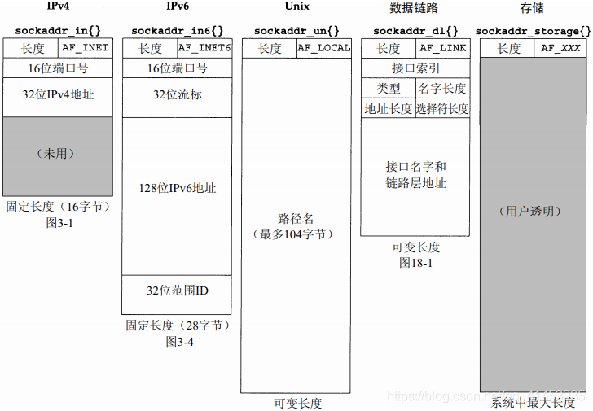
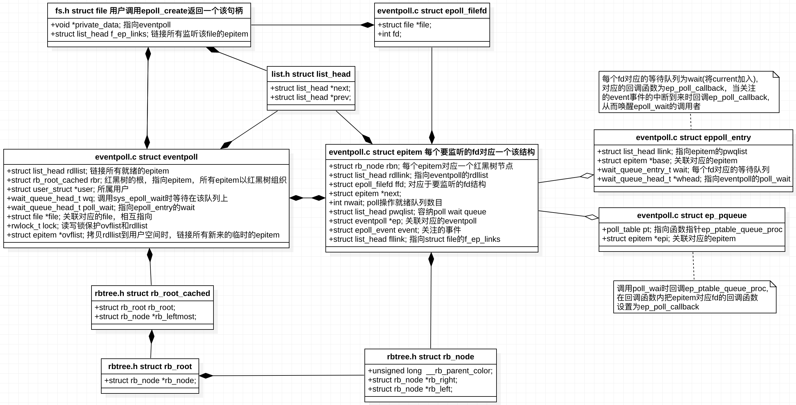
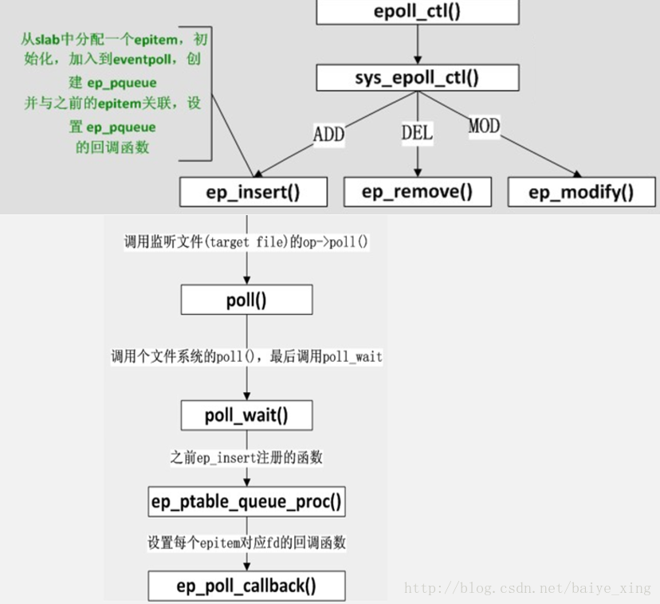

# 目录

<!-- vim-markdown-toc GFM -->

* [套接字](#套接字)
    * [socket文件与Linux设计哲学](#socket文件与linux设计哲学)
    * [套接字的数据结构](#套接字的数据结构)
        * [数据结构](#数据结构)
            * [`sockaddr_in`](#sockaddr_in)
            * [`sockaddr_in6`](#sockaddr_in6)
            * [`sockaddr`](#sockaddr)
            * [`sockaddr_storage`](#sockaddr_storage)
        * [值-结构参数](#值-结构参数)
            * [从进程到内核](#从进程到内核)
    * [套接字类型](#套接字类型)
        * [本地套接字 Unix Socket](#本地套接字-unix-socket)
        * [网络套接字 BSD Socket](#网络套接字-bsd-socket)
    * [套接字实现](#套接字实现)
        * [sockfs文件系统](#sockfs文件系统)
        * [socket初始化](#socket初始化)
        * [socket创建](#socket创建)
        * [socket操作](#socket操作)
        * [socket销毁](#socket销毁)
* [OS网络API](#os网络api)
    * [链接管理](#链接管理)
        * [`socket()`](#socket)
        * [`bind()`](#bind)
        * [`listen()`/`connect()`](#listenconnect)
        * [`accept()`](#accept)
        * [`close()`/`shudown()`](#closeshudown)
    * [读写](#读写)
        * [`read()`/`write()`](#readwrite)
        * [`send()`/`recv`](#sendrecv)
        * [`sendto`/`recvfrom`](#sendtorecvfrom)
        * [`sendmsg`/`recvmsg`](#sendmsgrecvmsg)
    * [地址转换](#地址转换)
        * [主机序与网络序](#主机序与网络序)
        * [inet_xxx()函数族](#inet_xxx函数族)
            * [不安全的函数](#不安全的函数)
            * [安全的地址转换](#安全的地址转换)
* [IO模型](#io模型)
    * [阻塞式IO](#阻塞式io)
    * [非阻塞是IO](#非阻塞是io)
    * [IO多路复用/事件驱动](#io多路复用事件驱动)
        * [内核支持](#内核支持)
            * [等待队列 waitqueue](#等待队列-waitqueue)
            * [内核的poll机制](#内核的poll机制)
        * [Posix:select](#posixselect)
            * [执行过程](#执行过程)
                * [`__pollwait`回调](#__pollwait回调)
            * [优点](#优点)
            * [缺点](#缺点)
        * [BSD:kqueue](#bsdkqueue)
        * [Linux:poll](#linuxpoll)
            * [优点](#优点-1)
            * [缺点](#缺点-1)
        * [Linux:epoll（高效）](#linuxepoll高效)
            * [实现原理](#实现原理)
                * [数据结构](#数据结构-1)
                * [过程](#过程)
                    * [`epoll_create`](#epoll_create)
                    * [`epoll_ctl`](#epoll_ctl)
            * [`ep_ptable_queue_proc`](#ep_ptable_queue_proc)
            * [`epoll_wait`](#epoll_wait)
            * [工作模式](#工作模式)
                * [电平触发LT(默认)](#电平触发lt默认)
                * [边缘触发ET(高速)](#边缘触发et高速)
            * [优点](#优点-2)
        * [惊群](#惊群)
            * [accept惊群](#accept惊群)
            * [epoll惊群](#epoll惊群)
                * [解决办法：](#解决办法)
                    * [**`lighttpd`**](#lighttpd)
                    * [**`nginx`**](#nginx)
                    * [`SO_REUSEPORT`](#so_reuseport)
    * [信号驱动IO(不常用)](#信号驱动io不常用)
    * [异步IO](#异步io)
        * [Windows:IOCP（优秀）](#windowsiocp优秀)
        * [Linux:AIO](#linuxaio)
    * [总结](#总结)
        * [epoll为什么高效](#epoll为什么高效)
    * [HSHA模型](#hsha模型)
    * [HSHR模型](#hshr模型)
* [IO模式](#io模式)
    * [Reactor](#reactor)
        * [步骤](#步骤)
    * [Proactor](#proactor)
        * [步骤](#步骤-1)
* [其他](#其他)
    * [`setsockopt()/getsockopt()`](#setsockoptgetsockopt)
    * [`SO_REUSEPORT`](#so_reuseport-1)
        * [均衡算法](#均衡算法)
    * [`SO_REUSEADDR`](#so_reuseaddr)
* [推荐资料](#推荐资料)

<!-- vim-markdown-toc -->

# 套接字

套接字Socket是连接应用程序和网络驱动程序的桥梁，套接字Socket在应用程序中创建，通过绑定与网络驱动建立关系。此后，应用程序送给套接字Socket的数据，由套接字Socket交给网络驱动程序向网络上发送出去。计算机从网络上收到与该套接字Socket绑定IP地址和端口号相关的数据后，由网络驱动程序交给Socket，应用程序便可从该Socket中提取接收到的数据。

## socket文件与Linux设计哲学

Linux设计的一条基础哲学即一切皆文件，但是socket文件的实现与该原则有所违背，它的操作接口和标准文件接口非常不同

1. 创建socket必须用socket调用而不是open，socket在打开之前不能存在。
2. bind，connect，accept等都是独立的系统调用，没有标准文件操作与之对应。

由于socket、管道等设计Linux的设计哲学由**一切皆文件退化为一切皆文件描述符**。

1. 一切皆文件： 文件属于Unix/Linux目录树，编址于统一命名空间。
2. 一切皆文件描述符： 文件描述符属于进程打开文件表，进程内可见。

## 套接字的数据结构

### 数据结构

|      数据结构      |        作用        | 大小 | 说明 |
| :----------------: | :----------------: | :--: | :--: |
|   `sockaddr_in`    |    IPV4地址信息    | 16B  |      |
|   `sockaddr_in6`   |    IPV6地址信息    | 28B  |      |
|     `sockaddr`     | 用于向系统调用传参 | 16B  |      |
| `sockaddr_storage` |                    | 128B |      |



#### `sockaddr_in`

```c
struct sockaddr_in{
    uint8_t        sin_len;//4.3BSD-Reno后为增加对OSI协议的支持添加，保存此结构体的长度，POSIX下无此成员
    sa_family_t    sin_family;  /*AF_INET*/
    in_port_t      sin_port;//16bit网络序端口号
    struct in_addr{
        in_addr_t    s_addr;//网络序32bit IPV4地址
    }sin_addr;
    char           sin_zero[8];//一般不使用，但总是设为0
};
```

#### `sockaddr_in6`

```c
struct sockaddr_in6{
    uint8_t         sin6_len;//套接字地址结构长度
    sa_family_t     sin6_family;
    in_port_t       sin6_port;
    uint32_t        sin6_flowinfo;//低序20位是流标，高序12位保留
    struct in6_addr{
    	unit8_t    s6_addr[16];//网络序128bit IPV4地址
}sin6_addr;
    uint32_t        sin6_scope_id; /*set of interfaces for a scope*/
};
```

#### `sockaddr`

处理套接字的函数（bind、connect等）的参数一般需要传递套接字的地址，然后对于不同协议簇的地址结构可能会不同，在传参时也就不同，为了统一传递一个地址结构，设计了`sockaddr`这样的通用套接字地址结构。因为套接字处理函数的参数为`struct sockaddr`类型，所以在传参时需要将`sockaddr_in、sockaddr_in6`强制类型转换为`sockaddr`。

```c
struct sockaddr{
    uint8_t        sa_len;
    sa_family_t    sa_family;
    char           sa_data[14]; /*protocol-specific address*/
};
```

#### `sockaddr_storage`

除了`ss_len`和`ss_family`之外，结构中的其它字段对用户来说是透明的，该结构必须类型强制转换成或复制到适合于`ss_family`字段所给出地址类型的套接字地址结构中，才能访问其他字段

```c
struct sockaddr_storage{
    uint8_t     ss_len;
    sa_family_t ss_familt;
    /*implementation-dependent elements to provide:
    a)alignment sufficient to fulfill the alignmen requirements of
        all socket address types that the system supports.
    b)enough storage to hold any type of socket address that thw
        system supports.
    */
};
```

### 值-结构参数

#### 从进程到内核

`bind、connect、sendto`三个函数需要将进程数据传递到内核空间，这些函数的一个参数是指向某个套接字地址结构的**指针**，另一个`socklen_t`类型的参数是该结构的整数**大小**。

## 套接字类型

### 本地套接字 Unix Socket

本地套接字一般用于本机的IPC（进程间通行），其名字是Linux文件系统中的文件名（可以找到最终的实体文件），一般放在`/tmp`或`/usr/tmp`目录。

### 网络套接字 BSD Socket

网络套接字的名字是与客户连接的特定网络有关的服务标识符（端口号或访问点）。这个标识符允许Linux将进入的针对特定端口号的连接转到正确的服务器进程，在文件系统中只有其描述符和**描述符的已断开的文件链接**。

## 套接字实现

linux以属于**sockfs文件系统**的特殊文件实现套接口，创建一个套接口就是在sockfs中创建一个特殊文件并建立起为实现套接口功能的相关数据结构。

### sockfs文件系统

linux的所有文件操作通过VFS实现了统一抽象，`sockfs`实现了VFS中的4种主要对象（超级块`super block`、索引节点`inode`、目录项对象`dentry`和文件对象`file`）。执行文件IO系统时VFS就将请求转发给`sockfs`，`sockfs`调用具体的协议实现IO。`socketfs`作为伪文件系统被编译进内核(因为要支持整个TCP/IP协议栈)而非一个模块，它在系统启动到关闭期间总是被装载着的。


应用程序是通过 `socket` 和协议栈交互的，`socket` 隔离了应用程序和协议栈，`socket` 是两者之间的接口，对于应用程序，它代表协议栈；而对于协议栈，它又代表应用程序，当数据包到达协议栈的时候，发生下面两个过程：

1. 协议栈将数据包放入socket的接收缓冲区队列，并通知持有该socket的应用程序；
2. 持有该socket的应用程序响应通知事件，将数据包从socket的接收缓冲区队列中取出

### [socket初始化](http://www.cppblog.com/qinqing1984/archive/2015/05/03/210521.html)

内核引导时初始化网络子系统，进而调用`sock_init`（创建`inode`缓存，注册和挂载`sockfs`）

### [socket创建](http://www.cppblog.com/qinqing1984/archive/2015/05/03/210521.html)

创建方法：`socket、accept、socketpair`三种系统调用。先构造inode，再构造对应的file，最后安装file到当前进程中（即关联映射到一个未用的文件描述符）。


### [socket操作](http://www.cppblog.com/qinqing1984/archive/2015/05/03/210522.html)

既可以调用文件IO，也可以调用BSD Sockets API。基于文件方式的IO操作主要经过了VFS这一抽象层。

1. 以read为例的文件IO调用图：
2. 以recv为例的socket式IO调用： 

### [socket销毁](http://www.cppblog.com/qinqing1984/archive/2015/05/03/210522.html)

close是用户空间销毁socket的**唯一方法**，

# OS网络API

网络中进程标识：三元组`<IP、Protocal、Port>`


## 链接管理

### `socket()`

```C++
int socket(int domain, int type, int protocol);
///@parameters:
///	domian:协议族,决定了socket的地址类.AF_UNIX要用绝对路径名作为地址
/// type:socket类型
///		SOCK_STREAM:TCP流套接字
///		SOCK_DGRAM:UDP数据报套接字
///		SOCK_RAW:原始套接字,允许读写内核没有处理的IP数据包实现低层协议的直接访问
///	protocal:传输协议(`IPPROTO_TCP、IPPTOTO_UDP、IPPROTO_SCTP、IPPROTO_TIPC`等)
///@Return value:
///	返回的socket描述字存在于协议族（AF_XXX）空间中，但没有一个具体的地址，是一个匿名描述符
```

**NOTE**：type与protocal参数不能随意组合，其取值不是两部分的笛卡尔积。

### `bind()`

```c++
int bind(int sockfd, const struct sockaddr *addr, socklen_t addrlen);
///@parameters:
///	sockfd:将要绑定到一个名字/本地协议地址的匿名描述符
///	addr:指向要绑定给sockfd的协议地址，其地址结构根据地址创建socket时的地址协议族的不同而不同
///@Return value:
///	函数返回码，0为成功
```

### `listen()`/`connect()`

```c++
int listen(int sockfd, int backlog);///被动等待请求
///@parameters:
///	sockfd:要监听的具名socket描述字
///	addr:该连接的全连接队列最大长度
///@Return value:
///	函数返回码，0为成功
```

```C++
int connect(int sockfd, const struct sockaddr *addr, socklen_t addrlen);///主动发起请求
///@parameters:
///	sockfd:建立连接时本端所用的具名socket描述字
///	addr:建立连接时对端的地址
///@Return value:
///	函数返回码，0为成功
```

### `accept()`

```C++
///取接收请求，此后完成连接的建立，可以类同于普通文件的操作进行网络I/O；
int accept(int sockfd, struct sockaddr *addr, socklen_t *addrlen);
///@parameters:
///	sockfd:建立连接时本端所用的具名socket监听套接字
///	addr:用于返回客户端的协议地址，其**内容由内核自动创建**
///@Return value:
///	成功则返回描述字，失败返回-1
```

  accept默认会**阻塞进程**直到有一个客户连接建立后返回，它返回的是一个新可用的**已连接套接字**。一个服务器通常通常仅仅只创建一个**监听描述字**，它在该服务器的生命周期内一直存在。内核为每个由服务器进程接受的客户连接创建了一个已连接描述字，当服务器完成了对某个客户的服务，相应的已连接描述字就被关闭。

### `close()`/`shudown()`

```c++
int close(int fd);///不阻塞
///@parameters:
///	fd:将被标记为已关闭的描述符。该描述字不能再由调用进程使用
///@Return value:
///	成功则返回描述字，失败返回-1
```

`close`操作只是使相应`socket`描述字的**引用计数-1**，只有当引用计数为0的时候，才会触发TCP客户端和服务器的四次握手终止连接请求。这在父子进程共享同一套接字时防止套接字被过早关闭。

```c++
int shutdown(int sockfd,int howto);
///@parameters:
///	sockfd:要操作的socket文件描述符
///	howto:
///		SHUT_RD：值为0，关闭连接的读这一半。
///		SHUT_WR：值为1，关闭连接的写这一半
///		SHUT_RDWR：值为2，连接的读和写都关闭
///@Return value:
///	成功则返回描述字，失败返回-1
```

`shutdown`会**切断进程共享的套接字的所有连接**，不管这个套接字的引用计数是否为零，那些试图读得进程将会接收到`EOF`标识，那些试图写的进程将会检测到`SIGPIPE`信号，同时可利用`shutdown`的第二个参数选择断连的方式。

## 读写

### `read()`/`write()`

### `send()`/`recv`

### `sendto`/`recvfrom`

### `sendmsg`/`recvmsg`

## 地址转换

### 主机序与网络序

```c
unsigned short ntohs(unsigned short);//  将16位的网络字节序转换为主机字节序
unsigned long ntohl(unsigned long);//    将32位的网络字节序转换为主机字节序
unsigned short htons(unsigned short );// 将16位的主机字节序转换为网络字节序
unsigned long  htonl (unsigned long);//  将32位的主机字节序转换为网络字节序
```

### inet_xxx()函数族

#### 不安全的函数

这些函数是不安全的（不可重入性），如`inet_ntoa()`函数返回的指针指向区域的数据必须被立即取走，此内存会在每次调用inet_nota函数的时候被覆盖掉，如果不及时拿走数据就会出现不可预料的错误。
```c
#include <sys/socket.h>
#include <netinet/in.h>
#include <arpa/inet.h>

int inet_aton(const char *cp, struct in_addr *inp);	//将点分4段式的IP地址转换为结构in_addr值
in_addr_t inet_addr(const char *cp);				//将字符串转换为结构in_addr值
in_addr_t inet_network(const char *cp);				//将字符串地址的网络部分转换为结构in_addr值
char *inet_ntoa(struct in_addr in);					//将结构in_addr转为字符串
struct in_addr inet_makeaddr(int net, int host);	//将网络地址和主机地址合成为IP地址，返回值是in_addr值
in_addr_t inet_lnaof(struct in_addr in);			//获得地址的主机部分
in_addr_t inet_netof(struct in_addr in);			//获得地址的网络部分
```

#### 安全的地址转换

```c
int inet_pton(int family, const char* strptr, void* addrptr);
//将点分十进制串转换成网络字节序二进制值，此函数对IPv4地址和IPv6地址都能处理。
const char* inet_ntop(int family, const void* addrptr, char* strptr, size_t len);
//将网络字节序二进制值转换成点分十进制串，此函数对IPv4地址和IPv6地址都能处理。
```

# IO模型

当一个用户态的函数试图进行IO时，由于用户态不能直接操纵IO，所以当一个read()函数发起读请求时，**实际上发生了两件事**。一是read()请求系统调用sys_read()，内核等待IO的数据就绪(获取并将数据拷贝到内核缓冲区)，另一个阶段是内核在数据就绪后将数据由内核态的空间拷贝到用户态空间供用户操纵数据。

## 阻塞式IO


Linux的**Socket在默认情况下都是阻塞的**，它会阻塞等待内核准备数据、阻塞等待内核数据拷贝到用户空间。

## 非阻塞是IO


Linux下通过**`fcntl(int fd, ...)`**将默认阻塞的Socket变为非阻塞模式，此时进程在调用IO时会立即获得返回值：如果IO就绪就成功返回，否则返回`EWOULDBLOCK`错误。在函数返回错误后线程需要不断的**轮询检查IO是否就绪**(反复循环检查会推高CPU的占用率)。

## IO多路复用/事件驱动


IO多路复用的情况下**系统调用会被阻塞两次**，第一次阻塞在`select`等函数上，第二次阻塞在由内核向用户拷贝数据上，他们**都需要在读写事件就绪后自己负责进行读写**。

### 内核支持

`linux(2.6+)`内核的事件**[`wakeup callback`机制](https://blog.csdn.net/wind_602/article/details/104824717)是IO多路复用机制存在的本质**，`select、poll、epoll`等并没有给内核引入什么特别复杂或者高深的技术，只不过是已有功能的重新组合。

Linux通过`socket`**睡眠队列**来管理所有等待`socket`的某个事件的`process`，同时通过**`wakeup`机制**来队列轮询遍历检测**整个等待队列**是否处于就绪状态，如果就绪就将等待的`proess`从等待列表移除，并调用等待节点的回调函数通知`process`相关事件发生，一般化的流程如下：

1. `select、poll、epoll_wait`陷入内核，判断监控的`socket`是否有关心的事件发生了，如果没发生则为当前`process`构建一个`wait_entry`节点，为其设置回调函数，然后插入到监控`socket`的`sleep_list`。
2. 不断轮询检查`process`等待的条件是否满足，不满足就调用`schedule()`进入休眠状态直到关心的事件发生。
3. 某个`socket`的事件发生后顺序遍历`socket`的睡眠队列，依次调用每个`wait_entry`节点的`callback`函数。直到完成队列的遍历或遇到某个`wait_entry`节点是排他的才停止。

一般情况下**`callback`包含两个逻辑**：**1.** `wait_entry`自定义的私有逻辑；**2.** 唤醒的公共逻辑，主要用于将当前`process`的`wait_entry`节点从`socket`的`sleep_list`中删除，将该`wait_entry`的`process`放入CPU的就绪队列，让CPU随后可以调度其执行。

#### 等待队列 waitqueue

队列头`wait_queue_head_t`往往是资源生产者，队列成员`wait_queue_t`往往是资源消费者，当头的资源`ready`后， 会逐个执行每个成员指定的回调函数，通知它们资源已经`ready`了。

#### 内核的poll机制

被`Poll`的`fd`对应的`file`必须实现`file_operations`中的`poll`操作，给自己分配有一个等待队列头。主动`poll fd`的某个进程必须分配一个等待队列成员，并将自己作为等待成员添加到`fd`的等待队列里面去，此外还需要指定资源`ready`时的回调函数。

### Posix:select

linux提供了四个宏来设置需要监听的文件描述符集合，所要监听的**文件描述符集合`fd_set`类似于一个位图**，`select`参数中的每个文件描述符集合参数既是输入也是输出，通过宏检测文件描述符集合中发生响应事件的文件描述符。


```cpp
FD_ZERO(int fd, fd_set *fds);
FD_SET(int fd, fd_set *fds);
FD_ISSET(int fd, fd_set *fds);
FD_CLR(int fd, fd_set *fds);

int select(int nfds, fd_set *readfds, fd_set *writefds, fd_set *excptfds, struct timeval *timeout);
/*
@parameters:
    nfds: 需要检测的最大的文件描述符
    readfds,writefds,excptfds: 要让内核测试读、写和异常条件的描述符,为null时表示不监听此类事件。
    timeout: 用来指定select的工作方式，即当文件描述符尚未就绪时，select是永远等下去，还是等待一定的时间，或者是直接返回
        永远等待：设置为空置指针，仅在有描述符准备好I/O时返回。
        等待固定时间：在有一个描述符准备号I/O时返回，一旦超时(微妙级别)又没有符合条件的就返回0。
        不等待:定时器设置为0，直接返回。加入描述符集的描述符都会被测试，并且返回满足要求的描述符的个数。这种方法通过轮询，无阻塞地获得了多个文件描述符状态。
@Return value
	-1表示产生错误，其他值表示就绪的描述符的数量
*/
```

#### [执行过程](https://blog.csdn.net/zhougb3/article/details/79792089)

执行调用后进程首先**被`select()`函数阻塞**，进入`select()`的执行逻辑，一旦`select()`返回其所管理的`socket`此时是非阻塞的。

1. `select()`将全量**`fd_set`从用户空间拷贝到内核空间**，并为每个`fd`注册**回调函数`__pollwait`**
2.  在内核态空间遍历所有`fd`，调用其对应的`poll`方法（对于`socket`，这个`poll`方法是`sock_poll`，`sock_poll`根据情况会调用到`tcp_poll`,`udp_poll`或者`datagram_poll`），经过`poll()->poll_wait()->__pollwait()`的调用链来判断每个请求是否准备好数据
3. 如果有一个或者多个描述符就绪，就将就绪的文件描述符置位，然后返回。
4. **系统唤醒或者超时唤醒**：如果遍历完所有的`fd`还没有可读写，则会调用`schedule_timeout`使调用`select`的`current`进程进入睡眠。当设备驱动发生自身资源可读写后，会唤醒其等待队列上睡眠的进程。如果超过一定的超时时间（`schedule_timeout`指定），还是没人唤醒，则调用`select`的进程会重新被唤醒获得CPU，进而重新遍历`fd`，判断有没有就绪的`fd`。
5. 返回后**调用者仅知道有I/O事件发生，却不知是哪几个流**，只会无差异**轮询所有流**，找出能读数据或写数据的流进行操作。

##### `__pollwait`回调

`__pollwait`的主要工作就是初始化等待队列项（有`pollwake()`负责唤醒时的工作），**把代表当前进程（`current`）的等待队列项挂到设备的等待队列中**，不同的设备有不同的等待队列，对于`tcp_poll`来说，其等待队列是`sk->sk_sleep`（注意把进程挂到等待队列中并不代表进程已经睡眠了）。在设备收到一条消息（网络设备）或填写完文件数据（磁盘设备）后，会经历`wakeup()–> _wake_up_common()->curr->pollwake()`的调用链唤醒设备等待队列上睡眠的进程。

|  `select()`返回条件  | 可读？ | 可写？ | 异常？ |
| :------------------: | :----: | :----: | :----: |
|      有数据可读      |   ✅    |        |        |
|   关闭连接的读一半   |   ✅    |        |        |
| 监听套接口产生新连接 |   ✅    |        |        |
|     有可写的空间     |        |   ✅    |        |
|   关闭连接的写一半   |        |   ✅    |        |
|      待处理错误      |   ✅    |   ✅    |        |
|     TCP带外数据      |        |        |   ✅    |

#### 优点

1. 可以使用单线程(占用资源少)**实现对$[0,nfs)$的多个文件描述符集合的监测**，同时服务多个文件描述符。
2. 跨平台支持

#### 缺点

1. select在确定是哪个文件描述符发生了相应的事件时需要对文件描述符集合进行轮询，当文件描述符集合中要监听的**最大文件描述符**比较大时这会消耗大量的资源。
2. select将事件的检测和事件的响应处理放在一个框架里处理，对每一个响应进行处理，当响应比较复杂时会造成等待时间过长。
3. select监听的**文件描述符上限为1024**（`linux/posix_types.h:#define __FD__SETSIZE 1024`）
4. 每次调用select都需要将**fdset在内核与用户态之间拷贝**

### BSD:kqueue

### Linux:poll

poll的实现和select非常相似，在本质上没有什么差别，都是轮询多个fd的状态，只是描述`fd`集合的方式不同。**如果设备就绪则在设备等待队列中加入一项并继续遍历，如果遍历完所有`fd`后没有发现就绪设备，则挂起当前进程，直到设备就绪或者主动超时，被唤醒后它又要再次遍历fd**。

```cpp
struct pollfd {
    int fd; /* 文件描述符 */
    short events; /*  事件掩码：等待的事件，由用户设置 */
    short revents; /* 操作结果事件掩码：实际发生了的事件，由内核在调用返回时设置 */
};

int poll (struct pollfd *fds, unsigned int nfds, int timeout);
/*
@Parameters:
	fds: pollfd[]的地址，该数组保存了所有要监听的文件描述符和事件
返回值与错误码：
	成功：
        超时前无事件发生：0
        有事件：发生的事件个数
	失败：
        返回-1，并设置errno
            EBADF　　       一个或多个结构体中指定的文件描述符无效。
            EFAULTfds　　 指针指向的地址超出进程的地址空间。
            EINTR　　　　  请求的事件之前产生一个信号，调用可以重新发起。
            EINVALnfds　　参数超出PLIMIT_NOFILE值。
            ENOMEM　　     可用内存不足，无法完成请求。
*/
```

|       常量       | `events` | `events` | 含义                    |
| :--------------: | :------: | :------: | ----------------------- |
|     `POLLIN`     |    🟢     |    🟢     | 有数据可读              |
|   `POLLRDNORM`   |    🟢     |    🟢     | 有**普通数据**可读      |
|   `POLLRDBAND`   |    🟢     |    🟢     | 有优先数据可读          |
|    `POLLPRI`     |    🟢     |    🟢     | 有紧迫数据/高优先级可读 |
|    `POLLOUT`     |    🟢     |    🟢     | 写数据不会导致阻塞      |
|   `POLLWRNORM`   |    🟢     |    🟢     | 写普通数据不会导致阻塞  |
|   `POLLWRBAND`   |    🟢     |    🟢     | 写优先数据不会导致阻塞  |
| `POLLMSGSIGPOLL` |    🟢     |    🟢     | 消息可用                |
|    `POLLERR`     |          |    🟢     | 发生错误                |
|    `POLLHUP`     |          |    🟢     | 发生挂起                |
|    `POLLNVAL`    |          |    🟢     | 文件描述符非法          |

#### 优点

1. 使用数组机制传递需要监听的文件描述符（第一个参数为数组首地址，第二个参数为数组长度），突破了`select()`文件描述符有限的缺点

#### 缺点

1. 任然**需要使用轮询**遍历的方式确定那个文件描述符发生了相应的事件
2. 在数据交互时**文件描述符数组被整体复制于内核态和用户态之间**，开销随监视的描述符增大而增大
3. 如果报告了`fd`后没有被处理，那么下次`poll`时会再次报告该`fd`（**持续报告**）

### Linux:epoll（高效）


#### 实现原理

##### 数据结构

内核维护数据结构`eventpoll`用来管理所要监视的fd，该数据结构中核心在于一颗**红黑树**（每个节点为`epitem`结构，用来快速的查找和修改要监视的`fd`）和一个**就绪链表**（收集已经发生事件的`epitem`）。



```c
struct eventpoll {// 简化后的epoll结构，对应于一个epoll描述符
    spinlock_t lock;
    struct mutex mtx;
    wait_queue_head_t wq;// 阻塞在epoll_wait的task的睡眠队列
    struct list_head rdllist;// 已就绪的需要检查的epitem列表，该list上的文件描述符事件将会全部上报给应用
    struct rb_root rbr;// 存放加入到此epoll描述符的epitem的红黑树容器
    struct user_struct *user; // 此epoll文件描述符的拥有者
    struct file *file;// 该epoll结构对应的文件描述符，应用通过它来操作该epoll结构
};
```


##### [过程](https://blog.csdn.net/baiye_xing/article/details/76360290)

epoll在Linux内核中申请了一个简易的**`epoll`文件系统**，通过三个函数**`epoll_create、epoll_ctl, epoll_wait`**实现调度，[过程分析1](https://blog.csdn.net/baiye_xing/article/details/76352935) [过程分析2](https://blog.csdn.net/dog250/article/details/80837278) [过程分析3](https://www.cnblogs.com/zengyiwen/p/7213f3303eca4bb08fd270f7d5772100.html) [过程分析4](https://icoty.github.io/2019/06/03/epoll-source/)


###### `epoll_create`

初始化数据结构，调用`epoll_create()`**创建并返回一个`epoll`文件描述符**（`epollfd`本身并不存在一个真正的文件与之对应, 所以内核需要创建一个"虚拟"的文件, 并为之分配真正的`struct file`结构）。

```c
int epoll_create(int size);
//其返回值是一个文件描述符，所以在使用完epoll后需要调用close()关闭。
//size参数只是为了保持兼容(之前的fd使用hash表保存，size表示hash表的大小)，无意义。
```

1. 在`eventpollfs`文件系统里创建了一个新匿名文件`file`（对应的`file operations`只是实现了`poll`跟`release`操作），绑定一个`inode`，同时为该文件申请一个`fd`。
2. 从**`slab`缓存**中创建并初始化一个`eventpoll`对象，将`eventpoll`对象保存在`struct file`结构的`private`指针中，并且返回。

###### `epoll_ctl`

为`epoll`描述符添加红黑树节点`epitem`（每个节点代表一个要监视的`fd`），注册睡眠`entry`的回调

```cpp
// 事件注册函数
int epoll_ctl(int epfd, int op, int fd, struct epoll_event *event)；
// op通过EPOLL_CTL_ADD，EPOLL_CTL_DEL，EPOLL_CTL_MOD三个宏表示对fd对应的监听事件的增删改
// event为具体要检测的事件

struct epoll_event {
  __uint32_t events;  /* Epoll events */
  epoll_data_t data; //用来保存用户自定义数据。
};
/*
events可以是以下几个宏的集合：
    EPOLLIN ：表示对应的文件描述符可以读（包括对端SOCKET正常关闭）；
    EPOLLOUT：表示对应的文件描述符可以写；
    EPOLLPRI：表示对应的文件描述符有紧急的数据可读（这里应该表示有带外数据到来）；
    EPOLLERR：表示对应的文件描述符发生错误；
    EPOLLHUP：表示对应的文件描述符被挂断；
    EPOLLET： 将EPOLL设为边缘触发(Edge Triggered)模式，这是相对于水平触发(Level Triggered)来说的。
    EPOLLONESHOT：只监听一次事件，当监听完这次事件之后，如果还需要继续监听这个socket的话，需要再次把这个socket加入到EPOLL队列里
*/

struct epitem {// 已简化，对应于一个加入到epoll的文件
    struct rb_node rbn;// 该字段链接入epoll描述符的红黑树容器
    struct list_head rdllink;// 当该epitem有事件发生时，该字段链接入“就绪链表”，准备上报给用户态
    struct epoll_filefd {// 该字段封装实际的文件(已展开)：红黑树的key
        struct file *file;
        int fd;
    } ffd;
    struct list_head pwqlist; // 当前文件的等待队列(eppoll_entry)列表，同一个文件上可能会监视属于不同的wait_queue中的多种事件，因此使用链表。
    struct eventpoll *ep;// 反向指向其所属的epoll描述符
    struct list_head fllink; // 链表头，用于将此epitem挂到链表上
    struct epoll_event event; // epoll_ctl 传入的用户数据
};//每个要监听的fd对应一个epitem实例

struct eppoll_entry {
    struct list_head llink; // List struct epitem::pwqlist
    struct epitem *base; // 所有者
    wait_queue_t wait; // 添加到wait_queue 中的节点
    wait_queue_head_t *whead; // 文件wait_queue 头
};

struct ep_pqueue {
	poll_table pt;
	struct epitem *epi;
};
```

1. 将`epoll_event`结构**拷贝到内核空间**中，并且判断加入的`fd`是否支持`poll`操作（`epoll,poll,select`的**I/O多路复用必须支持`poll`操作**）。
2. 从`epfd->file->privatedata`获取`eventpoll`对象
3. 根据`op`区分是添加删除还是修改，在`eventpoll`结构中的**红黑树查找**是否已经存在了相对应的`fd`，没找到就支持插入操作，否则报重复的错误，此时支持修改，删除操作。
4. 插入操作时，会在**`slab`中**创建一个**与`fd`对应的`epitem`结构**并初始化，设置`poll_wait()`的回调函数为`ep_ptable_queue_proc()`。
5. 调用加入的`fd`的`file_operation->poll()`用于完注册操作（经过`select`注册时类似的调用链最终进入`ep_ptable_queue_proc()`函数）。此后`epitem`和`fd`建立了关联
6. **将`epitem`结构添加到`eventpoll`的红黑树中**，而每个文件也会将所有监听自己的`epitem`链起来。

#### `ep_ptable_queue_proc`

函数主要工作和作用类似于`select()`中提到的`__pollwait()`，主要是把当前`epitem`添加到`socket`对象的等待队列中，并且设置唤醒函数为 `ep_poll_callback()`。当`socket`状态发生变化时，会触发调用`ep_poll_callback()` 函数，`ep_poll_callback()` 函数会把就绪文件对应的`epitem`添加到 `eventepoll`对象的就绪队列中，如果有进程由于调用 `epoll_wait()` 而阻塞就唤醒该进程。



#### [`epoll_wait`](https://www.jxhs.me/2021/04/08/linux%E5%86%85%E6%A0%B8Epoll-%E5%AE%9E%E7%8E%B0%E5%8E%9F%E7%90%86/)

```c
//epoll_wait() 调用会阻塞当前进程，当被监听的文件状态发生改变时，epoll_wait() 调用便会返回。
int epoll_wait(int epfd, struct epoll_event* events, int maxevents, int timeout);
// 等待epfd上的IO事件，这些事件保存在长为maxevents的events事件数组里
```

`epoll_wait()` 函数会调用 `sys_epoll_wait()` 内核函数，而 `sys_epoll_wait()` 函数最终会调用 `ep_poll()` 函数

  1. 判断被监听的文件集合中是否有就绪的文件，如果有就返回。
  2. 如果没有就把当前进程添加到`epoll`的等待队列中，并且进入睡眠。
  3. 进程会一直睡眠直到以下任意事件发生：被监听的文件集合中有就绪的文件、设置了超时时间并且超时了、设置了超时时间并且超时了
  4. 当被监听的文件状态发生改变时（如`socket`接收到数据），会把文件描述符对应 `epitem` 对象添加到 `eventpoll` 对象的就绪队列 `rdllist` 中。并且把就绪队列的文件列表复制到 `epoll_wait()` 函数的 `events` 参数中。
  5. 唤醒调用 `epoll_wait()` 函数被阻塞（睡眠）的进程，返回就绪文件的个数。

#### 工作模式

在源码中，两种模式的区别是一个`if`判断语句，通过`ep_send_events_proc()`函数实现，如果没有标上`EPOLLET`（即`ET`）且事件未被处理的`fd`会被重新放回`rdllist`，下次`epoll_wait`又会把`rdllist`里的`fd`拿来拷给用户。

##### 电平触发LT(默认)

+ 同时支持阻塞和非阻塞两种方式
+ 只要发生的事件还没有被处理，内核就会**一直向用户进程通知**该事件

##### 边缘触发ET(高速)

边缘触发模式通过减少`epoll_wait`的系统调用次数来降低系统开销，提升系统的性能，因此对编程的要求较高可能出现**事件丢失**以及**饥饿**（某个`socket`一直再接受数据造成持续的边缘触发）的情况。

+ 只支持非阻塞`socket`（避免一个文件描述符的阻塞造成其它多个文件描述符长期得不到响应）
+ 仅当状态发生变化时才会通知，即**对于一个事件只通知一次**，如果用户一直没有对该事件作出处理（从而导致它再次变为非就绪态），内核不会发送更多的通知。

#### 优点

+ 可以监听的文件描述符数量上限为最大可打开文件数目（`cat /proc/sys/fs/file-max`）
+ 使用队列而非轮询的方式来处理就绪的IO，队列里保留了就绪的IO，IO的效率不会随着监视fd的数量的增长而下降（因为它**只关心“活跃”的连接**）
+ `epoll`返回时会把哪个流发生哪种I/O事件通知到上层
+ 使用一个文件描述符管理多个描述符，将用户关心的文件描述符的事件存放到内核的一个事件表中
+ 适用于**连接较多，活动数量较少**的情况。

### [惊群](https://mp.weixin.qq.com/s/dQWKBujtPcazzw7zacP1lg)

当多个进程和线程在同时阻塞等待同一个事件时，他们会在同一个等待队列，如果这个事件发生，**内核会唤醒等待队列上的所有进程**，但最终只可能有一个进程/线程对该事件进行处理，其他进程/线程会在失败后重新休眠，这种**性能浪费**（无效调度带来的无效上下文切换，对共享资源的保护）就是惊群。

**惊群本身不是问题**，问题在于惊群发生后很多处理进程在被惊醒后，发现根本无事可做，造成白白被唤醒，做了无用功。简单的避免惊群会造成同时并发上来的请求得不到及时处理，在一个异常繁忙，并发请求很多的服务器上，为了能够及时处理到来的请求，我们希望能有尽可能多的惊群，因为此时根本做不了无用功。

#### accept惊群

Linux2.6内核在等待节点上加入了**`WQ_FLAG_EXCLUSIVE`**属性值，当有新的连接进入到`accept`队列的时，一旦设置此属性后内核将**仅唤醒一个进程**，解决了使用`accept()`时的惊群问题。

#### epoll惊群

在`epoll`的多进程环境下（多个进程`epoll_wait()`同一个`listen_fd`），`epoll_wait`返回后会有**多个进程被唤醒只有一个进程能正确处理、其他进程无事可做**的情况发生。

##### 解决办法：

###### **`lighttpd`**

 **无视惊群**，将`epoll_create()`放到`fork()`后（每个子进程自己`epoll_create()`和`epoll_wait()`），捕获accept()抛出来的错误并忽视等（此时的开销不大）。

###### **`nginx`**

**避免惊群**，使用全局互斥锁，每个子进程在epoll_wait()之前先去申请锁，申请到则继续处理，获取不到则等待，并设置了一个负载均衡的算法（当某一个子进程的任务量达到总设置量的7/8时，则不会再尝试去申请锁）来均衡各个进程的任务量。

###### `SO_REUSEPORT`

在一个多核 CPU 的服务器上，通过 `SO_REUSEPORT` 来创建多个监听相同 `IP、PORT `的 `listen  socket`，每个进程监听不同的 `listen socket`。在只有 1 个新请求到达监听的端口的时候，内核只会唤醒一个进程去  `accept`，而在同时并发多个请求来到的时候，内核会唤醒多个进程去 `accept`，并且在一定程度上保证唤醒的均衡性。`SO_REUSEPORT`  在一定程度上解决了"惊群"问题，但是`SO_REUSEPORT`的均衡算法也会造成其他问题。

## 信号驱动IO(不常用)


利用Linux的信号机制，用sigaction函数将SIGIO读写信号以及handler回调函数存在内核队列中。当设备IO缓冲区可写或可读时触发SIGIO中断，返回设备fd并回调handler。

此方式下handler是在中断环境下运行，多线程不稳定而且要考虑信号的平台兼容性。再者SIGIO信号被POSIX定义为standard signals不会进入队列，所以同时存在多个SIGIO会只触发第一个SIGIO。

## 异步IO


用户进程在发起异步IO的系统调用后会立即返回，当内核等待的数据就绪并由内核将数据拷贝到用户空间后，内核会向调用者发送信号通知IO操作已完成。由于进程以**信号**这种特殊的方式得知IO事件已经就绪，进程对这一信号的处理一般都不是立即处理。

### Windows:IOCP（优秀）

### Linux:AIO

Linux的AIO系列API只是模拟了异步操作的接口，但是内部还是用多线程来模拟，实则为**伪异步**。

## 总结

|       IO方式        | 数据准备 | 数据拷贝 |
| :-----------------: | :------: | :------: |
|      同步阻塞       |   阻塞   |   阻塞   |
|     同步非阻塞      |  非阻塞  |   阻塞   |
| 事件驱动/IO多路复用 |  非阻塞  | **阻塞** |
|      信号驱动       |  非阻塞  |   阻塞   |
|       异步IO        |  非阻塞  |  非阻塞  |

|  IO函数  |   平台    |  设计模式  |    数据结构     |   上限   |     fd拷贝      | 事件追踪 |
| :------: | :-------: | :--------: | :-------------: | :------: | :-------------: | :------: |
| `select` |  `posix`  | `Reactor`  | `fdset`(类位图) |   1024   |      每次       | 轮询O(n) |
|  `poll`  |  `Linux`  | `Reactor`  |      数组       | 系统限制 |      每次       | 轮询O(n) |
| `epoll`  |  `Linux`  | `Reactor`  |     红黑树      | 系统限制 | 首次`epoll_ctl` |   O(1)   |
| `kqueue` |   `BSD`   | `Reactor`  |                 |          |                 |          |
|  `IOCP`  | `Windows` | `Proactor` |                 |          |                 |          |

### epoll为什么高效

1. **调用方式**：`select/poll`每次调用都要传递所要监控的所有`fd`给`select/poll`系统调用（这意味着每次调用都要将`fd`列表从用户态拷贝到内核态，当`fd`数目很多时，这会造成低效）。而每次调用`epoll_wait`时（作用相当于调用`select/poll`），不需要再传递`fd`列表给内核，因为已经在`epoll_ctl`中将需要监控的fd告诉了内核（`epoll_ctl`不需要每次都拷贝所有的fd，只需要进行增量式操作）。所以，在调用`epoll_create`之后，内核已经在内核态开始准备数据结构存放要监控的fd了。每次`epoll_ctl`只是对这个数据结构进行简单的维护。
2. **slab机制**：内核使用了slab机制，为`epoll`提供了快速的数据结构
3. **红黑树与就绪链表**：红黑树可以快速锁定发生了事件的fd与对应的`epitem`，就绪链表保存了所有有效的`fd`，这样一来`kernel`不用去遍历所有的`fd`，用户空间程序也不用遍历所有的`fd`，而只是遍历返回有效`fd`链表。

## HSHA模型

半同步/半异步模式（Half-Sync/Half-Async）主要由异步IO层+队列层+同步处理层三层构成。一般为一个异步IO线程、多个同步工作线程、数据队列作为数据交换通道。


## HSHR模型

HSHA模式十分依赖异步IO，半同步/半反应堆（Half-Sync/Half-Reactor）用IO多路复用代替异步IO，对HSHA进行改造。

# IO模式

## Reactor

### 步骤

1. 应用向reactor注册多个监听设备以及回调函数
2. IO ready事件触发
3. reactor分发事件执行对应的回调函数
4. 应用在回调函数中进行IO操作。

## Proactor

### 步骤

* 与Reactor模式类似，区别在于proactor在IO ready事件触发后，完成IO操作再通知应用回调。

# 其他

## [`setsockopt()/getsockopt()`](https://www.cnblogs.com/clschao/articles/9588313.html)

选项可能存在于多层协议中，当操作套接字选项时，选项位于的层和选项的名称必须给出

```c
///获取或者设置与某个套接字关联的选项。
int getsockopt(int sock, int level, int optname, void *optval, socklen_t *optlen);
int setsockopt(int sock, int level, int optname, const void *optval, socklen_t optlen);
///@Parameters:
///	sock:要设置的套接字
///	level:选项所在的协议层（SOL_SOCKET,IPPROTO_IP,IPPROTO_TCP）
///	optname:需要访问的选项名
///	optval:对于getsockopt()，指向返回选项值的缓冲。对于setsockopt()，指向包含新选项值的缓冲
///	optlen:对于getsockopt()，作为入口参数时，选项值的最大长度。作为出口参数时，选项值的实际长度。对于setsockopt()，现选项的长度
///@Return value
///	成功执行时，返回0。失败返回-1，并设置errno
```

## `SO_REUSEPORT`

**Linux kernel 3.9**之前一个`ip+port`组合只能被`bind`一次，因此只能有一个线程（或者进程）是`listener`，在高并发情况下，多个`worker`线程必须使用锁互斥使用`listener`造成性能低下。`SO_REUSEPORT`**支持多个进程或者线程同时绑定到同一个TCP/UDP端口（`IP:Port`）**，每个进程可以自己创建`socket、bind、listen、accept`相同的地址和端口，各自是独立平等的。让多进程监听同一个端口，各个进程中`accept socket fd`不一样，有新连接建立时，内核只会唤醒一个进程来`accept`，并且**保证唤醒的均衡性**。

```c
int opt_val = 1;
setsockopt(server_socket_fd, SOL_SOCKET, SO_REUSEPORT, &opt_val, sizeof(opt_val));
///在bind之前设置socketopt使套接字server_socket_fd启用SO_REUSEPORT（端口复用）
```

### 均衡算法

使用`(remote_ip, remote_port, local_ip, local_port)`和本服务器上绑定同一`(local_ip, local_port)`的 `listen socket `数量，根据固定的 `hash` 算法来路由数据包，因此可以保证同一个`client`的包可以路由到同一个进程。但是 `Listen Socket`数量发生变化的时候，会造成握手数据包的前一个数据包路由到`A listen socket`，而后一个握手数据包路由到`B listen socket`，`client-server`的三次握手过程可能会被重置。

## `SO_REUSEADDR`

`SO_REUSEADDR`用于**重复绑定处于`TIME_WAIT`状态下的TCP套接字**，具体指以下四种情况：

1、当有一个有相同本地地址和端口的`socket1`处于`TIME_WAIT`状态时，而你启动的程序的`socket2`要占用该地址和端口，你的程序就要用到该选项。

2、`SO_REUSEADDR`允许同一`port`上启动同一服务器的多个实例(多个进程)。但每个实例绑定的IP地址是不能相同的。

3、`SO_REUSEADDR`允许单个进程绑定相同的端口到多个`socket`上，但每个`socket`绑定的`ip`地址不同。这和2很相似，区别请看UNPv1。

4、`SO_REUSEADDR`允许完全相同的地址和端口的重复绑定。但这只用于UDP的多播，不用于TCP（如果被捆绑的IP地址是一个多播地址，则`SO_REUSEADDR`和`SO_REUSEPORT`等效）。

```c
int opt = 1;
setsockopt(sockfd, SOL_SOCKET, SO_REUSEADDR, (const void *)&opt, sizeof(opt));
///在bind之前设置socketopt使TCP套接字server_socket_fd启用SO_REUSEADDR（地址复用）
```

# 推荐资料

[UNIX网络编程 学习笔记 (一) 王鹏程 ](https://wangpengcheng.github.io/2019/11/10/unix_network_programming_01/)

[深入浅出 Linux 惊群：现象、原因和解决方案](https://mp.weixin.qq.com/s/dQWKBujtPcazzw7zacP1lg)

[socket 端口复用 `SO_REUSEPORT` 与  `SO_REUSEADDR`](https://www.cnblogs.com/schips/p/12553321.html)
