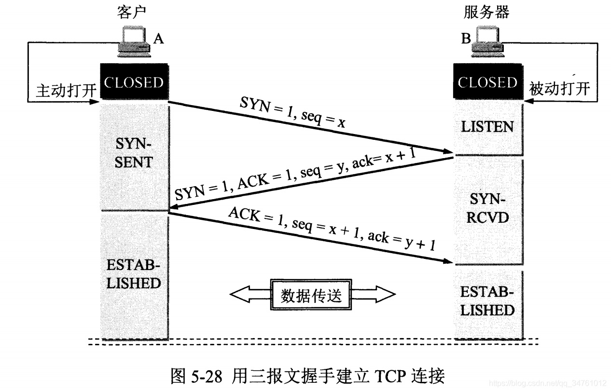
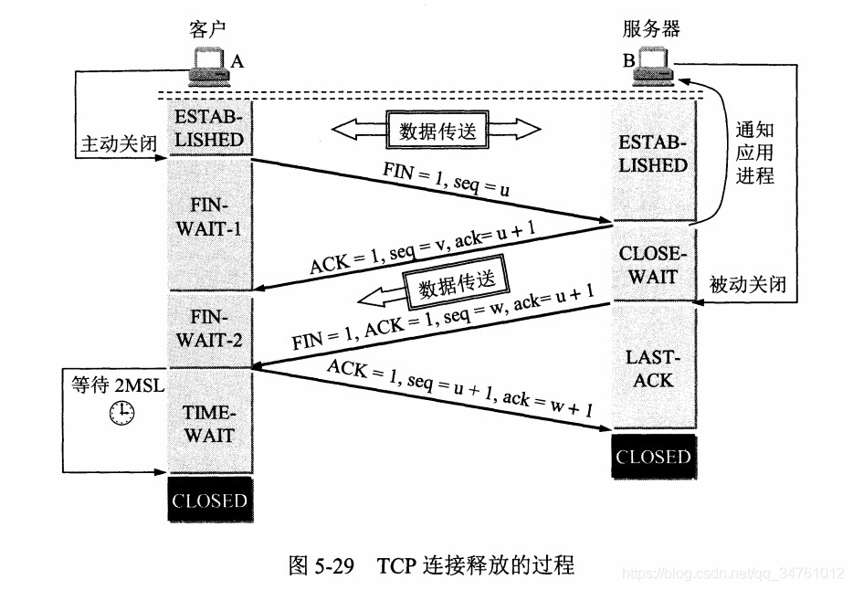

<!-- vim-markdown-toc GFM -->

+ [其它](#其它)
    * [URI与URL](#uri与url)
    * [MSS/Maximum Segment Size](#mssmaximum-segment-size)
    * [MTU/Maximum Transport Unit](#mtumaximum-transport-unit)
+ [概览](#概览)
    * [OSI七层模型](#osi七层模型)
    * [TCP/IP四层模型](#tcpip四层模型)
    * [实际五层结构](#实际五层结构)
+ [应用层](#应用层)
    * [SSH](#ssh)
    * [DHCP](#dhcp)
    * [HTTP](#http)
        - [重要演化](#重要演化)
        - [方法](#方法)
        - [状态码](#状态码)
        - [补丁](#补丁)
            + [应对无状态:Cookie;Session;HTTP/1.1持久连接](#应对无状态cookiesessionhttp11持久连接)
            + [分块传输](#分块传输)
            + [管道传输](#管道传输)
        - [其他](#其他)
            + [Token抵御CSRF(跨站请求伪造)攻击](#token抵御csrf跨站请求伪造攻击)
    * [HTTPS(HTTP over TLS)](#httpshttp-over-tls)
        - [实现](#实现)
            + [混合加密](#混合加密)
            + [数字摘要](#数字摘要)
            + [数字签名](#数字签名)
        - [数字证书](#数字证书)
            + [验证过程](#验证过程)
        - [缺点](#缺点)
    * [DNS](#dns)
        - [传输方式](#传输方式)
            + [UDP:53](#udp53)
            + [TCP:53(特殊情况使用)](#tcp53特殊情况使用)
        - [查询过程](#查询过程)
            + [递归解析(常见、默认)](#递归解析常见默认)
            + [迭代解析](#迭代解析)
    * [QUIC](#quic)
+ [传输层](#传输层)
    * [SSL->TLS](#ssl-tls)
        - [过程](#过程)
        - [证书信任链](#证书信任链)
        - [数字证书与服务器一一对应](#数字证书与服务器一一对应)
    * [TCP](#tcp)
        - [三次握手(建立连接)](#三次握手建立连接)
            + [过程](#过程-1)
            + [原因/优点](#原因优点)
            + [其他问题](#其他问题)
        - [可靠传输](#可靠传输)
            + [超时重传](#超时重传)
            + [自动重传(ARQ,auto repeat request)](#自动重传arqauto-repeat-request)
        - [滑动窗口机制](#滑动窗口机制)
        - [拥塞控制](#拥塞控制)
            + [慢开始](#慢开始)
            + [拥塞避免(加性增、乘性减)](#拥塞避免加性增乘性减)
            + [快重传](#快重传)
            + [快恢复](#快恢复)
            + [TCP拥塞控制扩展](#tcp拥塞控制扩展)
        - [流量控制](#流量控制)
        - [流量控制与拥塞控制](#流量控制与拥塞控制)
        - [四次挥手(正常断开连接)](#四次挥手正常断开连接)
            + [过程](#过程-2)
            + [原因/优点](#原因优点-1)
        - [断开连接(客户端故障：保活计时器+探测报文)](#断开连接客户端故障保活计时器探测报文)
    * [UDP/User Datagram Protocol](#udpuser-datagram-protocol)
+ [网络层](#网络层)
    * [ARP/RARP协议](#arprarp协议)
    * [IP](#ip)
        - [IP数据报](#ip数据报)
        - [划分子网](#划分子网)
        - [广播(仅用于UDP)](#广播仅用于udp)
        - [多播/组播(仅用于UDP)](#多播组播仅用于udp)
    * [NAT](#nat)
    * [ICMP/IGMP](#icmpigmp)
        - [ICMP](#icmp)
        - [IGMP](#igmp)
    * [VPN 虚拟专用网](#vpn-虚拟专用网)
    * [ARP/RARP](#arprarp)
    * [路由协议 ??????????????????不完整？？？？？？？？？？？？？](#路由协议-不完整)
        - [内部网关协议](#内部网关协议)
            + [RIP (应用层协议)](#rip-应用层协议)
            + [OSPF 开放最短路径优先](#ospf-开放最短路径优先)
        - [外部网关协议](#外部网关协议)
            + [BGP](#bgp)
+ [数据链路层](#数据链路层)
+ [物理层](#物理层)

<!-- vim-markdown-toc -->

# 其它

## URI与URL

* URI:Identifier，标识符
* URL:Location，定位符

## MSS/Maximum Segment Size

* 最大消息长度：TCP连接中发送的数据包的单位，理想情况下不会被IP层分片。其长度由双方协商(TCP首部的MSS选项)

## MTU/Maximum Transport Unit

* 最大传输单元：

| 协议  | 端口 | 备注 |
| :---: | :--: | :--: |
|  FTP  |      |      |
| HTTPS |      |      |
|  SSH  |      |      |
| DHCP  |      |      |


# 概览

## OSI七层模型

* 应用层，会话层，表示层，传输层，网络层，数据链路层，物理层

## TCP/IP四层模型

* 应用层，运输层，网际层，网络接口层

## 实际五层结构

# 应用层

## SSH

## DHCP

## HTTP

* 概览:无状态，无连接(每次请求需要建立TCP连接)，明文(无身份确认、无完整性保护)，基于请求和响应，支持任意类型

### 重要演化

* HTTP/1.0:增加PUT、DELETE等方法
* HTTP/1.1:长连接/持久链接，管道
* HTTP/2.0:多路复用，服务器推送

1. 多路复用：通过单一的HTTP/2连接请求发起多重的请求-响应消息，多个请求stream共享一个TCP连接，实现多留并行而不是依赖建立多个TCP连接。

* HTTP/3.0:

### 方法

1. GET/查：查询，参数可以放入URL中(长度受浏览器限制)。该方法在再次访问网站中未改变的页面时可以使客户端使用缓存而节省流量(通过请求时的If-Modified-Since选项和响应时的状态码304 Not Modified实现)。
2. POST/增：提交，数据放在报文内部
3. PUT/改：
4. DELETE/删：

### 状态码

| 错误码 |            含义            |
| :----: | :------------------------: |
|  1XX   |           信息类           |
|  2XX   |           成功类           |
|  3XX   |          重定向类          |
|  301   |          永久转移          |
|  302   |          临时跳转          |
|  4XX   |        客户端错误类        |
|  400   |          请求错误          |
|  401   |          未经授权          |
|  404   |         资源不存在         |
|  5XX   |        服务端错误类        |
|  500   | 服务器内部发生不可预期错误 |
|  503   |   服务器当前不能处理请求   |

### 补丁

#### 应对无状态:Cookie;Session;HTTP/1.1持久连接

1. Cookie(用户通行证): 服务端生成Cookie传输并保存在客户端上，安全性差，如登录认证场景。
2. Session(用户唯一标识):服务端生成Session对象保存在服务端，用SeesionID标识此对象，此SessionID会随Cookie传输到客户端。安全性高，如保存用户购物车。**Session的实现依赖于Cookie**
3. 持久连接

* 客户端和服务端在各自的头中加入Connection: Keep-Alive，当出现对服务器的后继请求时，Keep-Alive 功能避免了建立或者重新建立连接。可以自定义连接重用的次数和保持时间。
* 长连接并不能强制保证连接是活跃的，他能保证当连接被关闭时可以得到一个通知。
* 结束传输：Content-Length指示大小；对于使用分块/chunked传输的动态生成文件则根据chunked编码判断（最后为一个空的chunked）。

4. URL重写：在URL结尾添加一个附加数据以标识该会话
5. 隐藏表单域：将会话ID添加到HTML表单元素中提交到服务器，此表单元素并不在客户端显示

#### 分块传输

* 消息体由数量未定的块组成，并以最后一个大小为0的块为结束。
* 使用方法：HTTP消息头的Transfer-Encoding字段(标示报头将以何种方式进行传输)的值为chunked
* chunked 的优势在于服务器端可以边生成内容边发送，无需事先生成全部的内容。HTTP/2 不支持 Transfer-Encoding: chunked，因为 HTTP/2 有自己的 streaming 传输方式

#### 管道传输

1. 背景：默认情况下 HTTP 协议中每个传输层连接只能承载一个 HTTP 请求和响应，浏览器会在收到上一个请求的响应之后，再发送下一个请求。
2. 作用：通过借助持久连接的机制实现请求的批量提交而不必等待响应后在提交。
3. Note：

* 只有 GET 和 HEAD 请求可以进行管线化，而 POST 则有所限制。
* 管线化不会影响响应到来的顺序。
* HTTP/1.1标准仅仅要求服务器在处理管道传输的响应时不出错，不强制要求响应也要管线化，因此不一定能提升性能，所以Chrome和Firefox默认不提供管线化支持。

### 其他

#### Token抵御CSRF(跨站请求伪造)攻击

* 原理：斩断攻击者推测合法请求的途径
* 实现：

1. 参数加密编码
2. 添加随机参数Token(随机性、一次性、注意保密)

## HTTPS(HTTP over TLS)

* 概览：HTTP+SSL/TLS,主要目的是提供对**服务器**的身份认证，同时保护交换数据的隐私与完整性。

### 实现

#### 混合加密

* 过程：客户端和服务端首先协商好双方加密的方法，服务端发给客户端自己的数字证书(机构颁发或者自己制作)，客户端验证证书的效力(自己制作的需客户端手动验证)。验证证书后科客户端根据前面的协商过程生成会话密钥，随后使用服务端的公钥加密(非对称加密)会话密钥传输给服务端，服务端以私钥解密出会话密钥。随后双方以协商好的会话密钥传输数据(对称加密)。
* 原因：非对称加密资源需求高，服务器无法支持大量的连接

#### 数字摘要

* 通过单向哈希函数对原文(明文)生成固定长度的摘要，？？？？可以比较解密出来的原文的哈希结果和摘要是否一致来防止篡改？？？？

#### 数字签名

### 数字证书

* 内容:服务器的公钥、权威机构的信息、服务器域名。

#### 验证过程

1. 客户端收到这个证书之后，使用本地配置的权威机构的公钥对证书进行解密得到服务端的公钥和证书的数字签名，数字签名经过CA公钥解密得到证书信息摘要。
2. 然后证书签名的方法计算一下当前证书的信息摘要，与收到的信息摘要作对比，如果一样，表示证书一定是服务器下发的，没有被中间人篡改过。

### 缺点

1. HTTPS协议多次握手，延长了页面加载时间
2. SSL证书要钱，SSL的算法耗费资源

## DNS
* 分布式(每个服务器只保存自己的那部分数据)多层级(根->顶级->权威(二级、三级) <->本地>)的域名-IP转换数据库。
* DNS中共有13个根域名服务器**集群**
### 传输方式
#### UDP:53
1. 广泛使用的传输方法，具有较高的传输效率
2. 通信双方需要必须自己处理超时和重传从而保证可靠性。
#### TCP:53(特殊情况使用)
1. 响应数据大于512B(UDP数据部分上限)
2. 区域传送(主域名服务器向辅助域名服务器传送变化的那部分数据)
### 查询过程
1. 客户端查询本机缓存(浏览器->系统)->hosts文件->本地DNS服务器(自己指定的，114、运营商的都属于)
#### 递归解析(常见、默认)
* **本地域名服务器**代替DNS客户端查询，本地DNS服务器得到正确结果后将结果返回给客户端。
1. 本地DNS服务器首先尝试以自身缓存的记录响应客户端。
2. 本地记录查询失败就将DNS请求以自身身份向**根服务器**请求响应。
3. 本地域名服务器收到被要求服务的服务器响应的响应报文
    1. 如果响应报文包含最终的映射记录就返回给DNS客户端。
    2. 否则，向响应报文中指示的下一级服务器发送自己的查询请求重复3。
#### 迭代解析
* 所有查询由**DNS客户端自身**完成
* 启用条件：客户端向本地DNS服务器的请求中未要求递归查询或者本地DNS服务器不支持递归查询。
1. 本地DNS服务器首先尝试以自身缓存的记录响应客户端。
2. 如果本地DNS服务器查询失败，就向客户端返回响应报文(包含根域名服务器的信息)
3. DNS客户端解析收到的DNS报文
	1. 如果报文包含最终的地址映射就结束
	2. 否则DNS客户端将请求发送到响应报文中所指示的下一级域名服务器上，重复3
#### 解析记录

| 解析类别 |                          含义                           |
| :------: | :-----------------------------------------------------: |
|   A<w>   |               <带权重的>域名与其IPV4地址                |
| AAAA<w>  |               <带权重的>域名与其IPV6地址                |
|  CNAME   |       别名记录，允许将多个名字映射到同一台计算机        |
|    NS    | 域名服务器记录，用来指定该域名由哪个DNS服务器来进行解析 |
|    MX    |            邮件交换记录，指向一个邮件服务器             |
|   PTR    |                  反向DNS，主要用于邮件                  |

#### 迭代与递归
1. 所谓递归指的是查询者的身份发生改变
2. 递归查询返回的结果只有两种:查询成功或查询失败；迭代查询/重指引返回最佳的查询点或者主机地址.
3. 从客户端到本地DNS服务器是属于递归查询，而DNS服务器之间就是的交互查询就是迭代查询

### NOTE
1. 理论上，全部域名查询都必须先查询根域名，由于只有根域名才能告诉你，某个顶级域名由哪台服务器管理。
2. 因为根域名列表不多变化，大多数 DNS 服务商都会提供它的缓存（通常为1000小时），因此根域名的查询事实上不是那么频繁。

## DHCP (UDP)
* 作用:自动化配置IP、掩码、网关以及DNS
### 工作过程
1. 客户端发送Discover报文:src=0.0.0.0:68，dst=255.255.255.255:67。将该UDP报文在局域网内广播，如果客户端和 DHCP 服务器不在同一个子网，就需要使用中继代理。
2. 所有收到Discover的DHCP服务端如果可以提供地址就发送offer信息(包含所有预分配的配置信息)，否则送DHCP-NAK报文。
3. 客户端选择一个响应报文准备作为自己的配置，并以**广播**发送Request报文(包含被选择的DHCP服务器的IP地址信)。
4. 收到Request报文的服务端回复ACK报文，允许客户端使用他提供的信息
5. 客户端以广播的方式发送ARP报文，探测是否有主机使用服务器分配的IP地址
	1. 如果在规定的时间内没有收到回应，客户端才使用此地址。
	2. 否则，客户端会发送DHCP-DECLINE报文给DHCP服务器，通知DHCP服务器该地址不可用，并重新申请IP地址
6. 重新登录:直接发送包含前一次所分配的IP地址的DHCP request请求信息，可用就用，不可用就从1 重新开始
7. 更新租约:DHCP客户机启动时和IP租约期限过一半时，DHCP客户机都会自动向DHCP服务器发送更新其IP租约的信息

### 缺点
1. DHCP不能发现网络上非DHCP客户机已经在使用的IP地址；
2. 当网络上存在多个DHCP服务器时，一个DHCP服务器不能查出已被其它服务器租出去的IP地址；
3. DHCP服务器不能跨路由器与客户机通信，除非路由器允许BOOTP转发。

## FTP
* 使用两个端口(控制/数据)共同完成任务
### 工作模式(服务器的主被动)
#### 主动
* 服务器端主动建立数据连接，其中服务器端的端口号为 20，客户端的端口号随机
* 要求客户端开放端口号给服务器端，需要去配置客户端的防火墙。
#### 被动
* 客户端主动建立数据连接，其中客户端的端口号由客户端自己指定，服务器端的端口号随机
* 服务器开放过多端口导致服务器端的安全性减弱

## QUIC

## 网络邮件

# 传输层

## SSL->TLS

* 基础：非对称加密

### 过程

* 分别确定密钥交互算法、对称加密算法、消息认证算法

1. C->S:ClientHello、TLS版本、支持的加密和压缩算法、ClientRandom字符串
2. S->C:ServerHello、TLS版本、Server选择的算法，自己的证书(含公钥)、ServerRandom字符串。
3. C:根据自己信任的CA列表验证证书，可信则使用Server的公钥加密一段自己生成的随机数"premaster secret (预主密钥)"。
4. C->S:传输公钥加密后的随机数"premaster secret (预主密钥)"
5. S:使用私钥解密随机数，使用ClientRandom、ServerRandom和premaster secret通过之前协商的算法生成自己的共享对称主密钥KEY。
6. C->S:将Finish消息使用KEY加密后传输到服务端
7. S->C:
8. 完成，此后使用对称秘钥交互

### 证书信任链

* 即一个证书要依靠上一级证书来证明自己是可信的，最顶层的证书被称为根证书，拥有根证书的机构被称为根CA。
* 验证时需要保证证书的正确性以及证书和域名的对应。
* 证书信任链最终依赖根CA，根证书一般是操作系统自带（Firefox 浏览器通常是使用自带的一套证书信任机制，不受系统证书的影响）。

### 数字证书与服务器一一对应

* TLS握手阶段客户端发送的信息之中不包括服务器的域名，当一个服务器有多个网站时会分不清应该向客户端提供哪一个网站的数字证书。
* 改进:2006年，TLS协议加入了一个Server Name Indication扩展，允许客户端向服务器提供它所请求的域名。

## TCP

* 概述：面向连接、面向字节流(把应用层传下来的报文看成字节流，把字节流组织成大小不等的数据块)、全双工、一对一的可靠传输协议

### 三次握手(建立连接)

* 目的：连接服务器指定端口，建立 TCP 连接并同步连接双方的序列号和确认号，交换TCP窗口大小信息，让双方都确认对方和自己的接收和发送功能是正常的。

#### 过程

1. Client ===> Server:SYN、ack=随机序列号seq1。进入SYN_SENT状态
2. Server ===> Client:ACK、seq=seq1+1、SYN、ack=随机序列号seq2，进入SYN_RCVD状态。未收到响应就重发5次ACK+SYN后进入CLOSED状态。
3. Client ===> Server:ACK、seq=seq2+1。检查seq1的回应后回应进入ESTABLISHED状态，服务端动作相同。

* 

#### 原因/优点

1. 两次：可能会出现已失效的连接请求报文段(在网络中滞留时间过长)又传到了服务器端致使服务器建立无用连接，其次，两次握手无法保证Client正确接收第二次握手的报文（Server无法确认Client是否收到），也无法保证Client和Server之间成功互换初始序列号。
2. 四次：可以但没必要(四次：第二次拆解为两次)

#### 其他问题

1. 随机序列号:避免同一个套接字上建立的多次连接传送的数据混淆(网络中某个包的整体传输时间过长时)。

### 可靠传输

* 依赖校验和，确认和重传机制

#### 超时重传
* 若一个已经发送的报文段在超时时间内($RTO_i = RTTs_i+4*RTTd_i = (1-a)RTTs_{i-1} + aRTT + 4RTTd_i$)没有收到确认，就重传这个报文段。TCP在超时重传失败后其超时时间的确定采用二进制指数退避算法。

#### 自动重传(ARQ,auto repeat request)
* 主要应用在无线链路层
1. 停等式（stop-and-wait）:发完一个就停止，确认后再发下一个
2. 回退n帧（go-back-n）:维持一个发送窗口,不用确认就能发，对last one确认，失败需要回退N
3. 选择性重传（selective repeat）:当发送方接收到接收方的状态报告指示报文出错，发送方只发送传送发生错误的报文。

### 滑动窗口机制

* 滑动窗口存在于发送端和接收端，窗口内为当前可以被发送或接受的所有消息。

1. 发送方窗口：在滑动窗口内的数据才能被传送，窗口的两边分别是已发送但未确认或者未发送(只会出现在一侧)的数据，重传时可以直接从滑动窗口中取数据。
2. 接收方窗口：作为接收方对数据存储的一个缓冲区，它只对最后一个按序到达的字节进行确认，确认后滑动窗口移动以接受新的数据。

### 拥塞控制

* 目的与方法：防止过多数据注入网络(传输失败会重传，导致拥塞加重)，导致网络过载。
* 

#### 慢开始

cwnd以1为初始值，在未到ssthresh(>=2)之前每次成功传输后，cwnd增长为原来的两倍，传输失败就令ssthresh=cwnd/2。

#### 拥塞避免(加性增、乘性减)

当cwnd>ssthresh时，进入拥塞避免，每个成功传输轮次后swnd=cwnd+1，当出现超时令ssthresh = cwnd/2，cwnd从1开始重复满开始和拥塞避免的过程。

#### 快重传

接收方只对最后一个收到的**有序报文段**进行确认，接收方在收到一个失序的报文段后就立即发出重复确认**而不要等到自己发送数据时捎带确认**(可以使发送方及早知道有报文段没有到达对方)，发送方只要一连收到三个重复确认就应当立即重传对方尚未收到的报文段，而**不必等待设置的重传计时器**时间到期。

#### 快恢复

当发送方连续收到三个重复确认时，令ssthresh=cwnd/2，cwnd=ssthresh <+3*MSS>，**直接进入拥塞避免**(在这种情况下，只是丢失个别报文段，而不是网络拥塞)。

#### TCP拥塞控制扩展

1. 基于丢包的拥塞控制：Tahoe、Reno、New Reno
2. 基于时延RTT的带宽预测：vegas
3. 基于丢包和RTT：westwood
4. 二分搜索最佳cwnd：BIC-TCP
5. 连续拥塞间隔：CUBIC
6. 基于精准带宽计算：BBR

* BBR摒弃了丢包和实时RTT作为拥塞控制因素。引入BDP管道容量来衡量链路传输水平。BBR追求的是在链路最小RTT（物理链路延迟）的状态下，找到最大带宽。

### 流量控制

* 目的与方法：通过改变滑动窗口大小控制发送方发送速率
* 滑动窗口
  1. 滑动窗口<=min(拥塞窗口、接受窗口)
  2. 接受窗口：接收端根据自己的资源情况动态调整并在返回ACK时将接受窗口大小放在TCP报文中的窗口字段告知发送方。只有当发送方发送并收到确认之后，才能将发送窗口右移。
  3. NOTE：接受窗口=0时发送方暂停发送数据并启动一个持续计时器(persistence timer)，到期后发送一个大小为1字节的探测数据包，以查看接收窗口状态。如果接收方能够接收数据，就会在返回的报文中更新接收窗口大小，恢复数据传送。

### 流量控制与拥塞控制

* 流量控制是为了让接收方能来得及接收，而拥塞控制是为了降低整个网络的拥塞程度。
* 慢开始和快恢复的快慢指的是cwnd的设定值，而不是cwnd的增长速率。慢开始cwnd设定为1，而快恢复cwnd设定为ssthresh。
* TCP Reno和Tahoe(废弃)：前者在快重传后执行满开始，后者则是执行快恢复

### 四次挥手(正常断开连接)

#### 过程

1. Client ===> Server:FIN、seq1=客户端最后发送序列号+1。(未响应则重发)
2. Server ===> Client:ACK、ack=seq1+1，seq2=服务器端最后发送序列号+1。此后处于**半关闭**状态(只能Server向Client单向发送数据)。
3. Server ===> Client:FIN、ACK、ack=seq1+1，seq2=w。(未响应则重发)
4. Client ===> Server:ACK、seq1=seq1、ack=w+1。等待2MSL后关闭

* 

#### 原因/优点

1. 四次挥手:Server端可能还有数据没有发送完毕，传送完毕后才会进入第三次挥手
2. 客户端不立即关闭:确保最后一个确认报文能够到达;让本连接持续时间内所产生的所有报文都从网络中消失，使得下一个新的连接不会出现旧的连接请求报文。

### 断开连接(客户端故障：保活计时器+探测报文)

服务器每收到一次客户端的请求后都会重新复位一个计时器，时间通常是设置为2小时，若两小时还没有收到客户端的任何数据，服务器就会发送一个探测报文段，以后每隔75秒钟发送一次。若一连发送10个探测报文仍然没反应，服务器就认为客户端出了故障，接着就关闭连接。

## UDP/User Datagram Protocol

* 概述：无连接、支持一对一、一对多、多对一和多对多的通信、面向报文(对于应用程序传下来的报文不合并也不拆分，只是添加 UDP 首部)
* UDP一次发送一个报文,因此，应用程序必须选择合适大小的报文。若报文太长，则IP层需要分片，降低效率。若太短，会使IP太小。
* UDP**提供尽最大努力的交付**，不保证可靠交付。所有维护传输可靠性的工作需要用户在**应用层**来完成。没有TCP的确认机制、重传机制。如果因为网络原因没有传送到对端，UDP也不会给应用层返回错误信息。
* UDP提供简单的差错检验。如果UDP校验和校验出UDP数据报是错误的，可以丢弃，也可以交付上层，但是要附上错误报告，告诉上层这是错误的数据报。

# 网络层

## ARP/RARP协议

## IP

* |  类别   | 前缀(CIDR) | 网络位数 |                NOTE                |       私有地址        |       保留地址        |
    | :-----: | ---------- | :------: | :--------------------------------: | :-------------------: | :-------------------: |
    |    A    | 0(/8)      |    8     |                                    |       10.x.x.x        |    127.x.x.x(环回)    |
    |    B    | 10(/16)    |    16    | 100.64.x.x- 100.127.x.x(运营商NAT) | 172.16.x.x-172.31.x.x | 169.254.x.x(DHCP失败) |
    |    C    | 110(/24)   |    24    |                                    |      192.168.x.x      |                       |
    | D(群播) | 1110(/4)   |  未定义  |                                    |                       |                       |
    | E(保留) | 1111(/4)   |  未定义  |                                    |                       |                       |

### IP数据报
* 首部数据长度是首部字段的二进制数的**4倍**B。
* 总长度：首部长度 + 数据部分长度；
* 首部检验和：数据报每经过一个路由器，都要重新计算检验和；
* 生存时间 ：TTL，它的存在是为了防止无法交付的数据报在互联网中不断兜圈子。以路由器跳数为单位，当 TTL 为 0 时就丢弃数据报。
* 标识 : 在数据报长度过长从而发生分片的情况下，相同数据报的不同分片具有相同的标识符。
* 片偏移 : 和标识符一起，用于发生分片的情况。片偏移的单位为 8 字节。
### 划分子网

* 背景：ABC类别的网络号的基本控制粒度太大，对于一些小子网会造成大量的浪费。划分子网在有类网络的基础上，通过对IP地址的主机号进行再划分，把一部分划入网络号来划分各种类型大小的网络。
* 表示：从主机号借用若干个比特作为子网号，掩码由网络号掩码和子网号掩码组成。
* 支撑技术：VLSM（等长/变长子网划分，新标准中所有子网号都可用）、CIDR（子网聚合，用于路由汇总提高路由查找效率）
* 路由过程：数据报仍然先按照网络号找到目的网络，发送到路由器，路由器再按照网络号和子网号找到目的子网

### 广播(仅用于UDP)

* 实现：借助路由器的转发功能实现，任何情况下路由器都拒绝广播到255.255.255.255

### 多播/组播(仅用于UDP)

## NAT
* 使用端口号的 NAT 也叫做网络地址与端口转换 NAPT，它使得多个专用网内部的主机共用一个全球 IP 地址。

## ICMP/IGMP

### ICMP
* **封装在IP数据报中**，但是不属于高层协议。
* 分为差错报告报文和询问报文。ping(ICMP Echo请求报文)，Traceroute(ICMP终点不可达差错报告报文:向目的主机发送TTL从1递增的ICMP报文，利用TTL的生命期控制间接使报文到达的最后一个节点返回差错报文，此探测路径不一定是真实路径)；

### IGMP

## VPN 虚拟专用网
* 用公用的互联网作为本机构各专用网(几个保留地址段中的网络)之间的通信载体。
* 基于隧道技术：要求多个网段有一个可以连接到互联网的路由器，该路由器A负责将数据进行加密发送到另一个路由器B，B解密并将数据交付到网络内部。

## ARP/RARP

* 作用：**ARP协议完成了IP地址与物理地址的映射，RARP完成物理地址到IP地址的映射**。
* 机制：每个主机会保存自己所在局域网中IP和MAC地址的映射表缓存，需要时先搜索自身后查询。
* ARP过程：查询自身失败后，主机广播ARP请求信息(包含自身IP-MAC映射，查询的IP地址)，局域网主机接收消息并比较是否是自己，如果是则保存消息中的IP-MAC映射并响应广播，主机接到响应后先添加响应的映射后传送数据。如果局域网内查询失败则将ARP查询信息传送到本局域网的路由器上，交给路由器处理(路由器有目标网段的路由表，开启ARP代理，到其他网段的消息都会交给路由器代理转发)。

## 路由协议 ??????????????????不完整？？？？？？？？？？？？？
互联网可以划分为许多较小的自治系统 AS，一个 AS 可以使用一种和别的 AS 不同的路由选择协议。
### 内部网关协议
#### RIP (应用层协议)
* 基于距离向量的路由选择协议。
* 原理：RIP协议让路由器按固定时间间隔后和相邻路由器交换路由表，经过若干次交换后，所有路由器都会知道自治系统中任何一个网络的最短距离和下一跳路由器地址
* 总结：实现简单，开销小；最大距离(跳数)为15限制了网络规模，网络出现故障时要经过较长的时间才能将此信息传递到所有路由器。
```
* 对地址为 X 的相邻路由器发来的 RIP 报文，先修改报文中的所有项目，把下一跳字段中的地址改为 X，并把所有的距离字段加 1；
* 对修改后的 RIP 报文中的每一个项目，进行以下步骤：
* 若原来的路由表中没有目的网络 N，则把该项目添加到路由表中；
* 否则：若下一跳路由器地址是 X，则把收到的项目替换原来路由表中的项目；否则：若收到的项目中的距离 d 小于路由表中的距离，则进行更新（例如原始路由表项为 Net2, 5, P，新表项为 Net2, 4, X，则更新）；否则什么也不做。
* 若 3 分钟还没有收到相邻路由器的更新路由表，则把该相邻路由器标为不可达，即把距离置为 16。
```
#### OSPF 开放最短路径优先

采用**洪泛法**向自治系统中**和所有路由器发送链路状态信息**，之后各自根据最短路径算法算出路由，放在OSPF路由表，OSPF路由与其他路由比较后优的加入全局路由表。

### 外部网关协议
#### BGP

用于AS自治系统间的动态路由协议，用于**AS间交换路由信息**。每个AS都要有一个BGP发言人，代表AS与其他AS交换信息。

# 数据链路层

# 物理层
