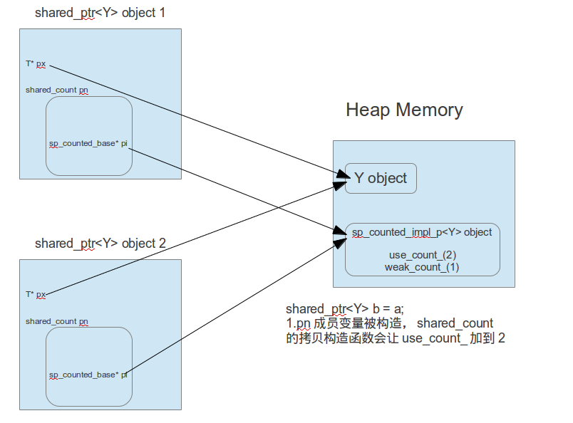
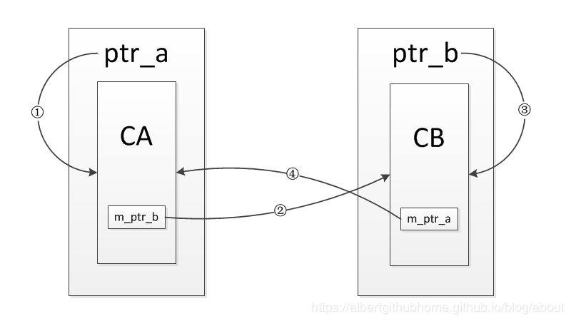
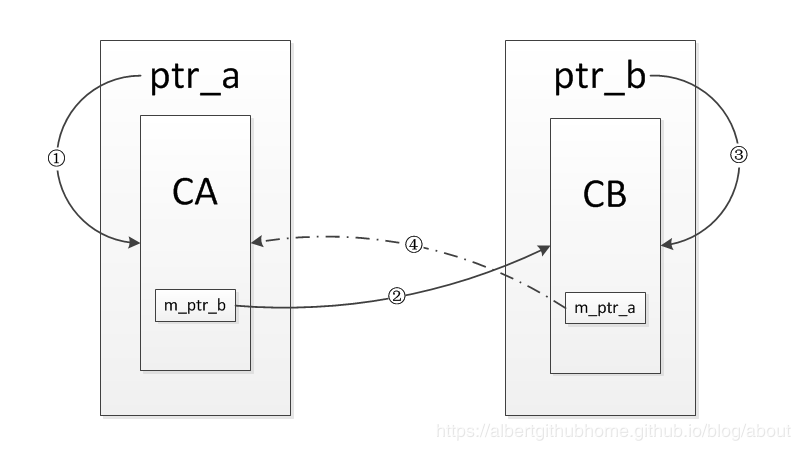
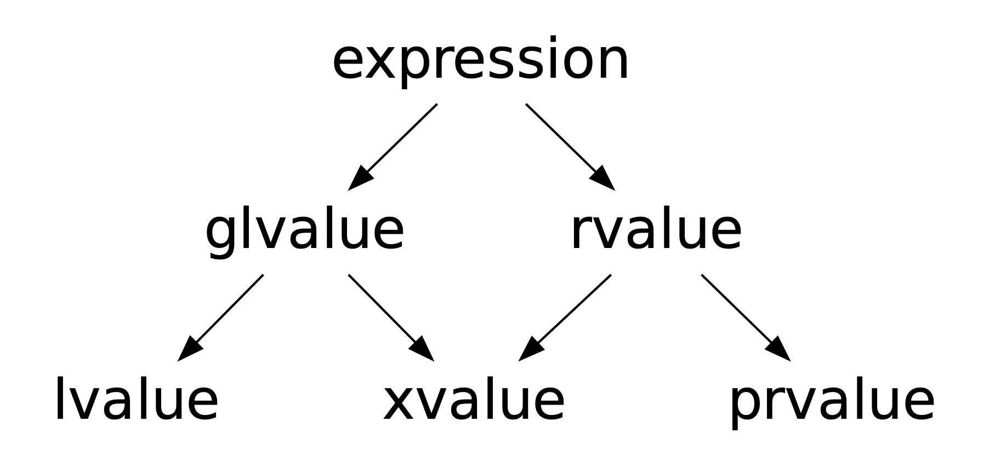
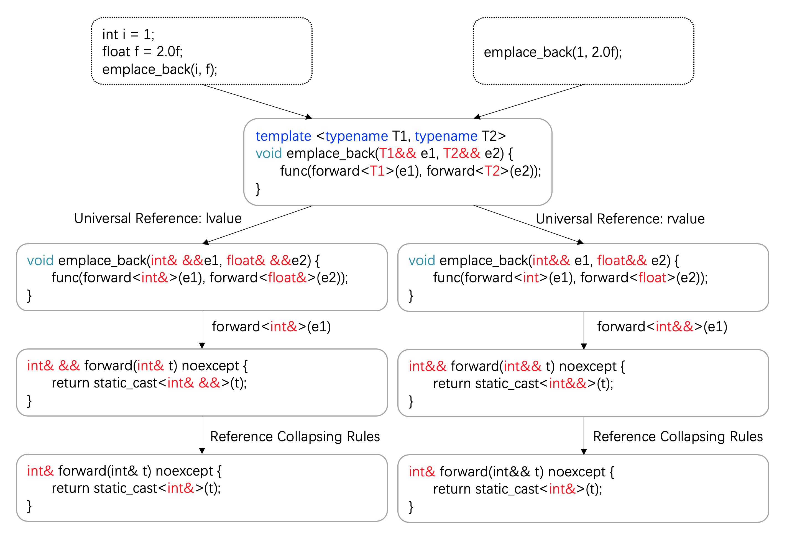
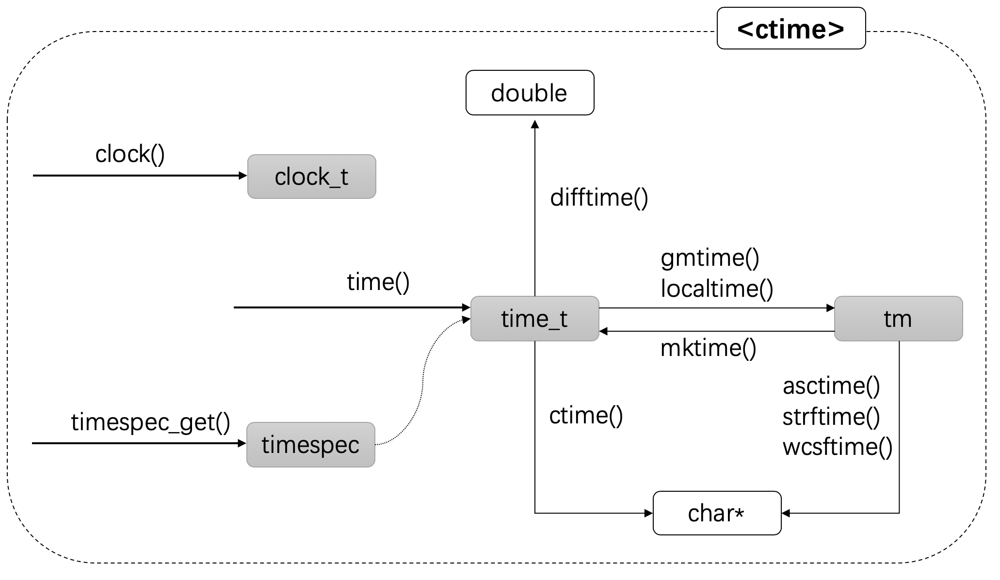
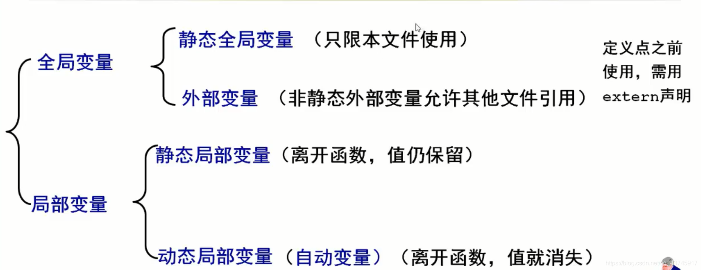
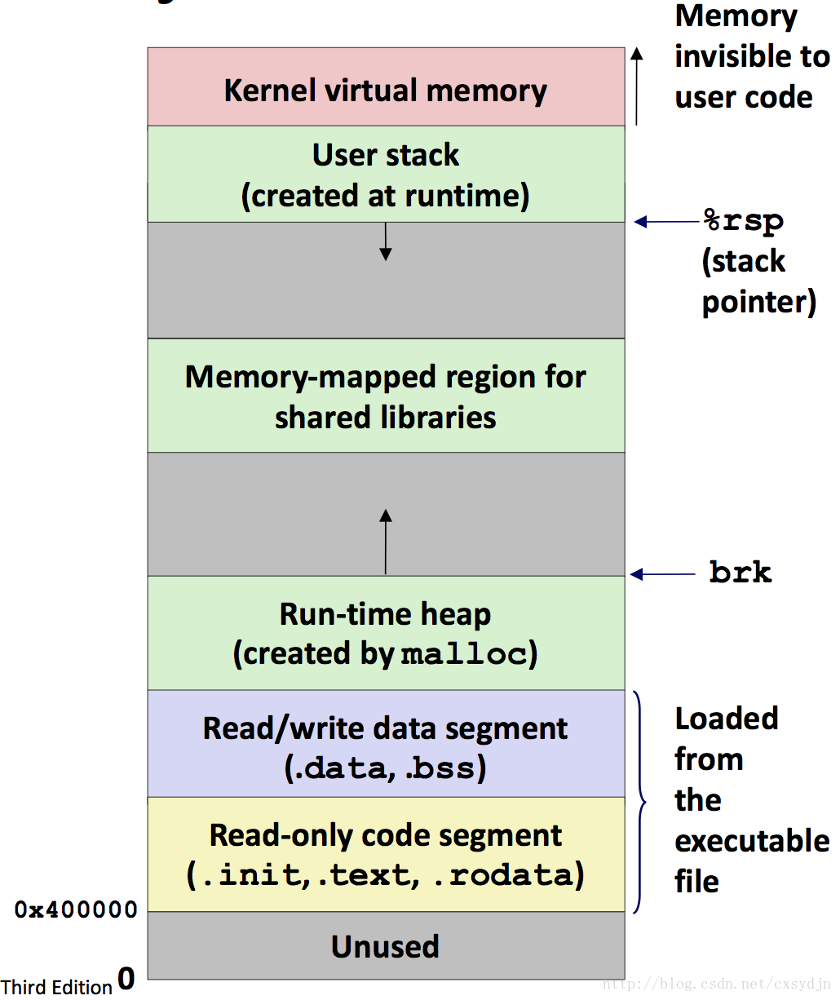

# **目录**

<!-- vim-markdown-toc GFM -->

* [内存管理](#内存管理)
    * [标准库支持](#标准库支持)
    * [new(new operator)的实现](#newnew-operator的实现)
        * [概述](#概述)
        * [operator new()](#operator-new)
            * [重载operator new/new[]](#重载operator-newnew)
        * [`placement new`](#placement-new)
            * [NOTE](#note)
            * [使用](#使用)
        * [new 与 malloc 的区别](#new-与-malloc-的区别)
* [多态](#多态)
    * [动态多态](#动态多态)
        * [设计思想](#设计思想)
        * [实施条件](#实施条件)
        * [实施机制（虚函数与虚函数表）](#实施机制虚函数与虚函数表)
            * [内存模型](#内存模型)
                * [虚表](#虚表)
            * [继承下的虚函数表](#继承下的虚函数表)
            * [虚函数与纯虚函数](#虚函数与纯虚函数)
                * [虚函数](#虚函数)
                * [纯虚函数](#纯虚函数)
        * [总结](#总结)
            * [性能](#性能)
    * [静态多态](#静态多态)
        * [设计思想](#设计思想-1)
* [智能指针](#智能指针)
    * [`auto_ptr`(已弃用)](#auto_ptr已弃用)
    * [`unique_ptr(boost::scoped_ptr)`](#unique_ptrboostscoped_ptr)
    * [`shared_ptr`](#shared_ptr)
        * [数据结构](#数据结构)
            * [引用计数](#引用计数)
        * [用法](#用法)
            * [注意事项](#注意事项)
        * [删除器](#删除器)
        * [循环引用](#循环引用)
            * [`weak_ptr`](#weak_ptr)
        * [线程安全](#线程安全)
    * [其他智能指针](#其他智能指针)
* [表达式](#表达式)
    * [值类别（value category）](#值类别value-category)
        * [两种混合类别](#两种混合类别)
        * [三种具体类别](#三种具体类别)
            * [`lvalue`（左值）](#lvalue左值)
            * [`prvalue`（纯右值）](#prvalue纯右值)
            * [`xvalue`（C++11将亡值）](#xvaluec11将亡值)
    * [值类型（Type）](#值类型type)
        * [指针](#指针)
        * [引用](#引用)
            * [左值引用](#左值引用)
            * [右值引用](#右值引用)
                * [无名右值引用](#无名右值引用)
                * [具名右值引用](#具名右值引用)
                * [转发型/万能/通用引用](#转发型万能通用引用)
                * [引用折叠/引用坍塌](#引用折叠引用坍塌)
        * [左右值重载策略](#左右值重载策略)
            * [一般函数策略](#一般函数策略)
            * [移动语义与完美转发](#移动语义与完美转发)
                * [移动语义`move`](#移动语义move)
                    * [`move`语义（`that->this`）](#move语义that-this)
                    * [`copy`语义（`that->this`）](#copy语义that-this)
                * [完美转发`forward`](#完美转发forward)
                    * [含义](#含义)
                    * [实现](#实现)
            * [引用的绑定优先级](#引用的绑定优先级)
* [返回值优化](#返回值优化)
    * [编译器优化](#编译器优化)
        * [`RVO`自动优化](#rvo自动优化)
        * [`NRVO`自动优化](#nrvo自动优化)
    * [手动优化](#手动优化)
* [String](#string)
    * [三种实现方式](#三种实现方式)
        * [Eager Copy](#eager-copy)
        * [COW / Copy-On-Write](#cow--copy-on-write)
        * [SSO / Small String Optimization](#sso--small-string-optimization)
    * [查找 find](#查找-find)
        * [一般查找](#一般查找)
        * [集合查找](#集合查找)
    * [NOTE](#note-1)
* [随机数](#随机数)
    * [伪随机数](#伪随机数)
    * [真随机数](#真随机数)
            * [Linux 内核熵池](#linux-内核熵池)
    * [C风格随机数](#c风格随机数)
    * [C++11 random](#c11-random)
        * [随机数引擎](#随机数引擎)
        * [随机分布模板类](#随机分布模板类)
        * [一般步骤](#一般步骤)
* [STL容器](#stl容器)
    * [顺序容器(线性结构)](#顺序容器线性结构)
        * [vector](#vector)
        * [deque](#deque)
    * [有序关联式容器(红黑树)](#有序关联式容器红黑树)
    * [无序关联式容器(哈希表)](#无序关联式容器哈希表)
    * [容器适配器：](#容器适配器)
    * [其它](#其它)
    * [堆](#堆)
    * [迭代器支持及失效情况](#迭代器支持及失效情况)
        * [迭代器支持情况](#迭代器支持情况)
        * [迭代器及引用失效情况](#迭代器及引用失效情况)
* [STL算法](#stl算法)
    * [查找算法(13个)：判断容器中是否包含某个值](#查找算法13个判断容器中是否包含某个值)
    * [排序和通用算法(14个)：提供元素排序策略](#排序和通用算法14个提供元素排序策略)
        * [`std::sort()`](#stdsort)
    * [删除和替换算法(15个)](#删除和替换算法15个)
    * [排列组合算法(2个)：提供计算给定集合按一定顺序的所有可能排列组合](#排列组合算法2个提供计算给定集合按一定顺序的所有可能排列组合)
    * [算术算法(4个)](#算术算法4个)
    * [生成和异变算法(6个)](#生成和异变算法6个)
    * [关系算法(8个)](#关系算法8个)
    * [集合算法(4个)](#集合算法4个)
    * [堆算法(4个)](#堆算法4个)
* [STL仿函数与仿函数适配器](#stl仿函数与仿函数适配器)
    * [仿函数](#仿函数)
    * [函数适配器](#函数适配器)
* [STL空间配置器](#stl空间配置器)
    * [默认配置器](#默认配置器)
        * [类型要求](#类型要求)
        * [组成结构](#组成结构)
            * [一级空间配置器](#一级空间配置器)
            * [二级空间配置器](#二级空间配置器)
                * [分配策略](#分配策略)
        * [缺点](#缺点)
    * [自定义配置器](#自定义配置器)
* [STL迭代器](#stl迭代器)
    * [类别](#类别)
        * [基本迭代器类型](#基本迭代器类型)
        * [迭代器适配器](#迭代器适配器)
            * [插入适配器](#插入适配器)
            * [逆向迭代器适配器](#逆向迭代器适配器)
            * [移动迭代器](#移动迭代器)
    * [迭代器模板](#迭代器模板)
        * [迭代器类型萃取](#迭代器类型萃取)
    * [迭代器的移动](#迭代器的移动)
    * [迭代器失效](#迭代器失效)
    * [指针、引用和迭代器](#指针引用和迭代器)
        * [指针](#指针-1)
            * [const与指针](#const与指针)
            * [指针与数组](#指针与数组)
        * [引用](#引用-1)
        * [迭代器](#迭代器)
* [STL正则表达式](#stl正则表达式)
    * [构成](#构成)
        * [正则表达式regex](#正则表达式regex)
        * [搜索匹配算法](#搜索匹配算法)
        * [结果匹配集](#结果匹配集)
    * [实例](#实例)
* [CPP IO处理](#cpp-io处理)
    * [基本流对象](#基本流对象)
        * [文件流](#文件流)
            * [流指针](#流指针)
            * [行结束标志](#行结束标志)
    * [缓冲](#缓冲)
        * [缓冲区](#缓冲区)
        * [应用](#应用)
            * [IO加速](#io加速)
            * [流同步](#流同步)
            * [流关联](#流关联)
        * [影响](#影响)
            * [\n与缓冲刷新](#n与缓冲刷新)
            * [诡异的std::cin](#诡异的stdcin)
    * [流相关迭代器](#流相关迭代器)
        * [输入流迭代器istream_iterator](#输入流迭代器istream_iterator)
        * [输出流迭代器ostream_iterator](#输出流迭代器ostream_iterator)
        * [输出流缓冲迭代器ostreambuf_iterator](#输出流缓冲迭代器ostreambuf_iterator)
        * [输入流缓冲迭代器istreambuf_iterator](#输入流缓冲迭代器istreambuf_iterator)
* [类型推导](#类型推导)
    * [`auto`](#auto)
        * [用法](#用法-1)
        * [限制](#限制)
    * [`decltype`](#decltype)
        * [`decltype(exp)`推导规则](#decltypeexp推导规则)
    * [auto与decltype的不同](#auto与decltype的不同)
        * [对cv限定符的处理](#对cv限定符的处理)
        * [对引用的处理](#对引用的处理)
        * [总结](#总结-1)
    * [traits(类型萃取)](#traits类型萃取)
        * [迭代器相关的类型萃取](#迭代器相关的类型萃取)
        * [在迭代器中的应用和实现](#在迭代器中的应用和实现)
    * [模板函数参数推导规则](#模板函数参数推导规则)
    * [`std::common_type`](#stdcommon_type)
* [可调用对象](#可调用对象)
    * [lambda表达式/闭包](#lambda表达式闭包)
        * [闭包](#闭包)
        * [大致原理](#大致原理)
        * [形式说明](#形式说明)
            * [捕获变量列表`capture`](#捕获变量列表capture)
                * [其他说明](#其他说明)
            * [`parameters`](#parameters)
            * [`multable`](#multable)
            * [`noexcept/throw()`](#noexceptthrow)
            * [`attribute`](#attribute)
            * [`return_type`](#return_type)
        * [其它](#其它-1)
            * [CPP14 lambda表达式增强](#cpp14-lambda表达式增强)
    * [仿函数](#仿函数-1)
    * [`std::function`与`std::bind`](#stdfunction与stdbind)
        * [`std::function`](#stdfunction)
        * [`std::bind`](#stdbind)
            * [参数绑定](#参数绑定)
* [模板](#模板)
    * [模板函数](#模板函数)
        * [模板参数](#模板参数)
            * [默认模板参数](#默认模板参数)
            * [可变模板参数](#可变模板参数)
            * [指明模板实例化参数](#指明模板实例化参数)
                * [调用参数](#调用参数)
                * [返回参数](#返回参数)
                    * [强制返回为值类型](#强制返回为值类型)
            * [推导模板实例化参数](#推导模板实例化参数)
                * [模板形参为值类型（即`T`）](#模板形参为值类型即t)
                    * [模板实参非指针（**衰减**）](#模板实参非指针衰减)
                    * [模板实参为指针](#模板实参为指针)
                * [模板形参非值类型（即`T&、T&&`或`T*`）](#模板形参非值类型即tt或t)
        * [模板参数设计原则](#模板参数设计原则)
        * [模板函数重载与特化](#模板函数重载与特化)
            * [模板函数重载与全特化](#模板函数重载与全特化)
            * [非标准模板函数偏特化](#非标准模板函数偏特化)
    * [模板类](#模板类)
        * [定义](#定义)
        * [实例化](#实例化)
        * [特化](#特化)
        * [模板类与友元](#模板类与友元)
    * [非类型模板参数](#非类型模板参数)
    * [模板参数推导规则](#模板参数推导规则)
    * [干预模板编译](#干预模板编译)
        * [模板类`enable_if<>/ enable_if_t<>`](#模板类enable_if-enable_if_t)
        * [控制模板编译](#控制模板编译)
    * [编译与链接问题](#编译与链接问题)
        * [编译与链接机制](#编译与链接机制)
        * [问题与方法](#问题与方法)
    * [`typename`与`class`](#typename与class)
* [类相关](#类相关)
    * [权限控制](#权限控制)
        * [外部访问控制](#外部访问控制)
        * [特殊权限控制](#特殊权限控制)
            * [构造函数private化](#构造函数private化)
                * [影响](#影响-1)
            * [构造函数protect化](#构造函数protect化)
                * [影响](#影响-2)
            * [析构函数private化](#析构函数private化)
                * [影响](#影响-3)
    * [初始化方法](#初始化方法)
        * [初始化列表](#初始化列表)
        * [就地初始化](#就地初始化)
        * [列表初始化list_initialization](#列表初始化list_initialization)
            * [聚合体](#聚合体)
            * [std::initializer_list](#stdinitializer_list)
        * [委托构造函数](#委托构造函数)
            * [异常处理](#异常处理)
    * [函数](#函数)
        * [The Big Three](#the-big-three)
        * [编译器自动生成的函数(4+2)](#编译器自动生成的函数42)
            * [生成内容](#生成内容)
            * [生成规则](#生成规则)
            * [函数生成管理](#函数生成管理)
                * [使用缺省函数=default](#使用缺省函数default)
                * [禁止函数=delete](#禁止函数delete)
                * [禁止构造函数类型转换explicit](#禁止构造函数类型转换explicit)
        * [自增/减运算符重载](#自增减运算符重载)
        * [`inline`函数](#inline函数)
    * [`friend`成员](#friend成员)
    * [继承](#继承)
        * [虚函数](#虚函数-1)
        * [限制继承`final`](#限制继承final)
        * [继承下的访问控制](#继承下的访问控制)
        * [继承的内容](#继承的内容)
                * [继承除赋值运算符重载](#继承除赋值运算符重载)
                * [继承构造函数](#继承构造函数)
        * [虚继承](#虚继承)
            * [实现原理](#实现原理)
                * [虚基类表](#虚基类表)
            * [NOTE](#note-2)
* [函数与运算符](#函数与运算符)
    * [`sizeof`](#sizeof)
* [类型检查与转换](#类型检查与转换)
    * [类型对比](#类型对比)
        * [`std::is_same<>`](#stdis_same)
            * [`std::decay`类型退化](#stddecay类型退化)
    * [`std::common_type`](#stdcommon_type-1)
    * [类型转换](#类型转换)
        * [传统类型转换](#传统类型转换)
            * [隐式类型转换](#隐式类型转换)
            * [显式/强制类型转换](#显式强制类型转换)
        * [标准类型转换](#标准类型转换)
            * [`static_cast<type-id>(expression)`](#static_casttype-idexpression)
            * [`const_cast<type-id>(expression)`](#const_casttype-idexpression)
            * [`reinterpret_cast<type-id>(expression)`](#reinterpret_casttype-idexpression)
            * [`dynamic_cast<type-id>(expression)`](#dynamic_casttype-idexpression)
        * [建议](#建议)
* [关键字补充说明](#关键字补充说明)
    * [cv限定符](#cv限定符)
        * [`const`](#const)
            * [`mutable`](#mutable)
            * [`const`修饰指针与引用](#const修饰指针与引用)
            * [`const`修饰函数](#const修饰函数)
            * [`const`与`static`](#const与static)
    * [`CPP14: constexpr `](#cpp14-constexpr-)
        * [常量与只读](#常量与只读)
        * [`constexpr`修饰函数/表达式](#constexpr修饰函数表达式)
        * [`constexpr`修饰变量](#constexpr修饰变量)
        * [`constexpr`修饰指针](#constexpr修饰指针)
    * [`volatile`](#volatile)
        * [使用场景](#使用场景)
* [重载、覆盖和改写(隐藏)](#重载覆盖和改写隐藏)
    * [重载**overload**](#重载overload)
        * [重载决议](#重载决议)
            * [名字查找](#名字查找)
            * [重载决议](#重载决议-1)
                * [参数类型匹配](#参数类型匹配)
                * [函数匹配顺序](#函数匹配顺序)
            * [可访问性检查](#可访问性检查)
    * [覆盖**override**](#覆盖override)
    * [改写**overwrite**/隐藏](#改写overwrite隐藏)
    * [总结](#总结-2)
* [异常处理](#异常处理-1)
    * [catch块](#catch块)
        * [catch块支持的类型转换](#catch块支持的类型转换)
    * [throw](#throw)
    * [函数的异常声明列表](#函数的异常声明列表)
    * [异常种类](#异常种类)
        * [标准异常](#标准异常)
        * [自定义异常](#自定义异常)
* [线程与原子操作](#线程与原子操作)
* [C++其它部分新特性](#c其它部分新特性)
    * [C++ 11](#c-11)
        * [`tuple`容器(CPP11)](#tuple容器cpp11)
        * [`decltype`后置返回类型](#decltype后置返回类型)
        * [新初始化机制](#新初始化机制)
            * [就地初始化](#就地初始化-1)
            * [列表初始化](#列表初始化)
            * [委托构造函数](#委托构造函数-1)
        * [外部模板(CPP11)](#外部模板cpp11)
        * [编译时的多重尖括号](#编译时的多重尖括号)
        * [类型别名](#类型别名)
        * [`nullptr`](#nullptr)
        * [可变参数](#可变参数)
            * [C可变参数原理](#c可变参数原理)
            * [可变模板参数](#可变模板参数-1)
                * [可变参数模板类](#可变参数模板类)
                    * [偏特化展开](#偏特化展开)
                    * [继承展开](#继承展开)
                * [可变参数模板函数](#可变参数模板函数)
                    * [递归函数展开参数包](#递归函数展开参数包)
                    * [逗号表达式展开参数包](#逗号表达式展开参数包)
                * [使用场景](#使用场景-1)
                    * [消除代码冗余](#消除代码冗余)
                    * [实现C++版本泛化的委托（`delegate`）](#实现c版本泛化的委托delegate)
            * [可变普通参数(变长参数)](#可变普通参数变长参数)
                * [`initializer_list`实现](#initializer_list实现)
                * [`...`实现](#实现-1)
            * [可变参数基类](#可变参数基类)
        * [`SFINAE`替换失败并非错误](#sfinae替换失败并非错误)
        * [模板类`enable_if`](#模板类enable_if)
            * [类型偏特化](#类型偏特化)
            * [控制函数返回类型](#控制函数返回类型)
            * [校验函数模板参数类型](#校验函数模板参数类型)
        * [强制引用](#强制引用)
        * [字面量](#字面量)
            * [标准字面量](#标准字面量)
                * [整数字面量](#整数字面量)
                    * [形式](#形式)
                    * [note](#note-3)
            * [浮点字面量](#浮点字面量)
            * [字符字面量](#字符字面量)
            * [字符字面量](#字符字面量-1)
            * [布尔字面量](#布尔字面量)
            * [用户定义字面量](#用户定义字面量)
                * [参数与匹配](#参数与匹配)
                * [定义字面量](#定义字面量)
    * [C++14](#c14)
        * [auto实现返回类型自动推导](#auto实现返回类型自动推导)
        * [lambda表达式](#lambda表达式)
        * [`constexpr`](#constexpr)
    * [C++17](#c17)
        * [结构化绑定(CPP17)](#结构化绑定cpp17)
            * [绑定方式(所声明的变量的形式)](#绑定方式所声明的变量的形式)
        * [折叠表达式](#折叠表达式)
        * [模板类自动类型推导CTAD](#模板类自动类型推导ctad)
            * [推断类型模板参数](#推断类型模板参数)
            * [`auto`推断非类型模板参数](#auto推断非类型模板参数)
        * [编译期IF](#编译期if)
        * [折叠表达式补充](#折叠表达式补充)
        * [变长`using`声明](#变长using声明)
    * [C++20](#c20)
        * [Ranges](#ranges)
        * [View](#view)
        * [模块Modules](#模块modules)
        * [协程(Coroutines)](#协程coroutines)
* [文件系统](#文件系统)
    * [基本类](#基本类)
* [时间与日期](#时间与日期)
    * [C风格](#c风格)
    * [`std::chrono`](#stdchrono)
        * [`duration` 时长](#duration-时长)
            * [`std::ratio`](#stdratio)
            * [`std::chrono::duration `](#stdchronoduration-)
        * [`clock` 时钟](#clock-时钟)
        * [`time_point` 时间点](#time_point-时间点)
        * [`std::chrono_literals` (c++14)](#stdchrono_literals-c14)
* [杂项](#杂项)
    * [惯用法](#惯用法)
        * [PIML(pointer to implementation)](#pimlpointer-to-implementation)
    * [作用域与生命期](#作用域与生命期)
        * [名字解析](#名字解析)
    * [文件与内存分段](#文件与内存分段)
* [其他推荐](#其他推荐)

<!-- vim-markdown-toc -->

# 内存管理

## 标准库支持

+ 标准库为`operator new/new[]和operator delete/delete[]`分别提供了抛出和不抛出异常的重载版本。用户可以在全局作用域或类作用域定义自己的重载并实现。
+ note:`new[]`与`delete[]`需要成对使用，原因在于这一对函数是为对象数组服务的。`new[]`为了保存数组的大小信息，在申请内存时多申请了4B(32bit下)放在首部来存储长度信息，而delete也需要长度信息来确定调用析构函数的次数

## new(new operator)的实现

### 概述

+ 具体实现方法没有一定之规，一般要经历以下3个步骤：

1. 调用`operator new`函数（`new[]`调用的时`operator new[]`函数）分配一块足够大的未命名的原始内存空间。
2. 编译器调用类的构造函数构造对象，传入初值。
3. 完成对象构造后返回对象指针。

### operator new()

+ `operator new()`只分配所要求的空间，调用相关对象的构造函数初始化空间由`new operator`在`operator new`返回之后完成。

+ `operator new()`可以在不能分配内存而返回异常（是否返回异常取决于是否有`nothrow`参数）之前通过`set_new_handler()`指定的回调函数`void new_handler(void)`完成一些操作(可以先释放一些空间，然后再尝试申请空间)。

#### 重载operator new/new[]

+ C++标准规定`new operator`与`delete operator`的行为是不能够也不应该被改变，只有`operator new`与`operator delete`允许被重载。
+ 要求：重载可以带其他参数、第一参数必须是表示要求分配的空间大小的`size_t`类型、返回值必须是`void*`类型。

### `placement new`

`placement new`是标准库提供的**`operator new`的重载**版本，它本身并不分配内存。`placement new`执行时忽略了`size_t`参数，只是在第二参数代表的的指针指向的内存空间（堆、栈甚至静态存储区）上构造对象，返回指向已经分配好的某段内存（此段内存已经被对象的构造函数初始化过）的一个指针。

```c++
void *operator new( size_t, void * p ) throw() { return p; }///原型
Object * p = new (address) ClassConstruct(...)///使用
```

由于是在已经预先准备好的内存中分配内存，避免了查找可用内存空间和一些系统调用，非常适合那些对时间要求比较高，长时间运行不希望被打断的应用程序。

#### NOTE

+ 利用`placement new`实现的对象不一定能使用`delete`系列函数释放空间(这个内存不一定是`new`动态申请的），但是这一类对象**必须显式调用类的析构函数**。但是如果所使用的空间是在堆上分配的，在程序结束时一定要释放这块堆内存。

#### 使用

  ```cpp
class X{
public:
    X() { cout<<"constructor of X"<<endl; }
    ~X() { cout<<"destructor of X"<<endl;}
    void function(int n) {}
};

int main(){
    char* buf = new char[sizeof(X)]; //1:分配内存buf（堆上、栈上或者直接指向有意义的地址都可）
    X *px = new(buf) X;     //2:在刚才已分配的缓存区调用placement new来构造一个对象。
    px->function(10);     //3:按照普通方式使用分配的对象。
    px->~X();       //4:使用完这个对象就显式调用它的析构函数\。
    delete []buf;      //5:释放buf(取决于1)
    return 0;
}
  ```

### new 与 malloc 的区别

|            |         new operator          |      malloc      |
| :--------: | :---------------------------: | :--------------: |
|  分配大小  |       自动计算类型大小        |     参数指定     |
| 对象初始化 |     自动调用构造函数完成      | 不支持自动初始化 |
|  异常处理  | `bad_alloc`或者构造函数的异常 |      不支持      |
|   返回值   |     对象类型的指针或异常      | void\*指针或null |
|  内存调整  |       借助`realloc`函数       |      不支持      |

`realloc`：如果原指针指向的空间有足够的连续空间则原地扩大可分配的内存地址返回原指针，否则寻找满足长度的连续内存空间并将数据拷贝到新空间返回新空间首地址并释放原地址空间

# 多态

多态指的是对同一接口调用会表现出不同行为的一种现象。可分为静态多态和动态多态：

## 动态多态

又称**运行时多态、晚绑定（基类虚函数定义接口，继承类负责实现）**，实现方法为虚函数。

### 设计思想

+ 在基类中把多个相关的对象共同的功能声明为多个公共的虚函数接口。各个子类重写这些虚函数以完成具体的功能。客户端的代码（操作函数）通过指向基类的引用或指针来操作这些对象，对虚函数的调用会自动绑定到实际提供的子类对象上去。
+ 只有当程序运行时才能最终确定调用的具体的方法

### 实施条件

1. 含有虚函数的基类
2. 继承自虚基类的子类，子类和基类的成员函数签名完全相同(返回值、函数名、参数列表)
3. 将子类对象的指针或者引用赋值给基类类型的指针或引用并以此调用虚函数

### 实施机制（虚函数与虚函数表）

+ 对于含有虚函数的基类，其对象的空间的最前面会占用一个地址长度来保存一个地址，该地址指向类的虚函数表
+ 编译器在处理非虚函数时，会将函数地址或相关信息直接编码到二进制代码中，在二进制执行的过程中直接跳转对应的代码段，而虚函数在绑定时不会明确绑定到一个可执行的地址。
+ 一个基类的多个子类实例在调用同一函数时之所以表现不同，是因为类的成员函数在编译时被编译器自动在参数列表中加入了`this`指针参数，不同对象的`this`指针各不相同，通过虚函数表最终确定的函数地址也不相同。

#### [内存模型](https://jacktang816.github.io/post/virtualfunction/)

```C++
class A {
  public:
    virtual void v_a(){}
    virtual ~A(){}
    int64_t _m_a;
};

int main(){
    A* a = new A();
    return 0;
}
```

每个类有一个或多个虚函数表（不同编译器实现有差别），对象 A 实例的头部持有`vtable` 指针（指向代码段中的 A 类型的虚函数表中的第一个虚函数起始地址），紧接着是 A 对象按照声明顺序排列的成员变量。


##### 虚表

存在于只读数据段`.rodata`中，由**表头和虚函数表**两部分组成：

**`typeinfo`**：存储了一个类的基本信息（包括类名以及父类，对于没有父类的 A 来说，当前`tinfo`是 `class_type_info` 类型的），关键字`typeid`返回的就是此字段。

**`offsets`：**即下图中的紫色框内容，该内容**仅限于虚继承**的情形（无虚继承则无此内容）

**`offset to top`：**指到对象起始地址的偏移值，只有多重继承的情形才有可能不为0，单继承或无继承的情形都为0。

**`RTTI information`：**是一个指向`typeinfo`对象的指针（即上文提到的`typeinfo`指针），它用于唯一地标识该类型

**`virtual function pointers`**：即虚函数表，每一个表项**按照虚函数的申明顺序**记录了一个虚函数的地址（**每个虚析构函数在虚函数表中会存在两个表项**：分别对应栈构造和堆构造时的析构函数），**`vtable`指向的是第一个表项**。


#### 继承下的虚函数表

1. 单继承无重写：则表无覆盖，子类的虚函数表项接到父类的表项之后。
2. 单继承有重写：子类重写的虚函数地址会覆盖父类中被重写的虚函数的表项，其他子类虚函数表项接到后面。
3. 多继承无重写：子类含有**多个虚函数表和多个虚函数表指针**（`linux/g++`）。子类的虚函数表项被放在第一个申明的基类的虚函数表项的后边构成一张表，其余基类的虚函数表被依次放到后边，此时子类持有多个虚函数表。
4. 多继承有重写：子类重写的虚函数地址**会覆盖所有基类**中被重写的虚函数的表项，其余同第三条。
5. 有虚函数的虚继承：
6. 无虚函数的虚继承：

#### 虚函数与纯虚函数

##### 虚函数

**希望**子类可以各自为自己父类提供的虚函数提供个性化的实现，当子类没有实现时可以使用父类的缺省实现。因此**虚函数必须提供实现**。

##### 纯虚函数

+ 思想：**强制**子类必须提供纯虚函数的个性化实现，否则子类还是一个纯虚基类。
+ 申明在**基类中的不强制需要实现**的虚函数（这样的类被称为**抽象类，不能实例化**对象），纯虚函数在派生类中定义以后，派生类才能实例化出对象。
+ 如果不加显式约束的话，基类的纯虚函数在子类中自动变为了虚函数。
+ **NOTE**：析构函数可以是纯虚的，但**纯虚析构函数必须有定义体**，因为子类会隐含调用父类的析构函数。

### 总结

|               优点               |           缺点           |
| :------------------------------: | :----------------------: |
|  **分离了接口与实现**，方便复用  |     运行时绑定有开销     |
| 便于处理同一继承体系下的异质对象 | **编译器无法优化虚函数** |
|                                  |      不方便修改接口      |

#### 性能

**单继承（开销很小）：**时间上仅仅只是增加了很少几次寻址的过程，而且需要跳转的地址都是不需要计算的，因此时间上并不会增加多少开销。

**多继承：**由于会根据多个父类生成多个`vptr`，在对象里为寻找 `vptr` 而进行的偏移量计算会变得复杂一些，但这些并不是虚函数的性能瓶颈。**虚函数运行时所需的代价主要是虚函数不能是内联函数（不能进行内联展开）**

**编译器会给每一个包含虚函数或继承了虚函数的类自动建立一个虚函数表**，所以虚函数的一个代价就是会增加类的体积。**如果存在大量的子类继承，且重写父类的虚函数接口只占总数的一小部分的情况下，会造成大量地址空间浪费。**

## 静态多态

又称编译器多态、**早绑定（模板定义接口，类型参数定义实现）**，实现的方法有函数重载以及模板

### 设计思想

+ 对于相关的对象类型，直接实现它们各自的定义，不需要共有基类，甚至可以没有任何关系。只需要各个具体类的实现中要求相同的接口声明，这里的接口称之为隐式接口。客户端把操作这些对象的函数定义为模板，当需要操作什么类型的对象时，直接对模板指定该类型实参即可（或通过实参演绎获得）。
+ 系统在编译期就可以确定程序将要执行哪个函数。

|           优点           |                             缺点                             |
| :----------------------: | :----------------------------------------------------------: |
|      方便了泛型编程      |            模板实现：代码膨胀、编译耗时、调试困难            |
|  效率高：编译器可以优化  | 不能处理异质对象（存储、指向类型不一致的数据对象，如基类下的几个子类） |
| 可以通过特化处理特殊类型 |                                                              |

# [智能指针](https://www.cnblogs.com/ChinaHook/p/7684268.html)

1. 设计目的：为了避免使用原生指针不当造成的内存泄漏（忘记释放）以及非法引用（被提前释放内存）的问题，设计智能指针概念来自动管理内存，其具有指针的部分行为。
2. 设计思想：`RAII(Resource Acquisition is Initialization)`使用类来管理（而非拥有）资源，将资源和对象的生命周期绑定，也就是说在构造函数中申请分配资源，在析构函数中释放资源。
3. 实现原则：智能指针对象作为普通变量被分配在栈空间，当智能指针对象离开作用域或者其引用失效时，智能指针对象自动调用其析构函数来管理对象所持有的资源。

与普通指针相比，智能指针仅提供`->` 、`*`和`==`运算符，没有`+`、`-`、`++`、`--`、`[]`等运算符。对于指针是否为空支持原生指针的判断方式，也支持重载`operator bool()`的判空方式。

## `auto_ptr`(已弃用)

C++98的方案，C++11已经抛弃。采用**排它所有权**模式，当出现语法中允许的拷贝构造和赋值时，资源所有权会由源对象转移到新对象中，此时再使用源对象时会空引用，为了解决问题设计了`unique_ptr`。此外`auto_ptr`在析构中使用的`delete`也不能管理动态开辟的数组。

## `unique_ptr(boost::scoped_ptr)`

**独占资源所有权**，实现独占式拥有或严格拥有概念，保证同一时间内只有一个智能指针可以指向该对象（只允许用右值进行赋值，在语义上禁止了拷贝构造和赋值运算：库中将函数申明为`private`且不实现这两个函数），不允许其他的智能指针共享其内部的指针。

`unique_ptr`提供了对**数组管理**的支持，且同样**可以指定删除器**（指定形式和`shared_ptr`不同）。

```c++
//管理数组
unique_ptr<int []> ptr(new int[10]);   //ok

//自定义删除器
shared_ptr<int> ptr(new int(1), [](int *p){delete p;});//ok，不需指明函数签名
unique_ptr<int> ptr2(new int(1), [](int *p){delete p;});//error
unique_ptr<int, void(*)(int *)> ptr2(new int(1), [](int *p){delete p;}); //ok，必须指明函数签名
```

## `shared_ptr`

### 数据结构

遵循**共享资源所有权**，不同的 `shared_ptr` 对象可以与相同的指针相关联，这多个对象会共用一个**原子引用计数**记录内存单元被引用的次数。在**`shared_ptr`内部主要是两个指针**，一个指针指向所管理的资源对象，另一个指针指向维护引用计数的数据对象。



#### 引用计数

引用计数`__shared_count`内部的拥有`use_count`和`weak_count`两个引用计数

|     成员     |             作用             |
| :----------: | :--------------------------: |
| `use_count`  | 标记**被管理对象**的生命周期 |
| `weak_count` |  标记**管理对象**的生命周期  |

### 用法

**构造：**可以通过传入`operator new`得到的普通指针（ 不能是栈指针，因为析构时默认使用的是`delete`）、`auto_ptr、unique_ptr、weak_ptr`来构造（**智能指针不支持直接使用裸指针赋值**）。推荐使用`make_shared<>()`构造`shared_ptr`，其传递的**参数**必须能够与该类型的某个**构造函数相匹配**。

**修改：**`reset()`包含两个操作。当智能指针中有值的时候，调用`reset()`会使引用计数减1。当调用`reset(new  xxx()))`重新赋值时，智能指针首先是生成新对象，然后将原对象的引用计数减1（如果原对象引用计数为0时，则析构旧对象），最后将新对象的指针交给智能指针保管。

**删除：**调用`release()`时当前指针会计数减一，计数等于0时释放资源，支持**自定义删除器**。

#### 注意事项

1. 不要用一个原始指针初始化多个`shared_ptr`，原因在于会造成二次销毁
2. 不要在函数实参中创建`shared_ptr`。因为C++的函数参数的计算顺序在不同的编译器下是不同的。正确的做法是先创建好，然后再传入。
3. 禁止通过将`this`以`shared_ptr`返回，因为`this`指针本质是一个裸指针，这样可能导致重复析构。返回本类指针应当继承`std::enable_shared_from_this<>`后使用`shared_from_this()`。
4. 避免循环引用，应当使用`weak_ptr`。
5. 避免使用`get`返回的原生指针，因为当最后一个对应的智能指针销毁后，`get`的指针就变为无效了。

### [删除器](https://blog.51cto.com/u_11142019/1846847)

智能指针是用来管理资源（动态内存、文件等）的，因此**可以用智能指针来管理文件等其他资源**，此时就不能用智能指针默认的删除器，因为要管理文件的话最后是`fclose`而不是`delete`，所以就必须自己定制一个删除器。

```c++
//自定义内存管理时的删除器
void DeletePtr(int *p){
   delete p;
}
std::shared_ptr<int> p(new int, DeletePtr);

///删除器可以是lambda表达式,上面的代码还可以这样写
std::shared_ptr<int> p(new int, [](int *p) { delete p; });

/// 为智能指针定制删除器，如下为数组定制了删除器
std::shared_ptr<int> p(new int[10], [](int *p) { delete[]p; });

function(std::shared_ptr<int>(new int, g()/*g是自定义的删除器*/);///error
//因为c++的函数参数的计算顺序在不同的编译器不同的调用约定下可能不一样，一般是从右到左，也有可能从左到右，所以可能是先new int，然后调用g()，如果g()调用发生异常，而此时shared_ptr<int>还没有创建成功，则int内存泄露了所以正确的方式是应该先创建好智能指针，然后保存在一个变量中，在用变量作参数

//定置管理文件资源的智能指针
shared_ptr<FILE> sp(fopen("test.txt","w"), [](void *ptr){fclose((FILE *)ptr);});
```

### [循环引用](https://www.codenong.com/cs105903979/)

| 引用类型 |                   说明                   |
| :------: | :--------------------------------------: |
|  强引用  | 当被引用的对象仍活着的话，这个引用也存在 |
|  弱引用  |     当引用的对象活着的时候不一定存在     |

```c++
struct B;
struct A{shared_ptr<B> apb};
struct B{shared_ptr<A> bpa};
{
	shared_ptr<A> pa = make_shared<A>();//pa->use_count = 1;
	shared_ptr<B> pb = make_shared<B>();//pb->use_count = 1;
	pa->apb = pb; //pb->use_count = apb->use_count = 2;
	pb->bpa = pa; //pa->use_count = bpa->use_count = 2;
}//离开作用域后，pa,pb会自动将计数减1，只有各自的引用计数为0时才会释放资源，而此时各自引用计数为1不为0
```



#### `weak_ptr`

`weak_ptr`指向一个`shared_ptr`管理的对象，对该对象进行内存管理的是强引用的`shared_ptr`，**`wake_ptr`作为`shared_ptr`的观察者**，其构造和析构不会改变強引用的计数，和`shared_ptr`配合用来解决循环引用。

但由于`wake_ptr`没有重载`operator *`和`operator ->`，因此不能使用其访问指向对象，需要使用`lock()`方法从`wake_ptr`得到`shared_ptr`后才可以访问资源。同时由于`weak_ptr`不控制生命周期，于是**存在`weak_ptr`指向的对象被释放而`weak_ptr`仍存在的情况**，此时`lock()`会返回一个空的`shared_ptr<>`对象，此外`weak_ptr`还提供了**`expired()`**来判断所指对象是否已经被销毁。

```c++
struct B;
struct A{weak_ptr<B> apb};//任意一个成员改为weak_ptr
struct B{shared_ptr<A> bpa};
{
	shared_ptr<A> pa = make_shared<A>();//pa->use_count = 1;
	shared_ptr<B> pb = make_shared<B>();//pb->use_count = 1;
	pa->apb = pb; //pb->use_count = apb->use_count = 1; apb->weak_count = 1;
	pb->bpa = pa; //pa->use_count = bpa->use_count = 2;
}//离开作用域后，pa,pb会自动将计数减1，
//pb.use_count-=1变为pb.use_count=0,同时pb->bpa->use_count-=1，此时pb->bpa->use_count=bpa->use_count=pa->use_count=1
//pa->use_count-=1后pa->use_count=0,自动释放资源
```



### 线程安全

`shared_ptr` **引用计数本身是安全且无锁的，但对象的读写则不是**，因为 `shared_ptr` 有两个数据成员，对所管理的对象的读写操作没有原子化，因此多线程写（析构也是写）所管理的对象时不安全。`shared_ptr` 的线程安全级别和内建类型、标准库容器、`string` 一样。

## 其他智能指针


5. `scoped_arry`：功能和`scoped_ptr`相同，但是重载了`operator[]`函数，可以管理数组
6. `shared_arry`：功能和`shared_ptr`相同，但是重载了`operator[]`函数，可以管理数组

# 表达式

C++表达式（expressions）由运算符和操作数的组成的序列，每个表达式可以实现计算数值、指明数据对象或函数、产生副作用（运行时对数据对象或文件的修改）等一个或多个作用。每个表达式求值将得到一个结果`result`，这个结果有**类型（type）和值类别（value category）**两个互相独立的属性。

## 值类别（value category）

左值（`lvalue`）和右值（`rvalue`）这两个术语源于C++的祖先语言：[CPL](https://en.wikipedia.org/wiki/CPL_(programming_language))。在后来的发展中，**`lvalue`代表了`locator value`对应了具有内存地址的对象，右值仅仅是临时使用的值**。C++中的值类别主要从具名和可移动性两方面划分，由两个方面构成三种原始值类别（有一种组合不存在），每个表达式都属于三种值类别（`prvalue，xvalue，lvalue`）中的一种，值类别会影响表达式的含义、影响函数的重载（右值引用和`const`左值引用时）。

**具名（identity）**：可以确定表达式是否与另一表达式指代同一实体。

**可移动性**：移动构造函数、移动赋值运算符或实现了移动语义的其他函数重载能够绑定到这个表达式。

### 两种混合类别

**`glvalue`（泛左值）**：可以自动放弃身份转换成`xvalue`；**支持多态**（动态类型和静态类型不一样，如指向子类的父类指针）；支持表达式允许下的**不完整类型**（如由前置声明但未定义的类类型）。

**`rvalue`（右值）**：不支持对其取址和任何方式的赋值；可以用来初始化右值引用和**`const`左值引用**；可以影响函数重载（作为实参时**优先匹配右值引用的形参**而非`const`左值引用形参）。



|                        | 拥有身份（`glvalue`） | 不拥有身份 |
| :--------------------: | :-------------------: | :--------: |
| **可移动（`rvalue`）** |       `xvalue`        | `prvalue`  |
|      **不可移动**      |       `lvalue`        |   不存在   |

### 三种具体类别

#### `lvalue`（左值）

特征：具有`glvalue`所有的特征；**支持取址**和任何形式的赋值；可以初始化所有左值引用。

例：函数名、变量名、**字符串字面值**、返回左值引用的函数调用、前置自增/自减运算符连接的表达式、由赋值运算符或复合赋值运算符连接的表达式、解引用表达式等。他们的**求值结果相当于字面值或是一个不具名的临时对象**。

**函数参数永远是一个左值**，即使它(在函数的参数列表中)的类型是一个右值引用，因为函数调用时参数是需要被压栈的，这意味着参数一定有其地址。

#### `prvalue`（纯右值）

特征：具有`rvalue`所有的特征；不支持多态、不完全类型；不会是抽象类型或数组。

例：除字符串字面值以外的字面值、返回非引用类型的函数调用、后置自增/自减运算符连接的表达式、算术表达式、逻辑表达式、比较表达式、取地址表达式等。

#### `xvalue`（C++11将亡值）

将亡值是随着右值引用的引入而新引入的，与右值引用息息相关

特征：它具有所有`rvalue`和`glvalue`所有的特征。

例：返回右值引用的函数的调用表达式、转换为右值引用的转换函数的调用表达式

## 值类型（Type）

C++中的值类型（这里的值类型不同于通常说的数据类型：即复合数据类型的值类型仍然可以是简单类型）主要分为简单数据类型和复合数据类型（常见的如指针、引用）。一般的变量声明形式为：**`Base_Type (compound)...declarator`**，当没有复合类型声明时声明的变量的类型就是普通类型，否则该变量就是复合数据类型。

### 指针

在C++中**指针作为一个不透明的实体存在**，使用指针必须进过解引用。

### 引用

《`C++`的设计与演化》中说**加入“引用”这个语言特性的契机是为了方便运算符重载**（为了让运算符重载的语法能够更加接近内建的运算符，需要对函数的返回值赋值，这就要求函数返回一个左值，当使用指针返回时又不够简洁，因此引入了引用这一特性）。

引用又有左值引用、右值引用之分。借助库函数`is_lvalue_reference(),is_rvalue_reference(),is_reference()`判断引用类型。

#### 左值引用

即常见的一类引用方式。实际上是开辟了内存用于保存被引用变量的地址，只要一旦使用该引用，编译器内部就会**自动进行解引用到实际对象**。[来源](https://juejin.cn/post/6860648369695260680)

#### 右值引用

右值引用是指向右值的引用，当右值被绑定到右值引用后，其生命周期将捆绑到右值引用上，此时可以修改右值引用所引用的值。成为右值引用对象意味着该对象所持有的资源的所有权可以安全的被转移给其他对象，从而避免了拷贝、析构等操作，消除了标准库中的大量不必要的开销(容器等)，同时为其他标准库提供了实现的可能。

##### 无名右值引用

指**由右值引用相关操作所产生的引用类型**（主要通过返回右值引用的类型转换操作产生，如`static_cast<T&&>(t)`）
**无名右值引用是右值**，标准规定无名右值引用和传统的右值一样具有潜在的可移动性，即它所占有的资源可以被移动（窃取）。

##### [具名右值引用](https://juejin.cn/post/6860648369695260680)

 如果某个变量或参数被声明为T&&类型，并且**T无需推导**即可确定，那么这个变量或参数就是一个具名右值引用。**具名右值引用是左值**，编译器为其开辟了一块**内存空间**存储信息（大小为地址值大小(`x64: 8`字节)+右值数据所占大小） ，对右值引用的修改结果保存在该空间。

```assembly
#int &&a = 1的汇编	 https://cppinsights.io/
# 在栈上开辟了12字节，后4字节存放(int)1，前8字节存放内容的地址
mov     DWORD PTR [rbp-12], 1
lea     rax, [rbp-12]
mov     QWORD PTR [rbp-8], rax
```

##### 转发型/万能/通用引用

**形如T&&且包含类型推导的引用形式**可以被称为通用引用（如`auto&&`以及某些模板类/函数的参数），否则就是右值引用。万能引用即可以绑定到左值引用又可以绑定到右值引用，其**实际引用方式取决于其被初始化时所使用的对象的引用类型**。

1. 由于万能引用既能够绑定右值引用也可以绑定左值引用，所以可以被设计作为函数的参数，可以避免为不同的参数类型分别定义实现不同的重载函数。
2. 当应用1时到函数重载时又会造成问题，由于通用引用的类型推导可以匹配到大量的类型（重载时精确匹配优先于类型提升转换），由于这种贪婪性质，万能引用和重载结合会造成问题。

##### 引用折叠/引用坍塌

由于C++禁止引用的引用，在引入了右值引用后，可能存在左值引用与右值引用之间的折叠，所以编译器需要对四种情况(也就是`L2L,L2R,R2L,R2R`)折叠/坍缩成一种单一的引用。C++确定了其规则为**左值引用会传染**：只有右值引用叠加到右值引用上仍是一个右值引用，除此之外都是左值引用。

| 形参的声明类型 | 调用时的参数类型 | 推导出的形参类型 | 推导出的模板参数类型 |
| :------------: | :--------------: | :--------------: | :------------------: |
|      `T&`      |       `t&`       |       `t&`       |         `t`          |
|     `T&&`      |       `t&`       |       `t&`       |         `t&`         |
|      `T&`      |      `t&&`       |       `t&`       |         `t`          |
|     `T&&`      |      `t&&`       |      `t&&`       |         `t`          |

### 左右值重载策略

#### 一般函数策略

利用函数重载和左右值引用参数不同的绑定特性实现在函数中区分参数的左右值属性，根据参数左右值属性的不同做出不同的处理。

```c++
struct X {};
void f(const X& param1){/*处理左值参数param1*/}
void f(X&& param2){/*处理右值参数param2*/}
 
X a;
f(a);            //调用左值版本
f(X());          //调用右值版本
f(std::move(a)); //调用右值版本
```

| 重载版本 |  函数参数  |                              注                              |
| :------: | :--------: | :----------------------------------------------------------: |
|   左值   | `const T&` |        在没有右值版本的重载时可以退而求其次使用此版本        |
|   右值   |   `T&&`    | 标准规定**在绑定右值时右值引用参数的优先级高于`const`左值引用参数** |

#### 移动语义与完美转发

**右值引用是`move`和`forwaed`的基础**，其语义容易造成其一定执行了某种动作的错觉，其实**`move`和`forwaed`都是`static_cast<>()`的类型转换的一个封装**：`move`是一个无条件的将参数转换为右值的函数模板，`forwaed`是一个在不同条件时调用不同模板将参数转发的模板。

##### 移动语义`move`

移动语义指的是通过移动（窃取）其他对象所拥有的资源来完成某个对象**接管另一个对象所拥有的外部资源的所有权**的过程。其实现**依赖于无名右值引用和具名右值引用**（`move<>`产生无名右值引用，具名右值引用接收无名右值引用）。

###### `move`语义（`that->this`）

**①**：释放`this`（`this`非空时，如移动赋值运算）：如果`this`对象自身也拥有资源，释放该资源

**②**：移动`that` ：将this对象的指针或句柄指向that对象所拥有的资源

**③**：标记`that`：将`that`对象原本指向该资源的指针或句柄设为空值

###### `copy`语义（`that->this`）

**①**：释放`this`（`this`非空时，如拷贝赋值运算）：如果this对象自身也拥有资源，释放该资源

**②**：拷贝`that`：拷贝（复制）`that`对象所拥有的资源

**③**：设置`this`：将this对象的指针或句柄指向新生的资源

**④**：释放`that`（`that`为右值时）：如果`that`对象为临时对象（右值），那么拷贝完成之后`that`对象所拥有的资源将会因`that`对象被销毁而即刻得以释放

**传递`move`包装过的参数不一定发生了移动**，只有被`move`操作的值类型（实现了移动构造函数或移动赋值函数的类）本身支持`move`操作时才发生`move`，否则发生的任然是`copy`（如基本类型）。

```C++
template<typename _Tp> constexpr typename std::remove_reference<_Tp>::type&& move(_Tp&& __t) noexcept{
    return static_cast<typename std::remove_reference<_Tp>::type&&>(__t);
}///Convert a value to an rvalue.
```

##### [完美转发`forward`](https://blog.csdn.net/zwvista/article/details/12306283)

###### 含义

完美转发是指函数模板在向其他函数转发（传递）自身参数（形参）时**保留该参数（实参）的左右值属性**的特性，这样做**是为了保留在其他函数针对转发而来的参数的左右值属性进行不同处理的可能性**（比如参数为左值时实施拷贝语义；参数为右值时实施移动语义）。

###### 实现

**问题**：要想在一个函数模板中转发参数的左右值属性，参数就必须具有同时接收左右值属性的能力，即模板参数必须被声明为**转发型引用`T&&`**，按照转发型引用的特点，该形参将根据实参的左右值属性而分别蜕变成左右值引用，而该**形参在模板函数内部永远是左值**（左值引用和具名右值引用都是左值），如果在模板类原样转发该参数，那么**转发的将永远是左值**。因此单纯依靠转发型引用也就无法实现完美转发的任务。

要想实现此功能，需要借助库函数`std::forward<T>(t)`并**将模板参数设置为转发型引用**，通过使用`forard<T>`封装的`static_cast<T>`可以实现将参数`t`转发为`T&&`类型（实际使用时此处有引用折叠、详情见代码）。

|    `t`的实参类型    | `T&&`被推导出的模板参数类型 | `t`在模板参数中的类型 | `std::forward<T>(t)`的类型 |
| :-----------------: | :-------------------------: | :-------------------: | :------------------------: |
| 左值（类型为`U&`）  |      `U&`（引用折叠）       |     具名左值引用      |        无名左值引用        |
| 右值（类型为`U&&`） |       `U`（引用折叠）       |     具名右值引用      |        无名右值引用        |
|  右值（类型为`U`）  |            `U&&`            |     具名右值引用      |        无名右值引用        |

```c++
struct X {};
void inner(const X&) {cout << "inner(const X&)" << endl;}
void inner(X&&) {cout << "inner(X&&)" << endl;}
template<typename T> void outer(T&& t) {inner(std::forward<T>(t));}///完美转发参数t

X a;
outer(a);//inner(const X&)
outer(X());//inner(X&&)
```



```c++
template<typename _Tp> constexpr _Tp&& forward(typename std::remove_reference<_Tp>::type& __t) noexcept{
    return static_cast<_Tp&&>(__t);///由于引用折叠，此处被转化为左值引用
}///Forward an lvalue.

template<typename _Tp> constexpr _Tp&& forward(typename std::remove_reference<_Tp>::type&& __t) noexcept{
    static_assert(!std::is_lvalue_reference<_Tp>::value, "template argument substituting _Tp is an lvalue reference type");
    return static_cast<_Tp&&>(__t);///由于引用折叠，此处被转化为右值引用
}///Forward an rvalue.
```

#### [引用的绑定优先级](https://juejin.cn/post/6860648369695260680)

| 实参`argument` \ 形参`parameter` | `T&` | `const T&` | `T&&` | `const T&&`（一般不用） |
| :------------------------------: | :--: | :--------: | :---: | :---------------------: |
|           **`lvalue`**           |  1   |     2      |   -   |            -            |
|        **`const lvalue`**        |  -   |     1      |   -   |            -            |
|           **`rvalue`**           |  -   |     3      |   1   |            2            |
|        **`const rvalue`**        |  -   |     2      |   -   |            1            |

数值越小代表越被优先使用，如果不存在则代表不匹配（`const`左值引用可以结合任何类型的实参），如果同时存在 传值`(by value) `重载（接受值类型参数 `T`），会和上述传引用`(by reference) `重载产生歧义，编译失败。

# 返回值优化

## 编译器优化

一个函数若直接返回类对象，一般会生成临时类对象变量，需多次调用拷贝构造函数（copy constructor）造成效率低下，编译器对此优化，省略其中的拷贝构造环节，达到提升效率的目的（尤其是对需要分配大量内存的类对象其值复制过程。这一类优化通常称为**[复制省略/消除（Copy elision）](https://en.cppreference.com/w/cpp/language/copy_elision)**，GCC默认启用了该优化可以通过`-fno-elide-constructors`关闭。RVO与NRVO都是复制消除的实现。

### `RVO`自动优化

编译器开启**`RVO`（返回值优化）**需要满足以下**三点**：返回的是值类型（不支持任何引用类型）、返回的是**匿名局部对象**、返回的值类型与函数签名的返回值类型相同。`RVO`**不支持**函数可能返回具有不同变量名的对象以及函数有多个返回出口的情况。

其具体实现是编译器让**被调函数将返回值构建在调用者的栈上**：调用函数在其栈上分配空间，然后将这块内存的地址传递给被调函数，被调函数直接在这块内存上构造返回值， 这样就消除从函数内部`return`出来时临时对象的复制问题。

### `NRVO`自动优化

`NRVO`（`Named Return Value Optimization`：具名返回值优化）与`RVO`的区别在于函数返回的临时值是否是具名的，当操作数是拥有自动存储期的**具名非`volatile`对象**、且具有和声明的函数返回类型相同的类型时，这种复制消除的变体称为`NRVO`。

## 手动优化

1. 使用`const`引用`const Foo& foo = f()`

2. 使用右值引用`Foo&& foo = f()`，此时调用了移动构造函数

# String

C++中`string`只是一个特化的模板类（`typedef basic_string<char>`)，类似的还有`wstring、u8string、u16strin、u32string`。它将字符存储为**字节序列而非字符序列**并提供**访问单字节字符的功能**。

## 三种实现方式

string中一般含有至少三个比较重要的字段：`char *data`（指向存放字符串的首地址，SSO中可能没有），`size_t size`（字符串长度。），`size_t capacity`（字符串容量）。

### Eager Copy

在每次拷贝时将原 string 对应的内存以及所持有的动态资源完整地复制一份，每个对象互相独立的拥有资源。

### COW / Copy-On-Write

**写时复制**：核心在于**惰性处理多个实体的资源请求**，即在多个实体之间共享某些资源，直到有实体需要对资源进行修改时，才真正为该实体分配私有的资源。该方法既可以减少不必要的资源分配（新实体不修改资源时），又将分配和复制大量资源带来的瞬间延迟进行了**延后**。

此方案下只有在某个 string 要对共享对象进行修改时，才会真正执行拷贝，因此存在共享机制（需要一个`std::atomic<size_t> refcount`表示资源被多少对象共享，此时涉及到**线程安全**的问题）。该方案下`lazy-copy`行为只发生在**两个string对象之间**的拷贝构造，赋值和assign()操作上。


### SSO / Small String Optimization

**基于字符串大多数比较短的特点**，利用 string 对象本身的栈空间来存储短字符串，当字符串长度大于某个临界值时使用eager copy方式。

```cpp
class string {
  char *start;
  size_t size;
  static const int kLocalSize = 15; // 临界值，≤该值时数据存储在union中。
  union{
    char buffer[kLocalSize+1];      // 满足条件时，用来存放短字符串
    size_t capacity;
  }data;
};
```


## 查找 find

所有查找方法返回的值的类型都是该模板类内部定义的`size_type`类型（一般为int类型），表示被查找的对象在string中的位置（未找到返回值为-1的`string::npos`）；所有6个查找函数中每个函数都提供了四个重载版本，一共24个查找函数。
```cpp
size_type find_first_of(const basic_string& s, size_type pos = 0)
size_type find_first_of(const charT* s, size_type pos, size_type n)
size_type find_first_of(const charT* s, size_type pos = 0)
size_type find_first_of(charT c, size_type pos = 0)
```
标准库中的查找算法比较复杂（详见[知乎](https://www.zhihu.com/question/392846851)），在不同平台下实现不一样。要想实现高效的搜索推荐使用泛型算法`std::search()`，该算法提供了[default_searcher](https://zh.cppreference.com/w/cpp/utility/functional/default_searcher)、[boyer_moore_searcher](https://zh.cppreference.com/w/cpp/utility/functional/boyer_moore_searcher)、[boyer_moore_horspool_searcher](https://zh.cppreference.com/w/cpp/utility/functional/boyer_moore_horspool_searcher)三种搜索算法。

### 一般查找

即`string::find()、string::rfind()`，支持正、反向在字符串中查找一个字符或者字符串。

### 集合查找

支持在字符串中查找集合中的某个元素：

|         函数          |                       作用                       |
| :-------------------: | :----------------------------------------------: |
|   `find_first_of()`   |   查找并返回包含子串中**任何字符**的第一个位置   |
| `find_first_not_of()` |  查找并返回不包含子串中**任何字符**的第一个位置  |
|   `find_last_of()`    |  查找并返回包含子串中**任何字符**的最后一个位置  |
| `find_last_not_of()`  | 查找并返回不包含子串中**任何字符**的最后一个位置 |

## NOTE

1. `const char* string::data()`函数返回的字符串指针不会以'\0'结束，其大小为size()的返回值。`const char* string::c_str()`返回一个以“\0”结尾的字符串指针。

2. 由于`data()和c_str()`函数返回的指向数组的指针由string拥有，指针在`string`更改后**可能会失效**。

3. 可以使用facebook开源的[`FBString`](https://github.com/facebook/folly/blob/master/folly/docs/FBString.md)(查找使用了更高效的BM算法)替代`string`。

4. 多数string的实现采用的是SSO方式，COW中”共享“的实现影响了**多线程环境下**string”拷贝“的性能，同时为了保证COW实现的正确性，string认定`operator[]、at()`具有修改的语义（但实际可能并没有）。

# 随机数

## 伪随机数

计算机是一个可预测的系统，因此不可能通过算法来产生真正的随机数。计算机中所谓的随机数通常都是通过随机算法计算出来的可以被近似看作随机数的伪随机数。常见的随机数算法有线性同余法（随机性差但生成效率高）、梅森旋转法（随机性高但生成效率低）。

## 真随机数

#### Linux 内核熵池

虽然计算机本身可预测，但计算机的运行环境中充满了各种不可预知的噪声，例如来自设备驱动的噪声、随机的鼠标点击间隔、硬件设备发生中断的时间等等。Linux 系统维护了一个专门用于收集上述噪声的**熵池**（entropy pool），**利用熵池可以产生产生真随机数**。Linux向外部暴露了**`/dev/random、/dev/urandom`**两个字符文件接口用于获取熵池的信息，其中**前者在熵池耗尽时会阻塞**对其的所有操作直到收集足够多的环境噪声。后者准确说它是一个伪随机数生成器，它的随机数种子来自于熵池，不存在阻塞的问题（即使熵池为空`/dev/urandom`仍然能产生随机数）。

## C风格随机数

```c++
#include <cstdlib>
#include <ctime>
 
std::srand(std::time(nullptr)); /// 以当前时间为随机生成器的种子
int random_variable = std::rand();///rand()返回一个随机数。
```

**NOTE**：`srand((unsigned)time(null))`设置的种子在程序运行过快或者使用了多线程时如果采用循环获取随机数每次返回的随机数都是一样的，C++11提供了真随机数做种子的方法来解决这一问题。

## C++11 random

`random`中的随机数发生器主要由**分布对象和随机数引擎**对象组成。其中随机数引擎用于根据随机数种子来产生随机数，分布对象对产生的随机数根据需求进行分布。

### 随机数引擎

随机数引擎以种子数据为熵源生成伪随机数，C++提供了三种伪随机数生成算法/引擎（线性同余、梅森旋转、滞后Fibonacci），三个引擎适配器和9个预定义的实例化的生成器。此外还有一个实例化的`default_random_engine`类（实现由编译器厂家决定），其产生的随机数范围是在`[default_random_engine::min()， default_random_engine::max()]`之间。


**`random_device`也可以作为一种随机数引擎**，器噪声来源可由构造函数指定（在Linux下读取的是`/dev/urandom`设备，Windows下的实现是用`rand_s`）。由于每次去调用`random_device`读取文件的代价较大，而且在生成大量随机数时会造成性能下降，因此`random_device`一般都作为随机数种子而非随机数引擎使用。

### 随机分布模板类

C++通过分布器可以使随机数的出现符合一定的分布，如均匀分布类，波努力分布类、正态分布类、两段分布类。这些概率分布函数都是有参数的，在类的构造函数中把参数（随机数引擎）传进去即可。

```c++
std::random_device sd;//生成random_device对象sd做种子(真随机数)
std::minstd_rand linearRan(sd());//使用种子初始化linear_congruential_engine对象
std::uniform_int_distribution<int>dis1(0,1);//生成01序列
for(int i=0; i<100; i++)///生成100个符合均匀分布的随机数
	std::cout << dis1(linearRan) << std::endl;///随机分布函数需要传入一个随机数引擎作为参数
```

### 一般步骤

1. 定义random_device对象或其他获取初始化种子的方式。
2. 选择随机引擎（默认、线性、梅森、斐波那契）的实现类，将种子传入引擎。
3. 创建分布对象，并用引擎初始化分布对象输出随机数。

# STL容器

由于默认分配器的原因，容器都**不支持保存具有CV限定符的类型的元素**。

## 顺序容器(线性结构)

* `array、vector、list、forward_list、deque`

### vector

1. `vector`的理论存储上限可以调用`vector<>::max_size`得到。

+ `vector<bool>`并不是一个STL容器，底层存储的并不是`bool`类型值，每个`bool`值都只使用一个比特位来存储。`vector<bool>`的`operator[]`返回的其实是一个代理对象，不满足容器要求的`opertor[]`返回指向元素的地址的要求。其本身是实验产物，注意在`for`循环中使用`auto`对`vector<bool>`遍历时，`auto`不会被推导为`bool`。

### deque

1. `deque`是**动态的以分段连续空间组合而成**，随时可以增加一段新的空间并链接起来，`deque`最大的工作就是维护这些分段连续的内存空间的整体性的假象，并提供随机存取的接口，避开了重新配置空间，复制，释放的轮回。
2. `deque`由主控和存储区构成，通过主控维持整体连续的假象。所谓的主控是一小块连续的内存空间，其中每一个元素(此处成为一个结点)都是一个指向另一段称作缓冲区的连续性内存空间的指针，缓冲区才是`deque`的存储空间的主体。
3. `deque`的实现决定了其迭代器复杂度和`vector`不是一个量级，并不适合直接使用算法中需要随机迭代器支持的算法。

## 有序关联式容器(红黑树)

* `set、multiset、map、multimap`

+ 红黑树是一种平衡二叉搜索树

1. 迭代器：由于红黑树本身有序，因此其迭代器可以视作对树的一种便利方法。
2. 由于红黑树任何一个结点都是独立的，修改其中一个结点不会影响到其他的元素在内存中的位置，所以对于关联容器插入删除都不会导致任何迭代器失效，除了指向被删除元素的迭代器。
3. `set`与`map`的区别在于所使用的红黑树的节点的具体类型有所不同，`map`使用了`pair`结构。
4. 红黑树提供的`insert_unique`和`insert`提供了multi系列的支持。

## 无序关联式容器(哈希表)

* `unordered_set、unordered_multiset、unordered_map、unordered_multimap`

+ 上述四个容器的底层实现都依靠STL中的`hash_table`与`hase_table_node`结构，其中`hash_table`提供的`insert_unique`和`insert_equal`为`multi`系列依靠hash的容器提供了支持。

1. 标准库中哈希冲突的默认解决方法为链接法。
2. hash函数:[常见哈希函数](https://blog.csdn.net/AlburtHoffman/article/details/19641123)，[各种字符串Hash函数比较](https://byvoid.com/zhs/blog/string-hash-compare/)
    - SGI STL的实现中定义了`hash<>()`模板的仿函数，对`int、long、char\*`等基本数据类型进行了特化，其中整数`hash`为恒等映射，对于`char*`类型所指的字符串的五进制（每个s[i]是s[i]的`ansic`值）整数表示做其`hash`结果[详情](https://blog.csdn.net/jmh1996/article/details/103763028)
    - VS STL的实现中硬编码了几个魔数，具体解释可参看[链接](https://blog.csdn.net/jmh1996/article/details/103763028)
3. 哈希表中每个元素称为一个桶（`bucket`），每个被插入的元素利用哈希函数映射到对应的桶。为求得更好的性能，桶数量通常是质数（使用质数作为桶数，保证了即使是很简单的哈希函数整个`hashteble`的效率也不会太低），库通过打表加速质数的选择。
4. 所支持的都是前向迭代器，迭代器只支持operator++操作。

### 扩容

为了能让桶数量动态增长，用`vector`作为桶的容器。

## 容器适配器

* `stack、queue、priority_queue`

1. 容器适配器本质上还是容器，只是为了特定的使用功能将基础容器中的函数实现进行了组合、优化或者重写。
2. 容器适配器的底层容器并不是固定的，STL对**`stack`和`queue`默认使用`deque`实现，`priority_queue`默认使用`vector`实现**;

## 其它

1. `assign`与`operator=`：其基本作用都是为容器赋值，`assign`的使用更广一些。
2. `at`与`operator[]`：`at`提供边界检查，越界会抛出`out_of_range`异常。
3. `array、vector、string`**`deque`**提供了随机访问迭代器支持的容器
4. `map`系列的容器支持按照`key`值删除元素
5. 算法的区间采用前开后闭的原因：可以统一空集的表示
6. `list`和`forward_list`容器都根据自身实现提供了`sort`成员函数来加速排序。
7. `string`的`size`和`length`没有本质区别，`length`是为了保持C风格而保留的老式函数。
8. `erase`方法返回了指向被删除元素的下一个元素的迭代器。
9. `vector`和`deque`支持`shrink_to_fit()`自动紧缩内存

## 堆

STL中并没有直接的数据结构实现了堆，但却在`vector`的结构上实现了堆的一系列操作。

1. 基于vector建堆：`make_heap`
2. 再对vector构成的堆变动之后的调整：`push`之后的`push_heap`，`pop`之后的`pop_heap`;
3. 对vector是否构成堆的判别操作：`is_heap`以及找到破坏堆的`is_heap_until`

## 迭代器支持及失效情况

+ [cppreference](https://zh.cppreference.com/w/cpp/container)底部提供了详细的各种容器的迭代器和引用在插入和操作后的失效情况说明,以及各容器支持的接口分布.

### 迭代器支持情况

|            不支持            |                             前向                             |                双向                |            随机             |
| :--------------------------: | :----------------------------------------------------------: | :--------------------------------: | :-------------------------: |
| `stack,queue,priority_queue` | `forward_list,unordered_map,unordered_set,unordered_multimap,unordered_multiset` | `list,map,set,multi_map,multi_set` | `vector,string,array,deque` |

### 迭代器及引用失效情况

1. 底层为数组的容器(`vector,string`)在插入删除点之后的失效(因为操作引起了存储转移),该点及之前的保持有效.
2. 底层为链表的容器 (`list,forward_list`)插入后均保持有效,删除后仅删除点失效.
3. 底层为红黑树 (`map,set,multimap,multiset`)插入后均有效,删除后除了删除点之外的均有效.
4. 底层为哈希表 ( `unordered_map,unordered_set,unordered_multimap,unordered_multiset`)在删除后除删除点之外均有效,插入后引用均合法,如果插入导致了重哈希则迭代器失效(少见).
5. `deque`在修改中部后迭代器和引用均失效,插入首尾失效,删除则仅操作点失效

# STL算法

## 查找算法(13个)：判断容器中是否包含某个值

1. `adjacent_find`：   在iterator对标识元素范围内，查找一对相邻重复元素，找到则返回指向这对元素的第一个元素的 `ForwardIterator`。否则返回last。重载版本使用输入的二元操作符代替相等的判断。
2. `binary_search`： 在有序序列中查找value，找到返回true。重载的版本实用指定的比较函数对象或函数指针来判断相等。
3. `count`：利用等于操作符，把标志范围内的元素与输入值比较，返回相等元素个数。
4. `count_if`：利用输入的操作符，对标志范围内的元素进行操作，返回结果为true的个数。
5. `equal_range`： 功能类似`equal`，返回一对iterator，第一个表示lower_bound，第二个表示upper_bound。
6. `find`：利用底层元素的等于操作符，对指定范围内的元素与输入值进行比较。当匹配时，结束搜索，返回该元素的一个`InputIterator`。
7. `find_end`：  在指定范围内查找"由输入的另外一对iterator标志的第二个序列"的最后一次出现。找到则返回最后一对的第一 个`ForwardIterator`，否则返回输入的"另外一对"的第一个`ForwardIterator`。重载版本使用用户输入的操作符代替等于操作。
8. `find_first_of`： 在指定范围内查找"由输入的另外一对iterator标志的第二个序列"中任意一个元素的第一次出现。重载版本中使用了用户自定义操作符。
9. `find_if`：使用输入的函数代替等于操作符执行find。
10. `lower_bound`：   返回一个`ForwardIterator`，指向在有序序列范围内的可以插入指定值而不破坏容器顺序的第一个位置。重载函数使用自定义比较操作。
11. `upper_bound`：  返回一个`ForwardIterator`，指向在有序序列范围内插入value而不破坏容器顺序的最后一个位置，该位置标志一个大于value的值。重载函数使用自定义比较操作。
12. `search`：  给出两个范围，返回一个`ForwardIterator`，查找成功指向第一个范围内第一次出现子序列(第二个范围)的位置，查找失败指向last1。重载版本使用自定义的比较操作。
13. `search_n`：  在指定范围内查找val出现n次的子序列。重载版本使用自定义的比较操作。

## 排序和通用算法(14个)：提供元素排序策略

1. `inplace_merge`：  合并两个有序序列，结果序列覆盖两端范围。重载版本使用输入的操作进行排序。
2. `merge`：合并两个有序序列，存放到另一个序列。重载版本使用自定义的比较。
3. `nth_element`：  将范围内的序列重新排序，使所有小于第n个元素的元素都出现在它前面，而大于它的都出现在后面。重载版本使用自定义的比较操作。
4. `partial_sort`：对序列做部分排序，被排序元素个数正好可以被放到范围内。重载版本使用自定义的比较操作。
5. `partial_sort_copy`： 与`partial_sort`类似，不过将经过排序的序列复制到另一个容器。
6. `partition`： 对指定范围内元素划分，使用输入的函数把结果为true的所有元素放在前半部分，**返回后半部分第一个值的迭代器**。
7. `random_shuffle`：对指定范围内的元素随机调整次序。重载版本输入一个随机数产生操作。
8. `reverse`：  将指定范围内元素重新反序排序。
9. `reverse_copy`：与`reverse`类似，不过将结果写入另一个容器。
10. `rotate`： 将指定范围内元素移到容器末尾，由middle指向的元素成为容器第一个元素。
11. `rotate_copy`：   与`rotate`类似，不过将结果写入另一个容器。
12. `sort`： 以升序重新排列指定范围内的元素。重载版本使用自定义的比较操作。
13. `stable_sort`：与`sort`类似，不过保留相等元素之间的顺序关系。
14. `stable_partition`：与`partition`类似，不过不保证保留容器中的相对顺序。

### `std::sort()`

需要注意的是**STL中的`sort()`算法为内省式排序，是一种混合式的排序算法**。综合使用了快速排序算法、堆排序算法、插入排序算法：

- 在数据量很大时采用正常的快速排序，此时效率为O(logN)。
- 一旦分段后的数据量小于某个**阈值（16）**，就改用插入排序，因为此时这个分段是基本有序的，这时效率可达O(N)。
- 在递归过程中自动侦测**递归层次（$2*log(N)$）**是否过深，过深采用堆排序处理，在此情况下，使其效率维持在堆排序的O(N logN)，但这又比一开始使用堆排序好。

STL中的[`sort(`)排序实现](https://feihu.me/blog/2014/sgi-std-sort/)还采用了一些优化方法：通过循环减少一半的递归函数调用，三点中值法确定`privot`，高效的划分算法。

在其他快速排序实现里，当包含许多重复的元素时通常使用[**三路划分算法**](https://blog.csdn.net/jlqCloud/article/details/46939703)来优化快速排序的表现，三路划分算法将数组划分为小于、等于、大于`provit`的三部分。

## 删除和替换算法(15个)

1. `copy`：复制序列
2. `copy_backward`： 与`copy`相同，不过元素是以相反顺序被拷贝。
3. `iter_swap`：   交换两个`ForwardIterator`的值。
4. `remove`：删除指定范围内所有等于指定元素的元素。注意，该函数不是真正删除函数。内置函数不适合使用`remove`和`remove_if`函数。
5. `remove_copy`： 将所有不匹配元素复制到一个制定容器，返回`OutputIterator`指向被拷贝的末元素的下一个位置。
6. `remove_if`：   删除指定范围内输入操作结果为true的所有元素。
7. `remove_copy_if`： 将所有不匹配元素拷贝到一个指定容器。
8. `replace`：将指定范围内所有等于vold的元素都用vnew代替。
9. `replace_copy`： 与`replace`类似，不过将结果写入另一个容器。
10. `replace_if`：   将指定范围内所有操作结果为true的元素用新值代替。
11. `replace_copy_if`： 与`replace_if`，不过将结果写入另一个容器。
12. `swap`：   交换存储在两个对象中的值。
13. `swap_range`：将指定范围内的元素与另一个序列元素值进行交换。
14. `unique`：清除序列中重复元素，和`remove`类似，它也不能真正删除元素。重载版本使用自定义比较操作。
15. `unique_copy`：  与`unique`类似，不过把结果输出到另一个容器。

## 排列组合算法(2个)：提供计算给定集合按一定顺序的所有可能排列组合

1. `next_permutation`： 取出当前范围内的排列，并重新排序为下一个排列。重载版本使用自定义的比较操作。
2. `prev_permutation`： 取出指定范围内的序列并将它重新排序为上一个序列。如果不存在上一个序列则返回false。重载版本使用 自定义的比较操作。

## 算术算法(4个)

1. `accumulate`：iterator对标识的序列段元素之和，加到一个由val指定的初始值上。重载版本不再做加法，而是传进来的二元操作符被应用到元素上。
2. `partial_sum`：创建一个新序列，其中每个元素值代表指定范围内该位置前所有元素之和。重载版本使用自定义操作代替加法。
3. `inner_product`：   对两个序列做内积(对应元素相乘，再求和)并将内积加到一个输入的初始值上。重载版本使用用户定义的操作。
4. `adjacent_difference`： 创建一个新序列，新序列中每个新值代表当前元素与上一个元素的差。重载版本用指定二元操作计算相邻元素的差。

## 生成和异变算法(6个)

1. `fill`： 将输入值赋给标志范围内的所有元素。
2. `fill_n`：将输入值赋给first到first+n范围内的所有元素。
3. `for_each`：  用指定函数依次对指定范围内所有元素进行迭代访问，返回所指定的函数类型。该函数不得修改序列中的元素。
4. `generate`：  连续调用输入的函数来填充指定的范围。
5. `generate_n`： 与generate函数类似，填充从指定iterator开始的n个元素。
6. `transform`：将输入的操作作用与指定范围内的每个元素，并产生一个新的序列。重载版本将操作作用在一对元素上，另外一个元素来自输入的另外一个序列。结果输出到指定容器。

## 关系算法(8个)

1. `equal`：  如果两个序列在标志范围内元素都相等，返回true。重载版本使用输入的操作符代替默认的等于操作符。
2. `includes`： 判断第一个指定范围内的所有元素是否都被第二个范围包含，使用底层元素的<操作符，成功返回true。重载版本使用用户输入的函数。>
3. `lexicographical_compare`： 比较两个序列。重载版本使用用户自定义比较操作。
4. `max`： 返回两个元素中较大一个。重载版本使用自定义比较操作。
5. `max_element`：  返回一个`ForwardIterator`，指出序列中最大的元素。重载版本使用自定义比较操作。
6. `min`：  返回两个元素中较小一个。重载版本使用自定义比较操作。
7. `min_element`：返回一个`ForwardIterator`，指出序列中最小的元素。重载版本使用自定义比较操作。
8. `mismatch`：并行比较两个序列，指出第一个不匹配的位置，返回一对iterator，标志第一个不匹配元素位置。如果都匹配，返回每个容器的last。重载版本使用自定义的比较操作。

## 集合算法(4个)

1. `set_union`：构造一个有序序列，包含两个序列中所有的不重复元素。重载版本使用自定义的比较操作。
2. `set_intersection`： 构造一个有序序列，其中元素在两个序列中都存在。重载版本使用自定义的比较操作。
3. `set_difference`：构造一个有序序列，该序列仅保留第一个序列中存在的而第二个中不存在的元素。重载版本使用  自定义的比较操作。
4. `set_symmetric_difference`： 构造一个有序序列，该序列取两个序列的对称差集(并集-交集)。

## 堆算法(4个)

1. `make_heap`： 把指定范围内的元素生成一个堆。重载版本使用自定义比较操作。
2. `pop_heap`：   并不真正把最大元素从堆中弹出，而是重新排序堆。它把first和last-1交换，然后重新生成一个堆。可使用容器的back来访问被"弹出"的元素或者使用pop_back进行真正的删除。重载版本使用自定义的比较操作。
3. `push_heap`： 假设first到last-1是一个有效堆，要被加入到堆的元素存放在位置last-1，重新生成堆。在指向该函数前，必须先把元素插入容器后。重载版本使用指定的比较操作。
4. `sort_heap`：  对指定范围内的序列重新排序，它假设该序列是个有序堆。重载版本使用自定义比较操作。

# STL仿函数与仿函数适配器

## 仿函数

1. 算术类仿函数(6个)：`plus、minus、multiplier、divides、modulus、negate`(取相反数)
2. 关系运算仿函数(6个)：`less、less_equal、equal_to、not_equal_to、greater_equal、greater_equal_to`
3. 逻辑运算仿函数(3个)：`logical_and、logical_or、logical_no`

## 函数适配器

+ 能够将仿函数和另一个仿函数（或某个值，或某一个函数）结合起来的仿函数。声明于<functional>中。
+ `C++11/C++17/C++2x`弃用了大量的函数适配器

# STL空间配置器

STL**空间配置器**可以配置包含内存、共享内存、磁盘存储在内的各种空间。

## 默认配置器

1. 出现背景：大量且频繁的小块内存非配带来了大量碎片，以及申请释放时的系统调用造成的性能损失。
2. 内存池：缓解小块内存分配带来的问题，基本的思想是一次向heap申请一块很大的内存(内存池)，如果申请小块内存的话就直接到内存池中去取。
3. 作用：完成内存配置与释放，对象构造和析构的工作。责任主体为`allocator`，其四大助手为`allocate`，`deallocate`，`construct`和`destroy`。
4. STL实现了`std::allocator`(效率低，简单包装了`new`和`delete`，只为兼容老代码)和`std::alloc`(实际使用的版本)

### [类型要求](https://zh.cppreference.com/w/cpp/named_req/Allocator)

待分配的基本类型**不包含CV限定符**。

### 组成结构

1. 概述：一级空间配置器(大块(>128B)内存分配，封装了malloc与free)和二级空间配置器(重点，小块(不大于128B) 的在内存池分配)。


#### 一级空间配置器

1. 首先尝试使用`malloc`分配内存
2. 如果空间不满足调用内存不足处理函数
3. 内存处理函数如果没有设置相应的处理函数，则抛出`bad_alloc`异常。否则循环调用处理函数直到成功。

+ **注意**："内存不足处理机制"是客户端的责任，设置"内存不足处理介质"也是客户端的责任。

#### 二级空间配置器

1. 支持结构：**堆内存池与`free_list`**。
   1. `free_list`：16个链表首指针构成`free_list`数组，每个链表分别组织已从内存池分配的$N×8B$​的空闲内存块（为了便于管理，在**内存池上的分配以`8B`为基本单位**）。
   2. 堆内存池（自由内存）：以`start_free`开始、`end_free`结束的一段连续的未被使用的内存


##### [分配策略](https://blog.csdn.net/GyafdxIs/article/details/48010869)

1. 首先尝试在`free_list`上寻找最小可满足内存块（其大小为n）返回，如果不满足调用`refill`从内存池申请
2. `refill`尝试从内存池分配**至少1个、至多20个**（STL默认）大小为n的内存块，如果得到满足，首先返回一个给上层调用，其余的挂到大小为n的`free_list`的元素的链表后面。
3. 如果第二步得不到满足（内存池可用小于n），先将内存池中的剩余可用块挂到相应的`free_list`的相应节点链表后面，**再向堆空间**申请内存。
4. 如果第三步成功，再次执行第二步。否则在`free_list`寻找**大于n**的内存，有则将这一块内存归还到内存池（自由内存区），之后进行第二步，否则调用一级空间配置器。

### 缺点

1. 二级空间配置器造成的**内碎片**问题(尤其时频繁申请char这种小内存时)。
2. 二级空间配置器将空闲的内存一直自己持有**没有回收给系统**，可能造成堆存储不够或者二级配置器无法满足稍大一点的内存需求等问题。

## 自定义配置器

实现自定义的空间配置器只需要实现`STL allocator`的规范即可。通常只需要继承`std::allocator`模板类即可，在子类里实现自己的方法就可以实现自定义的空间配置器。

```c++
template<class T> struct Allocator : public allocator<T> {
    typedef ptrdiff_t       difference_type;    
	typedef size_t   size_type;  
    typedef typename allocator<T>::pointer              pointer;  
    typedef typename allocator<T>::value_type           value_type;  
    typedef typename allocator<T>::const_pointer        const_pointer;  
    typedef typename allocator<T>::reference            reference;  
    typedef typename allocator<T>::const_reference      const_reference;  

/// 0：此结构定义了other成员，该成员定义为专门用于不同参数类型的分配器的实例（other成员定义了可以创建不同类型的对象的分配器类）,例如map<>模板类的内部需要创建红黑树的每个node的存储结构
    template<class U> struct rebind{ typedef Allocator<U> other;};
///	template<class U> struct rebind{using other=MyAllocator<U>;};

///1：空间分配函数：配置可以存储n个对象的空间（注意：operator new并不会执行任何类型T的初始化）
    pointer allocate(size_type n) {
		return static_cast<pointer>(operator new(sizeof(T)*numObjs));
    }
    ///第二参数接受一个已分配堆内存的指针，只是参考值（可以增强地址的区域性）
	pointer allocate(size_type numObjs, const void* hit){ return allocate(numObjs);}
    
///2：空间释放函数
    template<typename U> void deallocate(U* p, size_type n) { return ::operator delete(p);}
    
///可选3：构造函数（被C++20废弃）
    template<typename U, class...Args> void construct(U* p, Args &&...) {
        ::new(p) T(std::forward<Args>(args)...);
    }
///可选4：析构函数（被C++20废弃）
    template<typename U> void _destroy(U* p) { p->~T();}

///地址及其他相关函数（非必要）
    pointer address(reference x) { return (pointer)&x;}
    const_pointer address(const_reference x) { return (const_pointer)&x;}
    size_type max_size() const { return size_type(UINT_MAX/sizeof(T));}
};

std::vector<int, Allocator<int> > v;
for(int i = 0; i < 100; ++i){
	v.push_back(i);
	if((i&(i-1)) == 0) cout << v.size() << '/' << v.capacity() << ' ' << v.back() << endl;
}
```

# STL迭代器

迭代器是一种抽象的设计概念，它提供一种方法使外界能够依序访问某个聚合物所含的各个元素，而无需暴露该聚合物的内部表述方式。因此迭代器的内部必须保存一个与容器相关联的指针，然后重载各种运算操作来方便遍历。

**优化思想**：利用C++重载机制和参数推导机制(`traits`：类型萃取)**将运行期决议问题提前到编译期决议**（**每个迭代器都必须定义型别`iterator_category`**），实现了**避免在运行时判断迭代器的类型**。[来源](https://ivanzz1001.github.io/records/post/cplusplus/2018/03/14/cpluscplus_stl_iterator)

## 类别

### 基本迭代器类型


|     输入型     |     输出型     |                  前向型                   |         双向型          |             随机获取型              |
| :------------: | :------------: | :---------------------------------------: | :---------------------: | :---------------------------------: |
| 单步向前、只读 | 单步向前、只写 |            单步向前、区间读写             |   双向单步、区间读写    |           随机跳转、读写            |
|   `istream`    |   `ostream`    | `forward_list,unordered_<multi>[map|set]` | `list,<multi>[map|set]` | `vector,array,string,deque,pointer` |

### 迭代器适配器

#### 插入适配器

1. 插入适配器`inserter`：要求容器有`insert`成员函数，如`vector`，`list`，`map`，`set`，`deque`(有点破坏`deque`数据结构)， `inserter()`可以快速创建该类型迭代器，参数中的位置参数仅做指示作用。
2. 前向插入适配器`front_insert_iterator`：要求类有`push_front`函数支持，如`list`和`deque`。可以借助`front_inserter()`快速创建。
3. 后向插入迭代器`back_insert_iterator`：要求成员函数`push_back`支持，如`vector`、list、`deque`。可以借助`back_inserter()`创建。

#### 逆向迭代器适配器

1. `reverse_iterator`：

#### 移动迭代器

1. `move_inserter`：C++11引入。可以实现以移动而非复制的方式，将某个区域空间中的元素移动至另一个指定的空间。

+ 调用`make_move_iterator`函数可以由基础迭代器快速创建`move_iterator`迭代器.

+ 此基础迭代器的类型虽然没有明确要求，但该模板类中某些成员方法的底层实现，需要此基础迭代器为双向迭代器或者随机访问迭代器。

+ 通过移动迭代器将容器中某区域的元素移动到了其他容器中，该区域内仍可能残留有之前存储的元素，但这些元素是不能再被使用的，否则极有可能使程序产生各种其他错误。

  |                         迭代器适配器                         |                           创建函数                           |    要求    |
  | :----------------------------------------------------------: | :----------------------------------------------------------: | :--------: |
  | [`reverse_iterator`](https://zh.cppreference.com/w/cpp/iterator/reverse_iterator) | [`make_reverse_iterator`](https://zh.cppreference.com/w/cpp/iterator/make_reverse_iterator) |            |
  | [`move_iterator`](https://zh.cppreference.com/w/cpp/iterator/move_iterator) | [`make_move_iterator`](https://zh.cppreference.com/w/cpp/iterator/make_move_iterator) |            |
  | [`back_insert_iterator`](https://zh.cppreference.com/w/cpp/iterator/back_insert_iterator) | [`back_inserter`](https://zh.cppreference.com/w/cpp/iterator/back_inserter) | `push_back` |
  | [`front_insert_iterator`](https://zh.cppreference.com/w/cpp/iterator/front_insert_iterator) | [`front_inserter`](https://zh.cppreference.com/w/cpp/iterator/front_inserter) | `push_front` |
  | [`insert_iterator`](https://zh.cppreference.com/w/cpp/iterator/insert_iterator) | [`inserter`](https://zh.cppreference.com/w/cpp/iterator/inserter) |   `insert`   |

## 迭代器模板

```c++
///五种基本迭代器类型的定义：只是作为一个标识，不需要具体的元素
struct input_iterator_tag{};
struct output_iterator_tag{};
struct forward_iterator_tag:public input_iterator_tag{};
struct bidirectional_iterator_tag:public forward_iterator_tag{};
struct random_access_iterator_tag:public bidirectional_iterator_tag{};

template <class _Tp, class _Distance> struct input_iterator {///输入迭代器
  typedef input_iterator_tag iterator_category;
  typedef _Tp                value_type;
  typedef _Distance          difference_type;
  typedef _Tp*               pointer;
  typedef _Tp&               reference;
};

struct output_iterator {///输出迭代器
  typedef output_iterator_tag iterator_category;
  typedef void                value_type;
  typedef void                difference_type;
  typedef void                pointer;
  typedef void                reference;
};

template <class _Tp, class _Distance> struct forward_iterator {///前向迭代器
  typedef forward_iterator_tag iterator_category;
  typedef _Tp                  value_type;
  typedef _Distance            difference_type;
  typedef _Tp*                 pointer;
  typedef _Tp&                 reference;
};


template <class _Tp, class _Distance> struct bidirectional_iterator {///双向迭代器
  typedef bidirectional_iterator_tag iterator_category;
  typedef _Tp                        value_type;
  typedef _Distance                  difference_type;
  typedef _Tp*                       pointer;
  typedef _Tp&                       reference;
};

template <class _Tp, class _Distance> struct random_access_iterator {///随机访问迭代器
  typedef random_access_iterator_tag iterator_category;
  typedef _Tp                        value_type;
  typedef _Distance                  difference_type;
  typedef _Tp*                       pointer;
  typedef _Tp&                       reference;
};
```

### 迭代器类型萃取

通过STL定义的**`iterator_traits`模板可以萃取不同种类的迭代器特性**，`iterator_traits`还对指针和常量指针有特化版本，因此也可以萃取原生指针的特性。

```c++
template<class Category,class T,class Distance = ptrdiff_t,class Pointer=T*,class Reference=T&>
class iterator{
    typedef Category iterator_category;///迭代器类别
    typedef T        value_type;///元素类型
    typedef Distance difference_type;///迭代器之差的类型
    typedef Pointer  pointer;///元素的指针类型
    typedef Reference reference;///元素的引用类型
};///STL中的迭代器模板

template <class _Tp> struct iterator_traits<_Tp*> {///特化版本：萃取指针类迭代器的特性
  typedef random_access_iterator_tag iterator_category;
  typedef _Tp                         value_type;
  typedef ptrdiff_t                   difference_type;
  typedef _Tp*                        pointer;
  typedef _Tp&                        reference;
};

template <class _Tp> struct iterator_traits<const _Tp*> {///特化版本：萃取常指针类迭代器的特性
  typedef random_access_iterator_tag iterator_category;
  typedef _Tp                         value_type;
  typedef ptrdiff_t                   difference_type;
  typedef const _Tp*                  pointer;
  typedef const _Tp&                  reference;
};

template <class _Iterator> struct iterator_traits {///萃取一般迭代器的特性
  typedef typename _Iterator::iterator_category iterator_category;
  typedef typename _Iterator::value_type        value_type;
  typedef typename _Iterator::difference_type   difference_type;
  typedef typename _Iterator::pointer           pointer;
  typedef typename _Iterator::reference         reference;
};
```

## 迭代器的移动

1. `advance`：参数本身被改变，迭代器至少为单向迭代器，当步数参数小于0则必须是双向迭代器。
2. `prev`：不改变参数。获取一个距离指定迭代器 n 个元素的迭代器。要求为双向或者随机迭代器。**自身不会检验新迭代器的指向是否合理**
3. `next`：不改变参数。迭代器类型要求同1，单向迭代器只能用正参数。**也不会检查新迭代器指向的有效性**。

## 迭代器失效

对容器的**操作改变了元素的存放位置**，使之前存储了存储位置的迭代器无法访问到正确数据的现象。[参考](https://blog.csdn.net/richenyunqi/article/details/86563479)

|                          底层：结构                          |  插入  |     删除     |
| :----------------------------------------------------------: | :----: | :----------: |
|          数组连续内存：`vector,deque,string,array`           | 后失效 |    后失效    |
|             链表不连续内存：`list,forward_list`              | 全有效 | 仅本节点失效 |
|        红黑树不连续内存：`map,multimap,set,multiset`         | 全有效 | 仅本节点失效 |
| 哈希：`unordered_map,unordered_multimap,unordered_set,unordered_multiset` | 全有效 | 仅本节点失效 |
|              堆栈：`stack,priority_queue,queue`              | 不支持 |    不支持    |

## 指针、引用和迭代器

### 指针

**指针作为一个实体存在**，占有具体的存储单元，该存储单元中存储的是被指向对象的地址。使用指针操作访问原始对象时必须手动对指针解引用。

#### const与指针

从右向左读申明，遇到*翻译为`pointer to`

```c
char * const p; // p is a const pointer to char;
char const * p; // p is a pointer to constr char;
const char * p; // p is a pointer to constr char;
```

#### 指针与数组

```c
int (*p)[n];//数组指针（也称行指针）,()优先级高，首先说明p是一个指针，指向一个整型的一维数组，这个一维数组的长度是n
 int *p[n];//指针数组，[]优先级高，先与p结合成为一个数组，再由int*说明这是一个整型指针数组，它有n个指针类型的数组元素。
```

### 引用

**引用只是一个已存在的对象的别名，它指向对象本身**，在定义时必须初始化引用，且一旦定义了引用就无法再绑定到其他对象，之后每次使用这个引用访问的都是最初绑定的对象，**左值引用和具名右值引用都占有存储空间**。

引用大多数时表现为一个被施加了许多限制的指针（可以看作`const`指针），通过这些语法上的限制规避了使用裸指针时的一些危险行为，其效率和裸指针相同。

### 迭代器

迭代器是模仿指针的行为设计的类模板，是**对指针概念的一种提升**。指针也可以被视为一种迭代器。迭代器更像是一组抽象的接口，满足了这一组接口就可以称之为迭代器，满足这些接口的具体实现方法高度依赖于实际的数据结构。

# STL正则表达式

+ 字符串处理的利器

## 构成

### 正则表达式regex

+ 正则表达式的核心，表达式极大的影响了最终的效率
+ 支持文法：STL的regex库默认支持ECMAScript文法，此外也提供了grep、egrep、awk等文法的支持。其文法大同小异，在这里不做具体展开。

1. [正则表达式30分钟入门教程](https://deerchao.cn/tutorials/regex/regex.htm)
2. [C++正则知识](https://github.com/HesseSummer/cspSolution/blob/master/C%2B%2B%E7%9F%A5%E8%AF%86/%E6%AD%A3%E5%88%99.md)
3. [learn-regex](https://github.com/ziishaned/learn-regex/blob/master/translations/README-cn.md)
4. [常用正则表达式](https://github.com/cdoco/common-regex/blob/master/README.md)

### 搜索匹配算法

1. `regex_match()`:会在目标字符串中尝试完全匹配正则表达式。
2. `regex_search()`:在目标字符串中搜索匹配正则表达式的部分,查找结果包含了匹配的子串和子串在目标字符串中的起始和结束地址。
3. `regex_replace()`:查找符合正则表达式的子串并替换。
4. `sregex_iterator()`:迭代器适配器，调用`regex_search`来遍历一个string中所有匹配的子串

### 结果匹配集

1. smatch/cmatch:以`string/const char*`格式保存匹配集合

## 实例

1. [C++与正则表达式](https://paul.pub/cpp-regex/)

# CPP IO处理

+ C++包含两个输入/输出库：现代的、基于流的I/O库和C风格I/O函数的标准集合。
+ 基于流的IO围绕抽象的输入/输出设备。通过这些抽象可以以相同的代码来处理面向文件、内存流或其他自定义的适配器设备执行IO操作。
+ 每个C流与外部物理设备（文件、标准输入流、打印机、序列端口等）关联，只能通过`std::FILE*`类型指针访问及操作

## 基本流对象


|                              类                              |                        作用                        |
| :----------------------------------------------------------: | :------------------------------------------------: |
| [`ios_base`](https://zh.cppreference.com/w/cpp/io/ios_base)  |     状态信息、控制信息、内部存储、回调、异常等     |
| [`basic_ios`](https://zh.cppreference.com/w/cpp/io/basic_ios) | 提供了`std::basic_streambuf`的接口，管理任意流缓冲 |

`cin、cout、cerr、clog`都是预先已经定义的全局对象。每个IO 对象都维护一组条件状态，用来指出此对象上是否可以进行 IO 操作。如果遇到错误（例如输入流遇到了文件末尾），则对象的状态变为是失效，所有的后续输入操作都不能执行，直到错误纠正。

| 状态标记位常量 |                           含义                           |  `good()`  |  `eof()`   |  `fail()`  |  `bad()`   |
| :------------: | :------------------------------------------------------: | :--------: | :--------: | :--------: | :--------: |
| `ios::goodbit` |                         没有错误                         | **`true`** |  `false`   |  `false`   |  `false`   |
| `ios::eofbit`  |                       已到达文件尾                       |  `false`   | **`true`** |  `false`   |  `false`   |
| `ios::failbit` | 非致命可挽回的**逻辑错误(如读数字遇到字母)，可继续使用** |  `false`   |  `false`   | **`true`** |  `false`   |
| `ios::badbit`  |   致命性不可挽回的**物理错误(如物理上)，不可继续使用**   |  `false`   |  `false`   | **`true`** | **`true`** |

流对象还提供了**逻辑判断的运算符重载**`ios::operator!() 、ios::operator bool()`，当流对象单独出现在条件语句中时，就间接调用布尔运算，布尔运算一个很方便的用法就是检测文件结束。

### 文件流

`fstream`头文件包含了所有文件相关的流对象（`ifstream、ofstream、fstream、filebuf`）。但要注意的是`ofstream、fstream、ifstream`之间没有继承的关系，使用`fstream`也并不是使用了`ifstream`与`ofstream`的交集。

|   流对象   | 默认IO方式 |        文件不存在的动作        |
| :--------: | :--------: | :----------------------------: |
| `ifstream` |    只读    |             不创建             |
| `ofstream` |    只写    |              创建              |
| `fstream`  |    读写    | 只写方式打开才创建，否则不创建 |

|     操作标志     |                  操作方式                  |
| :--------------: | :----------------------------------------: |
|  `ios::in/out`   |       为输入(读)/输出(写)而打开文件        |
|  `ios::binary`   |       用于二进制文件的二进制方式打开       |
|    `ios::ate`    |              初始位置：文件尾              |
|    `ios::app`    |           所有输出附加在文件末尾           |
|   `ios::trunc`   |        如果文件已存在则先删除该文件        |
| `ios::nocreate`  |    不建立文件，所以文件不存在时打开失败    |
| `ios::noreplace` | 不覆盖文件，所以打开文件时如果文件存在失败 |

|    0     |    1     |    2     |    3     |
| :------: | :------: | :------: | :------: |
| 普通文件 | 只读文件 | 隐藏文件 | 系统文件 |

|        操作符         |           格式           |    场景    |
| :-------------------: | :----------------------: | :--------: |
|     `dec/hex/oct`     | 格式化为十、十六、八进制 | 输入和输出 |
| `setpxecision(int p)` |   设置浮点数的精度位数   |    输出    |

#### 流指针

+ 所有输入/输出流对象都有至少一个流指针，该指针在输入流对象中指向下一个将被读取的元素，在输出流对象中指向写入下一个元素的位置。

+ 获取流指针：`tellg(void)`或` tellp(void)`返回`pos_type` 类型的值`(int)`代表当前`get` 流指针的位置或 `put` 流指针的位置。

+ 改变流指针：`seekg()` 或`seekp()`可以以绝对(从文件开始计算)或者相对的方式改变流指针get 和put的位置。


|  ios::beg  |    ios::cur    | ios::end |
| :--------: | :------------: | :------: |
| 流开始位置 | 流指针当前位置 |  流末尾  |

+ **NOTE:**对文本和二进制文件流指针的计算方法是不同的。由于文本模式的文件中某些特殊字符可能被修改，建议对以文本模式打开的文件总是使用`seekg`和seekp`的`绝对位置版本，而且不要对`tellg` 或 `tellp` 的返回值进行修改。对二进制文件可以任意使用这些函数，应该不会有任何意外的行为产生。

#### 行结束标志

+ 换到下一行开始这样一个控制命令在windows和linux系统下的控制方法不同。在windows下为\r\n，在linux为\n。(\r为回车，\n为换行)

## 缓冲

+ 重要机制：每个标准C++输入输出流对象都包含一个指向streambuf的指针，basic_ios允许多个流对象绑定同一个缓冲区对象streambuf（流和 I/O 设备之间加入的抽象中间层，一旦流对象绑定的缓冲区对象发生变化，最终的 I/O 效果也会随之发生变化）。

### 缓冲区

+ 如果未显示绑定缓冲区(通过setvbuf()和 setbuf())，系统会默认为标准输入输出设置一个缓冲区(大小由宏BUFSIZ定义,与系统相关,win=512B,linux=1024B)。
+ setbuf()都将缓冲区设置的大小为BUFSIZ；setvbuf设置缓冲区大小以及缓冲区的模式（行缓冲、全缓冲、无缓冲）。
+ **NOTE**：上述两个函数设置的是**C的输入输出缓冲区**，因为c++和c的缓冲区默认是同步的，所有该函数会对c++有影响。
+ 缓冲刷新/同步
  1. 时机：缓冲满、**行缓冲区**遇回车、其他直接或间接调用flush的函数、调用无参版本函数sync()、进程结束(流关闭、文件关闭)
  2. 动作：输出缓冲区的刷新动作一般导致缓冲区内的内容被执行IO到其关联的文件描述符中，然后清空缓冲区。而对于输入缓冲区，不可能强制实现将输入缓冲区强制注入到关联的实体中，因为输入是不可预测掌控的，所以对输入缓冲区的刷新表现为清空缓冲区里的当前内容，等待输入进入输入缓冲区。
| 缓冲类型 |                      特点                       |    典型代表    |
| :------: | :---------------------------------------------: | :------------: |
|  行缓冲  | 当缓冲区内容遇到**换行**时，即进行实际的I/O操作 |  读写磁盘文件  |
|  全缓冲  |      填满标准I/O缓冲区才进行实际的I/O操作       | 标准输入和输出 |
|  无缓冲  |                   直接I/O操作                   |    标准错误    |

| 缓冲操作函数 |                      作用                      |
| :----------: | :--------------------------------------------: |
|     endl     |         添加换行line、输出、刷新缓冲区         |
|     ends     |     添加空格space、输出。**不刷新缓冲区**      |
|    flush     |                输出、刷新缓冲区                |
|   **sync**   | 刷新**输入**缓冲区(清除输入缓冲区)或输出缓冲区 |
|   unitbuf    |      启用**输出流**在任何操作后都自动刷新      |
|  ununitbuf   |      禁用**输出流**在任何操作后的自动刷新      |

### 应用

#### IO加速

+ 通过调用成员函数rdbuf()获取指针,直接访问底层streambuf对象，进行数据的直接读写，跳过上层的格式化输入输出操作，提高了读写效率。对于文件流、字符串流类，都可以使用

#### 流同步

+ iostream和cstdio默认共用一套标准输入、输出缓冲区，因此可以在程序中混用配对的流对，其效果是相同的。
+ 流同步导致所以cin、cout比scanf、printf速度要慢(维护兼容性的开销)，可以用std::ios_base::sync_with_stdio(false)来取消这种同步，取消后配对的流对的输出顺序可能和混用的逻辑顺序不同。

#### 流关联

+ C++ 标准库为IO流提供了一个成员函数tie可以把 一个istream 对象关联到一个ostream，也可以把 一个ostream 关联到另一个 ostream。

1. 标准库默认把cin和cout关联在一起，cin 会刷新cout的缓冲区，可以用函数cin.tie(nullptr)来解除关联。
2. 实现流底层的streambuf在不同流之间的关联绑定

 ```cpp
std::ifstream fin{"oj.test.txt"};
auto cin_buf = std::cin.rdbuf(fin.rdbuf()); //返回关联前的缓冲区，绑定fin的缓冲到cin
std::cin.tie(nullptr);     					//解除cin和cout的缓冲区绑定
std::string temp;
std::getline(std::cin, temp);
 ```

### 影响

#### \n与缓冲刷新

+ 无缓冲的输出流(如cerr)：endl与\n完全一致。
+ 带缓冲的输出流(clog等)：
  + endl除了输出换行之外，还刷新输出流或错误流缓冲区。
  + \n导致的行为在标准输出和非标准输出表现并不一致(在manjaro linux5.10 gcc10.2下验证)
    1. 非标准输出，\n只会输出带换行的内容，并不会去刷新流。
    2. **多数实现中**标准输出是行缓冲的，除非执行`std::ios::sync_with_stdio(false)`否则'\n'会导致缓冲刷新。[来源](https://zh.cppreference.com/w/cpp/io/manip/endl)

#### 诡异的std::cin

+ 根本原因:cin背后是一个行缓冲，从里面取走数据之后并没有取走全部数据(留下了标志、换行符等)而且也没有刷新缓冲，造成缓冲不干净而影响下一次读取缓冲。
+ 标准输入流的“文件末尾”：win下ctrl+z表示输入结束，linux下ctrl+d表示输入结束

|       方法       |                作用                 |
| :--------------: | :---------------------------------: |
|   cin.clear()    |     清空流中的标志(EOF、错误等)     |
| cin.ingore(a,ch) | 忽略流中的字符第一个ch或a个任意字符 |
|    cin.sync()    |         清除缓存区的数据流          |

## 流相关迭代器

+ 存在流迭代器和支持流迭代器的流缓冲迭代器。
+ 通过流缓冲迭代器用户可以跨过iostream，直接跟流缓冲区打交道。
+ 流缓冲区迭代器仅会将元素**以字符的形式（`char、wchar_t、char16_t、char32_t`）**读或者写到流缓冲区中，由于不会涉及数据类型的转换，读写数据的速度比流迭代器要快。

### 输入流迭代器istream_iterator

+ `istream_iterator<T,CharT=char>(istream)`在**文本模式(char、wchar等，不支持二进制)**下从istream流中提取数据。
+ 要求T类型是基本数据类型或者实现了将输出流写入T中的operator >>()方法。
+ **NOTE**:
    1. 默认跳过空白字符(除非明确禁止)
    2. 当多个输入流迭代器指向同一个输入流时，其中一个迭代器位置的改变也会使另一个迭代器的位置改变(他们相当于共享了一个底层结构)

### 输出流迭代器ostream_iterator

+ `ostream_iterator<T, CharT=char>(ostream <,const CharT* delim>)`:以`CharT`的形式`(char、wchar)`将若干个T写入到输出流`ostream`，每写一个T对象追加一个`delim`。
+ 要求T类型是实现了将T对象写入流中的`operator <<()`方法数据结构或者普通数据类型。
+ 其`operator *()、++()、++(int)`方法始终返回当前指向的对象，不包含其他任何操作。这些函数的存在只是为了满足迭代器的规范。
+ **NOTE:**
    1. 输出流迭代器的输出更新本质上最终都是通过operator =()函数实现。

### 输出流缓冲迭代器ostreambuf_iterator

### 输入流缓冲迭代器istreambuf_iterator

# 类型推导

## `auto`

+ 背景：`auto`作为变量存储关键字长期以来并没有发挥大的作用，C++11决定用`auto`依据初始值实现编译期的类型推导
+ note：`auto`仅仅是一个占位符，在编译期间会自动推导出变量的类型，C++中的变量依然有明确的类型。
+ note：`auto`表达式推导出的类型和`auto`被替换时的类型不同，被替换成的字符只是最终类型的一部分。

### 用法

+ 由于`auto`用来做类型推导，所以`auto`类型的变量必须在声明的时候进行初始化。

1. 当一个`auto`修饰多个变量时，变量推导出的类型不能有冲突。
2. `auto`与*和&混用：此时`auto`被推导为不带指针或引用的类型，但是`auto`声明的变量的类型为`auto+cv`限定符。
3. 当`auto`的=右边的表达式是一个引用类型时，`auto` 会把引用抛弃，直接推导出它的原始类型。
4. `auto`与`const`的结合：当左边的类型声明含有引用或者指针符号时，推导出的最终类型含有`const`属性，否则`const`被去除。

### 限制

1. 不能做函数参数(C++11不允许;C++14已经允许，但是在设置默认参数可能无法匹配)
2. 不能作用于类的非静态成员变量(类的静态成员变量似乎也不行，没实验成功)。
3. 不能用于定义数组，即不能是auto var[]的形式。
4. 不能作用于模板参数，但在泛型编程中可以得到大量应用。

## `decltype`

+ 背景：C++11新增，根据表达式(必须有类型)参数完成编译期的类型推导。

### `decltype(exp)`推导规则

1. 如果exp是一个不被括号( )包围的表达式，或者是一个类成员访问表达式，或者是一个**单独的**变量，那么`decltype(exp)`的类型就和exp一致。
2. 如果`exp`是函数调用(形式要满足函数调用，但是不会被执行)，那么`decltype(exp)`的类型就和函数返回值的类型一致。
3. 如果`exp`是一个左值表达式(注意与1中的单独的变量区分)，或者被括号( )包围，那么`decltype(exp)`的类型就是exp的引用。

## auto与decltype的不同

### 对cv限定符的处理

+ `decltype`：保留`cv`限定符
+ `auto`：如果表达式的类型是指针或者引用，保留cv限定符，否则丢弃限定符。

### 对引用的处理

1. `decltype` 会保留引用类型.
2. `auto`会抛弃引用类型，直接推导出它的原始类型。

### 总结

+ auto书写简单、推导复杂(有时会改变原始类型)。`decltype`书写复杂、推导简单

## traits(类型萃取)

+ 提出背景：

 1. template参数推导：无法用于函数返回类型
 2. 内嵌声明型别：无法处理原生指针

+ 思想：加入中间层，提供一个统一的接口，通过这个接口可以获取对象/数据的类型，其他的容器实现这一接口

### 迭代器相关的类型萃取

1. `value_type`： 代表迭代器所指对象的类型。
2. `difference_type`：代表两个迭代器之间的距离
3. `reference_type`：代表迭代器所指对象的引用类型。简言之，它是`operator*()`的返回类型
4. `pointer_type`：代表迭代器所致对象的指针类型。简言之，它是`operator->()`的返回类型
5. `iterator_category`：代表1中提出的五种迭代器的类型标识

### 在迭代器中的应用和实现

1. 原生指针：利用模板类的偏特化，为原生的指针和const指针提供iterator_traits。
2. 一般迭代器：在数据结构中的实现里，统一提供一个接口来标明自己的数据类型来供外部访问。

## [模板函数参数推导规则](# 模板参数类型推导)

## [`std::common_type`](# `std::common_type`)

# 可调用对象

C++中的可调用对象可以是以下类型：函数指针、具有`operator()`成员函数的类的对象（仿函数、`lambda`表达式）、可被转换成函数指针的类对象、类成员函数指针。

## lambda表达式/闭包

### 闭包

闭包（Closure），又称词法闭包（Lexical Closure）或函数闭包（function closures），是引用了自由变量的函数。 这个被引用的自由变量将和这个函数一同存在，即使已经离开了创造它的环境也不例外。简单来说：**闭包可以记忆住创建它时候的那些变量**。

```c++
void getMinMax(vector<int>& number, function<void ()>& printer) {
	int min = *min_element(number.begin(), number.end());
	int max = *max_element(number.begin(), number.end());
	printer = [=] () { cout << "min:" << min << "max:" << max << endl;};
}

function<void()> printer;
getMinMax(numbers, printer);
///......
printer();///调用闭包
```

### 大致原理

  在C++中，lambda表达式是函数对象的语法糖，每当定义一个`lambda`表达式，编译器会自动生成一个重载了`operatr ()`的匿名类/闭包类型（closure type）。在运行时，lambda表达式就会返回一个匿名的闭包实例。

### 形式说明

`[capture] <(parameters) mutable noexcpt/throw() attribute -> return_type> { body }`，尖括号内可选，但`param`和`mutable`以及异常管理中的任意多个必须同时出现。

#### 捕获变量列表`capture`

1. [<[ ，=，&][var]>]：<>内前半部分的三个符号可以与`var`随意结合/不结合用来表示捕获变量的方式。为空则不捕获任何变量，=表示值捕获，&为引用捕获，与var结合表示对该变量使用结合的捕获方式，不结合表示捕获在表达式内部被用到的全部变量，单独var表示值捕获。通用的捕获在捕获列表前部，特殊捕获在后，以逗号分割。
2. 变量来源：使用那些**到定义`Lambda`为止时**`Lambda`所在作用范围内可见的局部变量(包括`Lambda`所在类的`this`)。非局部变量，如静态变量、全局变量等可以不经捕获，直接使用；
3. 捕获时机：`lambda`被声明时而非运行时，对于引用则是运行时在访问外部。
4. 捕获this：只有包含且最靠近lambda表达式的函数不是静态成员函数时才能被捕获this。在C++17之前只能通过引[this]以引用捕获当前对象（其实是复制指针），c++17以后可以通过[*this]进行值捕获。捕获之后lambda 表达式拥有和当前类成员函数同样的访问权限、控制权限和访问方式。

##### 其他说明

1. note：如果一个闭包含有局部变量的引用，在超出创建它的作用域之外的地方被使用的话，这种行为是未定义的!
2. 捕捉列表不允许变量重复传递

#### `parameters`

1. 不支持默认参数、不支持可变参数、不支持匿名参数。

#### `multable`

1. 背景：对于值捕捉方式，类会相应添加对应类型的非静态数据成员，在运行时会用复制的值初始化这些成员变量，从对于引用捕获的变量，标准中没有规定其在类中的表示方法（clang的实现大概是在闭包中放了个指针）。
2. 重载的`operator()`默认的函数签名是`const operator()`限，因此无法修改值传递后构建的成员。而对于引用的传递方式，并不会改变引用本身，而只会改变引用的值，因此就可以改变。
3. 作用：mutable关键字可以使重载的operator()函数丢弃函数声明末尾的const限定符，从而修改传递进来的拷贝。

#### `noexcept/throw()`

`noexcept`表示不抛出遗产，throw表示只抛出指定类型的异常。

#### `attribute`

  对于attribute的描述可以参见[这里](http://en.cppreference.com/w/cpp/language/attributes)

#### `return_type`

当返回值为 `void`，或者函数体中只有一处`return`（此时编译器可以自动推断出返回值类型）时，这部分可以省略。

### 其它

1. lambda禁用了赋值操作符，但是可以使用拷贝构造函数(可以用已有的lambda表达式初始化新的lambda表达式)。
2. lambda可以赋值给具有相同形式的函数指针
3. 如果lambda的生存期长于捕获的对象，则可能导致悬空引用的问题。
4. 利用lambda的立即调用实现的[magic](https：//lesleylai.info/zh/c++-lambda/)，推荐这位[博主](https：//lesleylai.info/zh)
5. 没有捕获变量的lambda表达式可以直接转换为函数指针，而捕获变量的lambda表达式则不能转换为函数指针。

#### [CPP14 lambda表达式增强](#lambda表达式)

## 仿函数

## `std::function`与`std::bind`

C++中**可调用对象**的虽然都有一个比较统一的操作形式，但是定义方法五花八门，这样就导致使用统一的方式保存可调用对象或者传递可调用对象时，会十分繁琐。C++11中提供了`std::function`和`std::bind`统一了可调用对象的各种操作。

### `std::function`

模板`std::function<函数类型>`是一个**可调用对象包装器**，可以容纳**除了类成员函数指针**之外的所有可调用对象，用统一的方式处理函数、函数对象、函数指针，并允许保存和延迟它们的执行（适合回调函数）。

```c++
int add(int a, int b){return a+b;} 
auto mod = [](int a, int b){ return a % b;}
struct divide{
    int operator()(int denominator, int divisor){
        return denominator/divisor;
    }
};

vector<std::function<int(int ,int)>> funcs{add, mod, divide()};
```

### `std::bind`

`std::bind`函数可以看作是一个**通用的函数适配器**，它接受一个可调用对象和一些参数，生成一个新的（参数个数和顺序（通过占位符实现）都可改变）可调用对象（该对象的`operator()`实现实际的函数调用）来适应原对象的参数列表。即可以改变函数的函数签名而不影响其作用。

```c++
auto newCallable = std::bind(callable, arg_list);
///newCallable是一个未指定类型T的函数对象，这个类型T满足以下条件: 
std::is_bind_expression<T>::value == true;
```

#### 参数绑定

默认情况下，`bind`的**参数采用值拷贝**的方式进入可调用对象，若希望以引用方式传递参数（数据不允许拷贝等情况），则需借助`std::ref()、std::cfref()`传递参数。对于当前不能确定下来的参数，标准库支持占位符实现参数的调用时传递（占位符`_1、_2、...`等位于头文件`functional`的`std::placeholders`命名空间下）。

```c++
double my_divide (double x, double y) {return x/y;}
auto fn_half = std::bind (my_divide,_1,2); ///普通函数做实参时，会隐式转换成函数指针

struct Foo {void print_sum(int n1, int n2){}};
auto f = std::bind(&Foo::print_sum, &foo, 95, std::placeholders::_1);
///bind绑定类成员函数时，第一个参数表示对象的成员函数的指针（编译器不会将对象的成员函数隐式转换成函数指针），第二个参数表示对象的地址。
```

```c++
///调用类成员函数
struct Foo {void f() { }};
void apply(Foo* foo1, void (Foo::*fun)()) {
    (foo1->*fun)();///fun为类成员函数指针，所以调用是要通过解引用的方式获取成员函数*fun
}
Foo foo1{1};
apply(&foo1, &Foo::f);
```

# 模板

推荐使用https://cppinsights.io/，他会将模板的实例化结果翻译出来供验证本节。

## [模板函数](https://www.cnblogs.com/zhangyachen/p/13919732.html)

### 模板参数

#### 默认模板参数

模板函数支持**默认参数写在模板参数的任意位置**（不同于普通函数的默认参数必须写在最后面），当调用时明确指定的模板参数不足以作用到默认模板参数时，先由模板参数推导尝试确定模板参数类型，当以上两步都不能确定模板参数类型时默认模板参数才起作用。默认模板参数一般可以用于模板函数返回值类型。

```c++
template <typename RT , typename T1 = int, typename T2> RT _max(T1 a, T2 b) {
    cout << typeid(RT).name() << '=' << typeid(T1).name() << '-' << typeid(T2).name() << "\t";
	return b < a ? a : b;
}

cout << _max<double,int,char>(7.2, 4) << endl;///d=i-c   7
cout << _max<double,double>(7.2, 4) << endl;///d=d-i   7.2
cout << _max<double>(7.2, 4.2) << endl;///d=d-d   7.2

template <typename T1, typename T2> typename std::common_type<T1, T2>::type max(T1 a, T2 b) {
  return b < a ? a : b;
}///使用common_type
```

#### [可变模板参数](# 可变参数模板函数)

#### 指明模板实例化参数

##### 调用参数

模板函数的类型参数T可以通过在调用时明确指定，**也可以不指定**函数模板参数类型而由模板函数的参数推导规则确定。

##### 返回参数

模板函数的返回值类型**必须明确指定、不能利用模板的自动推导机制获得**（和调用参数相同时可以不用指定）。

```c++
template<typename T>  T retV(T p) {}///此时返回参数可以不用明确给定

template<typename T1, typename T2, typename RT> RT max(T1 a, T2 b){};///要求显式指明

///利用类型推导
template <typename T1, typename T2> auto max(T1 a, T2 b) -> decltype(b < a ? a : b) {}///C++11
template<typename T1, typename T2> auto max (T1 a, T2 b) {}///C++14

///c++11新特性std::common_type
template <typename T1, typename T2> typename std::common_type<T1, T2>::type max(T1 a, T2 b) {}///C++11
template <typename T1, typename T2> std::common_type_t<T1, T2> max(T1 a, T2 b) {}///C++14
```

###### 强制返回为值类型

`std::remove_reference<>`可以将引用类型变为值类型、也可以利用`auto`推导规则中丢失引用的特性返回值类型。

```c++
template<typename T> T retV(T p) { return T{...};} /// retV<int&>(x)将无法返回值类型

template<typename T> typename std::remove_reference<T>::type retV(T p) { return T{...};}///去除引用
template<typename T> auto retV(T p)  { return T{...};}///去除引用
```

#### [推导模板实例化参数](https://www.jianshu.com/p/589a747557ce)

只能用于推导模板函数形参，不能用于推导返回值。

```c++
// 模板参数值param类型 ?= (模板参数T类型 == 模板形参xT类型) ?= 模板实参/表达式expr类型
// 注：参数类型（即x的类型）是模板形参与其他标识符的结合，不一定是T类型

template<typename T> // T:模板参数类型（即T的类型）
void f(T param); // T：模板形参，还可以与cv、*、&、&&结合

int expr, *p;
const int* q;
f(expr); // i：模板实参，int
```

##### 模板形参为值类型（即`T`）

```c++
template<typename T> void f(T param);///模板形参为值类型

int expr, *p;
const int* q;

f(expr); // T和x都是int
f(p); // T和x都是int*
f(q); // T和x都是const int*
```

###### 模板实参非指针（**衰减**）

当调用模板函数的参数表达式为非指针时会造成推断出的模板参数**衰减(decaying)**（模板实参与推导出的模板参数类型不同：如数组和函数类型退化为普通指针、**丢失`const`和`volatile`属性、丢失引用类型**）。为了缓解模板参数传递的衰减，有以下方法：

* [**使用`std::ref()`和`std::cref()`**]()向原本以值方式接受参数的模板函数实现传递引用的效果。

* 使用`enable_if`区分指针和数组：不符合`enable_if`设置的条件的实例化请求不会被执行:

```c++
template<class T, typename = std::enable_if_t<std::is_array<T>::value> > void destroy(T* t) {
	for(std::size_t i = 0; i < std::extent<T>::value; ++i) {destroy((*t)[i]);}
}
```

###### 模板实参为指针

当调用模板函数的参数表达式为指针时推导出的模板参数和模板函数值类型将保留表达式中的cv限定符和指针类型。

##### 模板形参非值类型（即`T&、T&&`或`T*`）

推导出的**模板参数值类型将**一定保留表达式中的`cv`限定符。对于`T*`保留指针；对于`T&`，如果**表达式本身和形参中含有任意个右值引用会涉及到引用折叠**，否则会被推导为左值引用类型。

```c++
int i, &r, &&rr, *p;
const int& cr;
const int* const q;

template<typename T> void f(T& x); // 此为引用，但可能涉及到引用折叠

f(i); // x是int& => T&是int& => T是int
f(r); // x是int& => T&是int& => T是int
f(rr); // x是int& => T&是int& => T是int
f(cr); // x是const int& => T&是const int& => T是const int
f(p); // x是int* & => T&是int* & => T是int*
f(q); // x是const int* const & => T&是const int* const & => T是const int* const
```

```c++
template<typename T> void f(T* x); // 此为地址传递，不会发生推断衰减

f2(&i); // x是int* => T*是int* => T是int
f2(&cr); // x是const int* => T*是const int* => T是const int
f2(p); // x是int* => T*是int* => T是int
f2(q); // x是const int* => T*是const int* => T是const int
```

### 模板参数设计原则

建议在一般情况下使用值传递（简单、小对象拷贝开销小、也可以实现引用传递的效果），在需要改变参数、需要完美转发和拷贝开销大的情况下使用引用传递。

[std::make_pair()模板参数历史演进](https://www.cnblogs.com/zhangyachen/p/14013629.html)

### 模板函数重载与特化

建议不使用模板函数的特化。

#### 模板函数重载与全特化

|          |                 模板                 |                      函数重载                      |
| :------: | :----------------------------------: | :------------------------------------------------: |
| **复用** | 定义功能相似的同名函数（函数名复用） | 实现逻辑一样只是参数类型不同的一类函数（逻辑复用） |
| **目的** |           提高函数的易用性           |                 提高函数编写的效率                 |

模板函数通过特化模板参数（**只支持全特化**），可以定义同名的模板函数，在实例化时类型同时匹配特化后的模板和一般模板时优先使用特化后的模板，由于特化后的模板的实现可以独立与普通模板，因此实现了**模板函数的重载**。

```c++
template <typename T> const T &max(const T &a, const T &b){}
template <> const char *const &max(const char *const &a, const char *const &b){}/// 函数模板全特化
template <typename T> const T &max(const T &a, const T &b, const T &c){}/// 函数模板重载

const int &max(const int &a, const int &b){}/// 非模板函数重载
const char *const &max(const char *const &a, const char *const &b){}/// 非模板函数重载

class Test{} t1, t2;
const char *str1 = "aaa", *str2 = "zzz";

::max(5.5, 6.6);//自动推导template max(const T& a, const T& b)：max(const double&, const double&);
::max('a', 'c');//自动推导template max(const T& a, const T& b)：max(const char&, const char&);
::max(t1, t2); // 自动推导template max(const T& a, const T& b)：max(const Test&, const Test&);
::max(str1, str2); //优先选择非模板函数：max(const char* const&a, const char* const& b)
::max<>(str1, str2); //指定使用模板，进而找到模板特化：template <> max(const char* const&a, const char* const& b)
::max(1, 5, 3); // 模板匹配，进而自动推导：template max(const int& a, const int& b, const int& c)
::max('a', 50); // 'a'即97;选择非模板函数（char可以隐式转换成int）:max(const int& a, const int& b)
::max(97, 100);// 优先选择非模板函数：max(const int& a, const int& b)
::max<>(97, 100);// 指定使用模板，进而自动推导：template max(const int& a, const int& b)
::max<int>(97, 100); // 显式指定模板函数：template max(const int& a, const int& b)
::max<int>('a', 50); // 显式指定模板函数：template max(const int& a, const int& b)
```

#### 非标准模板函数偏特化

**C++标准并不支持函数模板偏特化**，为了实现模板函数偏特化的效果，可以采用以下方法：**①借助偏特化模板类**（偏特化模板类+仿函数），**②使用标签分发**（比较麻烦，标准委员会推荐的一种方法），**③使用C++20 Concepts**。

```c++
// 标签分发demo
struct NormalVersionTag {};///普通标签
struct IntPartialVersionTag {};///偏特化int的标签

template<class T> struct TagDispatchTrait { using Tag = NormalVersionTag; };///普通类型
template<> struct TagDispatchTrait<int> { using Tag = IntPartialVersionTag; };///特化类型：int

template <typename A, typename B> void internal_f(A a, B b, NormalVersionTag){}///f的普通模板函数
template <typename A, typename B> void internal_f(A a, B b, IntPartialVersionTag){}///f的int偏特化函数

template <typename A, typename B> void f(A a, B b) {///对不同类型的B进行偏特化
    return internal_f(a, b, typename TagDispatchTrait<B>::Tag {});///分发到特化、普通函数执行
}

f(1, 1);///f<int, int>()->f<int, int, TagDispatchTrait<int>::IntPartialVersionTag>()
f(1, 1.0);///f<int, float>()->f<int, int, TagDispatchTrait<float>::NormalVersionTag>()
```

## [模板类](https://www.cnblogs.com/zhangyachen/p/13946442.html)

### 定义

通常类模板只能定义在`global/namespace `作用域，或者是其它类的声明里面，不可以将类模板声明或定义在函数或者块作用域内。在模板类使用该类的模板函数和普通函数不需要带模板参数。

### 实例化

模板类的实例化和模板函数相同，一个模板类和其模板成员函数只有被调用到才会被实例化，所以**实例化一个模板类时不一定实例化它所有的模板函数**。

### 特化

指定模板类中的几个（**偏特化**）或全部（**全特化**）模板参数。在形式上的**改变有三处**：`template<>`里、模板类名后加了内容、模板类里面的改到实际类型。

```c++
#define INFO(arg) cout << arg << "ClassName<" << typeid(a).name() << ", " << typeid(b).name() << ", " << typeid(c).name() << ">" << endl

template<typename A, typename B, typename C=float> class ClassName {A a; B b; C c;
public: void operator()(){if(typeid(C) != typeid(float)) INFO("泛化版本: "); else INFO("泛化默认参数版本");};};///带默认模板参数的泛化模板类

template<> class ClassName<int, char, string> {int a; char b; string c;
public: void operator()(){INFO("全特化版本: ");};};///全特化、特化为绝对类型

template<typename A, typename B, typename C> class ClassName<A*, B, C>{A* a; B b; C c;
public: void operator()(){INFO("偏特化版本: ");};};///针对指针进行偏特化，特化为指针类型

template<typename A, typename C> class ClassName<A*, A, C>{A* a; A b; C c;
public: void operator()(){INFO("偏特化版本: ");};};///对部分类型进行偏特化

template<typename A, typename B> class ClassName<A, B, int>{A a; B b; int c;
public: void operator()(){INFO("偏特化版本: ");};};///对部分类型进行偏特化

template<typename A> class ClassName<A, char, int>{A a; char b; int c;
public: void operator()(){INFO("偏特化版本: ");};};///对部分类型进行偏特化

ClassName<int, double>()();///泛化默认参数版本ClassName<i, d, f>
ClassName<int, double, char>()();///泛化版本: ClassName<i, d, c>
ClassName<int, double, float>()();///泛化默认参数版本ClassName<i, d, f>
ClassName<int*, double, char>()();///偏特化版本: ClassName<Pi, d, c>
ClassName<int*, int, double>()();///偏特化版本: ClassName<Pi, i, d>
ClassName<double, float, int>()();///偏特化版本: ClassName<d, f, i>
ClassName<double, char, int>()();///偏特化版本: ClassName<d, c, i>
ClassName<int, char, string>()();///全特化版本: ClassName<i, c, NSt7__cxx1112basic_stringIcSt11char_traitsIcESaIcEEE
```

### 模板类与友元

关于类模板友元规则有很多（Friend Classes of Class Templates、Friend  Functions of Class Templates、Friend Templates），详细参考《C++  Templates Second Edition》12.5小节。

```c++
/// 使用了两个不同的模板参数,T和U构成一对多关系
/// 此时对于foo<char>来说bar<任何类型>、function<任何类型>都是其友元
template<typename T> class foo {
	template<typename U> friend class bar;///友元类族
	template <typename V> friend V function(V arg);///友元函数族
};
```

```c++
/// 使用同一个模板参数T
/// 此时对于foo<char>来说bar<cahr>、function<char>才是其友元，其他的都不是
template<typename T> class foo;///前置声明
template<typename T> class bar;///前置声明
template<typename T> void func(Stack<T>);///前置声明

template<typename T>class foo {
	friend class bar<T>;///单个友元类
	friend void func<T>(foo<T>);///单个友元函数
};
```

## 非类型模板参数

即模板类或者模板函数里的**定义式时模板参数不是一个待定的类型而是一个具体的类型**，实例化这种模板时的**实例化参数不再是类型值而是确切的值**。模板参数所有求的具体的类型取值是有限的。注意与默认模板参数区分。

**模模参数类型限制**：必须是整型常量/枚举、指向对象/函数/成员变量的指针、对象/函数的左值引用、std::nullptr_t中的一种；当传递指针或者引用时，指向的对象不能是字符串常量、临时变量、数据成员以及其它子对象。

```c++
///模板类非类型模板参数
using array3 = array<int, 3>;///库中的非类型模板参数类
template <typename T, int size> class MyTempalte{};///申明和实现非类型模板参数类
MyTempalte<int, 3> mytemplate;///实例化和使用非类型模板参数模板类
```

```c++
///模板函数非类型模板参数
template<int Val, typename T> T addValue (T x) {}///申明和实现非类型模板参数函数
addValue<5, int>(3);///实例化和使用非类型模板参数模板函数
```

## [模板参数推导规则](https://www.cnblogs.com/zhangyachen/p/14013605.html)

## 干预模板编译

### 模板类[`enable_if<>/ enable_if_t<>`](https://zh.cppreference.com/w/cpp/types/enable_if)

基于`C++11 SFINAE`特性，模板类`enable_if<exprssion, T>`只有在模板参数`expression`为真时才会经过参数推导机制进入偏特化的模板类`enable_if<true, T>`中（该类中拥有公开成员`typedef T type`），使用`typename enable_if<true,T>::type`可以获得**类型**`T`，`enable_if_t<expression, T>`可以直接返回`type`，以下是`enable_if`的简单实现。

```c++
template< bool B, class T = void > using enable_if_t = typename enable_if<B, T>::type;

template<bool Cond, class T = void> struct enable_if {};
///模板类申明：进入此模板实例化后引用type会出错，在SFINAE下就不会实例化和编译该模板类
template<class T> struct enable_if<true, T> { typedef T type; };
```

### [控制模板编译](# 模板类`enable_if`)

一般将模板类`enable_if<>`与`is_integral<T>、is_trivial<T>、is_void<>、is_pointer<>、...`等用于[**类型萃取**](http://www.cplusplus.com/reference/type_traits/)的模板类中的`::value`成员结合使用，以此用来根据模板参数控制模板实例化和编译的过程。

[用法一：类型偏特化](# 类型偏特化)、[用法二：控制函数返回类型](# 控制函数返回类型)、[用法三：校验函数模板参数类型](# 校验函数模板参数类型)

## 编译与链接问题

### 编译与链接机制

由于在c/c++中，首先根据单个文件编译成各自的目标文件obj，当在这个过程中如果发现一个符号只有声明没有定义时，编译器会假设它的定义在其他文件中，将寻找定义的任务交给后续的链接阶段。

### 问题与方法

由于C++的编译与链接机制，模板的声明和定义不能分别放在不同的文件中进行编译。由于调用模板函数的文件需要在编译阶段根据函数的定义实例化模板，但由于上面两个cpp文件都是**单独的编译单元文件**，所以编译器编译无法实例化模板函数，而只能将寻找模板函数实例的符号的任务交给链接器。而编译模板函数文件时没有模板的调用也就无法实例化产生有用的符号供链接器使用。所以在链接阶段就会出错。

所以把模板的声明和定义都放在一起构成hpp文件（如STL）。或者在模板的定义文件中加入所有可能的模板函数调用（傻雕写法）。

## `typename`与`class`

最初定义模板时使用的是`class`，后来为了避免`class`在带来混淆，所以引入`typename`关键字，它的作用同`class`一样表明后面的符号为一个类型，在模板定义语法中关键字`class`与`typename`的作用完全一样。

`typename`另外一个作用为使用**嵌套依赖类型**，通知编译器`typename`后面的字符串为一个类型名称，而不是成员函数或者成员变量。

```c++
struct MyArray{
	typedef int LengthType;
};

template<class T> void MyMethod(T myarr){
	typedef typename T::LengthType LengthType;
	LengthType length = myarr.GetLength();
}
```

# 类相关

## 权限控制

### 外部访问控制

+ Public，Protected，Private控制本类、子类、外部调用对类中成员的访问权限，访问控制逐渐严格(protect屏蔽外部访问，private只有本类可见)。

### 特殊权限控制

+ 概述：为了满足某些特殊的需求，可能对The Big Three等特殊的基础函数的权限加以约束(protect或者private)，此时程序中对这些函数的显式或隐式调用将会被编译器阻止。而对这些函数的访问是不可或缺的，为了访问这些函数完成对象的创建和销毁，必须借用类的内部成员间接调用这些函数并返回信息。

+ 访问方法

1. 借助类的static成员(函数或者数据成员)属于类但却独立于类存在的特性，利用公有的static成员间接调用
2. 借助类的友元函数或者友元类，利用友元成员(友元可以无视一切权限控制)间接调用

#### 构造函数private化

##### 影响

1. 禁止该类被继承：利用子类的构造函数必须首先调用基类的构造函数，这种外部调用要求基类的构造函数必须是**public或者protect**的访问控制权限

2. 在间接调用构造函数返回对象时不能使用值传递(需要调用构造函数创建临时对象)，所以**只能以指针或者引用**的方式返回对象和传递参数，此时的对象**既可以创建在堆上也可以在栈上**。

#### 构造函数protect化

##### 影响

1. 和构造函数private化相比，这种限制下类可以被继承(protect限定的成员可以被子类直接访问)。

#### 析构函数private化

##### 影响

1. 只能在堆上创建对象，这是因为在栈上创建对象是由编译器自动生成的代码，此时编译器会检查对象的构造和析构函数是否可以被外部调用。

+ 如果构造函数不允许被外部调用，编译器将会拒绝为其自动生成对象(参考上面的解决办法)。
+ 如果析构函数不允许被外部调用，即使通过其他方法调用构造函数在栈上创建了对象，编译器在尝试直接或间接调用析构函数函数时任然会失败，此时编译器也会拒绝在栈上创建对象(因为无法完成自动回收)。

## 初始化方法

+ 初始化列表发生在就地初始化之后，即最终的初始化结果以初始化列表为准。

### 初始化列表

1. 必用情况：`const`成员或引用类型的成员、成员类型是没有默认构造函数的类。
2. 好处：**C++在进入构造函数的函数体之前已经完成对类数据成员的构造**。使用**初始化列表可以一步构建出成员**，而**构造函数函数体内的进行的是赋值初始化**，它针对已经构造好的类对象调用拷贝赋值操作符完成赋值。
3. 初始化顺序：**按照声明的顺序初始化**的，而不是按照出现在初始化列表中的顺序。

### 就地初始化

定义类时给变量赋初始值，C++11前只能对结构体或类的静态常量成员进行就地初始化。

```cpp
class Info{
 private:
  int _type {0};
  char _a = 'a';
  std::string x = "hello world"; //可以
};
```

### 列表初始化list_initialization

+ 作用：提供了统一的初始化方式，使过去适用于POD类型的列表初始化得以应用到其它通用类型的初始化上。同时也适用于使用new操作等初始化方式。
+ 适用范围：聚合体类型和POD类型，尤其是违反聚合体规定1的列表初始化在编译时不会报错，但是实际上赋值的是一个随机值，会造成难以发现的Bug。
+ 可以通过自定义类型的构造函数来使非聚合体类型的类型支持列表初始化。
+ 额外收益：该机制可以**防止类型收窄**，避免一些隐式的类型转换。

#### 聚合体

1. 无用户自定义构造函数
2. 无基类、虚函数
3. 无私有或者受保护的非静态数据成员
4. 无{}和=直接初始化的非静态数据成员。

#### std::initializer_list

+ std提供的一个轻量化的类模板容器，可以接受任意长度的同类型的数据，该容器实现了迭代器等容器的一般接口(迭代器、begin、end、size)。
+ 注意事项

1. 接受的可变参数中的参数必须是同类型或者是可以转换为显式指定过的类型。
2. 只能被整体的初始化和复制，迭代器访问到的数据都是不可更改的。
3. 其保存的值是对数据来源的引用，要注意列表初始化时使用的数据源的生命周期。

### 委托构造函数

+ 把构造的任务委派给目标构造函数来完成类的构造，避免多个构造函数执行类似操作的代码量（编译器原则上不允许在构造函数中调用任何构造函数，即`this->Info()`的编译会被阻止。

+ 语法规则：在构造函数的初始化列表中显式调用被委托的构造函数。

+ **NOTE**

1. 不能在委托构造函数的初始化列表中初始化其他数据成员，即**不能同时使用初始化列表和委托构造函数**
2. 委托构造函数的函数体中的操作在最后执行
3. 该机制下可能构成委托链或者委托环，编译器不能检查委托环的出现（会导致递归栈爆栈）
4. 目标/被委托的构造函数可以是private的构造函数

#### 异常处理

+ 如果在委派构造函数中使用try的话，那么从目标构造函数中产生的异常，都可以在委派构造函数中被捕捉到。

+ ```cpp
  class DCExcept {
  public:
    DCExcept(double d)
        try : DCExcept(1, d) {
            cout << "Run the body." << endl;
            // 其他初始化操作
        }catch(...) {
            cout << "caught exception." << endl;
            // 异常处理
        }
  private:
    DCExcept(int i, double d){
        cout << "going to throw!" << endl;
        throw 0;//抛出异常
    }
    int type;
    double data;
  };
  int main() {
    DCExcept a(1.2);
  }
  /*输出:
  going to throw!
  caught exception.
  terminate called after throwing an instance of 'int'
  Aborted*/
  ```

## 函数

### The Big Three

+ 拷贝构造函数、拷贝赋值函数、析构函数一起构成C++三大函数

1. 申明时初始化、参数的值传递、以值返回时调用拷贝构造函数，当用户没有自定义拷贝构造函数时，编译器会提供一个默认的执行浅拷贝/位拷贝的拷贝构造函数(合成的拷贝构造函数)。
2. 赋值/赋值构造函数应用于两个已经构造的对象，为了提高赋值时的异常安全性，赋值操作应当遵守copy/move and swap的实现原则。

### 编译器自动生成的函数(4+2)

#### 生成内容

+ 4(构造函数、[拷贝构造函数、拷贝赋值函数/运算符、析构函数](#The Big Three)) + 2(c++11新增：移动构造函数、移动赋值函数)，一共6个`public`的`inline`函数

#### 生成规则

+ 只有在被需要且用户未提供自定义版本的时候才会生成，例如C++不会为一个未使用的空类生成构造函数

1. 默认构造函数：只在用户没有定义其它任何类型的构造函数时才会生成，概括来讲有四种情况[参考来源](https://cloud.tencent.com/developer/article/1036240)：
   1. B类含A**类成员对象，且该类有默认构造函数**：因为此时 编译器并不知道A类默认构造函数做了什么，出于消除A类的不当操作的原因，编译器将为B类生成构造函数
   2. 类的**基类提供了默认的构造函数**。
   3. 类内定义了**虚函数**
   4. 类使用了**虚继承**

2. 拷贝构造函数：只有用户没有定义 **移动构造函数**(5) 和 **移动赋值运算符**(6) 时，才会生成

3. 拷贝赋值运算符：只有用户没有定义 **移动构造函数**(5) 和 **移动赋值运算符**(6) 时，才会生成

4. 析构函数：用户没有定义析构函数

5. 移动构造函数：只有用户没有定义 **拷贝构造函数**(2), **拷贝赋值运算符**(3), **析构函数**(4) 和 **移动赋值运算符**(6) 时，才会生成

6. 移动赋值运算符：只有用户没有定义 **拷贝构造函数**(2), **拷贝赋值运算符**(3), **析构函数**(4) 和 **移动构造函数**(5) 时，才会生成

#### 函数生成管理

##### 使用缺省函数=default

在默认函数定义或声明时加上`=default`，来让编译器生成该函数的默认版本。

##### 禁止函数=delete

+ 在C++98中，可以把该函数设为私有，不定义，这样，如果有人调用就会报错。

+ 在c++11中，任何函数都可以被禁止(包括非成员函数、模板函数的具化实现、默认生成的成员函数)

```cpp
  bool isLucky(int number) = delete;
  bool isLucky(float) = delete;      //阻止int->float的隐式转换

  template<typename T> void ProcessPointer(T* ptr);
  template<> void ProcessPointer(void*) = delete; //阻止void*具化
  template<> void ProcessPointer(char*) = delete; //阻止char*具化
```

##### 禁止构造函数类型转换explicit

1. 背景：在类的构造函数只传递**一个有效参数(单参或者多参时后面都有默认参数)时**，C++在编译时会默认将该构造函数参数类型的数据转换为该类对象。
2.explicit可以阻止构造函数的这种转换，避免一些难以发现的错误。

### 自增/减运算符重载

后缀形式的自增/减重载接受一个无用的`int` 形参来与前缀形式区分

### `inline`函数

普通的`inline`函数没有函数地址，在编译时只是将代码展开替换

## `friend`成员

通过`friend`关键字可以在类的申明中将其他类/函数作为本类的友元，成为友元的函数/类可以**不受类权限控制**访问类中的所有数据。**被友元的类会作为显式参数**传递到友元函数/类中，因此**友元函数不含有`this`指针**。

`note`：友元关系不具有继承性和传递性，**友元的申明只能在类的申明中完成**。

## 继承

### 虚函数

| 不可virtual  |                             原因                             |
| :----------: | :----------------------------------------------------------: |
| `inline`函数 |                     `inline`函数没有地址                     |
| `static`函数 |                  `static`函数没有`this`指针                  |
| **构造函数** | 对象中的虚函数表指针和虚函数表在构造函数的初始化列表阶段（编译期）初始化 |

### 限制继承`final`

+ 使用方法：将`final`关键字添加到定义类时的类的名称的后面
+ 影响：该类不能被继承

### 继承下的访问控制

+ 子类对父类的访问控制权限由父类控制，三种继承方式不影响子类对父类的访问权限。
+ 继承方式是为了控制子类的调用方对父类的访问，三种继承相当于将父类的public和protect成员访问权限变为继承方式所标明的权限。父类的Private成员在子类中始终不可见

| 父类成员\继承方式 |   Public   |  Protect   |  Private   |
| :---------------: | :--------: | :--------: | :--------: |
|      Public       |   Public   |  Protect   |  Private   |
|      Protect      |  Protect   |  Protect   |  Private   |
|      Private      | **不可见** | **不可见** | **不可见** |

### 继承的内容

|           父类           |       子类       |                    原因/使用方法                    |
| :----------------------: | :--------------: | :-------------------------------------------------: |
|     所有普通数据成员     |       继承       |                受访问控制的直接使用                 |
|         所有接口         |       继承       |                受访问控制的直接使用                 |
|       静态数据成员       | **不继承但可用** |   基类及所有子类共用基类的同一个静态数据成员空间    |
|       静态函数成员       | **不继承但可用** |    static函数实际上是“加上了访问控制的全局函数”     |
|       友元函数/类        |      不继承      |                   重写入类的友元                    |
|      普通运算符重载      |       继承       |                受访问控制的直接使用                 |
| =重载：拷贝/移动赋值函数 | **不继承但可用** |          `using BaseClassName::operator=;`          |
|         成员函数         | **不继承但可用** | `using BaseClassName::function_name;`，可以避免隐藏 |
|       所有构造函数       | **不继承但可用** |        `using BaseClassName::BaseClassName;`        |
|         析构函数         | **不继承但可用** |                   析构时自动调用                    |

```cpp
class Base{
    static int global;
public:
    Base& operator=(int a){cout << "Base::" << __FUNCTION__ << endl; return *this;}
    Base& operator+(int a){cout << "Base::" << __FUNCTION__ << endl; return *this;}
    Base& common_function(int a){cout << "Base::" << __FUNCTION__ << endl; return *this;}
    static void static_function(){cout << "Global::" << __FUNCTION__ << "> <global=" << global << endl;}
};

class Derive : public Base{
    public:
        using Base::operator=;
        using Base::common_function;
        Derive& common_function(double a){cout << "Derive::" << __FUNCTION__ << endl; return *this;}
};

int Base::global = 12;

int main(){
    Derive derive;
    derive.common_function(0.1).common_function(0);
    derive.operator+(1);
    derive.operator=(2);
    Derive::static_function();
    Base::static_function();
    return 0;
}
/*输出
Derive::common_function
Base::common_function
Base::operator+
Base::operator=
Globalstatic_function> <global=12
Globalstatic_function> <global=12
*/
```

##### 继承除赋值运算符重载

+ C++的类会默认生成自己的拷贝赋值函数(`operator =()`)，此时父类的拷贝赋值运算符就被覆盖隐藏了，此时父类的拷贝赋值函数也就不被继承。

##### [继承构造函数](https://www.cnblogs.com/5iedu/p/11291124.html)

1. 一旦使用using来声明继承基类的构造函数，编译器就**不再为派生类生成默认构造函数**。
2. 继承构造函数只会初始化基类中的成员变量，对于派生类中的成员变量则需由派生类自行初始化（如“就地初始化”、初始化列表等）
3. 对于继承构造函数来说，參数的默认值是不会被继承的????。并且基类构造函数的默认值会导致基类产生多个构造函数版本号（即从默认參数开始前面减默认参数，直到包括无默认参数的构造函数），这些函数版本号都会被派生类继承。
4. 当派生类拥有多个基类时，多个基类中的同参的构造函数会导致派生类中的继承构造函数的函数名冲突。对此可以再派生类中显式申明自己构造函数，其参数和基类间冲突的构造函数的参数相同。
5. 如果基类的构造函数被声明为**私有构造函数**或者派生类是从基类**虚继承**的，那么就不能在派生类中声明继承构造函数。
6. C++11中继承构造函数与派生类的各种类默认函数一样，是隐式声明的。即如果一个继承构造函数不被相关代码使用，编译器不会为其产生真正的函数代码。这比显式声明函数更加节省目标代码空间。

```cpp
#include <iostream>
using namespace std;

class Base1{
public:
//   Base1() { cout << "Base1::" << __FUNCTION__ << " void " << endl; }
    explicit Base1(char first) { cout << "Base1::" << __FUNCTION__ << " char " <<endl; }
    explicit Base1(char* first, double second = 2.0, double third = 3.0, double forth = 4.0){ cout << "Base1::" << __FUNCTION__ << " char*, double=, double=, double= " <<endl; }
    explicit Base1 (string zero = string("")){ cout << "Base1::" << __FUNCTION__ <<" string= "  << endl;}
    Base1(char first, int second){ cout << "Base1::" << __FUNCTION__ << " char, int " <<endl; }
    Base1(char first, double second){ cout << "Base1::" << __FUNCTION__ << " char, double " <<endl; }
    Base1(int zero, char* first, double second = 2.0, double third = 3.0, double forth = 4.0){ cout << "Base1::" << __FUNCTION__ << " int, char*, double=, double=, double= " <<endl; }
};


class Derive: public Base1{
private:
   int d{ 0 }; //就会初始化派生类成员
public:
    using Base1::Base1;  //继承构造函数
};


class Base2{
public:
    Base2(){cout << "Base2::" << __FUNCTION__ <<endl;}
    Base2(char first) { cout << "Base2::" << __FUNCTION__ << " char " <<endl; }
};

class Derive12: public Base1, Base2{
private:
   int d{ 0 }; //就会初始化派生类成员
public:
    using Base1::Base1;  //继承构造函数
    using Base2::Base2;  //继承构造函数
    Derive12(){cout << "Derive12::" << __FUNCTION__  <<endl;}                   //消除二义性
    Derive12(char x){cout << "Derive12::" << __FUNCTION__ << " char " <<endl;}  //消除二义性

};

int main(){
    Derive d0,                          //Base1::Base1 string=
           d1(string("hello")),         //Base1::Base1 string=
           d2(-1, nullptr),             //Base1::Base1 int, char*, double=, double=, double=
           d3('0',1),                   //Base1::Base1 char, int
           d4('0', 1.0),                //Base1::Base1 char, double
           d5(0, nullptr, 1.0, 2.0),    //Base1::Base1 int, char*, double=, double=, double=
           d6(nullptr),                 //Base1::Base1 char*, double=, double=, double=
           d7('c');                     //Base1::Base1 char
    Derive12 e0,                        //Base1::Base1 string=
                                        //Base2::Base2
                                        //Derive12::Derive12
             e1('x');                   //Base1::Base1 string=
                                        //Base2::Base2
                                        //Derive12::Derive12 char
    return 0;
}
```

### 虚继承

* 解决从不同途径继承来的同一基类，会在子类中存在多份拷贝的问题，避免浪费存储空间和二义性问题，对原本冗余的数据成员也只会初始化一次。

#### [实现原理](https://blog.csdn.net/qq_44777506/article/details/104320649)

* 虚继承底层实现原理与编译器相关，一般通过虚基类指针和虚基类表实现。
* 每个虚继承的子类都有一个指向虚基类表的虚基类表指针`vbptr`，通过虚基类表的偏移地址**不同的继承路径最终会访问到同一个虚基类成员**
* 当虚继承的类被当做父类继承时，虚基类指针也会被继承，且最终的子类中的**虚基类表指针的个数和它所继承的虚继承的类的个数相同**。

##### [虚基类表](https://www.cnblogs.com/fanzhidongyzby/archive/2013/01/14/2859064.html)

存储**在`.rodate`段内**、不占用类对象的存储空间。每个表项目**记录了每个虚基类的数据相对派生类起始地址的偏移量**，通过偏移地址就可以在派生类的内存空间里找到基类成员

```cpp
// 64bit OS
class Myclass{int var;};						//4
class MyclassA :virtual public MyclassA{int varA;};		//16=4+4+8
class MyclassB :virtual public MyclassA{int varB;};		//16=4+4+8
class MyclassC :public MyclassB, public MyclassA{int varC;};	//40=16+16+4+4
```


#### NOTE

1. 在继承链顶部被虚继承的类被称为虚基类
2. 虚派生只影响从指定了虚基类的派生类中进一步派生出来的类，它**不影响派生类本身**。
3. 能用单一继承解决的问题就不要使用多继承
4. 在一个成员初始化列表中同时出现对虚基类和非虚基类构造函数的调用时，虚基类的构造函数先于非虚基类的构造函数执行。

# 函数与运算符

C++运算符包含`sizeof、new、delete`三种，他们都以关键字的形式存在，是语言自身的特性，它**有固定的语义**（所以`new、delete`**不能进行重载**），编译器负责解释语义生成相应的代码，其实现和语义依赖于语言而**不依赖函数库**。

## `sizeof`

`sizeof`可以求**除`void`外**所有类型的大小，确定静态分配的数组的大小，**当表达式或者函数调用做操作数时**，`sizeof`计算表达式的值/函数返回值的类型的大小但**不对表达式求值/不执行函数体**。

```c
int  num1 = 1, num2 = 2;
int  n1 = sizeof(num1 + num2);
int  n2 = sizeof(num1 += num2);
printf("%d %d %d %d\n",num1, num2, n1, n2);//1 2 3 4
```

# 类型检查与转换

## 类型对比

### `std::is_same<>`

判断类型是否一致，判断结果为`std::is_same<Type1, Type2>::value`。该判断的标准中将带`cv`限定符或引用的类型和不带这些标识的类型视作不同的类型。

#### [`std::decay`类型退化](https://zh.cppreference.com/w/cpp/types/decay)

将原始类型中的`cv`限定符或引用标识去掉但**不支持对指针的退化**（`decay`的实现中没有`remove_pointer`），例如把`cosnt int&`退化为`int`。

## `std::common_type`

`std::common_type<Type1, Type2>::type`可以产生并获得`Type1`和`type2`的共同类型。

## 类型转换

### 传统类型转换

+ 即C风格的类型转换可能带来一些隐患，让一些问题难以察觉.
+ 在类模型中有时也会用到传统的类型转换方式，例如重载`operator T`函数实现类向类`T`的转换。

#### 隐式类型转换

由编译器自动完成，一般只作用到基本数据类型，将小内存的类型向大内存或相同内存大小的类型转换，但是其结果通常是不可预期的。

#### 显式/强制类型转换

显式要求编译器要转换的目标类型

### 标准类型转换

使用新的转换函数可以清楚的理解转换的具体含义，且支持一定程度的安全检查

#### [`static_cast<type-id>(expression)`](https://www.cnblogs.com/ider/archive/2011/07/31/cpp_cast_operator_part4.html)

用于**有一定关系**的对象（包含基础数据）的指针/引用之间。所谓关系**在指针和引用上通常指继承关系**（上转安全，下转危险），**在对象间通常按照先构造函数后类型转换运算符(`operator TYPE`)的顺序转换**。也可以实现C++中**内置基本数据类型之间**的相互转换。

#### [`const_cast<type-id>(expression)`](https://www.cnblogs.com/ider/archive/2011/07/22/cpp_cast_operator_part2.html)

用于**去除指针/引用的`const/volatile`限定符**，转换前后**数据的最终指向并不会改变**。但并不意味着可以对原对象修改（取决于源对象的限定符）。加`const`由`static_cast<>()`完成。`const_cast`基于C++对于指针的转换是任意的，任何指针之间都可以进行互相转换，因此`const_cast`就可以直接使用显示转换来代替。

#### [`reinterpret_cast<type-id>(expression)`](https://www.cnblogs.com/ider/archive/2011/07/30/cpp_cast_operator_part3.html)

`reinterpret_cast`运算符是用来处理无关类型之间的转换；它会产生一个与原始参数（`expressoin`）有完全相同的比特位的新值。`reinterpret_cast`虽然看似强大，作用却没有那么广，错误的使用`reinterpret_cast`很容易导致程序的不安全，**只有将转换后的类型值转换回到其原始类型**，这样才是正确使用`reinterpret_cast`方式。

[IBM的C++指南](http://publib.boulder.ibm.com/infocenter/compbgpl/v9v111/index.jsp?topic=/com.ibm.xlcpp9.bg.doc/language_ref/keyword_reinterpret_cast.htm)推荐以下几种转换方式：整型->指针->大整型（大小不小于指针）、任意对象指针、对象引用、函数指针、类成员函数指针、类数据成员指针之间的转换

#### [`dynamic_cast<type-id>(expression)`](https://www.cnblogs.com/ider/archive/2011/07/30/cpp_cast_operator_part3.html)

只接受基于类对象的指针和引用的类转换，且要求源和目标的类型具**有继承关系**。且该转换的实现依赖虚函数表，需要有`RTTI`支持。

### 建议

|   传统转换   |     `static_cast`      |  `const_cast`  |      `daynamic_cast`      | `reinterpreter_cast` |
| :----------: | :--------------------: | :------------: | :-----------------------: | :------------------: |
| **使用对象** |       有一定关系       |   指针/引用    | 同一继承体系下的指针/引用 |       任意指针       |
| **类型要求** |       基本类型间       |   **去**`cv`   |         多态类间          | 不同类型的指针/引用  |
|   **备注**   | **上转安全，下转危险** |                |       需`RTTI`支持        |   支持逆转换才安全   |
|  **返回值**  |     等于旧值的右值     | 指向旧值的右值 |                           |   每比特相等的右值   |

+ `static_cast`和`reinterpret_cast`运算符要么直接被编译器拒绝进行转换，要么就一定会得到相应的目标类型的值。 
+ `dynamic_cast`会先进行判别，确定源指针所指的内容是否真的合适被目标指针接受。如果是否定的，那么`dynamic_cas`t则会返回`null`。这是通过检查**运行期类型信息**（Runtime type information，RTTI）来判定的，它还受到编译器的影响，有些编译器需要设置开启才能让程序正确运行。
+ `const_cast<>`不适用于迭代器的转换。因为其只是用于去掉类型前的限定符，而`const_iterator`和`iterator`是两个完全不同的类，其转换可以借助`void advance(，int distance())`的函数组合。

# 关键字补充说明

## cv限定符

### [`const`](https://blog.csdn.net/qfturauyls/article/details/110408027)

|  常量性质  |        特点         |             补充             |
| :--------: | :-----------------: | :--------------------------: |
| 物理常量性 | 每个`bit`都不可改变 |   某些修改会违背逻辑常量性   |
| 逻辑常量性 | 对象的表现保持不变  | 允许改变对象中外部不可见的域 |

C++中采用的是**物理常量性**，它**通过编译器来保证对象的常量性**，强制编译器阻止除初始化赋值（可在编译期也**可在运行时初始化**）之外的所有赋值行为。被`const`修饰的变量的可见范围为默认为**文件作用域**，加上`extern`关键字可以扩展其作用域。

#### `mutable`

通过`mutable`关键字可以使`const`修饰的变量支持一定的逻辑常量性。

#### `const`修饰指针与引用

`const`修饰引用时，其意义与修饰变量相同。修饰指针时可以将整个类型申明**按变量名左边最近的*分成两部分**，**右边表示指针变量的性质，左边表示它指向元素的性质**。

#### `const`修饰函数

当**修饰类的非静态成员函数**保证该函数所对应的对象本身的`const`性。在`const`成员函数中，所有可能违背`this`指针（此时等同于**`const Type * const this`**）类型特点的操作都会被阻止（赋值、对非`const`成员函数的调用、对成员的非`const`成员函数的调用）。但**对声明为`mutable`的成员变量所做的任何操作都不会被阻止**。

  `const`修饰函数时还会参与到函数的重载中，即通过`const`对象、`const`指针或引用调用方法时，优先调用`const`方法。

#### `const`与`static`

`const`：类中的**常量必须在初始化列表中进行初始化**（当**有`static`属性时除外**）。

`static`：类中的**静态变量必须在类外进行初始化**（当**有`const`属性且为基本整数类型时除外**，此时为就地初始化）。如果就地初始化后在代码中需要做取值之外的操作，还是需要在类外给它提供一个定义（不需要初始值）。

```c++
class Test{
    const static int x = 0;//ok
    const static char y = '0';//ok
    const static float z = 3.14;//error 不是基本整数类型
    constexpr float a = 3.14;//error,const类型必须用初始化列表
    static constexpr float b = 3.14;//ok
    const static string c = string("hello");//error
};

Test test;
const char* py = &test.y;//error:undefined reference to `Test::y',续呀i在类外提供定义
```

## `CPP14: constexpr `

为了解决`const`具有的只读和常量的双重语义造成的歧义问题，C++11引入了**`constexpr`（隐含了`const`属性）代表常量表达式**（值不会改变且在编译阶段就可以得到结果的表达式），而用**`const`代表只读变量**。

### 常量与只读

**常量一定只读**：常量是被编译器放在内存中的只读区域，对这一片内存只能读取而不能够去修改它。他们通常通过字面量、宏、枚举值进行定义。

**只读变量**：只读变量首先**是一个变量**、只读只是附加在这个变量上的一个特性，编译器在内存中开辟一个地方来存放变量的值，由编译器通过`const`等限定此值不允许被修改，但我们任然有可能绕过编译器修改其值。

### `constexpr`修饰函数/表达式

   + `constexpr`修饰的函数如果编译期可以确定（参数都是`constexpr`）就确定，否则的话函数成为普通函数
   + `constexpr`可以修饰函数模板，如果其实例化版本不满足`constexpr`的要求则函数自动退化为普通函数。

      1. 被修饰的函数必须在使用之前被定义。
      2. CPP11要求被修饰的函数返回值和参数必须要保证是字面值，而且必须有且只有一条有效语句（可以有`static_assert，using，typedef`等不会产生实际代码的语句），该语句为`return`语句。
      3. CPP14只要求被修饰的函数返回值和参数必须要保证是字面值。
      4. 被修饰的函数只能调用其他`constexpr`修饰的函数、只能引用全局不变常量。

### `constexpr`修饰变量

`constexpr`修饰的变量类型只能是基本数据类型、指针、引用和自定义数据类型（需**满足要求**），不能是其它标准库类型。且隐含要求了该变量为`const`类型，其**值必须在编译时就能确定**。

   1. 要求：自定义**常量构造函数+空构造函数+初始化列表由常量表达式赋值**

      ```cpp
      class Point{
          public:
              constexpr Point( double x = 0, double y = 0 ): x_( x ), y_( y ){  }
          private:
              double x_, y_;
      };
      constexpr string str = "hello"; // error: constexpr variable cannot have non-literal type
      constexpr Point pt( 10, 20 ); // Evaluate at compiling time
      ```

### `constexpr`修饰指针

对于指针而言，`constexpr`**仅对指针本身有效**，**与指针所指对象无关**，被其修饰的指针**既可以指向常量也可以指向变量**。

## `volatile`

+ 含义：被`volatile`修饰的变量表明它**可能被某些编译器未知的因素更改**（操作系统、硬件或者其它线程等）。
+ 表现（**不优化、不缓存**）：编译器对访问该变量的代码不再进行优化；在运行时系统总是重新从它所在的内存读取数据，即使它前面的指令刚刚从该处读取过数据，而且读取的数据立刻被保存。

### 使用场景

1. 中断服务程序中修改的供其它程序检测的变量需要加 `volatile`
2. 并行设备的硬件寄存器
3. 多任务环境下各任务间共享的标志应该加 `volatile`；
4. 存储器映射的硬件寄存器通常也要加 `volatile` 说明，因为每次对它的读写都可能由不同意义；

# 重载、覆盖和改写(隐藏)

## 重载**overload**

涉及的多方在**同一个作用域**中(同一类中或者都在全局作用域...)，且多方的函数名一定相同，函数参数列表一定不同，重载和被重载函数可以被virtual修饰也可以不被修饰。

### [重载决议](https://zh.cppreference.com/w/cpp/language/overload_resolution)

为了编译函数调用，编译器必须经历名字查找、重载决议、可访问性检查、编译函数等过程。详细内容：《C++ Primer Plus（第五版）》8.5.4小节。

#### [名字查找](https://zh.cppreference.com/w/cpp/language/lookup)

将要调用的函数与具有相同函数名的多个函数申明建立联系。对于普通函数的名字查找可能涉及[实参依赖查找](https://zh.cppreference.com/w/cpp/language/adl)，而对于函数模板可能后随[模板实参推导](https://zh.cppreference.com/w/cpp/language/template_argument_deduction)。若这些步骤产生多于一个候选函数，则进行重载决议选择将要实际调用的函数。

#### 重载决议

##### [参数类型匹配](https://doowzs.com/blog/2020-05-06-cpp-interview-questions/)

准确匹配 > 类型提升转换 > 隐式转换 >  用户定义的类类转换

- 准确匹配：不要求转换；值 ↔ 引用；左值→右值；`[] →*`；`type(argument-list →(type *)(argument-list)`、限定性加强的转换（`type →const/volatile type、type*→ const/volatile type*`）。

- 提升转换（整型提升、浮点提升）：`char/short→ int→ float→ double`。

- 隐式转换：整型转换、浮点转换、浮点整型转换、指针转换、成员指针转换、布尔转换。

- 用户定义的类类型转换：类中的构造函数，类型转换函数等。

  

##### 函数匹配顺序

普通函数 > 普通模板函数（未特化的模板） > 全特化函数。当普通模板函数与全特化模板都能匹配函数参数时，优先选择在匹配类型的过程中需要转换/增加关键字次最少的函数。

```c++
struct A {};
struct B: public A {};
struct C {};

void foo(A const&) {}///#1
void foo(B const&) {}///#2

foo( A() );///匹配#2失败，匹配#1成功。通过编译
foo( B() );///匹配#2成功，匹配#1成功。有两个候选，#2完全匹配，最终使用#2通过编译
foo( C() );///匹配#2失败，匹配#1失败。不能通过编译
```

#### 可访问性检查

[成员访问](https://zh.cppreference.com/w/cpp/language/access)的规则只会在名字查找和重载解析之后才会进行，之前的名字查找和重载决议并不会考虑成员的可访问性。访问检查后如果仍有多个候选函数，则会引发二义性错误，如果只有一个模板函数供候选则实例化该函数。

## 覆盖**override**

涉及的多方在**多个类中**，多方的函数名、参数列表以及返回值类型完全相同，基类的函数必须由virtual修饰，子类重写的方法可以加`override`关键字。**返回值类型可以不同**，此时不同是指函数返回本类类型的指针或者引用，这种情况称为**协变**。

## 改写**overwrite**/隐藏

涉及的多方在**多个作用域**，多方的函数名一定相同，参数列表不一定相同，也无论基类函数是否被virtual修饰。被隐藏的函数无法通过子类调用到，即使实参数列表完全匹配被隐藏函数的形式参数列表。

## 总结

|                   | 重载overload |               覆盖override                |      改写overwrite/隐藏      |
| :---------------: | :----------: | :---------------------------------------: | :--------------------------: |
|    **关键字**     |      无      |                 override                  |              无              |
|    **作用域**     |  同一作用域  |                继承类之间                 |          多个作用域          |
| **virtual关键字** |   可有可无   |                父类必须有                 | 可有可无(和覆盖冲突则为覆盖) |
|    **方法名**     |   完全相同   |                 完全相同                  |           完全相同           |
|   **方法参数**    |     不同     |                 完全相同                  |          可同可不同          |
|  **返回值类型**   |  可同可不同  | 一般相同（不同：协变,返回this指针或引用） |          可同可不同          |
|     **作用**      |   静态多态   |                 动态多态                  |     屏蔽其他作用域的影响     |

# 异常处理

* C++处理异常的机制是由检查(try)、抛出(throw)和捕捉(catch)3个部分组成
* 当异常被正确捕捉后，所有从try到throw语句之间构造起来的对象的析构函数将被自动调用。否则当系统调用terminate()终止整个程序，这种情况下不能保证所有局部对象会被正确地销毁。
## catch块
* Catch块可以任何顺序排列，异常处理的顺序是首先进入与异常类型匹配且离抛出异常位置最近的那一个。
* catch块仅通过类型而不是通过值来匹配的，所以catch块的参数可以没有参数名称，只需要参数类型。
* 如果程序抛出的异常没有对应类型的catch块捕捉处理，默认将会把这种异常交给unexpected()函数处理。
* catch块不能访问try块中定义的变量
### catch块支持的类型转换

1. 非常量转换到常量的类型转换
2. 派生类到基类的转换
3. 数组被转换成为指向数组（元素）类型的指针，函数被转换成指向该函数类型的指针（降级问题）
4. 标准算术类型的转换和类类型转换(使用类的类型转换运算符和转换构造函数)。
## throw
* throw先通过Copy构造函数构造一个新对象，再把该新对象传递给 catch.
* 异常抛出的新对象并非创建在函数栈上，而是创建在专用的异常栈上，因此它才可以跨接多个函数而传递到上层
## 函数的异常声明列表
* C++ 允许在函数声明和定义时，在函数的()后方加上throw关键字和它所能拋出的异常类型列表。如果不写则表示可以抛出任意类型的异常，列表为空代表不会抛出异常。
## 异常种类
### 标准异常
*  标准异常都是从类`exception`中派生的类，都含有方法`what()`用以以字符串形式显式异常信息。


### 自定义异常
* 需要从标准异常中继承

# 线程与原子操作

[线程和原子操作](./C++并发.md)

# C++其它部分新特性

## C++ 11

### `tuple`容器(CPP11)

+ 作用：提供一个可以存储多种多个类型的值的一中泛型容器类。
+ 对`tuple<>`类型的访问有两种方式。一种是`std::get<index>(obj)`方法，一种是`std::tie(varname...) = var`方法。前者需要提供所需成员在tuple中的下标index，后者括号内的varname都必须提前申明。

### `decltype`后置返回类型

+ `auto function_name(Args...) -> decltype`(返回类型计算表达式);


### 新初始化机制

#### [就地初始化](#就地初始化)

#### [列表初始化](#列表初始化list_initialization)

#### [委托构造函数](#委托构造函数)

### 外部模板(CPP11)

+ 背景：模板函数在不同的编译单元可能被同一个类型实例化多次造成代码膨胀(链接时是随机选取一个实例化后的模板)。
+ 形式:`extern template [class] function_name/class_name<实例化的类型>[(Args...)]`;
+ 显式告诉编译器何时进行模板的实例化，上式的意思是告知编译器此时不要实例化，实例化已经在其它地方实现。

### 编译时的多重尖括号

### 类型别名

**`typedef Old/CertainType NewType`**也可以定义类型别名，但是其表达方式不够直观，也缺乏对模板的一些支持，于是C++11引入了`using`，使用**`using NewType = Old/CertainType`**可以完成和`typedef`一样定义类型别名的工作，`using`同时支持了`typedef`不支持的功能（对模板别名的支持）。

和当在类中或别的作用域中定义了类型别名而又想获取其中的类型时，必须在这个类型前加上**`typename`**以避免编译器将类中的类型当作普通变量。

```c++
template <typename T> class MyStack{
	public:	typedef int iterator0;
};

class HeStack{
	public:
		typedef int iterator0;
		using iterator1 = int;
};

typedef void (*FP)(int, const std::string&);/// 为普通函数定义别名FP
typedef std::string (Foo::*fooMemFnPtr) (const std::string&);/// 为类成员函数定义别名fooMemFnPtr
typedef stack<int> IntStack;//为库中的实例化模板定义别名IntStack
using FP = void (*)(int, const std::string&);/// 为普通函数定义别名
using fooMemFnPtr = std::string (Foo::*) (const std::string&);/// 为类成员函数定义别名
using IntStack = stack<int>;//为库中的实例化模板定义别名

template <typename T> using AliasAtack = MyStack<T>;///为模板类定义别名
//template <typename T> typedef MyStack<T> AliasAtack;//typedef不支持模板，编译错误。

typedef typename HeStack::iterator0 Aliasitr1;
template <typename T> using alais_iter0 = typename MyStack<T>::iterator0;
template <typename T> using alais_iter1 = typename MyStack<T>::iterator1;
//template <typename T> typedef typename MyStack<T>::iterator0 Aliasitr0;//typedef不支持模板，编译错误。
```

### `nullptr`

为了**防止野指针**、程序需要将一些指针设置为空指针。在C可以使用`NULL、0、(type *)0`来代表一个空指针，其中的`NULL`是标准库中的宏定义，C/C++标准规定其值（由实现定义）代表一个空指针常量。

```c++
#if defined(__cplusplus)
	# define NULL 0    // C++中使用0作为NULL的值
#else
	# define NULL ((void *)0)    // C中使用((void *)0)作为NULL的值
#endif
```

在C++11新标准中，出于兼容性的考虑，字面常量0的二义性并没有被消除。但新标准提供了编译期常量`nullptr`代表指针空值类型的常量。

```c++
typedef decltype(nullptr) nullptr_t;
```

|    值     |             本质              |               运算               |
| :-------: | :---------------------------: | :------------------------------: |
|  `NULL`   |      标准库定义的**宏**       |            算术、关系            |
| `nullptr` | `nullptr_t`类型的一个实例对象 | 不支持算术、仅支持与指针关系运算 |

`nullptr_t`类型数据可以隐式转换成任意一个指针类型，不能以任何手段（包含`reinterpret_acst<>()`）转换为任意其他非指针类型。

所有`nullptr_t`类型的数据是等价的、不能参与算术运算、只能和指针类型进行关系运算。

### 可变参数

参数个数为任意多个（C++中可以为0个）。

#### C可变参数原理

| [入栈规则](https://blog.csdn.net/yexiangCSDN/article/details/83900366) |   清理方   |              参数顺序               |        函数签名规则        |
| :----------------------------------------------------------: | :--------: | :---------------------------------: | :------------------------: |
|                           `cdecl`                            | 函数调用方 |              从右向左               |       下划线+函数名        |
|                          `stdcall`                           | 被调用函数 |              从右向左               | 下划线+函数名+@+参数字节数 |
|                          `fastcall`                          | 被调用函数 | 前两个`DWORD`进寄存器，其余自右向左 |    @+函数名+@参数字节数    |
|                           `pacall`                           | 被调用函数 |              从左向右               |            复杂            |

可变参数的实现**依赖于函数调用栈的结构**，C中的可变参数由**强制参数**（至少一个）和**可选参数**（类型可变化、数量由强制参数或可选参数列表中的特殊值决定）两部分构成。常规的函数调用参数入栈规则是从右到左入栈的，这样最左边的强制参数会在最后入栈，其地址就是栈中有效参数的边界。由于**内存对齐**，栈中参数的有效数据并不是相邻的，编译器会根据变参的类型将其放到满足类型对齐的地址上，大多数编译器在32位OS下将**栈单元**限定为`sizeof(int)`，**每个参数所占大小以栈单元为基础单位**。

基于以上存储结构特征，可变参数函数必须**从强制参数来逐个寻址后续的所有可变参数的类型及其值**。为此C标准库`stdarg.h`提供了一系列宏用来解析可变参数。

```c
typedef char* va_list;//参数指针类型：用该类型的变量代表栈边界（当前参数）的地址

void va_start(va_list argptr, lastparam);//必须先调用该宏，才可以开始使用可选参数：该宏使用最后一个有名称参数的位置来初始化argptr参数指针

type va_arg(va_list argptr, type);//将argptr所指向的地址的数据解释为type并返回，参数指针移动到下一个正确位置

void va_end(va_list argptr);//当不再需要使用参数指针时，必须调用此宏

void va_copy(va_list dest, va_list src);//使用当前的src值来初始化参数指针dest
```

#### [可变模板参数](https://www.cnblogs.com/qicosmos/p/4325949.html)

##### 可变参数模板类

```c++
template< class... Types > class tuple;///库中的tuple类
```

其参数的展开可以借助偏特化或者继承来完成。

###### 偏特化展开

其展开原理与递归展开类似，利用了模板的参数匹配的规则，每次展开都会进入一个偏特化的类中。以下的`struct Sum`可以计算出一个可变模板类的参数大小之和。

```c++
template<typename First, typename ...Rest> struct Sum{///此写法要求至少一个类模板参数
    int value = Sum<First>::value + Sum<Rest...>::value;///递归进入偏特化展开参数
}

template<typename End, typename End_1> struct Sum<End, End_1>{///参数展开并在参数包只有两个参数时结束递归
    int value = sizeof(End) + sizeof(End_1);
}

template<typename End> struct Sum<End>{///参数展开并在参数包只有一个参数时结束递归
    int value = sizeof(End);
}

template<> struct Sum<>{///参数展开并在参数包为空时结束递归
    int value = 0;
}
//Sum<int,double,short>::value;//值为14
```

###### 继承展开

展开原理为递归的展开继承知道继承到最终的类。

```c++
///整型序列的定义
template<int...> struct IndexSeq{};

//开始利用继承展开参数包
template<int N, int ...Indexes> struct MakeIndexes : MakeIndexes<N - 1, N - 1, Indexes...> {};

// 模板特化，终止展开参数包的条件
template<int ...Indexes> struct MakeIndexes<0, Indexes...>{
    typedef IndexSeq<Indexes...> type;
};

using T = MakeIndexes<3>::type;/// T = IndexSeq<0, 1, 2>
/*展开过程
MakeIndexes<3> : MakeIndexes<2, 2>{}
MakeIndexes<2, 2> : MakeIndexes<1, 1, 2>{}
MakeIndexes<1, 1, 2> : MakeIndexes<0, 0, 1, 2>{
    typedef IndexSeq<0, 1, 2> type;
}
*/
```

##### 可变参数模板函数

```c++
template <class ...T>///可以将参数包展开成一个一个独立的参数
void f(T... args){///声明一个参数包T... args，这个参数包中可以包含0到任意个模板参数；
    cout << sizeof...(args) << endl; ///sizeof...()打印变参的个数
}
```

`arg`参数包中的参数只能使用参数包展开的方式才能获取，无法直接获取到所有的参数。

###### 递归函数展开参数包

需要提供一个参数包展开的函数和一个递归终止函数，参数包展开函数利用模板参数的i匹配机制每次展开一个参数，将其余的参数通过递归调用该函数在下一层展开，由于参数匹配的规则，最后一次递归调用将进入空参数的同名函数，从而结束递归，展开所有的函数参数。

```c++
void get_param(){return ;}//不知道最后一个参数的类型时使用的递归出口
void get_param(const char *param){return ;}//知道最后一个参数的类型时使用的递归出口

template <typename First, typename ...Rest>
void get_param(First first, Rest... rest){
	cout << "参数：" << typeid(first).name() << first << endl;///获取参数包中的第一个参数
	get_param(rest...);///展开参数包中的其他参数
}
get_param(1, 2.0, '3', "4");
/*
参数：i1 // int
参数：d2 // double
参数：c3 // char
参数：PKc4 // pointer(P) const(K) char
*/

template <typename First, typename ...Rest> void get_param(First first, Rest... rest){
	if constexpr(sizeof...(rest) > 0){
		get_param(rest);
	}
}///利用C++17的新特性可以避免定义递归出口函数
```

###### 逗号表达式展开参数包

只需要一个普通的函数，该函数每次只负责处理处理一个参数，需要展开参数时借助逗号表达式多次调用普通函数。

```c++
template <class T> void printarg(T t){///用作展开参数的普通模板函数
   cout << t << endl;
}
template <class ...Args> void expand(Args... args){
   int arr[] = {(printarg(args), 0)...};///逗号表达式，此处将创建一个所有值都是的int数组
}
expand(1,2,3,4);

/// 使用lambda表达式少创建一个具名函数
template<typename Fun, typename ...Args> void get_param(const Fun &fun, Args&& ...arg){
	initializer_list<int>{(fun(forward<Args>(arg)), 0)...};
}

get_param([](int i){cout<<i<<endl;}, 1, 2, 3);///C++11
get_param([](auto i){cout<<i<<endl;}, 1, 2.0, ”test”);///C++14
```

**原理**：`{(printarg(args), 0)...}`的实现基础为逗号表达式+初始化列表

```c++
{(printarg(args), 0)...} = {((printarg(arg1),0), (printarg(arg2),0), (printarg(arg3),0),  etc... )}
/*
每个逗号表达式从左向右执行，printarg()完成了一个参数的展开，表达式返回结果作为初始化列表的参数
最终会创建一个元素值都为0的数组int arr[sizeof...(Args)]，这个数组就是为了展开参数而造成的副产物
*/
```

##### 使用场景

###### 消除代码冗余

```c++
struct A{A(int){}};
struct B{B(int,double){}};

/// 不使用可变模板参数的函数支持工厂模式
template<typename T, typename T0>T* Instance(T0 arg0){return new T(arg0);}///一个模板参数，
template<typename T, typename T0, typename T1>T* Instance(T0 arg0, T1 arg1){///两个模板参数
    return new T(arg0, arg1);
}

/// 不使用可变模板参数的函数支持工厂模式
template<typename…  Args> T* Instance(Args&&… args){///支持任意多个模板参数
    return new T(std::forward<Args>(args)...);
}

A* pa = Instance<A>(1);
B* pb = Instance<B>(1,2);
```

###### 实现C++版本泛化的委托（`delegate`）

```c++
template <class T, class R, typename ...Args> class  MyDelegate{
public:
    MyDelegate(T* t, R  (T::*f)(Args...) ):m_t(t),m_f(f) {}

    R operator()(Args&&... args) {
            return (m_t->*m_f)(std::forward<Args>(args) ...);///将实际数据交到传入的函数体中执行
    }
private:
    T* m_t;///提供实际处理方法的类对象
    R  (T::*m_f)(Args...);///对象T的成员函数的指针
};

template <class T, class R, typename ...Args> MyDelegate<T, R, Args...> CreateDelegate(T* t, R (T::*f)(Args...)){
    return MyDelegate<T, R, Args...>(t, f);
}

struct A{
    void Fun(int i){cout << i << endl;}
    void Fun1(int i, double j){cout << i+j << endl;}
};

A a;
auto d = CreateDelegate(&a, &A::Fun); //创建委托
d(1); //调用委托，将输出1
auto d1 = CreateDelegate(&a, &A::Fun1); //创建委托
d1(1, 2.5); //调用委托，将输出3.5
//借助https://cppinsights.io可以看到两个auto申明分别会被展开，模板类也会被实例化：
MyDelegate<A, void, int> d = CreateDelegate(&a, &A::Fun);
MyDelegate<A, void, int, double> d1 = CreateDelegate(&a, &A::Fun1);
/*
在以上的模板参数里面，T代表了一个类类型，R代表了一个返回值类型，...Args则代表了要传递给函数的参数包。
CreateDelegate()函数申明的第二个参数R (T::*f)(Args...)就代表了一个返回值为R类型，参数为可变参数的属于T类型函数成员的一个成员函数指针f。
*/
```

#### 可变普通参数(变长参数)

##### `initializer_list`实现

在参数的类型都相同但是参数个数不确定时，可以传递`initializer_list`类型的参数，该类型实际上就是一个模板类。
```c++
size_t func(initializer_list<string> li){
	for(auto beg=li.begin(); beg!=li.end(); ++beg);
	return li.size();
}

func({"This", "is", "C++", "!"});
```

##### [`...`实现](https://www.jianshu.com/p/fc6476265327)

将`...`放在形参列表的最后一项用来表示变长参数部分。该方法应该**只用于C和C++的的基本类型**（由于复合数据类型在传递参数时可能无法正确传递）。该方法需要用到库提供的几个宏用来获取每一个参数
```c++
#include<cstdarg>  // C中是<stdarg.h>

void add_nums(int count, ...){
	int result = 0;
	va_list args;/// 库中：typedef char* va_list;即用valist类型的args变量来持有所有可变参数
	va_start(args, count);///将arg指向长度为count的可变参数列表args中的第一个参数
	for(int i=0; i<count; ++i)
		result += va_arg(args, int);///va_arg()函数从arg中依次获取类型为int的变量并返回
	va_end(args);///释放va_list类型的args变量
}

add_nums(4, 25, 25, 50, 50);
```

#### 可变参数基类
可以灵活的控制需要被继承的父类的个数和类别
```c++
class Gemfield{
    public:
        void test1(){
            std::cout<<"This is base class Gemfield."<<std::endl;
        }
};

class CivilNet{
    public:
        void test2(){
            std::cout<<"This is base class CivilNet."<<std::endl;
        }
};

template<typename... Bases> class SYSZUX : public Bases...{};

SYSZUX<Gemfield, CivilNet>().test1().test2();
/*
This is base class Gemfield.
This is base class CivilNet.
*/
```

### [`SFINAE`替换失败并非错误](https://zhuanlan.zhihu.com/p/21314708)

为了实现函数重载，编译器需要每一个重载调用选择最合适的函数版本，当这些**重载函数包含模板函数**时，就涉及到替换的问题。即编译器首先确定模板参数类型、然后将函数参数列表和返回值的模板参数替换掉（substitute），在这个替换的过程中会推导出多种可能的替换方法，如果其中某一个或者某几个模板函数推导出来替换结果无意义（无法编译），那么**只要有一个可以正确推导出来**，那么那些无意义的推导替换**不会触发编译器的错误**，这样一套规则即`SFINAE`规则。

```c++
struct Test { typedef int foo;};

template <typename T> void f(typename T::foo) {} // Definition #1
template <typename T> void f(T) {}               // Definition #2

f<Test>(10); // Call #1：
f<int>(10);  // Call #2：#1,#2都可以被初步匹配，但是如果使用#1的话则缺少foo属性
```

**替换**发生在**实例化**之前，即使最终不需要被实例化的模板也要进行替换（只会替换直接出现在函数声明中的相关内容（不包含函数体）），将所有的可能选择替换完之后，才会根据**重载决议**确定候选函数，当有多个候选函数则会引发二义性错误，没有候选引发无实现错误，只有有唯一候选函数时且该候选函数为模板函数时编译器才会实例化此函数。

### 模板类`enable_if`

[SFINAE：substitution failure is not an error](https://www.wikiwand.com/zh-cn/%E6%9B%BF%E6%8D%A2%E5%A4%B1%E8%B4%A5%E5%B9%B6%E9%9D%9E%E9%94%99%E8%AF%AF) 规则是模板类`enable_if<>`最核心的原理，利用该模板类可以更好的控制模板的编译和实例化的过程。

#### 类型偏特化

在**编译时校验模板参数的某些特性**，根据模板参数的某些特性进行不同类型的实现的选择，即实现了自定义宽松度（取决于`enable_if<>`的校验强度）的类型偏特化。

```c++
template <typename T, typename Enable=void> struct check;

template <typename T> struct check<T, typename std::enable_if<T::value>::type> {};
/// check只希望选择T::value==true的类型T，否则就报编译时错误。
```

#### 控制函数返回类型

变相实现模板函数的偏特化，根据不同的模板参数返回不同类型的值。如库中的`std::get<>(std::tuple<>)`根据不同下标返回不同类型的元素：

```c++
template <std::size_t k, class T, class... Ts>
typename std::enable_if<k==0, typename element_type_holder<0, T, Ts...>::type&>::type
get(tuple<T, Ts...> &t) {
  return t.tail;
}

template <std::size_t k, class T, class... Ts>
typename std::enable_if<k!=0, typename element_type_holder<k, T, Ts...>::type&>::type
get(tuple<T, Ts...> &t) {
  tuple<Ts...> &base = t;
  return get<k-1>(base);
}
```

#### 校验函数模板参数类型

限定特定的类型才可以可以调用某一个模板函数（控制是否实例化这个函数模板即可）。

```c++
template <typename T> typename std::enable_if<std::is_integral<T>::value, bool>::type is_odd(T t) {}
///只有is_odd(int_value)或is_odd<int>(value)的使用方法才会实例化和编译出相应的模板函数
```

### 强制引用

在C++的函数式接口如`bind(...)、thread()`中，其参数传递方式是拷贝后的值传递，即使`bind(fun, ...)`中的函数`fun(Type &)`要求以引用方式传递参数，`bind`还是会在创建时就将需要的参数以拷贝的形式传递给`fun()`，为了实现对参数的引用传递，`C++11`定义了模板函数`ref<>(param)、cref<>(param)`生成 [std::reference_wrapper](https://zh.cppreference.com/w/cpp/utility/functional/reference_wrapper) 类型的对象实现对`param`参数的引用传递。

**`std::reference_wrapper` 用于按引用传递对象给 [std::bind](https://links.jianshu.com/go?to=https%3A%2F%2Fzh.cppreference.com%2Fw%2Fcpp%2Futility%2Ffunctional%2Fbind) 或 [std::thread](https://links.jianshu.com/go?to=https%3A%2F%2Fzh.cppreference.com%2Fw%2Fcpp%2Fthread%2Fthread) 的构造函数**

```c++
void f(int& n1, int& n2, const int& n3){
    std::cout << "In function: " << n1 << ' ' << n2 << ' ' << n3 << '\n';
    ++n1, ++n2;
}

int n1 = 1, n2 = 2, n3 = 3;
std::function<void()> bound_f = std::bind(f, n1, std::ref(n2), std::cref(n3));
///创建时n1已经按照拷贝传递到f，而n2和n3只有在被调用时才会以引用传递到f中
n1 = 10, n2 = 11, n3 = 12;
std::cout << "Before function: " << n1 << ' ' << n2 << ' ' << n3 << '\n';
bound_f();
std::cout << "After function: " << n1 << ' ' << n2 << ' ' << n3 << '\n';
/*
Before function: 10 11 12
In function: 1 11 12
After function: 10 12 12
*/
```

### 字面量

#### 标准字面量

##### 整数字面量

###### 形式


|     字面量类型     |    前缀     |           数位            |
| :----------------: | :---------: | :-----------------------: |
| **十六进制字面量** | `0x` 或`0X` |   一或多个十六进制数位    |
|  **十进制字面量**  |     无      | 非零十进制位+任意十进制位 |
|  **八进制字面量**  |  数位零`0`  |      任意个八进制位       |
|  **二进制字面量**  | `0b` 或`0B` |     一或多个二进制位      |

若提供**整数后缀**，则可含有下列一或两者（若均提供，则可以任意顺序出现）：
   -  无符号后缀（字符 u 或字符 U）
   
   -  长后缀（字符 l 或字符 L）或 长长后缀（字符序列 ll 或字符序列 LL） (C++11 起) 

###### note

整数字面量数位间可插入作为分隔符的可选的单引号（`'`），该单引号只为了方便用户识别，编译器会忽略该符号。没有负整数字面量。由于[最大吞噬](https://www.apiref.com/cpp-zh/cpp/language/translation_phases.html#.E6.9C.80.E5.A4.A7.E5.90.9E.E5.99.AC)规则，以 `e` 和 `E` 结束的十六进制整数字面量在后随运算符 `+` 或 `-` 时，源码中必须以空白符或括号将它们与运算符分隔

#### [浮点字面量](https://zh.cppreference.com/w/cpp/language/floating_literal)

#### [字符字面量](https://zh.cppreference.com/w/cpp/language/character_literal)

#### [字符字面量](https://zh.cppreference.com/w/cpp/language/string_literal)

#### [布尔字面量](https://zh.cppreference.com/w/cpp/language/bool_literal)


```cpp
using namespace std::literals::chrono_literals;///500ms
using namespace std::literals::string_literals;///"Hello world"s
using namespace std::literals::complex_literals;

string s1 = "abc\0\0def", s2 = "abc\0\0def"s;
///以C式字符串初始化string时会从C式字符串结尾截断，而字面量会将“\0”也作为一个字符。
cout << "s1: " << s1.size() << " \"" << s1 << "\"\n";//s1: 3 "abc"
cout << "s2: " << s2.size() << " \"" << s2 << "\"\n";//s2: 8 "abcdef"
```

#### [用户定义字面量](https://zh.cppreference.com/w/cpp/language/user_literal)

##### 参数与匹配

|  实参  |             第一形参              |                        备选形参与备注                        |
| :----: | :-------------------------------: | :----------------------------------------------------------: |
|  整形  |       `unsigned long long`        | `const char*`（第一形参不存在或[无法满足时](https://www.cnblogs.com/Braveliu/p/12241837.html)自动转换使用） |
| 浮点型 |           `long double`           |   `const char*`（第一形参不存在或无法满足时自动转换使用）    |
|  字符  |     `const <w>char<8|16|32>*`     |                                                              |
| 字符串 | `const <w>char<8|16|32>*, size_t` |            `size_t`会**自动推断为字符串的长度**。            |

##### 定义字面量	

使用合法参数自定义字面量操作符`<constexpr> RT operator"" _name(param) `便实现了自定义字面量，之后在使用字面量`value_name`会被自动翻译为`_name(value)`，当自定义的字面量操作符签名含`constexpr`时，该转换结果会在编译时就完成。所有用户定义**后缀必须以下划线字符`_`开始**，标准库的后缀不以下划线开始。

```c++
long double operator"" _mm(long double x) { return x / 1000; }
size_t operator"" _len(char const*, size_t n){return n;}
char const* operator"" _r(char const* s){return s;}
unsigned long operator"" _rs(unsigned long long s){return s;}
string operator"" _rs(char const* s){return 'x' + string(s) + 'y';}///无上一行才匹配到此行

cout << 1.0_mm << '\t' << "ABCDEFGH"_len << '\t' << 12_r << '\t' << 512_rs << '\n';///0.001 8 12	x512y
```

## C++14

### auto实现返回类型自动推导

+ `auto function_name(Args...);`

### lambda表达式

1. 通用捕获：带有初始化器的捕获符，实例：`[x = 1]{ return x; // 1 }`

2. 使用通用捕获捕获仅可移动的类型，实例：`unique_ptr<T> x = ...; [u=move(u)] {  do_something_with( u );}`

3. 泛型`lambda`表达式：参数可以使用自动推断类型的功能，而不需要显示地声明具体类型。

4. 表达式捕捉：允许用任何类型的表达式初始化捕捉的变量(与1，2相关)。

### [`constexpr`](# `CPP14: constexpr `)

## C++17

### 结构化绑定(CPP17)

+ 形式：类似于python中对返回值的直接分片。`auto [x,y,z] = obj_var;`方括号内为结构化绑定后的变量的名称，其中auto可以与cv限定符、引用组合表达不同的绑定方法。
+ 作用：方便了代码的编写，在一些场景下可以替换tuple。方便对被绑定结构的访问(例如对map中key-value的访问，处理多返回值函数等)。
+ 重要原则：结构化绑定的本意是一个绑定而非申明，仅在编译时已知结构时才能使用结构化绑定，任何违反这一原则的写法都是不被编译器允许的,结构化绑定矢量不是这种情况.

#### 绑定方式(所声明的变量的形式)

+ 可绑定部分：数组、array、pair、tuple的各个元素。实体的非静态public数据成员且被绑定成员不能分散在多个类中。

1. 非引用：此时各个变量是被绑定变量中可以被绑定的各个属性的拷贝。
2. 引用：各个变量绑定的是被绑定变量中可以被绑定部分的本身。

### [折叠表达式](https://www.jianshu.com/p/8df794addfed)

将二元运算（`+`、`-`、`*`、` /`、` %`、` ^`、` &`、` |`、` =`、` <`、` >`、` <<`、` >>`、` +=`、` -=`、` *=`、` /=`、` %=`、` ^=`、` &=`、` |=`、` <<=`、` >>=`、` ==`、` !=`、` <=`、` >=`、` &&`、` || `、`,`、` .*`、` ->*`）与参数包结合，将参数包中的参数展开依次进行运算。Fold表达式一共有四种形式(二元折叠要求两个op必须相同，所有op中只有`&&`、`||`、 `,`支持pack为空，此时分别代表`true、false、void()`)。

1. 一元右折叠：(pack op ...) <=> (pack1 op (... op (pack"N-1" op packN)))
2. 一元左折叠：(... op pack) <=> (((pack1 op pack2) op ...) op packN)
3. 二元右折叠：(pack op ... op init) <=> (pack1 op (... op (packN−1 op (packN op I))))
4. 二元左折叠：(init op ... op pack) <=> ((((init op pack1) op pack2) op ...) op packN)

```c++
//(1) ( pack op ... )一元右折叠
template<class T, class... Args> void push_back_vec(std::vector<T>& v, Args&&... args){
    (v.push_back(args), ...);
}

//(4) (init op ... op pack)二元左折叠
template<class ...Args> void printer(Args&&... args){
    (std::cout << ... << args) << '\n';
}

std::vector<int> v;
push_back_vec(v, 6, 2, 45, 12);///v中的内容是6 2 45 12
printer(1, 2, 3, "abc");   //123abc

template <typename... Args> auto empty_pack_unary_fold_operator_and(Args&&... args){
    return (args && ...);
}

template <typename... Args>auto empty_pack_unary_fold_operator_or(Args&&... args){
    return (args || ...);
}

template <typename... Args>auto empty_pack_unary_fold_operator_comma(Args&&... args){
    return (args , ...);
}

empty_pack_unary_fold_operator_and();///true
empty_pack_unary_fold_operator_or();///false
is_void<decltype(empty_pack_unary_fold_operator_comma())>::value;///true
```

### 模板类自动类型推导[CTAD](https://zh.cppreference.com/w/cpp/language/class_template_argument_deduction)

#### 推断类型模板参数

需要为想实现自动类型推导的模板类提供能推断出类模型类型的构造函数，也可以使用`Deduction Guides`来提供额外的模板参数推导规则，或者修正已有的模板参数推断规则。

```c++
template<typename T>class Stack {
	public:
		Stack () = default;//
		Stack (T elem) : elems({std::move(elem)}) {}//推导规则
		Stack(char const*) -> Stack<std::string>;///修正推导规则
};

Stack<int> intStack1; // stack of strings
Stack<int> intStack2 = intStack1; // OK in all versions
Stack intStack3 = intStack1; // OK since C++17
Stack stringStack{"bottom"};// OK: Stack<std::string> deduced since C++17
```

#### `auto`推断非类型模板参数

```c++
template <auto value> void f() { }///c++17
f<10>();///自动推导为int
```

### 编译期IF

`if constexpr()`在编译期决定编译`if`条件的哪个分支，比如用在编译期的模板实例化中。

### 折叠表达式补充

```c++
template <typename... Args> void print(Args... args) {
    std::cout << ... << args << endl;//二元左折叠表达式无空格遍历输出
    auto printWhiteSpace = [](const auto arg) { std::cout << " " << arg; };
    (..., printWhiteSpace(args));//一元左折叠+lambda表达式空格遍历输出
}

template<typename... T> void printDoubled (T const&... args) {
    print ((args + args)...);///print(arg1+arg1, arg2+arg2, arg3+arg3);
    print (args + args...);///print((arg1+arg1), (arg2+arg2), (arg3+arg3));
}///将每个参数打印两次

template<typename C, typename... Idx> void printElems (C const& coll, Idx... idx) {
	print (coll[idx]...);///print (coll[2], coll[0], coll[3])、对每个idx调用一次coll[idx];
}

print("hello","world","copyright");
printDoubled(7.5, std::string("hello"), std::complex<float>(4,2));
printElems({"good", "times", "say", "bye"}, 2, 0, 3);
```

### [变长`using`声明](https://www.cnblogs.com/zwvista/p/9256655.html)

```c++
template<class... Ts> struct overloaded : Ts... { using Ts::operator()...; };///可变基类模板类。using被展开为using A::operator(), B::operator(), C::operator()...
template<class... Ts> overloaded(Ts...) -> overloaded<Ts...>;///推导指引

overloaded s{
    [](int){cout << "int" << endl;},
    [](double){cout << "double" << endl;},
    [](string){cout << "string" << endl;},
};///每个匿名对象的operator()将会成为结构体的的成员函数，在s对象内部形成重载关系。
```

## C++20

### Ranges

### View

### 模块Modules

### 协程(Coroutines)

# 文件系统

* 定义于头文件<filesystem>，存在于命名空间`std::filesystem`；

## 基本类
1. path：路径处理
2. directory_entry：文件入口
3. directory_iterator：获取文件系统目录中文件的迭代器容器
4. file_status：获取和修改文件（或目录）的属性

# 时间与日期

+ C++的时钟库有两个版本，一个是`std::chrono`库（chronology），一个是C样式的日期和时间库(如`std::time_t`)。

## C风格



图中以数据类型为中心，带方向的实线箭头表示该函数能返回相应类型的结果，时钟周期除以`CLOCKS_PER_SEC`才是以秒为单位的时间，该时间可大于、等于、小于真实世界时间。

|     `clock_t`      | `time_t` |  `timespec`(C++17)   |   `tm`   |
| :----------------: | :------: | :------------------: | :------: |
| 进程运行的时钟周期 | 纪元时间 | 以秒和纳秒表示的时间 | 日历时间 |

可以通过`strftime`或者`wcsftime`函数来[指定格式输出](https://zh.cppreference.com/w/cpp/chrono/c/strftime)，需要注意`tm::tm_year，tm::tm_mmon`需要分别加上1900和1的偏移才是真实日历时间。

除了`<ctime>`之外，为了方便时间的输入输出，从C++11开始，在`<iomanip>`头文件中还增加了[put_time](https://zh.cppreference.com/w/cpp/io/manip/put_time)与[get_time](https://zh.cppreference.com/w/cpp/io/manip/get_time)两个函数。为了提高时间精度，C++17上增加了`timespec`类型提供了纳秒级别的精度，`timespec_get()`用来获取纳秒级别时间。


```c++
timespec ts;
timespec_get(&ts, TIME_UTC);
char buff[100];
strftime(buff, sizeof buff, "%D %T", std::gmtime(&ts.tv_sec));
printf("Current time: %s.%09ld UTC\n", buff, ts.tv_nsec);
//Current time: 12/27/19 09:03:29.497456000 UTC
```

## `std::chrono`

### `duration` 时长

#### `std::ratio`

  `std::ratio<Num, Denom>`模板类描述了[编译时的有理数](https://zh.cppreference.com/w/cpp/numeric/ratio)值$Num/Denom$。ratio头文件中定义了部分预定义的值。此外还定义了`ratio_add，ratio_subtract，ratio_multiply，ratio_divide`来完成`ratio<>`间的加减乘除四则运算。

```cpp
typedef ratio<1,       1000000000000000000> atto;
typedef ratio<1,          1000000000000000> femto;
typedef ratio<1,             1000000000000> pico;
typedef ratio<1,                1000000000> nano;
typedef ratio<1,                   1000000> micro;
typedef ratio<1,                      1000> milli;
typedef ratio<1,                       100> centi;
typedef ratio<1,                        10> deci;
typedef ratio<                       10, 1> deca;
typedef ratio<                      100, 1> hecto;
typedef ratio<                     1000, 1> kilo;
typedef ratio<                  1000000, 1> mega;
typedef ratio<               1000000000, 1> giga;
typedef ratio<            1000000000000, 1> tera;
typedef ratio<         1000000000000000, 1> peta;
typedef ratio<      1000000000000000000, 1> exa;
```

```c++
using sum = std::ratio_add<std::ratio<2, 3>, std::ratio<1, 6>>;
std::cout << "2/3 + 1/6 = " << sum::num << '/' << sum::den << '\n';/// 2/3 + 1/6 = 5/6
```

####  `std::chrono::duration `

表示时间间隔的模板类，模板参数为节拍数量(`Rep`)和节拍精度(`ratio`)，支持基于时间的60进制的四则运算。标准库提供的很常用的几个时长单位，并通过`duration_cast<TYPE>(soutrce)`实现`duration`类型的转换。

```c++
std::chrono::nanoseconds    duration<long long, std::ratio<1, 1000000000>>
std::chrono::microseconds   duration<long long, std::ratio<1, 1000000>>
std::chrono::milliseconds   duration<long long, std::ratio<1, 1000>>
std::chrono::seconds        duration<long long>
std::chrono::minutes        duration<int, std::ratio<60>>
std::chrono::hours          duration<int, std::ratio<3600>>
```

```c++
chrono::hours two_hours(2);
chrono::minutes five_minutes(5);
auto duration = two_hours + five_minutes;
auto seconds = chrono::duration_cast<chrono::seconds>(duration);
cout << "02:05 is " << seconds.count() << " seconds" << endl;
///02:05 is 7500 seconds
```

### `clock` 时钟

时钟类必须提供时间值（`time_point`类型，通过静态成员函数`now()`获得）、时间类型（`duration`）、时钟节拍（`rep`）和时钟稳定性（`is_steady`）**四种**信息。

标准库中提供了三种类型的时钟,其中的`system_clock`提供了两个静态函数`to_time_t()、from_time_t()`用来与`std::time_t`来回转换。
1. `std::chrono::system_clock`：本地系统的当前时间 (可以调整)，静态成员函数to_time_t()支持风格转换
2. `std::chrono::steady_clock`：不能被调整的，稳定增加的时间
3. `std::chrono::high_resolution_clock`：提供最高精度的计时周期，不同标准库实现的行为有差异


### `time_point` 时间点

`std::chrono::time_point<clock, duration>`是一个表示距离时钟原点的具体时间点的类模板，他包含了时钟和时长两个信息。它支持加减`duration`、相互相减（值为`duration`），除了相加和相减，两个时间点还**支持比较**操作（ `==`，`!=`，`<`，`<=`，`>`，`>=`）。

###  `std::chrono_literals` (c++14)

`std::chrono_literals`通过字面运算符模板提供了时间的后缀支持。

```cpp
constexpr std::chrono::minutes operator ""min(unsigned long long m){
    return std::chrono::minutes(m);
}

auto x = 45min;
auto y = std::chrono::minutes(45);
x == y;//true
```

# 杂项

## 惯用法

### PIML(pointer to implementation)

1. 目的：通过使用指针的方式隐藏对象的实现细节，将文件间的编译依存关系降至最低的方法之一。
2. 实现原理：利用了前置申明。在C++语言中，要定义某个类型的变量或者使用类型的某个成员，就必须知道这个类的完整定义，其例外情况是：如果定义这个类型的指针，或者该类型是函数的参数或者返回类型(即使是传值类型的)，那么就可以通过前置声明引入这个类型的名字，而不需要提供暴露其完整的类型定义，从而类型的完整定义可以被隐藏在其他hpp头文件或者cpp实现文件中，而这个指针也被称为不透明指针(opaque pointer)。
3. 实现方法：在API的头文件中提供接口类的定义以及实现类的前置声明**接口类不能include实现类的头文件，否则白干**，实现类的本身定义和成员函数的实现都隐藏在cpp文件中去，同时为了避免实现类的符号污染外部名字空间，实现类大多作为接口类的内部嵌套类的形式。
4. 其他优点：信息隐蔽、加速编译、更好的二进制兼容性、惰性分配

## [作用域与生命期](https://www.cnblogs.com/wolf-lifeng/p/3156936.html)

一个产生变量的语句要经过声明和定义两个过程，在变量的定义的语句中如果没有进行显式的赋值、那么系统就会进行默认的初始化操作（整形赋0，字符串置空）。针对函数可以直接将声明和定义拆分为两个阶段，针对变量一般是一个语句包含了两个阶段，通过在语句前**加`extern`关键字可以限制语句只完成变量的声明阶段**（如声明全局变量，其定义将由编译器去寻找）。

**一次定义法则：**一个变量可以被声明多次，但只能被定义一次。全局对象和全局函数或者只有一次定义，或者在一个程序中有**多个完全相同的定义**（内联函数和全局常量的情况）。

|   阶段   |                  动作                  |                 备注                 |
| :------: | :------------------------------------: | :----------------------------------: |
| **声明** |        引入了一个助记符（名称）        |         建立符号、无内存分配         |
| **定义** | 关联助记符到一段特定的内存，进行初始化 | 内存分配：内存的大小由变量的类型决定 |

### 名字解析


名字解析的顺序是：从名字的被使用位置开始，从小作用域到大作用域的顺序进行查找，当查找到该名字的声明或定义后，名字查找动作结束。当在两个不同的作用域中定义相同名称的实体的时候，小作用域中定义的实体会隐藏大作用域中定义的实体。因为编译器从小作用域开始查找，找到第一个名称的定义或声明后，名字查找动作停止，所以小作用域中定义的名称会隐藏大作用域中定义的名称。

|     C++作用域      |              说明              |                注                |
| :----------------: | :----------------------------: | :------------------------------: |
| **名字空间作用域** |        可嵌套、可跨文件        | 全局作用域是最大的名字空间作用域 |
|      **类域**      | 类中定义的所有成员都属于该类域 |   每定义一个类就会引入一个类域   |
|   **局部作用域**   |  起始和结束于函数体两端的括号  |                                  |
|   **语句作用域**   |       语句块构成的作用域       |                                  |

将**变量定义在头文件中可能造成链接冲突**（包含该头文件的源文件都有此变量的定义），但**头文件中的`const`变量不会造成冲突**（编译器会自动将该变量放入每个源文件的匿名`namespace`中）。



## 文件与内存分段



C/C++主要有以下五种内存存储区：

**全局/静态存储区域**：存放**全局变量和静态变量**。程序编译时内存已分配好，并存在于程序整个运行期间，程序结束后由系统统一释放

* C ：全局变量又分为初始化的和未初始化的。初始化的全局变量和静态变量在一块区域（`.data`），未初始化的全局变量与静态变量在相邻的另一块区域（`.bss`）。同时未被初始化的对象存储区可以通过 void* 来访问和操纵，程序结束后由系统自行释放。
* C++：没有区分，共同占用同一块内存区。

**栈**：存放**函数的参数值，局部变量**，函数执行结束时会被自动释放。栈内存分配运算内置于处理器的指令集中，效率高，但是容量有限。

**堆（动态内存分配）**：**通过`new`和`malloc`由低到高分配，由`delete`或`free`手动释放或者程序结束自动释放**。动态内存的生存期人为决定，使用灵活。缺点是容易分配/释放不当容易造成内存泄漏，频繁分配/释放会产生大量内存碎片。 若程序员不释放，程序结束时可能由OS（操作系统）回收

**程序代码区**： 存放函数体的二进制代码与部分整数常量

**字符/文字常量区**： 存放**常量字符串**（编译器保证重复的字符串常量在内存中只有一个实例），程序结束时由系统释放。**简单的数字常量会被作为立即数编码到代码段**。

# 其他推荐

1. **强烈推荐**用[==**网站**==](https://cppinsights.io/)翻译代码，验证自己的想法。尤其是`auto、decltype、lambda`等一些章节。
2. [陈硕的C++工程实践经验谈](https://github.com/downloads/chenshuo/documents/CppPractice.pdf)
3. [C++17速览](https://zhuanlan.zhihu.com/p/23052754)
4. [C++20速览](https://zhuanlan.zhihu.com/p/137646370)
5. [Glibc 内存管理](https://paper.seebug.org/papers/Archive/refs/heap/glibc%E5%86%85%E5%AD%98%E7%AE%A1%E7%90%86ptmalloc%E6%BA%90%E4%BB%A3%E7%A0%81%E5%88%86%E6%9E%90.pdf)
6. [模板系列九讲](https://www.cnblogs.com/zhangyachen/p/13919732.html)
7. [C++语言的单元测试与代码覆盖率](https://paul.pub/gtest-and-coverage/#id-gcov)
8. [知无涯之std::sort源码剖析](https://feihu.me/blog/2014/sgi-std-sort/)
9. [C++与正则表达式](https://paul.pub/cpp-regex/)
10. [不那么新的C++标准学习笔记](https://missdeer.github.io/cxxstd/)
11. [C++的属性指示符](https://blog.csdn.net/duandianR/article/details/72784828)
12. [STL学习笔记](https://github.com/steveLauwh/SGI-STL)
13. [布隆过滤器(Bloom Filter)详解](https://www.cnblogs.com/liyulong1982/p/6013002.html)
14. [==人话翻译器==：扒开复杂指针类型](https://www.cdecl.org/)
15. [智能指针的标准之争：Boost vs. Loki](https://dev.gameres.com/Program/Abstract/Design/Boost.htm)

